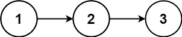
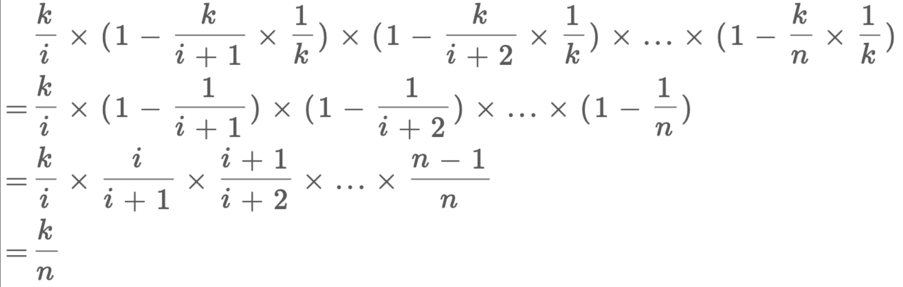
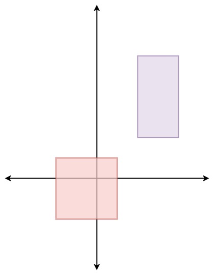

### [382. 链表随机节点](https://leetcode-cn.com/problems/linked-list-random-node/)

[labuladong 题解](https://labuladong.github.io/article/?qno=382)[思路](https://leetcode-cn.com/problems/linked-list-random-node/#)

难度中等270

给你一个单链表，随机选择链表的一个节点，并返回相应的节点值。每个节点 **被选中的概率一样** 。

实现 `Solution` 类：

- `Solution(ListNode head)` 使用整数数组初始化对象。
- `int getRandom()` 从链表中随机选择一个节点并返回该节点的值。链表中所有节点被选中的概率相等。

 

**示例：**



```
输入
["Solution", "getRandom", "getRandom", "getRandom", "getRandom", "getRandom"]
[[[1, 2, 3]], [], [], [], [], []]
输出
[null, 1, 3, 2, 2, 3]
```

#### [蓄水池抽样算法](https://leetcode-cn.com/problems/linked-list-random-node/solution/xu-shui-chi-chou-yang-suan-fa-by-jackwener/)

当内存无法加载全部数据时，如何从包含`未知大小的数据流`中`随机选取k个数据`，并且要保证每个数据被抽取到的概率相等。

当 k = 1 时，即此题的情况
也就是说，我们每次只能读一个数据。

假设数据流含有N个数，我们知道如果要保证所有的数被抽到的概率相等，那么每个数抽到的概率应该为 1/N

那如何保证呢？

先说方案：

每次只保留一个数，当遇到第 i 个数时，以 1/i的概率保留它，(i-1)/i的概率保留原来的数。

举例说明： 1 - 10

遇到1，概率为1，保留第一个数。
遇到2，概率为1/2，这个时候，1和2各1/2的概率被保留
遇到3，3被保留的概率为1/3，(之前剩下的数假设1被保留)，2/3的概率 1 被保留，(此时1被保留的总概率为 2/3 * 1/2 = 1/3)
遇到4，4被保留的概率为1/4，(之前剩下的数假设1被保留)，3/4的概率 1 被保留，(此时1被保留的总概率为 3/4 * 2/3 * 1/2 = 1/4)
以此类推，每个数被保留的概率都是1/N。

证明使用数学归纳法即可



#### 代码

```c++
class Solution {
    ListNode* head;
public:
    Solution(ListNode* head) {
        this->head = head;
    }
    
    /** Returns a random node's value. */
    int getRandom() {
        ListNode* phead = this->head;
        int val = phead->val;
        int count = 1;
        while (phead){
            if (rand() % count++ == 0)
                val = phead->val;
            phead = phead->next;
        }
        return val;
    }
};
```

### [398. 随机数索引](https://leetcode-cn.com/problems/random-pick-index/)

[labuladong 题解](https://labuladong.github.io/article/?qno=398)[思路](https://leetcode-cn.com/problems/random-pick-index/#)

难度中等146英文版讨论区

给定一个可能含有重复元素的整数数组，要求随机输出给定的数字的索引。 您可以假设给定的数字一定存在于数组中。

**注意：**
数组大小可能非常大。 使用太多额外空间的解决方案将不会通过测试。

**示例:**

```
int[] nums = new int[] {1,2,3,3,3};
Solution solution = new Solution(nums);

// pick(3) 应该返回索引 2,3 或者 4。每个索引的返回概率应该相等。
solution.pick(3);

// pick(1) 应该返回 0。因为只有nums[0]等于1。
solution.pick(1);
```

#### 代码

```c++
class Solution {
    vector<int> &nums;
public:
    Solution(vector<int> &nums) : nums(nums) {}

    int pick(int target) {
        int ans;
        for (int i = 0, cnt = 0; i < nums.size(); ++i) {
            if (nums[i] == target) {
                ++cnt; // 第 cnt 次遇到 target
                if (rand() % cnt == 0) {
                    ans = i;
                }
            }
        }
        return ans;
    }
};
```

### [384. 打乱数组](https://leetcode-cn.com/problems/shuffle-an-array/)

难度中等273

给你一个整数数组 `nums` ，设计算法来打乱一个没有重复元素的数组。打乱后，数组的所有排列应该是 **等可能** 的。

实现 `Solution` class:

- `Solution(int[] nums)` 使用整数数组 `nums` 初始化对象
- `int[] reset()` 重设数组到它的初始状态并返回
- `int[] shuffle()` 返回数组随机打乱后的结果

 

**示例 1：**

```
输入
["Solution", "shuffle", "reset", "shuffle"]
[[[1, 2, 3]], [], [], []]
输出
[null, [3, 1, 2], [1, 2, 3], [1, 3, 2]]
```

#### `Fisher–Yates shuffle 洗牌算法`

##### 现代方法

Fisher–Yates shuffle 算法的现代版本是为计算机设计的。由 Richard Durstenfeld 在1964年 描述。并且是被 Donald E. Knuth 在 《The Art of Computer Programming》 中推广。但是不管是 Durstenfeld 还是 Knuth，都没有在书的第一版中承认这个算法是 Fisher 和 Yates 的研究成果。也许他们并不知道。不过后来出版的 《The Art of Computer Programming》提到了 Fisher 和 Yates 贡献。

现代版本的描述与原始略有不同，因为如果按照原始方法，愚蠢的计算机会花很多无用的时间去计算上述第 3 步的剩余数字。**这里的方法是在每次迭代时交换这个被取出的数字到原始列表的最后**。这样就将时间复杂度从 O(n^2) 减小到了 **O(n)**。算法的伪代码如下：

```
-- To shuffle an array a of n elements (indices 0..n-1):
for i from n−1 downto 1 do
     j ← random integer such that 0 ≤ j ≤ i
     exchange a[j] and a[i]
```

##### 例子

###### 迭代步骤演示

根据每次迭代次数可以用下面的表格，描述这个算法的执行过程

| 随机数取值范围 | 随机数 |        原始数据 | 结果          |
| :------------- | :----- | --------------: | :------------ |
|                |        | 1 2 3 4 5 6 7 8 |               |
| 1-8            | 6      |   1 2 3 4 5 7 8 | 6             |
| 1-7            | 2      |     1 7 3 4 5 8 | 2 6           |
| 1–6            | 6      |       1 7 3 4 5 | 8 2 6         |
| 1–5            | 1      |         5 7 3 4 | 1 8 2 6       |
| 1–4            | 3      |           5 7 4 | 3 1 8 2 6     |
| 1–3            | 3      |             5 7 | 4 3 1 8 2 6   |
| 1–2            | 1      |               7 | 5 4 3 1 8 2 6 |

#### 代码

```c++
class Solution {
public:
		vector<int> nums;
		vector<int> origin;
  
    Solution(vector<int>& nums) {
        this->nums = nums;
        this->origin.resize(nums.size());
        copy(nums.begin(), nums.end(), origin.begin());
    }
    
    vector<int> reset() {
        copy(origin.begin(), origin.end(), nums.begin());
        return nums;
    }
    
    vector<int> shuffle() {
        for(int i = 0; i<nums.size(); i++){
            int j =i+ rand()%(nums.size()-i);
            swap(nums[i], nums[j]);
        }
        return nums;
    }
};
```

### [剑指 Offer II 071. 按权重生成随机数](https://leetcode-cn.com/problems/cuyjEf/)

难度中等19英文版讨论区

给定一个正整数数组 `w` ，其中 `w[i]` 代表下标 `i` 的权重（下标从 `0` 开始），请写一个函数 `pickIndex` ，它可以随机地获取下标 `i`，选取下标 `i` 的概率与 `w[i]` 成正比。


例如，对于 `w = [1, 3]`，挑选下标 `0` 的概率为 `1 / (1 + 3) = 0.25` （即，25%），而选取下标 `1` 的概率为 `3 / (1 + 3) = 0.75`（即，75%）。

也就是说，选取下标 `i` 的概率为 `w[i] / sum(w)` 。

 

**示例 1：**

```
输入：
inputs = ["Solution","pickIndex"]
inputs = [[[1]],[]]
输出：
[null,0]
解释：
Solution solution = new Solution([1]);
solution.pickIndex(); // 返回 0，因为数组中只有一个元素，所以唯一的选择是返回下标 0。
```

**示例 2：**

```
输入：
inputs = ["Solution","pickIndex","pickIndex","pickIndex","pickIndex","pickIndex"]
inputs = [[[1,3]],[],[],[],[],[]]
输出：
[null,1,1,1,1,0]
解释：
Solution solution = new Solution([1, 3]);
solution.pickIndex(); // 返回 1，返回下标 1，返回该下标概率为 3/4 。
solution.pickIndex(); // 返回 1
solution.pickIndex(); // 返回 1
solution.pickIndex(); // 返回 1
solution.pickIndex(); // 返回 0，返回下标 0，返回该下标概率为 1/4 。

由于这是一个随机问题，允许多个答案，因此下列输出都可以被认为是正确的:
[null,1,1,1,1,0]
[null,1,1,1,1,1]
[null,1,1,1,0,0]
[null,1,1,1,0,1]
[null,1,0,1,0,0]
......
诸若此类。
```

#### 解法1

前缀和 + 二分 主要注意二分查找的值的选择

```cpp
class Solution {
    vector<int> preSum;
public:
    Solution(vector<int>& w) {
      preSum.resize(w.size());
      int pre = 0;
      for(int i = 0; i<preSum.size(); i++){
        preSum[i] = pre + w[i];
        pre = preSum[i];
      }
    }
    
    int pickIndex() {
      //假设1 1 1 presum: 1 2 3 
      //取随机数的size应该就是 3 但是查找随机数应该在随机数+1
      //从最后一个看 rand最大为2 永远取不到最后一个 且多取到1次0
      int val = rand()%(preSum.back());
      int pos = lower_bound(preSum.begin(), preSum.end(), val + 1) - preSum.begin();
      return pos;
    }
};
```

#### 解法2

蓄水池抽样 超时了 想起来更简单 但是每次都是On 总体时间超时了 试了下随机中断他，通过不了 可能中断思路不对吧

```c++
class Solution {
    vector<int> nums;
public:
    Solution(vector<int>& w) : nums(w){}
    
    int pickIndex() {
      int ans;
      int preSum = 0;
      for(int i = 0; i<nums.size(); i++){
        preSum += nums[i];
        ans = rand()%preSum < nums[i]?i:ans;
      }
      return ans;
    }
};
```

### [497. 非重叠矩形中的随机点](https://leetcode.cn/problems/random-point-in-non-overlapping-rectangles/)

难度中等130

给定一个由非重叠的轴对齐矩形的数组 `rects` ，其中 `rects[i] = [ai, bi, xi, yi]` 表示 `(ai, bi)` 是第 `i` 个矩形的左下角点，`(xi, yi)` 是第 `i` 个矩形的右上角点。设计一个算法来随机挑选一个被某一矩形覆盖的整数点。矩形周长上的点也算做是被矩形覆盖。所有满足要求的点必须等概率被返回。

在给定的矩形覆盖的空间内的任何整数点都有可能被返回。

**请注意** ，整数点是具有整数坐标的点。

实现 `Solution` 类:

- `Solution(int[][] rects)` 用给定的矩形数组 `rects` 初始化对象。
- `int[] pick()` 返回一个随机的整数点 `[u, v]` 在给定的矩形所覆盖的空间内。

**示例 1：**



```
输入: 
["Solution", "pick", "pick", "pick", "pick", "pick"]
[[[[-2, -2, 1, 1], [2, 2, 4, 6]]], [], [], [], [], []]
输出: 
[null, [1, -2], [1, -1], [-1, -2], [-2, -2], [0, 0]]

解释：
Solution solution = new Solution([[-2, -2, 1, 1], [2, 2, 4, 6]]);
solution.pick(); // 返回 [1, -2]
solution.pick(); // 返回 [1, -1]
solution.pick(); // 返回 [-1, -2]
solution.pick(); // 返回 [-2, -2]
solution.pick(); // 返回 [0, 0]
```

#### 蓄水池 再随机

用蓄水池选中矩形 然后再在矩形内随机选点

```c++
class Solution {
private:
  vector<vector<int>> recs;

public:
  Solution(vector<vector<int>> &rects) { recs = rects; }

  vector<int> pick() {
    int idx = -1, cur = 0, curSum = 0, n = recs.size();
    for (int i = 0; i < n; ++i) {
      int x1 = recs[i][0], y1 = recs[i][1], x2 = recs[i][2], y2 = recs[i][3];
      cur = (x2 - x1 + 1) * (y2 - y1 + 1);
      curSum += cur;
      if (rand() % curSum < cur)
        idx = i;
    }
    int x1 = recs[idx][0], y1 = recs[idx][1], x2 = recs[idx][2],
        y2 = recs[idx][3];
    return {x1 + rand() % (x2 - x1 + 1), y1 + rand() % (y2 - y1 + 1)};
  }
};
```

#### 前缀和+二分

1. 先处理出前缀和数组 （注意前缀和有没有一开始的0，体现在最后的位置要不要减减）
2. 然后pick随机取一个数a 查找前缀和数组中第一个>=a的第一个位置 从而确定选中的是哪个矩形 然后在矩形中随机选点

```c++
class Solution {
private:
  vector<vector<int>> rects;
  vector<int> preS;

public:
  Solution(vector<vector<int>> &rects) {
    this->rects = rects;
    preS.push_back(0);
    for (auto &rec : rects) {
      int x1 = rec[0], y1 = rec[1], x2 = rec[2], y2 = rec[3];
      preS.push_back(preS.back() + (x2 - x1 + 1) * (y2 - y1 + 1));
    }
  }

  vector<int> pick() {
    int w = rand() % preS.back() + 1;
    int l = lower_bound(preS.begin(), preS.end(), w) - preS.begin();
    l--;
    int x1 = rects[l][0], y1 = rects[l][1], x2 = rects[l][2], y2 = rects[l][3];
    return {x1 + rand() % (x2 - x1 + 1), y1 + rand() % (y2 - y1 + 1)};
  }
};

```
