# ELF文件格式

预编译(.i) ->  编译(.s) -> 汇编(.o) -> ==链接==(.exe .out)

### **简介**

● 可执行与可链接格式（Executable Linkable Format, ELF），简称ELF格式

● 它是一种文件存储格式，Linux下的目标文件和可执行文件都是按照该格式存储的

### ELF文件类型

ELF文件可以细分为3种类型

1. 可重定向文件（.o文件） ==(汇编之后产生的机器码语言)==

​		● 这类文件中包含二进制代码和数据，可以和其他目标文件进行合并，创建一个可执行文件或者一个共享目录文件

2. 可执行文件（.out文件） ==(最后的可执行文件)==

​		● 可以被处理器加载执行的文件

3. 共享目标文件（.so文件） ==(动态库静态库)==

​		● 用于和其他共享目标文件或者可重定位文件一起生成ELF目标文件或者和执行文件一起创建进程映像，例如lib*.so文件

### ELF文件作用

1. 对于可**重定向文件和共享目标文件**，用于==编译和链接==，则编译器和链接器将把ELF文件看作是节头表描述的节的集合，程序头表可选

2. 对于**可执行文件**，用于==加载执行==，则加载器则将把ELF文件看作是程序头表描述的段的集合，一个段可能包含多个节，节头表可选

### ELF文件格式

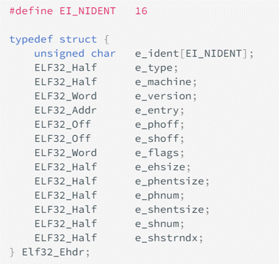


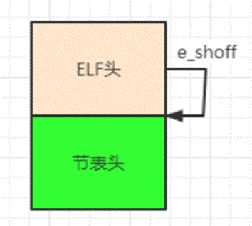

ELF文件格式提供两种不同的视角

● 在**汇编器和链接器**看来，ELF文件是由**Section Header Table**描述的一系列==Section==的集合

● 执行时，在**加载器**看来，ELF文件时由**Program Header Table**描述的一系列==Segment==的集合

● ELF文件由四个部分组成

● ELF头（ELF header）

● **用途**：ELF头描述了ELF文件的基本类型，地址偏移等信息

● ELF头分为32 bits和64 bits两个版本，两者只是数据类型（字长）有区别，但包含的字段均相同

● 下图为32bits版本

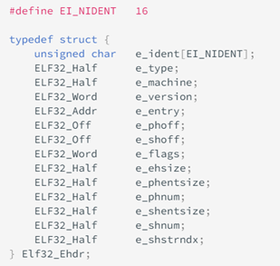

● e_ident ~ e_version

● 分别描述文件的数据格式、文件类型、文件的体系架构、文件版本

● e_entry

● 程序的虚拟入口地址

● e_phoff 👈 **较为重要**

● 文件中程序头表的偏移（bytes）

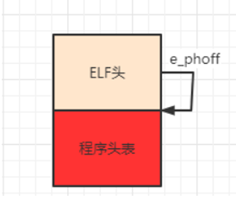

● e_shoff 👈 **较为重要**

● 文件中段表的偏移（bytes）


● 其他见图

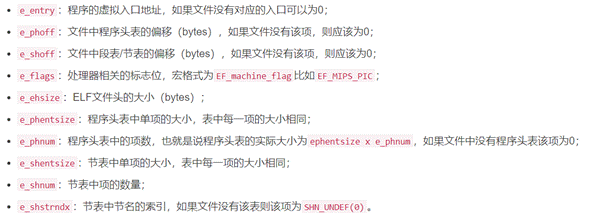

● 程序表头（Program header table）

● **用途**：程序表头描述了一个段***（Segment）\***在文件的位置，大小以及它被放进内存后所在的位置和大小

● **注意：只有执行过程使用**，在汇编和链接过程中没有用到，所以可有可无

● 程序表头是一个结构体数组，与ELF头一样，分成32bits和64bits的版本，只是字长不同，字段相同

● 下图为32bits版本

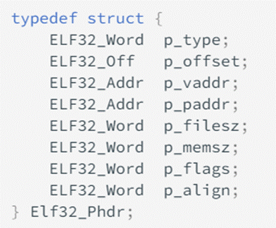

● 字段说明如下


● 节表头（Section header table）

● **用途**：节表头描述了各个节***（Section）\***的条目，每个节的条目定义了该节的类型，定义了节的大小

● **注意：在编译和链接过程中使用**，在执行过程中没有用到，所以可有可无

● 下图为32bits版本

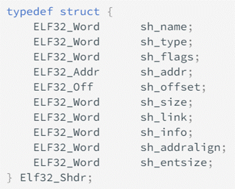

● 字段说明如下


段（Segment）/ 节（Section）

1. 段（Segment）

   可执行文件由Segment组成，例如程序代码段、数据段，每一个段由一个或多个Section组成，例如代码段由.text组成、数据段由.data，.bss等组成

2. 节（Section）

   平时在进行代码构建时理解的.text，.bss，.data段，这些都是section，也就是节的概念，这些节是通过节表头（section header table）进行组织的


#  虚拟地址: A=B+C，参数在什么时候确定虚拟内存中的地址；

# `链接时怎么确定将哪些目标文件链接到一起`

程序运行前的操作（预处理，编译，汇编，链接），编译后还是C++代码吗(汇编代码)，汇编后是什么文件(机器码)，

### 链接概述

模块化设计是软件开发中最常用的设计思想。**链接（Linking）** 本质上就是把各个模块之间相互引用的部分处理好，使得各个模块之间能够正确衔接。比如：

> 我们在模块`main.c`中使用另一个模块`func.c`中的`foo()`函数。我们在`main.c`模块中每一处调用`foo`时都必须确切知道`foo`函数的地址。但由于每个模块都是单独编译的。编译器在编译`main.c`的时候并不知道`foo`函数的地址。所以编译器会暂时把这些调用`foo`的指令的目标地址搁置，<u>等待最后链接时由链接器将这些指令的目标地址修正</u>。这就是静态链接最基本的过程和作用。

如下图所示为最基本的静态链接过程示意图。每个模块的源代码文件（如`.c`）文件经过编译器编译汇编成**目标文件**（Object File，一般扩展名为`.o`或`.obj`）。目标文件和 **库（Library）** 一起链接形成最终的可执行文件。

其中，最常见的库就是**运行时库（Runtime Library）**，它是支持程序运行的基本函数的集合。**库本质上是一组目标文件的包，由一些最常用的代码编译成目标文件后打包而成**。

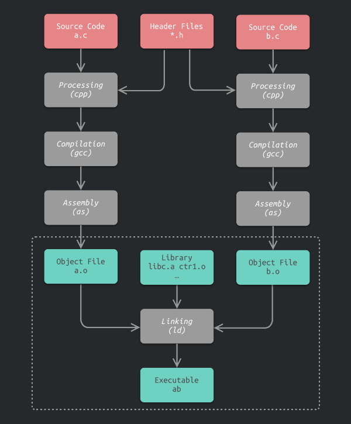

链接过程主要包含了三个步骤：

1. **地址与空间分配（Address and Storage Allocation）**
2. **符号解析（Symbol Resolution）**
3. **重定位（Relocation）**

# [`调用约定`(cdecl、fastcall、stcall、thiscall) 的一点知识](https://www.laruence.com/2008/04/01/116.html)

# 为什么select的最大数量是1024

可能的答案: 我感觉我当时是对的 主要就是进程默认文件描述符数量的限制

1. 进程默认的最大描述符1024, 可以unlimit修改
2. 操作系统设置的是1024, 改的话只能重新编译内核
3. select轮询的时间复杂度是On, 需要轮询两次,而且需要两次拷贝, 过大的话, 严重降低速度

# 红黑树和avl树的区别 在实际场景中怎么选择

> 首先红黑树是<u>不符合AVL树的平衡条件</u>的，即每个节点的左子树和右子树的高度最多差1的二叉查找树。但是提出了为节点增加颜色，红黑是用非严格的平衡来换取增删节点时候旋转次数的降低，任何不平衡都会在三次旋转之内解决，而AVL是严格平衡树，因此在增加或者删除节点的时候，根据不同情况，旋转的次数比红黑树要多。所以红黑树的插入效率更高！！！

红黑树的查询性能略微逊色于AVL树，因为他比avl树会稍微<u>不平衡最多一层</u>，也就是说红黑树的查询性能只比相同内容的avl树==最多多一次比较==，但是，<u>红黑树在插入和删除上完爆avl树</u>，avl树每次插入删除会进行大量的平衡度计算，而红黑树为了维持红黑性质所做的红黑变换和旋转的开销，相较于avl树为了维持平衡的开销要小得多

红黑树不同于平衡树的操作，<u>红黑树不会因为插入、删除等操作追求绝对的平衡，它的旋转次数少，插入最多两次旋转，删除最多三次旋转</u>，所以==对于搜索、插入、删除操作较多的情况下，红黑树的效率是优于平衡二叉树的==。

但是需要注意的是，==如果应用场景中对插入、删除不频繁，只是对查找要求较高，那么平衡二叉树还是较优于红黑树==。

> ==avl追求绝对的平衡, 所以查找快, 但是插入删除要维持其绝对的平衡性, 比较费事(旋转次数多)==
>
> ==rb-tree放弃绝对的平衡, 插入删除的旋转次数少(2, 3), 但是查找速度慢于avl==

# [了解二叉树吗，平衡二叉树，红黑树？ ](https://cloud.tencent.com/developer/article/1748705)

> ##### 数组优点：
>
> - 简单易用，随机访问性强
> - 无序数组插入速度很快，效率为O1
> - 有序数组查找速度较快，效率为O(logN)
>
> ##### 数组缺点：
>
> - 插入和删除效率低
> - 数组大小固定，无法动态扩容
>
> ##### 链表优点：
>
> - 大小不固定，无限扩容
> - 插入和删除速度很快
>
> ##### 链表缺点：
>
> - 查询效率低，不支持随机查找，必须从第一个开始遍历
> - 在链表非表头的位置进行插入、删除很慢，效率为O(N)
>
> 从数组到链表的优缺点，我们可以看出是各有千秋，不能很准确的说链表比数组就一定要高效，而正是因为这种关系的存在，所以二叉树出现了。
>
> 所以二叉树的由来：二叉树整合了数组和链表的优缺点，使得插入、删除、查找的速度都很快，效率比较高。

### 平衡二叉树

> avl就是 最大高度差为1的二叉搜索树

平衡二叉树，又被称为AVL树，是为了解决二叉树退化成一棵链表而诞生的。

平衡二叉树特点：

- 拥有二叉查找树的全部特性。
- 每个节点的左子树和右子树的高度差至多等于1。

其中左右子树的高度差是通过左旋右旋实现的。

下面是一个平衡二叉树和非平衡二叉树的图：

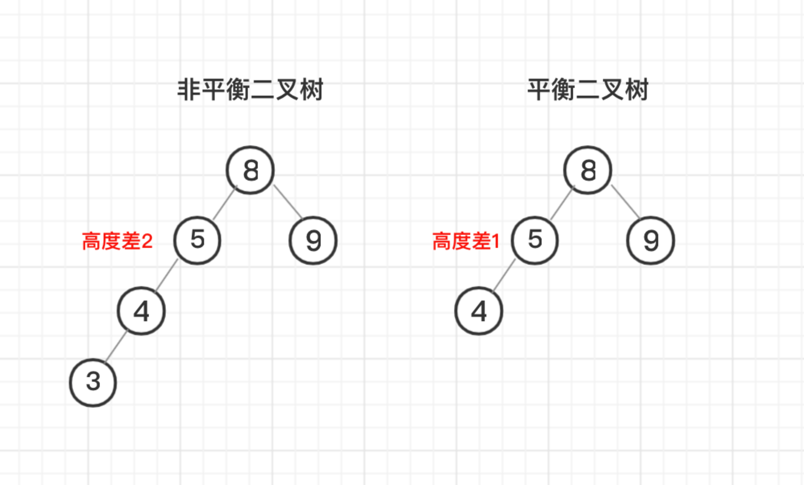

到底是如何判断高度差的呢？我们可以来数节点最长连接数，比如左侧节点最长连接数为「3 > 4 > 5」3个节点，右侧为「9」一个节点，所以高度差为2。

再比如下面一个平衡二叉树：

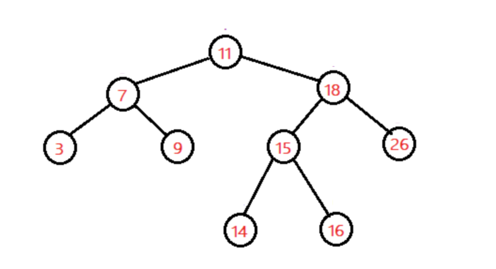

左侧最长连接点为「3(9) > 7 >11」，即高度为3，右侧最长连接点为「14(16) > 15 > 18 > 11」，即高度为4，所以高度差为1。

为了维持二叉树的平衡，平衡二叉树是通过左旋、右旋来保证的，从大的方向旋转过程又被分为单旋转和双旋转，总之，旋转的作用就是避免出现节点偏向一边的情况，具体左旋、右旋操作在这就不详细阐述了。

==但是平衡二叉树这种高度差为 1 的要求太严格了，尤其是对于频繁删除、插入的场景非常浪费时间...==

> 查找、插入和删除在平均和最坏情况下==都是O（log n）==

### 红黑树

对于那种`频繁删除、插入`的场景，<u>平衡二叉树的调整过程显然是==存在性能问题==的</u>，所以为了解决这个问题，进而又引入了红黑树。

红黑树的特点：

- 具有二叉树所有特点。
- 每个节点只能是红色或者是黑色。
- 根节点只能是黑色，且黑色根节点不存储数据。
- 任何相邻的节点都不能同时为红色。
- 红色的节点，它的子节点只能是黑色。
- 从任一节点到其每个叶子的所有路径都包含相同数目的黑色节点。

红黑树如下图所示：

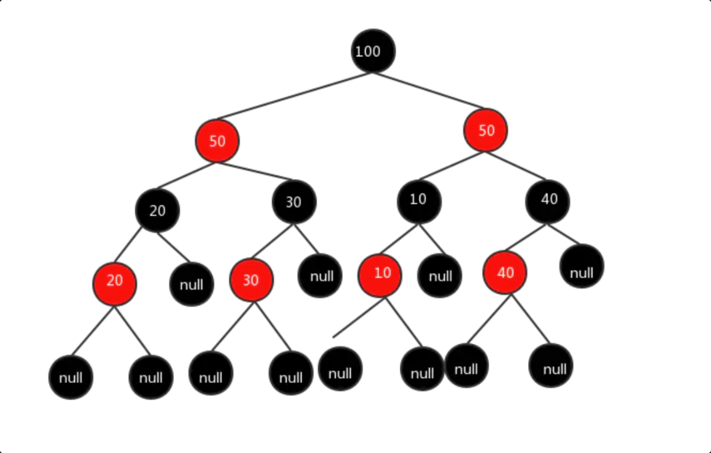

概括为：红黑树所有的根节点都是黑色的的空节点，也就是根节点不存数据；任何相邻的节点都不能同时为红色，红色节点是被黑色节点隔开的，每个节点，从该节点到达其可达的叶子节点是所有路径，都包含相同数目的黑色节点。

正是因为这种特点，红黑树不同于平衡树的操作，<u>红黑树不会因为插入、删除等操作追求绝对的平衡，它的旋转次数少，插入最多两次旋转，删除最多三次旋转</u>，所以==对于搜索、插入、删除操作较多的情况下，红黑树的效率是优于平衡二叉树的==。

但是需要注意的是，==如果应用场景中对插入、删除不频繁，只是对查找要求较高，那么平衡二叉树还是较优于红黑树==。

### 总结

**为什么有了数组和链表还要引入二叉树？**

针对数组和链表的优缺点，无法说链表一定优于数组，或者是数组一定优于链表，因为某些长期的需要，所以就推出一个相对折中的二叉树。

**为什么有了二叉树还要引入平衡二叉树？**

有了二叉树还不算完，二叉树有一种==极端==的情况，就是所有的子结点偏向一端，==二叉树退化成链表==，这就相当于我选择了这种的二叉树，你现在罢工不干了，找了个链表来糊弄我...

所以为了解决二叉查找树退化为链表的情况，引入了平衡二叉树，即：

平衡二叉树是为了解决二叉树退化成一棵链表而诞生的。

既然有了平衡二叉树，这下总没有问题了吧？

**为什么有了平衡二叉树还要引入红黑树？**

但是是实际使用过程中，因为平衡二叉树追求绝对严格的平衡关系，显然这个规则在于频繁的插入、删除等操作的情景性能肯定会出现问题...

所以为了解决这个问题，进而又引入了红黑树。

平衡二叉树追求绝对严格的平衡，平衡条件必须满足左右子树高度差不超过1，红黑树是放弃追求完全平衡，它的旋转次数少，插入最多两次旋转，删除最多三次旋转，所以对于搜索、插入、删除操作较多的情况下，红黑树的效率是优于平衡二叉树的。

> avl追求绝对的平衡, 所以查找快, 但是插入删除要维持其绝对的平衡性, 比较费事(旋转次数多)
>
> rb-tree放弃绝对的平衡, 插入删除的旋转次数少(2, 3), 但是查找速度慢于avl

# 多线程抢占output时，首先如何确保正确，再如何提高效率和性能

1. 确保正确: 使用`锁`机制, 将output部分代码设置为临界区, 互斥访问
2. 提高效率和性能:
   1. 乐观锁?
   2. 减小临界区, 减少所得持有时间
   3. 如果是log日志的话, 使用读写锁 读写分离

# [C++设计实现日志系统 - 知乎](https://zhuanlan.zhihu.com/p/100082717)

1. 使用单例模式保证只有一个实例
2. 使用策略模式实现不同类型的输出

# 如何在main函数之前进行控制台输出，在C++中如何实现，在C中如何实现

1. c++会在main之前进行全部变量的构造和初始化, 所以在c++中可以选择将输出的语句写在构造函数中, c++还可以使用全局变量的赋值, 来提前运行函数: int a = func();

2. c++ 和 c都可以的

   ```cpp
   __attribute_((constructor))void before(){
       printf("before\\n");
       func();
   }
   
   __sttribute__((destructor))void after(){
       printf("after\\n");
   }
   ```

# 左右值的区别，对右值引用的理解，const修饰的变量作为函数形参的优点

- 左值: 有名称或者能取地址, 一般表达式结束后, 仍然存在的持久对象
- 右值: 匿名或不可取地址, 表达式结束后就不再存在
- 右值引用就是可以引用临时变量, 并对其进行修改, 经典的用法就是搭配移动语义实现的移动拷贝和移动赋值
- A a = creatA();  A&& a = creatA();  会少调用一次拷贝构造
- 移动语义解决了无用拷贝的问题, 移动构造函数

使用&可以避免拷贝, 但是会修改原对象, 使用const则保证不会修改原来的对象

# const和constexpr

- [constexpr和const的区别详解 C++11 (notion.so)](https://www.notion.so/constexpr-const-C-11-b85fe6ba81e2481e879194f32a7be763)

  const存在双重语义, 即只读(变量)和常量的属性, 为了将双重语义区分开, c++11添加了constexpr关键字

  ```cpp
  int add5(const int a) {
    int nums[a]; //报错 a为只读局部变量
    return a + 5;
  }
  int main() {
    const int n = 10;
    int a[10];  //不报错 a为常量
    return 0;
  ```

  在 C++ 11 标准中，const 用于为修饰的变量添加“`只读`”属性；**`而 constexpr 关键字则用于指明其后是一个常量（或者常量表达式）`**，编译器在**`编译`**程序时可以顺带将其结果计算出来，而无需等到程序运行阶段，这样的优化`**极大地提高了程序的执行效率**`。

  <u>大多数情况是可以混用的, 但是有些时候是不可混用的 例如const/constexpr修饰返回值</u>

  ```cpp
  #include <array>
  #include <iostream>
  using namespace std;
  constexpr int sqr1(int arg) { return arg * arg; }
  const int sqr2(int arg) { return arg * arg; }
  int main() {
    array<int, sqr1(10)> mylist1;  //可以，因为sqr1时constexpr函数
    //报错 表达式必须含有常量值
    array<int, sqr2(10)> mylist1;  //不可以，因为sqr2不是constexpr函数
    return 0;
  }
  ```

# 写一段代码, 可以输出这段代码本身

通过fstream 和 getline实现  _FILE _宏为当前文件的路径

```c++
#include <fstream>
#include <iostream>
using namespace std;

int main() {
  fstream fs(__FILE__);
  string temp;
  while (getline(fs, temp)) cout << temp << endl;
  fs.close();
  return 0;
}
```

# 实时进程了解过吗, 实时进程有优先级吗

进程提供了两种优先级，一种是普通的进程优先级，第二个是实时优先级。前者适用SCHED_NORMAL调度策略，后者可选SCHED_FIFO(先进先出)或SCHED_RR(时间片)调度策略。**任何时候，实时进程的优先级都高于普通进程**，==**实时进程只会被更高级的实时进程抢占，同级实时进程之间是按照FIFO（一次机会做完）或者RR（多次轮转）规则调度的。**==

> 实时进程整体上按照优先级抢占和先进先出调度
>
> 优先级不同, 则高优先级抢占低优先级
>
> 优先级相同, 则按照先进先出进行服务
>
> > 不同调度策略的实时进程`只有在相同优先级`时才有可比性：
> >
> > 1. 对于FIFO的进程，意味着只有当前进程执行完毕才会轮到其他进程执行。由此可见相当霸道。
> >
> > 2. 对于RR的进程。一旦时间片消耗完毕，则会将该进程置于队列的末尾，然后运行其他相同优先级的进程，如果没有其他相同优先级的进程，则该进程会继续执行。
>
> 总而言之，对于实时进程，高优先级的进程就是大爷。它执行到没法执行了，才轮到低优先级的进程执行。等级制度相当森严啊。

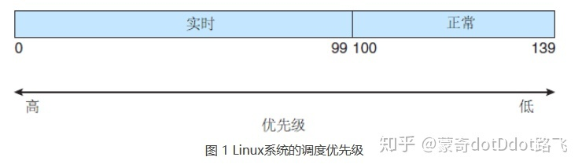

linux里面的进程调度机制实现了实时线程与正常线程。可以在代码中调用函数把当前的线程设置为实时进程。

可以利用top命令，如果一个进程或线程为实时的，那么在pr列表中可以看到rt的结果
