# 个人面经

## 2022.5.10 联发科北京嵌入式软件

1. 链表和数组 什么时候用链表
2. 有没有手写过一些数据结构和操作 说一下怎么实现
3. 程序装载到内存的内存分布 
4. linux内存空间 怎样寻址 一级页表 二级页表页表的大小分别是怎么算的
5. 进程和线程
6. 说一下inline内联 以及是怎么实现运行速度的优化的
7. union了解吗
8. 你的软件结构是什么 哪几个部分

## 2022.5.19 青岛鼎信

1. 指针和引用的区别，对cpu来说两个是一样的吗
2. 什么是内存泄漏 内存泄漏怎么检测
3. 智能指针了解吗 相互引用怎么办 为什么weakptr可以解
4. 线程的锁有哪几种
5. TCP和UDP的区别
6. vector和list的区别
7. select和epoll的区别 为什么select有一个参数1024，为什么是1024
8. 程序在内存中的分布
9. c++的动态多态是什么 怎么实现的 设计一个多态
10. c++的静态多态是什么 返回值类型不同呢
11. 从项目中学到了什么
12. Qt::concurrent是线程安全的吗

## 2022.6.23 武汉中望软件 35分钟

1. 多态 你知道的都说一下

2. 面向对象你是怎么设计的

3. 函数后加const构不构成重载  (值传递不构成, 指针传递构成 成员函数传递this指针 所以构成)

4. const修饰的函数 怎么让他去可以修改成员变量

   > 1. 用mutable修改成员变量
   >
   > 2. 函数的参数中, 把成员变量的引用传进去
   >
   >    
   >
   > 3. const_cast去掉函数指针的底层const ? 不知道可不可以 瞎扯的

5. mutable关键字了解吗

   > mutalbe的中文意思是“可变的，易变的”，是constant（即C++中的const）的反义词。在C++中，==mutable也是为了突破const的限制而设置的，被mutable修饰的变量将永远处于可变的状态。==
   >
   > mutable的作用有两点： （1）保持常量对象中大部分数据成员仍然是“只读”的情况下，实现对个别数据成员的修改； （2）使类的const函数可以修改对象的mutable数据成员。
   >
   > 使用mutable的注意事项： （1）mutable只能作用于类的非静态和非常量数据成员。 （2）在一个类中，应尽量或者不用mutable，大量使用mutable表示程序设计存在缺陷。
   >
   > 示例代码如下：
   >
   > ```c++
   > //mutable int test;//编译出错
   > 
   > class Student
   > {
   > 	string name;
   > 	mutable int getNum;
   > 	//mutable const int test;    //编译出错
   > 	//mutable static int static1;//编译出错
   > public:
   > 	Student(char* name)
   > 	{
   > 		this->name=name;
   > 		getNum=0;
   > 	}
   > 	string getName() const   //这个const本身是不会修改非mutable成员的
   > 	{
   > 		++getNum;
   > 		return name;
   > 	}
   > 	void pintTimes() const
   > 	{
   > 		cout<<getNum<<endl;
   > 	}
   > };
   > 
   > int main(int argc, char* argv[])
   > {
   > 	const Student s("张三");
   > 	cout<<s.getName()<<endl;
   > 	s.pintTimes();
   > 	return 0;
   > }
   > ```
   >
   > 程序输出结果：
   >
   > ```javascript
   > 张三
   > 1
   > ```

6. 用了qt界面的哪些模块

   > treeview .....

7. 有没有做过qt的重绘

8. qt信号槽跨线程用过没 怎么设置

   > **Qt支持5种连接方式**
   >
   > - **Qt::DirectConnection（直连方式）**（信号与槽函数关系类似于函数调用，同步执行）
   >   当信号发出后，相应的槽函数将立即被调用。emit语句后的代码将在所有槽函数执行完毕后被执行。当信号发射时，槽函数将直接被调用。无论槽函数所属对象在哪个线程，槽函数都在发射信号的线程内执行。
   > - **Qt::QueuedConnection（队列方式）**（此时信号被塞到事件队列里，信号与槽函数关系类似于消息通信，异步执行）
   >   当信号发出后，排队到信号队列中，需等到接收对象所属线程的事件循环取得控制权时才取得该信号，调用相应的槽函数。emit语句后的代码将在发出信号后立即被执行，无需等待槽函数执行完毕。当控制权回到接收者所依附线程的事件循环时，槽函数被调用。槽函数在接收者所依附线程执行。 ==队列方式也就是跨线程的信号槽==
   > - **Qt::AutoConnection（自动方式）** 
   >   Qt的**默认连接方式**，如果信号的发出和接收信号的对象同属一个线程，那个工作方式与直连方式相同；否则工作方式与队列方式相同。如果信号在接收者所依附的线程内发射，则等同于直接连接如果发射信号的线程和接受者所依附的线程不同，则等同于队列连接
   > - **Qt::BlockingQueuedConnection**（信号和槽必须在不同的线程中，否则就产生死锁) 
   >   槽函数的调用情形和Queued Connection相同，不同的是当前的线程会阻塞住，直到槽函数返回。
   > - **Qt::UniqueConnection**
   >   与默认工作方式相同，只是不能重复连接相同的信号和槽，因为如果重复连接就会导致一个信号发出，对应槽函数就会执行多次。

9. 项目

10. 爱好

    > 除了打打游戏就是瞎折腾, 自己写点小软件, 学点比较好玩的, 感兴趣的东西, 比如搭博客, 写博客, 写点实用的小软件, 学一些简单使用的脚本语言等
    
11. 补充我不会的    同学

    1. 虚函数表存在哪里 : ==常量区==

    2. 类里面static成员什么时候初始化: 

       > 全局变量, 文件域的静态变量和类的静态成员变量==在main执行之前==的<u>静态初始化过程中分配内存并初始化</u>

    3. 函数里面static成员什么时候初始化:

       > ==局部静态变量==(一般为函数内的静态变量)在==第一次使用==时分配内存并初始化。这里的变量包含内置数据类型和自定义类型的对象。

    4. 哪些场景下使用static: 

    5. c++多模块交互接口如何生成

    6. 堆排序

    7. 动态库的生成

## 2022.7.1 武汉中望软件二面(悟空+云事业部) 35分钟

1. 领导给你个工作 但时间不够怎么办

2. 领导让你干活, 没给你提具体的需求怎么办

3. 团队任务中, 其他人不配合怎么办

4. 看你博客上写了一些 思路里面提到了代码不够优美, 那你什么样的代码是优美的

5. 虚继承解决什么问题, 虚继承的内存分布  [继承、虚继承、虚函数内存分布（MSVC下）_JACKSONMHLN的博客-CSDN博客](https://blog.csdn.net/JACKSONMHLK/article/details/123872817)

   > 首先: 解决的是二义性命名冲突和冗余数据的问题
   >
   > 虚菱形继承中的内存分布
   >
   > ```c++
   > class B {
   >  public:
   >   int ib;
   > 
   >  public:
   >   B(int i = 1) : ib(i) {}
   >   virtual void f() { cout << "B::f()" << endl; }
   >   virtual void Bf() { cout << "B::Bf()" << endl; }
   > };
   > 
   > class B1 : virtual public B {
   >  public:
   >   int ib1;
   > 
   >  public:
   >   B1(int i = 100) : ib1(i) {}
   >   virtual void f() { cout << "B1::f()" << endl; }
   >   virtual void f1() { cout << "B1::f1()" << endl; }
   >   virtual void Bf1() { cout << "B1::Bf1()" << endl; }
   > };
   > 
   > class B2 : virtual public B {
   >  public:
   >   int ib2;
   > 
   >  public:
   >   B2(int i = 1000) : ib2(i) {}
   >   virtual void f() { cout << "B2::f()" << endl; }
   >   virtual void f2() { cout << "B2::f2()" << endl; }
   >   virtual void Bf2() { cout << "B2::Bf2()" << endl; }
   > };
   > 
   > class D : public B1, public B2 {
   >  public:
   >   int id;
   > 
   >  public:
   >   D(int i = 10000) : id(i) {}
   >   virtual void f() { cout << "D::f()" << endl; }
   >   virtual void f1() { cout << "D::f1()" << endl; }
   >   virtual void f2() { cout << "D::f2()" << endl; }
   >   virtual void Df() { cout << "D::Df()" << endl; }
   > };
   > ```
   >
   > 
   >
   > 几个点:
   >
   > 1. 最底层的公共基类的虚表指针和成员放在最后
   > 2. 从最底层的公共基类开始虚表中的函数替换, 没有再查找第一直接基类, 第二直接基类...
   > 3. 内存分布依次为: 第一直接基类的虚表和成员->第二直接基类的虚表和成员->自己的成员->最底层基类的虚表二号成员
   > 4. 自己特有的虚函数. 加在第一直接基类的虚表的后面

6. windows下的异常机制和处理

   > 答的不好 只说了自己遇到的内存泄露 和 vs的代码图确定中断位置
   >
   > 详细: 
   >
   > 1. 内存泄露:  我在实际使用的时vs的诊断工具直观的去查看内存变化(错!)
   >
   >    - Linux下可以使用==Valgrind工具==  Wǎ'ěr gélín
   >    - Windows下可以使用==CRT库==
   >    - 运行时检测工具 ==BoundsChecker==
   >
   > 2. 访问越界之类的野指针问题: 数组访问越界, 访问释放的地址等等, 这个编写代码时不好发现, 但是运行时可能会发生中断, 我一般是中止程序 使用代码图看上层的函数调用, 查看中间变量
   >
   > 3. 访问/修改  不可访问/不可修改/不属于进程地址空间/不存在  的内存
   >
   >    这种一般编译器直接就会提示错误, 或者运行起来第一次跑到就会中断, 代码上比较好发现
   >
   > 4. 多用assert断言和try catch

7. 写博客的目的是什么

8. 为什么熬夜, 没有工作和学业的压力的话, 还会熬夜吗

9. toB还是toC有什么看法, 工业软件, 互联网, 金融软件怎么看


> 补充 同学的:
>
> 1. 高压状态下怎么样
> 2. static，多继承，堆栈，STL,  (linux部门二面)

## 7.9星猿哲一面 40分钟

面试官是个很好的小哥, 面的氛围很轻松

我猜测可能是hr看到我项目里面有qt所有才给我发面试的, 所以面试中也有很多qt的问题

1. 面试官自我介绍

2. 自我介绍

3. 介绍项目

4. 两个线程对label进行文本的设置, 会有什么问题吗, 怎么实现

5. (因为仓库里写了一个文件搬运的小程序) 10g的大文件的搬运有什么问题吗

   > 用qt的函数应该是没有什么问题的, 猜测不需要加载到内存, 其次, 就算加载到内存, 64位堆可分配128T

6. 大文件的加载导致页面卡顿的操作, 怎么解决

   > 可以单独开线程去加载文件, 繁重cpu或者io任务与ui线程分离

7. c和c++的区别

8. 结构体和class的区别

   > 默认属性和模板实现

9. 构造函数可以为虚函数吗

10. 析构函数不为虚函数会有什么问题  (我乱了, 答的比较乱, 把小哥也给带蒙了)

11. c++11新特性了解哪些, 粗略的说一下就行

    > 卡壳了, 没想起几个

12. 右值引用了解吗, 什么时候用

    > 答的两个方面
    >
    > 1. 调用移动构造和移动赋值
    > 2. 右值引用接收函数的返回值避免一次拷贝构造

13. 手撕vector类 实现几个常用的函数

14. 什么时候学的qt, 怎么学的

15. 反问

## 2022.7.14 武汉中望软件二面(windows+linux) 15分钟

1. 经过前几轮面试对公司有什么了解
2. 认为相比其他面试者 优势在哪
3. 工作地点有什么要求, 期望
4. 手上有几个offer
5. 薪资要求
6. 看你简历里面加粗了并行, qt多线程和windows多线程有什么区别
7. 还有什么想问的

## 2022.7.19 星猿哲 二面 70分钟

1. 自我介绍

2. 介绍一下项目

3. 算法怎样加速的, 做了哪些加速

4. 求职方向和职业规划

5. 展示一下做过的项目成果

6. 段错误

7. 内存泄露

8. 系统内存不够怎么办

   > 首先 要看是什么内存不够 
   >
   > 如果是栈空间内存不够的话 查下代码逻辑有没有bug, 例如循环实例化和无限递归, 然后可以在编译器的设置中增大栈空间
   >
   > 如果是堆内存不够的话 看有没有循环new和内存泄露 换64位 还不够的话 换电脑吧 抠搜的

9. 怎么少写bug

   > 1. 勾勒大概的项目框架
   > 2. unit test 对每个模块进行测试
   > 3. 重视IDE的警告 比如常出现的 usinged int 和int的强转
   > 4. 良好的命名规范等编码习惯 

10. gdb调试

    > 基本的指令了解 但是平时比较依赖IDE封装好的编译工具 windows下使用vstudio linux使用clion

11. 你用的什么编译器

12. shared_ptr和unique_ptr

13. 聊一下四种cast转换

14. 命名规范

    > google规范 平时缩进也会使用clang-format对代码进行调整

15. opencv了解吗

    > 常规的传统图像算法基本了解 学过
    >
    > 平时感觉比较好用的就是opencv二维矩阵插值 还有一些图像简单处理和拼接函数

16. ==循环展开==了解吗

    > 循环展开式编译器在预编译阶段对循环操作进行的优化 , 比如一个数据要进行一万次的累加, 那么不如一个循环内累加多次 或者使用将计算分为两个数 分别对奇数和偶数位进行累加 最后合并
    >
    > ```c++
    > //关闭编译器优化 测试循环展开的优化
    > int sum= 0;
    > int count= 10000;
    > //循环10000次累加
    > for(int i= 0;i< count;i++){
    >      sum+= i;
    > }  //0.0000279s
    > 
    > 
    > for(int i = 0;i < count;i += 2){
    >  sum += i;
    >  sum += i+1;
    > }  //0.0000159s
    > 
    > int sum1=0,sum2=0;
    > for(int i=0;i < count;i+=2){
    >  sum1 += i;
    >  sum2 += i+1;
    > }
    > sum = sum1 + sum2;  //0.0000073s
    > ```

17. Unit Test了解吗

18. ==SSE指令集==

19. 繁重计算导致界面卡死怎么办

20. 计算卡死用户怎么终止, 或者黑盒子函数卡死, 怎么终止它

21. 套接字使用过吗

22. 还有什么想问的

23. 刷道题, 返回边长1-m可以构成的三角形种类数 (写的好拉)

> 面评:
>
> Unit Test，Design Principle会需要加强；有点太依赖Windows环境和VS的IDE，有机会能力可以再提升

## 2022.7.28 万集 c++一面

1. 数据结构, 设计模式你们专业课程的学过吗

2. 项目开发怎么选用的设计模式

3. 怎么选用的数据结构

4. 算法优化上, 有没有变更数据结构来优化速度

5. 线程同步用到没, (没有)

6. 你感觉mfc和qt有什么区别

7. 动态库静态库的区别, 函数调用方式

8. boost用过哪些

9. 手动改写控件 比如qss用过吗

10. RAII机制了解吗 智能指针用过哪几种 

11. RAII有什么缺点

    > RAII的本质内容是用对象代表资源，把管理资源的任务转化为管理对象的任务，将资源的获取和释放与对象的构造和析构对应起来，从而确保在对象的生存期内资源始终有效，对象销毁时资源一定会被释放。

12. 内存泄露

13. 其他语言了解哪些

14. linux了解吗


## 2022.8.2 最右 后端一面

1. 自我介绍 不问项目(md)
2. 堆栈有什么区别  函数内一个int a在堆上还是栈上
3. python的字符串format有多少种方法
4. tcp和ip分别位于哪一层, 哪一个的协议头更靠外
5. 滑窗了解吗 不使用滑窗的话 会有什么问题
6. io多路复用, poll相比select, epoll相比poll和select
7. 算法题 二分查找target在数组中的左右边界 [34. 在排序数组中查找元素的第一个和最后一个位置 - 力扣（LeetCode）](https://leetcode.cn/problems/find-first-and-last-position-of-element-in-sorted-array/)


## 2022.8.4 蔚来 系统优化一面

1. 为什么用mfc

2. 为什么选择用qt

3. qt的多线程有什么区别

4. webserver实现了哪些功能

5. get和post有什么区别

6. 删除一个目录 设计结构体和删除逻辑

7. 多线程跑的结果 没记错的话 应该是下面的代码

   ```c++
   int *p = nullptr;  //如果是atmoic会有什么区别吗
   void f1(){
     int a = 100;
     p = &a;
   	sleep(200);
   }
   void f2(){
     while(1){
       sleep(1);
       printf("%d", *p);
     }
   }
   ```

8. 写一个函数 输入字符串的代码片段, 要求输出不带注释的代码

## 2022.8.13 芯动算法

1. 多进程和多线程有什么区别
2. 引用和指针的区别 传指针和传引用有什么区别
3. 右值引用了解吗 基于右值引用实现的特性
4. c++11新特性 c++14呢
5. constexpr 什么时候用 在什么时期
6. c++多态

## 2022.8.16 快手客户端一面 60分钟

1. http1.1相比1.0 http2.0相比1.x的区别
2. http和https的区别
3. 一个https的url输入到浏览器到页面显示 发生了什么
4. 抓过包吗 https抓包会抓到什么
5. tcp和udp的区别
6. 源代码到可执行文件
7. 设计题 怎么保证连个线程交替输出递增的奇偶数(1 3 5 7....  2 4 6 8 ....)
8. 算法题
   1. 相交链表相反的版本 找父节点
   2. topk 手写顶堆数据结构

## 2022.8.17 美团软件开发 一面60分钟 

1. 项目
2. b+树和b树的区别
3. 聚簇索引了解吗
4. 数据库表格太大怎么办
5. tcp3次握手的过程 为什么三次握手四次挥手
6. linux io模型
7. 数据准备和拷贝阶段 为什么分为这两个阶段
8. linux文件系统了解吗
9. 查找大的日志文件的命令
10. 项目测试 用到那些测试方法
11. 算法题
    1. 第n个丑数
    2. 接雨水

## 2022.8.18 快手客户端二面 50分钟

1. 项目选一个介绍 项目难点

2. 说一下你认为你项目中做的好的地方和不好的地方

3. 客户端很好看? 之前有设计经验吗

4. qt的信号槽是怎么实现的 让你设计你会怎么设计 例如实现功能的基础上 实现线程安全啊之类的

5. 锁机制了解吗 

6. 设计模式了解哪些 

7. 写一个用户登录界面的逻辑 要求实现多个方法的验证(用户名密码, 手机验证码, 人脸登录等) 并可以后序添加模块

8. qt mfc这种框架怎么和计算机底层交互的

9. 消息循环机制 消息队列为空怎么办

10. 写一个线程不安全的例子, 再把它改为线程安全

11. 个人网站怎么做的 写博客的目的是什么

    

## 2022.8.22 百度自动驾驶一面 56分钟

1. 项目问题
2. C++虚函数了解吗
3. 野指针了解吗
4. 内存泄露
5. tcp为什么要三次握手
6. 程序的局部性了解吗
7. 哲学家就餐问题了解吗
8. 死锁的四个条件
9. 怎么检测循环的环路(想听拓扑排序) 拓扑排序了解吗
10. B+树和B树了解吗
11. 稳定排序和不稳定排序
12. 归并排序的复杂度 空间复杂度为什么是On
13. 堆排序的复杂度 建堆的复杂度 为什么建堆是On
14. 判断链表有没有环 判断环的长度 怎么第一次遍历就判断环的长度
15. 单链表给你一个节点 怎么删除这个节点
16. 二叉树的前序 非递归
17. 前中数组 重建二叉树 复杂度多少 怎么优化(哈希)


## 2022.8.29 zoom杭州 客户端一面 30分钟

1. 项目介绍 聊天 opencv了解哪些算法
2. c++构造函数和析构函数哪个可以为虚函数
3. 析构函数为什么要用虚函数
4. delete父类指针发生了什么
5. c++四种cast转换
6. 智能指针
7. 深拷贝和浅拷贝
8. stl的数据结构用过哪些, map和unodered_map区别和应用场景
9. tcp和udp的区别
10. tcp的可靠性是怎么保证的
11. 视频会议用的是tcp还是udp, 为什么
12. udp, qq视频那种的画质自动调节是怎么实现的

## 2022.9.26 字节客户端 一面60分钟

1. 项目
2. dns了解吗
3. 进程 线程的概念和区别
4. 进程间通信的方式
5. 共享内存 信号量的优缺点
6. 死锁了解吗 四个条件
7. 计算机网络体系 知道的说一下
8. tcp和udp的区别
9. get和post的区别 其他请求方式了解
10. 三次握手和四次挥手的流程
11. 数组和链表的区别
12. 栈和队列的区别
13. 怎样哈希 哈希冲突的解决方法
14. 算法题
    1. 合并区间
    2. 合并k个链表 (不让写归并)


# 牛客面经

## 联想软件开发暑期实习

项目- [ ] 聊天室的实现机制

- select和epoll的区别
  - select`最大`支持1024 epoll理论上无上限, 支持很多
  - select基于文件描述符的数据, 涉及到两次文件描述符的`拷贝`  红黑树和链表, 不需要多于的文件描述符的拷贝
  - select只告诉有数据, 需要自己`遍历`是哪个 epoll直接采用事件机制, 将文件描述符插入到链表
  - epoll支持lt和et
- [ ] 故障预警的实现

[算法](https://www.notion.so/jump/super-jump/word?word=算法)

- 检验一棵树是否是二叉[排序](https://www.notion.so/jump/super-jump/word?word=排序)树（讲思路）

  中序遍历递增 注意 普通递归只比较左右是错的

  ```cpp
  class Solution {
  public:
      bool ans = 1;
      long lastVal = LONG_MIN;
      bool isValidBST(TreeNode* root) {
        if(root== nullptr) return 1;
        dfs(root);
        return ans;
      } 
  
      void dfs(TreeNode* node){
        if(ans == 0 || node == nullptr) return;
  
        dfs(node->left);
        if(node->val <= lastVal)
          ans = 0;
        lastVal = node->val;
        dfs(node->right);
      }
  };
  ```

- 内存泄漏的解决方法

  - 内存泄露是怎么产生的(两种), 怎么解决

    `产生`: 1. 堆内存忘记释放 2. 系统资源无法或忘记释放

    `排查`:

    Linux下可以使用==Valgrind工具== Wǎ’ěr gélín Windows下可以使用==CRT库== 运行时检测工具 ==BoundsChecker==

    `堆内存忘记释放的解决方法`

    一个new对应一个delete

    智能指针思想 new时+1 delete-1

    基类析构虚函数

    `系统资源释放`

    系统资源比如 socket引用无法置0.  shared_ptr无法置0 前者可以修改代码逻辑 后者使用weak_ptr

- **vector和set的区别**

  vector是动态数组, 在内存上是连续的, 支持尾插o1, 其他复杂度为on

  set是基于红黑树实现的, 增删查改都是ologn

  首先vector属于`顺序`容器，其元素与存储位置与操作操作有关；set属于关联容器，其元素相当于键值。set`能够保证它里面所有的元素都是不重复的`（multiset除外）。

  其次，由于存储结构不同，vector擅长于解决`某个位置是什么值`的问题，而set擅长于解决，某个元素在那个位置的问题，知道元素的内容，查找它的位置。因此vector特别好的支持随机访问，而set不支持（不支持下标访问）。

- 常见[排序](https://www.notion.so/jump/super-jump/word?word=排序)方法

- C++怎么写C函数 [c++面试 | qianxunslimgのblog](https://qianxunslimg.xyz/2022/03/16/c-ji-chu-zhi-shi/#6-3-extern)

  （1）C++调用C函数： 需要extern c

  ```cpp
  CPP
  [//xx.h](<https://xx.h/>)
  extern int add(...)
  [//xx.c](<https://xx.c/>)
  int add(){}
  [//xx.cpp](<https://xx.cpp/>)
  extern "C" {
  #include "xx.h"  //在调用的文件中 指定用c去编译
  }
  ```

  （2）C调用C++函数 只需要extern

  ```cpp
  CPP
  [//xx.h](<https://xx.h/>)
  extern "C"{
  int add();  //原函数文件中 指定用c去编译
  }
  [//xx.cp](<https://xx.cpp/>)
  int add(){
  }
  [//xx.c](<https://xx.c/>)
  extern int add();
  ```

- C++的多态实现

  首先分为静态多态和动态动态, 分别在编译期和执行时确定调用函数

  1. 静态多态通过函数重载和模板实现
  2. 动态多态通过虚函数表和虚表指针实现

- 写多线程时要注意什么

  对临界区的访问, 同一进程下的多线程因为共享进程的数据空间所以通信很方便, 但是对临界区的操作需要加锁, 格外注意线程的同步操作

- 友元类

  友元类用于对其他类私有成员的访问

  一个类 A 可以将另一个类 B 声明为自己的友元，类 B 的所有成员函数就都可以访问类 A 对象的私有成员。

  友元关系在类之间不能传递，即类 A 是类 B 的友元，类 B 是类 C 的友元，并不能导出类 A 是类 C 的友元。“咱俩是朋友，所以你的朋友就是我的朋友”这句话在 C++ 的友元关系上 不成立。

- [ ] 数据库的查找指令（加条件）

- [ ] 数据库的连接方法

- [ ] 事务

- [ ] 事务隔离级别

- 计算机网络的七层模型

  1. 物理层 `底层比特流数据传输` 最底层的数模转换, 电气操作等
  2. 链路层 控制物理层和网络成之间通信
  3. 网络层 IP寻址和路由选择
  4. 传输层 建立维护管理端到端的连接
  5. 会话层 建立维护管理 应用程序之间的会话连接
  6. 表示层 `数据格式化 加解密`
  7. 应用层 为应用程序提供网络服务

- 传输层的协议和区别 [计算机网络面试 | qianxunslimgのblog](https://qianxunslimg.xyz/2022/03/16/ji-suan-ji-wang-ji-chu-zhi-shi/#3-21-TCP和UDP的区别和各自适用的场景)

  1. tcp 面向连接 端到端 1对1 可靠 拥塞和流量 动态报文长度 首部开销大
  2. udp 无连接 可一对多 不可靠 没有拥塞和流量 首部开销小
  3. 场景: 通信完整性 还是数据实时性

- TCP三次握手过程

  服务器经过bind绑定了自己的ip和端口号 并且处于listen状态

  - Client将标志位SYN置为1，随机产生一个值seq=J，并将该数据包发送给Server，Client进入SYN_SENT状态，等待Server确认。
  - Server收到数据包后由标志位SYN=1知道Client请求建立连接，Server将标志位SYN和ACK都置为1，ack=J+1，随机产生一个值seq=K，并将该数据包发送给Client以确认连接请求，Server进入SYN_RCVD状态。
  - Client收到确认后，检查ack是否为J+1，ACK是否为1，如果正确则将标志位ACK置为1，ack=K+1，并将该数据包发送给Server，Server检查ack是否为K+1，ACK是否为1，如果正确则连接建立成功，Client和Server进入ESTABLISHED状态，完成三次握手，随后Client与Server之间可以开始传输数据了。

- 输入url到浏览器，得到页面，这中间发生了什么

  1. 解析url, 如果有输入 根据用户输入信息生成请求报文
  2. 域名→ip dns查询 首先是浏览器缓存查询时候存有域名对应的ip, 没有的话 查选操作系统缓存 还没有的话查询hosts文件, 如果还没有则请求本地dns服务器是否缓存, 没有的话请求到根域名服务器, 根域名服务器告知顶级域名, 顶级域名服务器告知权威dns服务器, 权威dns直接告知对应ip, 本地服务器告知客户端并自己缓存起来, 客户端也会缓存起来
  3. 应用程序调用socket库 委托协议栈工作, 依次添加tcp报文头和ip报文头, 并经由交换机送至路由器进入网络
  4. tcp进行三次握手建立端到端的稳定可靠的连接 ip模块负责数据包在网络中的路由寻址, 其中还有用到arp协议尽量相邻两点的数据传输
  5. 服务器接收到数据包后 依次进行头的拆分和确认, 首先是验证mac头, 查看时候是给自己的 不是则丢失, 然后查看ip头 看ip地址时候吻合 然后查看tcp的头 根据端口号确定上层程序, 查看seq是不是自己想要的 有的还会有时间戳验证数据的可靠性, 如果是的话, 拿到客户端信息比并处理, 封装http报文 依次添加tcp头 ip头 以太网帧头相同的过程送至客户端
  6. 客户端拿到信息后进行网页的显示与渲染
  7. 没有长连接的话, 四次挥手断开连接

- Ipv4包含什么（IP协议包含什么）

  头部长度 整个ip包的长度 源ip 目的ip 上层协议 分片所在数据的标志 是否分片以及是否最后一个分片的标志 分片的在改组数据的偏移 tll防环

- [ ] linux的基本指令

- 不点击怎么打开linux

- linux查看网络信息

  netstat

base上海，4.2面完一面到现在也没给我感谢信..

## 字节跳动 一面

1、简短的自我介绍

2、`gcc 编译的过程`

**`源码到可执行文件的过程`**

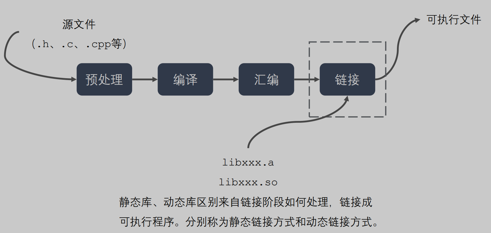

- 预编译(.i)

  > 预编译程序所完成的基本上是对源程序的“替代”工作

  主要处理源代码文件中的以“#”开头的预编译指令。处理规则见下

  1. 处理所有的条件`预编译指令`，如“#if”、“#endif”、“#ifdef”、“#elif”和“#else”。
  2. 处理“#include”预编译指令，将文件内容替换到它的位置，这个过程是递归进行的，文件中包含其他文件。
  3. 删除所有的注释，“//”和“/**/”。
  4. 删除所有的#define，`展开所有的宏定义`。
  5. 保留所有的#pragma 编译器指令，编译器需要用到他们，如：#pragma once 是为了防止有文件被重复引用。
  6. 添加行号和文件标识，便于编译时编译器产生调试用的行号信息，和编译时产生编译错误或警告时能够显示行号。

- 编译(.s)

  > 把预编译后的代码进行词法,语法,语义分析和优化 得到汇编代码

  把预编译之后生成的xxx.i或xxx.ii文件，进行一系列词法分析、语法分析、语义分析及优化后，生成相应的`汇编代码文件`。

  1. 词法分析：利用类似于“有限状态机”的算法，将源代码程序输入到扫描机中，将其中的字符序列分割成一系列的记号。
  2. 语法分析：语法分析器对由扫描器产生的记号，进行语法分析，产生语法树。由语法分析器输出的语法树是一种以表达式为节点的树。
  3. 语义分析：语法分析器只是完成了对表达式语法层面的分析，语义分析器则对表达式是否有意义进行判断，其分析的语义是静态语义——在编译期能分期的语义，相对应的动态语义是在运行期才能确定的语义。
  4. 优化：源代码级别的一个优化过程。
  5. 目标代码生成：由代码生成器将中间代码转换成目标机器代码，生成一系列的代码序列——汇编语言表示。
  6. 目标代码优化：目标代码优化器对上述的目标机器代码进行优化：寻找合适的寻址方式、使用位移来替代乘法运算、删除多余的指令等。

- 汇编(.o)

  > 把汇编代码转换成机器码

  将汇编代码转变成机器可以执行的指令(机器码文件)。 汇编器的汇编过程相对于编译器来说更简单，没有复杂的语法，也没有语义，更不需要做指令优化，只是根据汇编指令和机器指令的对照表一一翻译过来，汇编过程有汇编器as完成。经汇编之后，产生目标文件(与可执行文件格式几乎一样)xxx.o(Windows下)、xxx.obj(Linux下)。

- ==链接==(.exe .out)

  将不同的源文件产生的目标文件进行链接，从而形成一个可以执行的程序。

3、动态链接和静态链接区别优缺点

1. ==静态链接==：（拿空间和更新难度 换 运行速度）

   函数和数据被编译进一个二进制文件。在使用静态库的情况下，在编译链接可执行文件时，链接器从库中`复制这些函数和数据`并把它们和应用程序的其它模块`组合`起来创建最终的可执行文件。

   > 空间浪费：因为每个可执行程序中对所有需要的目标文件都要有一份副本，所以如果多个程序对同一个目标文件都有依赖，会出现同一个目标文件都在内存存在多个副本； （内存中的空间浪费）
   >
   > `更新困难`：每当库函数的代码修改了，这个时候就需要重新进行编译链接形成可执行程序。
   >
   > `运行速度快`：但是静态链接的优点就是，在可执行程序中已经具备了所有执行程序所需要的任何东西，在执行的时候运行速度快。

2. *==动态链接==*：（拿运行速度 换 空间和更新难度）

   动态链接的基本思想是把程序按照模块拆分成各个相对独立部分，在程序运行时才将它们链接在一起形成一个完整的程序，而不是像静态链接一样把所有程序模块都链接成一个单独的可执行文件。

   > 共享库：就是即使需要每个程序都依赖同一个库，但是该库不会像静态链接那样在内存中存在多分，副本，而是这多个程序在执行时共享同一份副本；
   >
   > `更新方便`：更新时只需要替换原来的目标文件，而无需将所有的程序再重新链接一遍。当程序下一次运行时，新版本的目标文件会被自动加载到内存并且链接起来，程序就完成了升级的目标。
   >
   > `性能损耗`：因为把链接推迟到了程序运行时，所以每次执行程序都需要进行链接，所以性能会有一定损失。

4、static

初始化一次 存在全局静态数据区

1. static 修饰局部 初始化一次, 限定作用域为局部
2. static 修饰全部变量 初始化一次(main之前初始化), 限定作用域为当前文件
3. staici修饰类内成员 初始化一次(mian之前) 类的所有对象共享
4. static修饰成员函数 属于类而不是某一个对象 ::调用 可用来实现工具类
5. 静态函数: 非extern 限定在声明他的文件中 不会同其他cpp中的同名函数引起冲突；

5、虚函数 虚表

怎样实现多态的

• 子类若重写父类虚函数，`虚函数表中，该函数的地址会被替换`，对于存在虚函数的类的对象，在VS中，`对象的对象模型的头部存放指向虚函数表的指针`，通过该机制实现多态。

6、#define MAX(x,y) 用宏实现最大值函数

\#define MAX(x, y) ((x) > (y) ? (x) : (y))

7、手写一个最大堆（实现插入、删除节点）

```cpp
class Heap {
private:
  vector<int> _nums;

  //下滤
  void lower(int rootPos, int lastPos) {
    int leftPos = 2 * rootPos + 1;
    if (leftPos < lastPos) {
      int maxPos = leftPos;
      int rightPos = leftPos + 1;
      if (rightPos < lastPos) {
        maxPos = _nums[leftPos] > _nums[rightPos] ? leftPos : rightPos;
      }
      if (_nums[maxPos] > _nums[rootPos]) {
        swap(_nums[rootPos], _nums[maxPos]);
        lower(maxPos, lastPos);
      }
    }
  }

  void upper(int val) {
    _nums.push_back(val);
    int curr = _nums.size() - 1;
    while (curr) {
      int parent = curr / 2;
      if (_nums[curr] > _nums[parent]) {
        swap(_nums[curr], _nums[parent]);
        curr = parent;
      } else
        break;
    }
  }

  //建堆
  void build() {
    int n = _nums.size();
    for (int i = n / 2; i >= 0; i--) {
      lower(i, n);
    }
  }

public:
  Heap() {}
  Heap(vector<int> nums) : _nums(nums) { build(); }

  void push(int val) { upper(val); }
  void pop() {
    _nums.erase(_nums.begin());
    build();
  }
  int top() {
    assert(_nums.size());
    return _nums.front();
  }

  int size() { return _nums.size(); }
};

int main() {
  Heap que(vector<int>{1, 2, 5, 6, 10, 2, 4, 1});
  que.push(100);
  que.push(9);
  while (que.size()) {
    cout << que.top() << endl;
    que.pop();
  }
  return 0;
}
```

面了一个小时，第6题回答得很不好，希望有机会下一面，话说二面没有连着一面是不是代表挂了呀。。。 😂 😂 😂

# 基础知识

## 分析下面代码可能会有什么风险？ 

```c++
void test1() { 
    char string[10]; 
    char* str1 = "01234567891"; 
    strcpy( string, str1 ); 
} 
```

1. 严格区分的话，string是`保留字`，而不是关键字，理论上可以作变量名或数组名，且`能`编译通过，但<u>一个好的编程习惯是不建议这样做的</u> 

2. “01234567891”是“const char *”类型，不可赋值给“char *”类型，故应改为const char * str = "01234567891" 

   > <u>但是在使用过程中是没有问题 不会报错的啊 这样写 其实就是const char*</u>

3. "01234567891"大小为12个字节（加上结束符），但string数组只有10个字节空间，在调用strcpy函数时发生越界，有安全隐患

#### 知识点

```c++
//考虑内存᯿叠的字符串拷⻉函数 优化的点
char *strcpy(char *dest, char *src) {
  char *ret = dest;
  assert(dest != NULL);
  assert(src != NULL);
  memmove(dest, src, strlen(src) + 1);
  return ret;
}
```

## 分析下面代码有什么问题？

```c++
void test2() { 
    char string[10], str1[10]; 
    int i; 
    for(i=0; i<10; i++) { 
        str1  = 'a'; 
    } 
    strcpy( string, str1 ); 
} 
```

1. 首先，代码根本不能通过编译。因为数组名str1为 `char *const类型的右值类型`，根本不能赋值。

2. 再者，即使想对数组的第一个元素赋值，也要使用 *str1 = 'a'; 

3. 其次，对字符数组赋值后，使用库函数`strcpy`进行拷贝操作，strcpy会从源地址一直往后拷贝，直到遇到`'\0'`为止。所以拷贝的长度是不定的。`如果一直没有遇到'\0'导致越界访问非法内存，程序就崩了`。

完美修改方案为：

```c++
void test2(){
	char string[10], str1[10];
	int i;
	for(i=0; i<9; i++){
		str1[i]  = 'a';
	}
	str1[9] = '\0';
	strcpy( string, str1 );
}
```

#### 知识点

```c++
//把 src 所指向的字符串追加到 dest 所指向的字符串的结尾。
char *strcat(char *dest, const char *src) {
	// 1. 将⽬的字符串的起始位置先保存，最后要返回它
	// 2. 先找到dest的结束位置,再把src拷⻉到dest中，记得在最后要加上'\0'
	char *ret = dest;
	assert(dest != NULL);
	assert(src != NULL);
	while (*dest != '\0')
		dest++;
	while (*src != '\0')
		*(dest++) = *(src++);
	*dest = '\0';
	return ret;
}
```

## 指出下面代码有什么问题？

```c++
void test3(char* str1) { 
    if(str1 == NULL){
        return;
    }

    char string[10]; 
    if( strlen( str1 ) <= 10 ) { 
        strcpy( string, str1 ); 
    } 
} 
```

`if(strlen(str1) <= 10)`应改为`if(strlen(str1) < 10)`，因为strlen的结果未统计’\0’所占用的1个字节。 

## 写出完整版的strcpy函数

```c++
char *strcpy(char *dst, const char *src){
    assert((dst != NULL) && (src !=NULL));//加断言，指针为空时报错
    const char *address = dst; //保存dst地址，因为下面*dst++会进行指针的移动
    while((*dst++ = *src++) != '\0');//字符拷贝
    return address;//返回输出地址，以便生成链式表达式
}

//把 src 所指向的字符串复制到 dest，注意：dest定义的空间应该⽐src⼤。
char *strcpy(char *dest, const char *src) {
	char *ret = dest;
	assert(dest != NULL); //优化点1：检查输⼊参数
	assert(src != NULL);
	while (*src != '\0')
		*(dest++) = *(src++);
	*dest = '\0'; //优化点2：⼿动地将最后的'\0'补上
	return ret;
}
```

## 检查下面代码有什么问题？

```c++
void GetMemory( char *p ) { 
    p = (char *) malloc( 100 ); 
} 

void Test( void )  { 
    char *str = NULL; 
    GetMemory( str );  
    strcpy( str, "hello world" ); 
    printf( str ); 
} 
```

1. 只是传值而没有传地址

   ```c++
   //传值调用
   void GetMemory( char **p ){
       *p = (char *) malloc( 100 );
   }
   
   GetMemory( &str );
   ```

   或者传引用进去

   ```c++
   //引用调用
   void GetMemory_1(char *&p){
       p = (char *) malloc (100);
   }
   
   GetMemory_1( str );
   ```

2. 没有释放malloc的内存 应该`free(str); str = NULL;`

3. printf这里应该改为 cout<<str<<endl;  （`然而运行起来并没有什么问题）`

   > printf("%c\n",*str);//输出首字符
   >
   > printf("%s\n",str);//输出整串字符
   >
   > printf("%p\n",str);//输出[字符串](https://so.csdn.net/so/search?q=字符串&spm=1001.2101.3001.7020)首字符地址
   >
   > printf("%p\n",&str);//输出指针str的地址

### `下面代码会出现什么问题？`

```c++
char *GetMemory( void ) {  
    char p[] = "hello world";  
    return p;  
} 

void Test( void ) {  
    char *str = NULL;  
    str = GetMemory();  
    printf( str );  
} 
```

1. p[]数组为函数内的局部自动变量，在函数返回后，内存已经被释放。这是许多程序员常犯的错误，其根源在于不理解变量的生存期。 

   > char p[]="hello world";相当于char p[12]，strcpy(p," hello world" ).
   >
   > p是一个数组名，属于局部变量，存储在栈中， " hello world" 存储在文字存储区，数组p中存储的是 " hello world" 的一个副本，当函数结束，p被回收，副本也消失了(确切的说`p指向的栈存储区被取消标记，可能随时被系统修改`)，而函数返回的p指向的内容也变得不确定，文字存储区的 " hello world" 未改变。
   >
   > 可以这样修改: 
   >
   > 1. ? <u>char* p= " hello world" ; return p; 这里p直接指向文字存储区的 " hello world" ，函数按值返回p存储的地址，所以有效。</u>
   > 2. static char p[]= " hello world" ; return p; static指出数组p为静态数组，函数结束也不会释放，所以有效.

2. 函数可以返回普通局部变量，但是不能返回局部变量的指针（确切说是 栈内存的地址），如果想返回指针，可以通过传参的方式，让这个参数做输出型参数。 int a = 1; return a; 是可以的

   > 一般来说，函数是可以返回局部变量的，但不能返回局部变量的地址，包括指向局部变量的指针也是不能返回的。如果真要返回，必需定义为static，存放在静态数据区，这样是可以返回的。当定义 int a=1,return a;时，此时返回的值，会有一个临时变量产生，类似调用拷贝构造函数，把a的值传递到临时变量，同时a的内存被释放。
   > 接下来我们考虑下面情况： const *char p="hello world"; return p; 此时是可以的，因为这是一个字符串常量，存储在文字常量区，也可以叫只读数据段，在只读数据段存储的数据的生命期一直到main退出的。

## 下面代码会出现什么问题？

```c++
void GetMemory( char **p, int num ) { 
    *p = (char *) malloc( num ); 
} 

void Test( void ) { 
    char *str = NULL; 
    GetMemory( &str, 100 ); 
    strcpy( str, "hello" );  
    printf( str );  
} 
```


1. 传入GetMemory的参数为字符串指针的指针，但是在GetMemory中执行申请内存及赋值语句, 后未判断内存是否申请成功，应加上：以及未考虑nums<=0的情况

```c++
void GetMemory(char **p, int num){
    if(num<=0)
        printf("申请的内存空间要大于零!\n");
    *p = (char*)malloc(num);
    if(*p==NULL)
        printf("申请内存失败!\n");
}
```

2. 未释放堆内存 动态分配的内存在程序结束之前没有释放，应该调用free, 把malloc生成的内存释放掉 str = NULL;

3. printf(str) 改为 printf("%s",str),否则可使用格式化 字符串攻击

## 下面代码会出现什么问题？

```c++
void Test( void ) { 
    char *str = (char *) malloc( 100 ); 
    strcpy( str, "hello" ); 
    free( str );  
    ... //省略的其它语句 
} 
```

1. 在执行 `char *str = (char *) malloc(100);` 后未进行内存是否申请成功的判断；

2. 另外，在free(str)后未置str为空，导致可能变成一个“野”指针，应加上： str = NULL;  试题6的Test函数中也未对malloc的内存进行释放。 

## 看看下面的一段程序有什么错误?

```c++
swap( int* p1,int* p2 ) { 
    int *p; 
    *p = *p1; 
    *p1 = *p2; 
    *p2 = *p; 
} 
```

1. 需要一个返回值void 

2. 在swap函数中，p是一个“野”指针，有可能指向系统区，导致程序运行的崩溃。在VC++中DEBUG运行时提示错误“Access Violation”。该程序应该改为：

   ```c++
   void swap( int* p1,int* p2 ) { 
       int p; 
       p = *p1; 
       *p1 = *p2; 
       *p2 = p; 
   } 
   //或者
   void swap( int* p1,int* p2 ) { 
       int *p = new int(0); 
       *p = *p1; 
       *p1 = *p2; 
       *p2 = p;
       delete p;
   } 
   ```

## 分别给出BOOL，int，float，指针变量 与“零值”比较的 if 语句（假设变量名为var）

```c++
if(!a)
if(0 == a) //避免少些等号 出错
const float eps = 0.00001;
if((x>=-eps) && (x<=eps))
if(a == nullptr)
```

### `以下为Windows NT下的32位C++程序，请计算sizeof的值`

```c++
void Func ( char str[100] ) { 
    sizeof( str ) = ? 
} 
void *p = malloc( 100 ); 
sizeof ( p ) = ? 
```

sizeof( str ) = 4 
sizeof ( p ) = 4 
`【剖析】` 
Func ( char str[100] )函数中数组名作为函数形参时，在函数体内，数组名失去了本身的内涵，仅仅只是一个指针；在失去其内涵的同时，它还失去了其常量特性，可以作自增、自减等操作，可以被修改。 
数组名的本质如下： 

1. 数组名指代一种数据结构，这种数据结构就是数组； 
   例如： 

```c++
char str[10]; 
cout ＜＜ sizeof(str) ＜＜ endl; 
```

​		`输出结果为10，str指代数据结构char[10]。` 

2. 数组名可以转换为指向其指代实体的指针，而且是一个指针常量，不能作自增、自减等操作，不能被修改； 
   char str[10];  
   str++; //编译出错，提示str不是左值 

3. 数组名作为函数形参时，沦为普通指针。 

Windows NT 32位平台下，指针的长度（占用内存的大小）为4字节，故sizeof( str ) 、sizeof ( p ) 都为4。 

> 在编译时是将char str[100]按指针变量处理的，相当于将函数f的首部写成f(int *str);
>
> 说明：C语言调用函数时采用“值传递”方式，当用变量名作为函数参数时传递的是变量的值，当                                                                                                                                                                                                                                                                                                                                                                                                                                                                                                                                                                            
>
> 用数组名作为函数参数时，由于数组名代表的是数组首元素地址，因此传递的是地址，所以要求形参为指针变量。
>
> 所以说：
>
> `void fun(int num[]) 和 void fun(int* num) 使用上是完全一样的`

## 写一个“标准”宏MIN，这个宏输入两个参数并返回较小的一个。另外，当你写下面的代码时会发生什么事？ least = MIN(*p++, b); 

解答： 

```c++
#define MIN(A,B) ((A) <= (B) ? (A) : (B))  
```

MIN(*p++, b)会产生宏的副作用 
剖析： 
这个面试题主要考查面试者对宏定义的使用，宏定义可以实现类似于函数的功能，但是它终归不是函数，而宏定义中括弧中的“参数”也不是真的参数，在宏展开的时候对“参数”进行的是一对一的替换。 
程序员对宏定义的使用要非常小心，特别要注意两个问题： 

1. ==<u>谨慎地将宏定义中的“`参数`”和`整个宏`用用括弧括起来</u>==。所以，严格地讲，下述解答： 

   ```c++
   #define MIN(A,B) (A) <= (B) ? (A) : (B) 
   #define MIN(A,B) (A <= B ? A : B ) 
   ```

   <u>都应判0分；</u> 

2. 防止宏的副作用。 
   宏定义#define MIN(A,B) ((A) <= (B) ? (A) : (B))对MIN(*p++, b)的作用结果是： 

   ```c++
   ((*p++) <= (b) ? (*p++) : (b))  
   ```

   这个表达式会产生副作用，指针p会作`2次++`自增操作。 

   除此之外，另一个应该判0分的解答是： 

   ```c++
   #define MIN(A,B) ((A) <= (B) ? (A) : (B)); 
   ```

   这个解答在宏定义的后面加“;”，显示编写者对宏的概念模糊不清，只能被无情地判0分并被面试官淘汰。

## 为什么标准头文件都有类似以下的结构？

```c++
#ifndef __INCvxWorksh 
#define __INCvxWorksh  
#ifdef __cplusplus 
extern "C" { 
#endif  
/*...*/  
#ifdef __cplusplus 
} 
#endif  
#endif /* __INCvxWorksh */ 
```

1. 头文件中的编译宏

   ```c++
   #ifndef　__INCvxWorksh 
   #define　__INCvxWorksh 
   #endif  
   ```

   的作用是`防止被重复引用`。

2. 作为一种面向对象的语言，C++支持函数重载，而过程式语言C则不支持。函数被C++编译后在symbol库中的名字与C语言的不同。例如，假设某个函数的原型为：
   `void foo(int x, int y);`
   该函数被C编译器编译后在symbol库中的名字为 `_foo`，而C++编译器则会产生像 `_foo _int _int`之类的名字。 _foo_int_int这样的名字包含了函数名和函数参数数量及类型信息，<u>C++就是靠这种机制来实现函数重载的</u>。
   为了实现C和C++的混合编程，C++提供了C连接交换指定符号extern "C"来解决名字匹配问题，函数声明前加上extern "C"后，则编译器就会按照C语言的方式将该函数编译为 _foo，这样c++中调用c的函数了。

## 编写一个函数，作用是把一个char组成的字符串循环右移n个。比如原来是“abcdefghi”如果n=2，移位后应该是“hiabcdefg” 

函数头是这样的：
//pStr是指向以'\0'结尾的字符串的指针
//steps是要求移动的n

```c++
void LoopMove ( char * pStr, int steps ) { 
 //请填充... 
} 
```

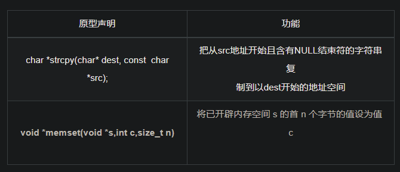

原型声明：  

​    void *memcpy(void *dest, const void *src, size_t n);  

  功能：

  从源`src`所指的内存地址的起始位置开始拷贝`n个字节`到目标`dest`所指的内存地址的起始位置中

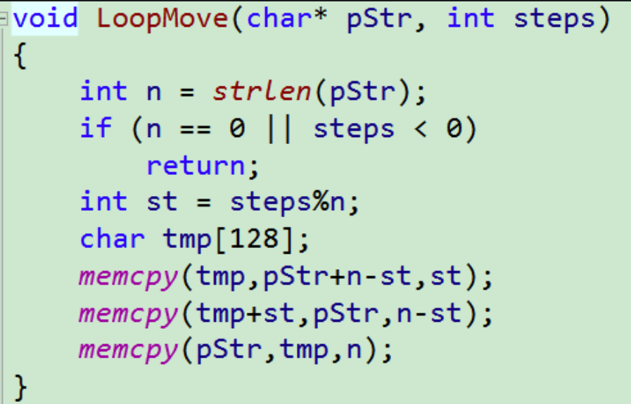

`可以用strcpy()和strncpy()代替`

## 已知WAV文件格式如下表，打开一个WAV文件，以适当的数据结构组织WAV文件头并解析WAV格式的各项信息。 

  WAVE文件格式说明表   

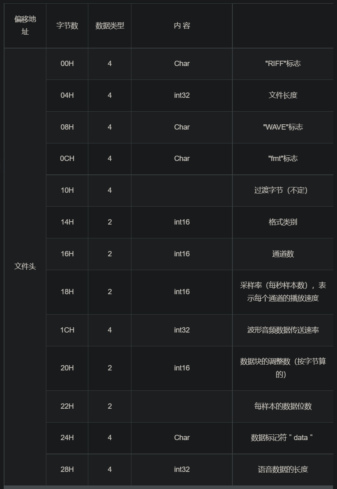

```c++
typedef struct tagWaveFormat {  
    char cRiffFlag[4];  
    UIN32 nFileLen;  
    char cWaveFlag[4];  
    char cFmtFlag[4];  
    char cTransition[4];  
    UIN16 nFormatTag ;  
    UIN16 nChannels;  
    UIN16 nSamplesPerSec;  
    UIN32 nAvgBytesperSec; 
    UIN16 nBlockAlign;  
    UIN16 nBitNumPerSample; 
    char cDataFlag[4];  
    UIN16 nAudioLength;  
} WAVEFORMAT; 
```

> 假设WAV文件内容读出后存放在指针buffer开始的内存单元内，则分析文件格式的代码很简单，为：    
>
> WAVEFORMAT waveFormat;    
>
> memcpy( &waveFormat, buffer,sizeof( WAVEFORMAT ) );   
>
> 直接通过访问waveFormat的成员，就可以获得特定WAV文件的各项格式信息。

【质疑】 结构体应该考虑到对齐。第9个字段之前实际上会有两个字节填充。 实际的存储空间比读取到的内容大

## 编写类String的构造函数、析构函数和赋值函数，已知类String的原型为：

```c++
class String {  
public:  
    String(const char *str = NULL); // 普通构造函数  
    String(const String &other); // 拷贝构造函数  
    ~ String(void); // 析构函数  
    String & operator =(const String &other); // 赋值函数  
private:  
    char *m_data; // 用于保存字符串  
}; 
```

```c++
//普通构造函数 
String::String(const char *str){
	if (str == NULL){
		m_data = new char[1]; // 得分点：对空字符串自动申请存放结束标志'\0'的空 
							  //加分点：对m_data加NULL 判断 
		*m_data = '\0';
	}
	else{
		int length = strlen(str);
		m_data = new char[length + 1];
		strcpy(m_data, str);
	}
}
// String的析构函数 
String::~String(void){
	delete[] m_data; // 或delete m_data; 
}
//拷贝构造函数 
String::String(const String &other){ 　　　// 得分点：输入参数为const型 
	int length = strlen(other.m_data);
	m_data = new char[length + 1];
	strcpy(m_data, other.m_data);
}
//赋值函数 
String & String::operator =(const String &other){ // 得分点：输入参数为const型 
	if (this == &other) 　　//得分点：检查自赋值 
		return *this;
	delete[] m_data; 　　　　//得分点：释放原有的内存资源 
	int length = strlen(other.m_data);
	m_data = new char[length + 1];
	strcpy(m_data, other.m_data);
	return *this; 　　　　　　　　//得分点：返回本对象的引用 
}

```

> C 库函数 **size_t strlen(const char \*str)** 计算字符串 **str** 的长度，直到空结束字符，但`不包括空结束字符`。

## 请说出static和const关键字尽可能多的作用

##### static关键字至少有下列n个作用： 

（1）函数体内static变量的作用范围为该函数体，不同于auto变量，该变量的内存只被分配一次，因此其值在下次调用时仍维持上次的值； 
（2）在模块内的static全局变量可以被模块内所用函数访问，但不能被模块外其它函数访问； 
（3）在模块内的static函数只可被这一模块内的其它函数调用，这个函数的使用范围被限制在声明它的模块内； 
（4）在类中的static成员变量属于整个类所拥有，对类的所有对象只有一份拷贝； 
（5）在类中的static成员函数属于整个类所拥有，这个函数不接收this指针，因而只能访问类的static成员变量。  

##### const关键字至少有下列n个作用： 

（1）欲阻止一个变量被改变，可以使用const关键字。在定义该const变量时，通常需要对它进行初始化，因为以后就没有机会再去改变它了； 
（2）对指针来说，可以指定指针本身为const，也可以指定指针所指的数据为const，或二者同时指定为const； 
（3）在一个函数声明中，const可以修饰形参，表明它是一个输入参数，在函数内部不能改变其值； 
（4）<u>对于类的成员函数，若指定其为const类型，则表明其是一个常函数，不能修改类的 成员变量；</u> 
（5）<u>对于类的成员函数，有时候必须指定其返回值为const类型，以使得其返回值不为“左值”。例如：</u> 
const classA operator*(const classA& a1,const classA& a2); 
operator * 的返回结果必须是一个const对象。如果不是，这样的变态代码也不会编译出错： 
classA a, b, c; 
(a * b) = c; // 对a*b的结果赋值 
操作(a * b) = c显然不符合编程者的初衷，也没有任何意义。

## 请写一个C函数，若处理器是Big_endian的，则返回0；若是Little_endian的，则返回1

```c++
int checkCPU() {
    { 
        union w {  
            int a; 
            char b; 
        } c; 
        c.a = 1; 
        return (c.b == 1); //联合体union的存放顺序是所有成员都从低地址开始存放，
    } 
} 
```

## 写一个函数返回1+2+3+…+n的值（假定结果不会超过长整型变量的范围）

```c++
int Sum( int n ) {  
    return ( (long)1 + n) * n / 2;　　//或return (1l + n) * n / 2; 
} 

int Sum( int n ) { 
    long sum = 0; 
    for( int i=1; i<=n; i++ ) { 
        sum += i; 
    } 
    return sum; 
}  
```

## 说一下static关键字的作用

1. `全局静态变量`

   在全局变量前加上关键字static，全局变量就定义成一个全局静态变量.

   静态存储区，在整个程序运行期间一直存在。

   初始化：未经初始化的全局静态变量会被自动初始化为0（自动对象的值是任意的，除非他被显式初始化）；

   作用域：全局静态变量在声明他的文件之外是不可见的，准确地说是从定义之处开始，到文件结尾。

2. `局部静态变量`

   在局部变量之前加上关键字static，局部变量就成为一个局部静态变量。

   内存中的位置：静态存储区

   初始化：未经初始化的全局静态变量会被自动初始化为0（自动对象的值是任意的，除非他被显式初始化）；

   作用域：作用域仍为局部作用域，当定义它的函数或者语句块结束的时候，作用域结束。但是当局部静态变量离开作用域后，并没有销毁，而是仍然驻留在内存当中，只不过我们不能再对它进行访问，直到该函数再次被调用，并且值不变；

3. `静态函数`

   在函数返回类型前加static，函数就定义为静态函数。函数的定义和声明在默认情况下都是extern的，但静态函数只是在声明他的文件当中可见，不能被其他文件所用。

   函数的`实现`使用static修饰，那么这个函数只可在`本cpp`内使用，不会同其他cpp中的同名函数引起冲突；

   warning：`不要`在`头文件`中`声明`static的全局函数，不要在cpp内声明非static的全局函数，如果你要在多个cpp中复用该函数，就把它的声明提到头文件里去，否则cpp内部声明需加上static修饰；

4. 类的`静态成员`

   在类中，静态成员可以实现多个对象之间的数据共享，并且使用静态数据成员还不会破坏隐藏的原则，即保证了安全性。因此，静态成员是类的所有对象中共享的成员，而不是某个对象的成员。对多个对象来说，静态数据成员只存储一处，供所有对象共用

5. 类的`静态函数`

   静态成员函数和静态数据成员一样，它们都属于类的静态成员，它们都不是对象成员。因此，对静态成员的引用不需要用对象名。

   在静态成员函数的实现中不能直接引用类中说明的非静态成员，可以引用类中说明的静态成员（这点非常重要）。如果静态成员函数中要引用非静态成员时，可通过对象来引用。从中可看出，调用静态成员函数使用如下格式：<类名>::<静态成员函数名>(<参数表>);

## 说一下C++和C的区别

1. 设计思想上：

   C++是面向对象的语言，而C是面向过程的结构化编程语言

2. 语法上：

   C++具有封装、继承和多态三种特性

   C++相比C，增加多许多类型安全的功能，比如强制类型转换、

   C++支持范式编程，比如模板类、函数模板等

## 说一说c++中四种cast转换

C++中四种类型转换是：static_cast, dynamic_cast, const_cast, reinterpret_cast

1. const_cast

   <u>用于将const变量`转为非const`</u>

2. static_cast

   > `static_cast`是静态类型转换，一般代码中用得最多的就是它，可以用来转换常量类型，或者子类指针/引用转父类。C++里`void*转 T * `就要用它（C++禁止void*`隐式`转换为其他类型指针，反之可以。C语言二者都允许）

3. dynamic_cast

   用于`动态类型`转换。只能用于含有`虚函数`的类，用于类层次间的向上和向下转化。只能转指针或引用。向下转化时，如果是非法的对于指针返回NULL，对于引用抛异常。要深入了解内部转换的原理。

   > 向上转换：指的是子类向基类的转换
   >
   > 向下转换：指的是基类向子类的转换

   它通过判断在执行到该语句的时候变量的运行时类型和要转换的类型是否相同来判断是否能够进行向下转换。

   > `dynamic_cast`使用了RTTI来做类型检查，父类转子类的时候使用它更安全。如果是不能转换的类型，转引用会抛`std::bad_cast`异常，转指针会返回`nullptr`。用得非常少，因为一用就会引入RTTI，造成代码膨胀。而且需要根据实际类型作出行动可以抽象成虚函数，不需要cast。

4. reinterpret_cast

   几乎什么都可以转，比如将int转指针，可能会出问题，尽量少用；`非常危险`

5. 为什么不使用C的强制转换？

   C的强制转换表面上看起来功能强大什么都能转，但是转化不够明确，不能进行错误检查，容易出错。

## 请说一下C/C++ 中指针和引用的区别？

1. 指针有自己的一块`空间`，而引用只是一个别名；

2. 使用`sizeof`看一个指针的大小是4，而引用则是被引用对象的大小；

3. 指针可以被`初始化`为NULL，而引用必须被初始化且必须是一个已有对象 的引用；

4. 作为`参数传递`时，指针需要被解引用才可以对对象进行操作，而直接对引 用的修改都会改变引用所指向的对象；

5. 可以有`const`指针，但是没有const引用；

6. 指针在使用中可以`指向`其它对象，但是引用只能是一个对象的引用，不能 被改变；

7. 指针可以有`多级`指针（**p），而引用至于一级；

8. 指针和引用使用`++运算符`的意义不一样；

9. 如果`返回动态内存`分配的对象或者内存，必须使用指针，引用可能引起`内存泄露`。

## 给定三角形ABC和一点P(x,y,z)，判断点P是否在ABC内，给出思路并手写代码

```c++
#include<iostream>
#include<math.h>
using namespace std;
struct point{	//三角形点的坐标
	float x;
	float y;
	float z;
};

//s=sqrt(p*(p-a)(p-b)(p-c))    p=1/2(a+b+c)
float sum(point A,point B,point C ) {	//计算面积
	float AB = sqrt(pow(A.x - B.x, 2) + pow(A.y - B.y, 2) + pow(A.z - B.z, 2));//计算三角形三边长
	float AC = sqrt(pow(A.x - C.x, 2) + pow(A.y - C.y, 2) + pow(A.z - C.z, 2));
	float BC = sqrt(pow(B.x - C.x, 2) + pow(B.y - C.y, 2) + pow(B.z - C.z, 2));
	float p = (AB + AC + BC) / 2;//海伦公式
	float S = sqrt(p * (p - AB) * (p - AC) * (p - BC));//面积
	return S;
}
int main() {
	float x,y,z;
	while(1){//测试
	cin >> x >> y >> z;
	point P = {x,y,z};
	point A = { 0, 0, 0 }, B = { 0, 6, 0 },C = { 7, 0, 0 };//设置一个简单的z值都为0的三角形，方便验证
	if ((sum(P, A, B) + sum(P, A, C) + sum(P, B, C)-sum(A, B, C))<0.001)
        cout << "P在三角形ABC之内\n";
	else cout << "P不在三角形ABC之内\n";
	}
}
```

## 请你说一下你理解的c++中的smart pointer四个智能指针

C++里面的四个智能指针: auto_ptr, `shared_ptr`, `weak_ptr`, `unique_ptr` 其中后三个是c++11支持，并且第一个已经被11弃用。

`为什么要使用智能指针`：

智能指针的作用是管理一个指针，因为存在以下这种情况：

> 申请的空间在函数结束时`忘记释放，造成内存泄漏`。使用智能指针可以很大程度上的避免这个问题，因为智能指针就是一个<u>==类==</u>，当超出了类的作用域是，类会自动调用<u>==析构函数==</u>，析构函数会自动释放资源。所以`智能指针的作用原理就是在函数结束时自动释放内存空间，不需要手动释放内存空间。`

1. auto_ptr（c++98的方案，cpp11已经抛弃）

- 采用`所有权模式`。

```c++
auto_ptr<string> p1 (new string ("I reigned lonely as a cloud.”));
auto_ptr<string> p2;
p2 = p1; //auto_ptr不会报错.
```

- 此时不会报错，p2剥夺了p1的所有权，但是当程序运行时访问p1将会报错。所以auto_ptr的缺点是：存在潜在的内存崩溃问题！

2. unique_ptr（替换auto_ptr）

- unique_ptr实现`独占式拥有`或严格拥有概念，保证同一时间内只有一个智能指针可以指向该对象。它对于避免资源泄露(例如“以new创建对象后因为发生异常而忘记调用delete”)特别有用。

- 采用`所有权`模式，还是上面那个例子

````c++
unique_ptr<string> p3 (new string  ("auto")); 
unique_ptr<string> p4；   
p4 = p3;//此时会报错！！
````

- 编译器认为p4=p3非法，避免了p3不再指向有效数据的问题。因此，unique_ptr比auto_ptr更安全。

- 另外unique_ptr还有更聪明的地方：当程序试图将一个 unique_ptr 赋值给另一个时，如果源 unique_ptr 是个`临时右值`，编译器允许这么做；如果源 unique_ptr 将存在一段时间，编译器将禁止这么做，比如：

```c++
unique_ptr<string> pu1(new string ("hello world"));
unique_ptr<string> pu2;
pu2 = pu1;                   // #1 not allowed
unique_ptr<string> pu3;
pu3 = unique_ptr<string>(new string ("You"));  // #2 allowed
```

- 其中#1留下悬挂的unique_ptr(pu1)，这可能导致危害。而#2不会留下悬挂的unique_ptr，因为它调用 unique_ptr 的构造函数，该构造函数创建的临时对象在其所有权让给 pu3 后就会被销毁。这种随情况而已的行为表明，unique_ptr 优于允许两种赋值的auto_ptr 。

- 注：如果确实想执行类似与#1的操作，要安全的重用这种指针，可给它赋新值。C++有一个标准库函数`std::move()`，让你能够将一个unique_ptr赋给另一个。例如：

```c++
unique_ptr<string> ps1, ps2;
ps1 = demo("hello");
ps2 = move(ps1); //(ps1不在指向原来对象)
ps1 = demo("alexia");
cout << *ps2 << *ps1 << endl;
```

3. <u>[==shared_ptr==](https://www.cnblogs.com/diysoul/p/5930361.html)</u>

- shared_ptr实现`共享式拥有`概念。多个智能指针可以指向相同对象，该对象和其相关资源会在“`最后一个引用被销毁`”时候`释放`。从名字share就可以看出了资源可以被多个指针共享，它使用计数机制来表明资源被几个指针共享。可以通过成员函数use_count()来查看资源的所有者个数。除了可以通过new来构造，还可以通过传入auto_ptr, unique_ptr,weak_ptr来构造。当我们调用release()时，当前指针会释放资源所有权，计数减一。当计数等于0时，资源会被释放。<u>==引用计数==</u>

- shared_ptr 是为了解决 auto_ptr 在对象所有权上的局限性(auto_ptr 是独占的), 在使用引用计数的机制上提供了可以共享所有权的智能指针。

- 成员函数：

  1. use_count 返回引用计数的个数
  2. unique 返回是否是独占所有权( use_count 为 1)
  3. swap 交换两个 shared_ptr 对象(即交换所拥有的对象)
  4. reset 放弃内部对象的所有权或拥有对象的变更, 会引起原有对象的引用计数的减少
  5. get 返回内部对象(指针), 由于已经重载了()方法, 因此和直接使用对象是一样的.如 shared_ptr<int> sp(new int(1)); sp 与 sp.get()是等价的

  ```c++
  #include <iostream>
  #include <memory>
  using namespace std;
  int main()
  {
      //构建 2 个智能指针
      std::shared_ptr<int> p1(new int(10));
      std::shared_ptr<int> p2(p1);
      //输出 p2 指向的数据
      cout << *p2 << endl;   //输出10
      p1.reset();//引用计数减 1,p1为空指针
      if (p1) {
          cout << "p1 不为空" << endl;
      }
      else {
          cout << "p1 为空" << endl;  //输出
      }
      //以上操作，并不会影响 p2
      cout << *p2 << endl;    //输出10
      //判断当前和 p2 同指向的智能指针有多少个
      cout << p2.use_count() << endl;  //输出 1
      return 0;
  }
  ```

4. weak_ptr  ( `shared_ptr 指针的一种辅助工具`)

- weak_ptr 是一种`不控制对象生命周期`的智能指针, 它指向一个 shared_ptr 管理的对象. 进行该对象的内存管理的是那个强引用的 shared_ptr. weak_ptr只是提供了对管理对象的一个访问手段。weak_ptr 设计的目的是为配合 shared_ptr 而引入的一种智能指针来协助 shared_ptr 工作, 它只可以从一个 shared_ptr 或另一个 weak_ptr 对象构造, `它的构造和析构不会引起引用记数的增加或减少。weak_ptr是用来解决shared_ptr相互引用时的死锁问题,如果说两个shared_ptr相互引用,那么这两个指针的引用计数永远不可能下降为0,资源永远不会释放`。它是对对象的一种弱引用，不会增加对象的引用计数，和shared_ptr之间可以相互转化，shared_ptr可以直接赋值给它，它可以通过调用lock函数来获得shared_ptr。

  ````c++
  class B;
  class A{
  public:
  	shared_ptr<B> pb_;
  	~A(){
      cout<<"A delete\n";
    }
  };
  
  class B{
  public:
    shared_ptr<A> pa_;
  	~B(){
      cout<<"B delete\n";
    }
  };
  
  void fun(){
    shared_ptr<B> pb(new B());
    shared_ptr<A> pa(new A());
    pb->pa_ = pa;
    pa->pb_ = pb;
    cout<<pb.use_count()<<endl; //2
    cout<<pa.use_count()<<endl; //2
  }
  
  int main(){
    fun();
    return 0;
  }
  ````

- 可以看到fun函数中pa ，pb之间`互相引用`，两个资源的引用计数为2，当要跳出函数时，智能指针pa，pb析构时两个资源引用计数会减一，但是两者引用计数还是为1，导致跳出函数时资源没有被释放（pa_，pb_未释放，因为AB是在堆上申请的内存），如果把其中一个改为weak_ptr就可以了，我们把类A里面的shared_ptr pb_; 改为weak_ptr pb_; 运行结果如下，这样的话，资源B的引用开始就只有1，当pb析构时，B的计数变为0，B得到释放，B释放的同时也会使A的计数减一，同时pa析构时使A的计数减一，那么A的计数为0，A得到释放。

- 注意的是`我们不能通过weak_ptr直接访问对象的方法`，比如B对象中有一个方法print(),我们不能这样访问，pa->pb_->print(); 因为pb_是一个weak_ptr，应该先把它转化为shared_ptr,如：

  ````c++
  shared_ptr p = pa->pb_.lock();  //将weak_ptr转换为shared_ptr
  p->print();
  ````

## 怎么判断一个数是二的倍数，怎么求一个数中有几个1，说一下你的思路并手写代码

1. 判断一个数是不是二的倍数，即判断该数二进制末位是不是0：

   `a % 2 == 0 或者a & 0x0001 == 0。`

2. 求一个数中1的位数，可以直接逐位除十取余判断：

   ```c++
   int countOne(int x){
       int ans = 0;
       while(x){
           if(x%10)
               ans++;
           x/=10;
       }
       return ans;
   }
   ```

## 请回答一下数组和指针的区别

指针和数组的主要区别如下：

| 指针                                                         | 数组                                 |
| ------------------------------------------------------------ | ------------------------------------ |
| 保存数据的地址                                               | 保存数据                             |
| 间接访问数据，首先获得指针的内容，然后将其作为地址，从该地址中提取数据 | 直接访问数据，                       |
| 通常用于动态的数据结构                                       | 通常用于固定数目且数据类型相同的元素 |
| 通过Malloc分配内存，free释放内存                             | 隐式的分配和删除                     |
| 通常指向匿名数据，操作匿名函数                               | 自身即为数据名                       |

## 请你回答一下野指针是什么？

野指针  是  一个指向   已删除的对象的指针

野指针  是  一个指向  未申请内存 或者 访问受限的   内存区域的 这么一个指针

## 请你介绍一下C++中的智能指针

智能指针<u>主要用于管理在堆上分配的内存</u>，它<u>将普通的指针封装为一个栈对象。当栈对象的生存周期结束后，会在析构函数中释放掉申请的内存，从而防止内存泄漏</u>。C++ 11中最常用的智能指针类型为shared_ptr,它采用`引用计数`的方法，记录当前内存资源被多少个智能指针引用。该引用计数的内存在堆上分配。当新增一个时引用计数加1，当过期时引用计数减一。只有引用计数为0时，智能指针才会自动释放引用的内存资源。对shared_ptr进行初始化时不能将一个普通指针直接赋值给智能指针，因为一个是指针，一个是类。可以通过make_shared函数或者通过构造函数传入普通指针。并可以通过get函数获得普通指针。

## 请你回答一下智能指针有没有内存泄露的情况

当两个对象相互使用一个shared_ptr成员变量指向对方，会造成循环引用，使引用计数失效，从而导致内存泄漏。例如：

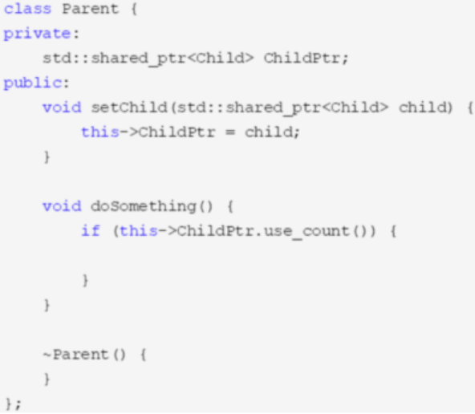

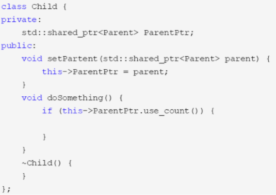

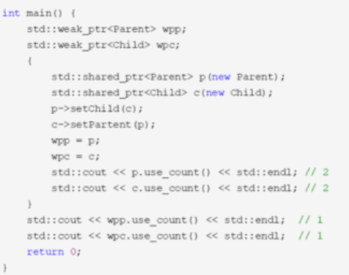

上述代码中，parent有一个shared_ptr类型的成员指向孩子，而child也有一个shared_ptr类型的成员指向父亲。然后在创建孩子和父亲对象时也使用了智能指针c和p，随后将c和p分别又赋值给child的智能指针成员parent和parent的智能指针成员child。从而形成了一个循环引用：

## 请你来说一下智能指针的内存泄漏如何解决

<u>为了解决循环引用导致的内存泄漏，引入了weak_ptr弱指针</u>，weak_ptr的构造函数不会修改引用计数的值，从而不会对对象的内存进行管理，其类似一个普通指针，但不指向引用计数的共享内存，但是其可以检测到所管理的对象是否已经被释放，从而避免非法访问。

> 解决循环引用的问题就是在类对象中使用weak_ptr弱指针对象，弱指针对象不会使引用计数加1

## 请你回答一下为什么析构函数必须是虚函数？为什么C++默认的析构函数不是虚函数

1. 将可能会被继承的父类的析构函数设置为虚函数，可以保证当我们new一个子类，然后使用基类指针指向该子类对象，释放基类指针时可以释放掉子类的空间，`防止内存泄漏`。

2. C++默认的析构函数不是虚函数是因为虚函数`需要额外的虚函数表和虚表指针`，`占用额外的内存`。而对于不会被继承的类来说，其析构函数如果是虚函数，就会`浪费内存`。因此C++默认的析构函数不是虚函数，而是只有当需要当作父类时，设置为虚函数。

## 请你来说一下函数指针

1. 定义

   函数指针是指向函数的指针变量。

   函数指针本身首先是一个指针变量，该指针变量指向一个具体的函数。这正如用指针变量可指向整型变量、字符型、数组一样，这里是指向函数。

   C在编译时，每一个函数都有一个入口地址，该入口地址就是函数指针所指向的地址。有了指向函数的指针变量后，可用该指针变量调用函数，就如同用指针变量可引用其他类型变量一样，在这些概念上是大体一致的。

2. 用途：

   调用函数和做函数的参数，比如回调函数。

3. 示例：

   ```c++
   char * fun(char * p)  {…}       // 函数fun
   char * (*pf)(char * p);         // 函数指针pf
   pf = fun;                       // 函数指针pf指向函数fun
   pf(p);                          // 通过函数指针pf调用函数fun
   ```

4. 首先函数指针是一个指针，指向某一类型的函数 typedef int (*pFunc) (int,int) ； 定义一个函数指针类型，指向返回值是int参数为int，int的函数。 用途：`回调函数`

## 请你来说一下fork函数

Fork：创建一个和当前进程映像一样的进程 可以通过fork( )系统调用：

```c++
#include <sys/types.h>
#include <unistd.h>
pid_t fork(void);
```

- 成功调用fork( )会创建一个新的进程，它几乎与调用fork( )的进程一模一样，这两个进程都会继续运行。在子进程中，成功的fork( )调用会返回0。在父进程中fork( )返回子进程的pid。如果出现错误，fork( )返回一个负值。

- 最常见的fork( )用法是创建一个新的进程，然后使用exec( )载入二进制映像，替换当前进程的映像。这种情况下，派生（fork）了新的进程，而这个子进程会执行一个新的二进制可执行文件的映像。这种“`派生加执行`”的方式是很常见的。

- 在早期的Unix系统中，创建进程比较原始。当调用fork时，内核会把所有的内部数据结构复制一份，复制进程的页表项，然后把父进程的地址空间中的内容逐页的复制到子进程的地址空间中。但从内核角度来说，逐页的复制方式是十分耗时的。现代的Unix系统采取了更多的优化，例如Linux，采用了`写时复制`的方法，而不是对父进程空间进程整体复制。

## 请你来说一下C++中析构函数的作用

1. 析构函数与构造函数对应，当对象结束其生命周期，如<u>对象所在的函数已调用完毕时</u>，系统会自动执行析构函数。
2. 析构函数名也应与类名相同，只是在函数名前面加一个位取反符~，例如 ~stud( )，以区别于构造函数。它不能带任何参数，也没有返回值（包括void类型）。只能有一个析构函数，不能重载。
3. 如果用户没有编写析构函数，<u>编译系统会`自动生成`一个缺省的析构函数（即使`自定义`了析构函数，编译器也总是会为我们合成一个析构函数，并且如果自定义了析构函数，编译器在执行时会先调用自定义的析构函数再调用合成的析构函数），它也不进行任何操作。所以许多简单的类中没有用显式的析构函数。</u>
4. 如果一个类中有指针，且在使用的过程中`动态的申请了内存`，那么最好显示构造析构函数在销毁类之前，`释放掉申请的内存空间`，避免内存泄漏。
5. 类析构顺序：1）派生类本身的析构函数；2）对象成员析构函数；3）基类析构函数。 (和构造函数 从基类到子类 正好相反)

## 请你来说一下map和set有什么区别，分别又是怎么实现的？

map和set都是C++的关联容器，其底层实现都是红黑树（RB-Tree）。由于 map 和set所开放的各种操作接口，RB-tree 也都提供了，所以几乎所有的 map 和set的操作行为，都只是转调 RB-tree 的操作行为。

==<u>map和set区别在于：</u>==

1. map中的元素是key-value（关键字—值）对：关键字起到索引的作用，值则表示与索引相关联的数据；Set与之相对就是关键字的简单集合，set中每个元素只包含一个关键字。
2. `set`的迭代器是const的，不允许`修改元素的值`；`map允许修改value，但不允许修改key`。其原因是因为`map和set是根据关键字排序来保证其有序性的`，如果允许修改key的话，那么首先需要删除该键，然后调节平衡，再插入修改后的键值，调节平衡，如此一来，严重破坏了map和set的结构，导致iterator失效，不知道应该指向改变前的位置，还是指向改变后的位置。所以STL中将set的迭代器设置成const，不允许修改迭代器的值；而map的迭代器则不允许修改key值，允许修改value值。
3. map支持下标操作，set不支持下标操作。map可以用key做下标，map的下标运算符[ ]将关键码作为下标去执行查找，如果关键码不存在，则插入一个具有该关键码和mapped_type类型默认值的元素至map中，<u>因此下标运算符[ ]在map应用中需要慎用</u>，const_map不能用，只希望确定某一个关键值是否存在而不希望插入元素时也不应该使用 `（用count函数）`，mapped_type类型没有默认值也不应该使用。如果find能解决需要，尽可能用find。

## 请你来介绍一下STL的allocator

1. STL的分配器用于封装STL容器在内存管理上的底层细节。在C++中，其内存配置和释放如下：

   new运算分两个阶段：(1)调用::operator new配置内存;(2)调用对象构造函数构造对象内容

   delete运算分两个阶段：(1)调用对象析构函数；(2)调用::operator delete释放内存

2. 为了精密分工，STL allocator将两个阶段操作区分开来：内存配置有alloc::allocate()负责，内存释放由alloc::deallocate()负责；对象构造由::construct()负责，对象析构由::destroy()负责。

3. 同时为了提升内存管理的效率，减少申请小内存造成的内存碎片问题，SGI STL采用了两级配置器，当分配的空间大小超过128B时，会使用第一级空间配置器；当分配的空间大小小于128B时，将使用第二级空间配置器。第一级空间配置器直接使用malloc()、realloc()、free()函数进行内存空间的分配和释放，而第二级空间配置器采用了内存池技术，通过空闲链表来管理内存。

## 请你来说一下C++中类成员的访问权限

C++通过 public、protected、private 三个关键字来控制成员变量和成员函数的访问权限，它们分别表示公有的、受保护的、私有的，被称为成员访问限定符。在类的内部（定义类的代码内部），无论成员被声明为 public、protected 还是 private，都是可以互相访问的，没有访问权限的限制。在类的外部（定义类的代码之外），只能通过对象访问成员，并且通过对象只能访问 public 属性的成员，不能访问 private、protected 属性的成员

- public：可以被该类中的函数、子类的函数、友元函数访问，也可以由该类的对象访问；
- `protected`：可以被该类中的函数、子类的函数、友元函数访问，但`不可以由该类的对象访问`；
- `private`：可以被该类中的函数、友元函数访问，但`不可以由子类的函数、该类的对象、访问`。
- 如果声明不写 public、protected、private，则默认为 private；

## 请你来说一下C++中struct和class的区别

在C++中，可以用struct和class定义类，都可以继承。区别在于：

1. structural的`默认继承权限和默认访问权限`是public，而class`的默认继承权限和默认访问权限是`private。

2. 另外，class还可以定义`模板类形参`，比如template <class T, int i>。

## 请你来说一下一个C++源文件从文本到可执行文件经历的过程？

对于C++源文件，从文本到可执行文件一般需要四个过程：

1. `预处理`阶段：对源代码文件中文件包含关系（头文件）、预编译语句（宏定义）进行分析和替换，生成预编译文件。
2. `编译`阶段：将经过预处理后的预编译文件转换成特定汇编代码，生成汇编文件
3. `汇编`阶段：将编译阶段生成的汇编文件转化成机器码，生成可重定位目标文件
4. `链接`阶段：将多个目标文件及所需要的库连接成最终的可执行目标文件

## 请你来回答一下include头文件的顺序以及双引号””和尖括号<>的区别？

Include头文件的顺序：对于include的头文件来说，如果在文件a.h中声明一个在文件b.h中定义的变量，而不引用b.h。那么要在a.c文件中引用b.h文件，并且要先引用b.h，后引用a.h,否则汇报变量类型未声明错误。

- **双引号和尖括号的区别：编译器预处理阶段查找头文件的路径不一样。**

  1. 对于使用双引号包含的头文件，查找头文件路径的顺序为：

     `当前头文件目录`

     编译器设置的头文件路径（编译器可使用-I显式指定搜索路径）

     系统变量CPLUS_INCLUDE_PATH/C_INCLUDE_PATH指定的头文件路径

  2. 对于使用尖括号包含的头文件，查找头文件的路径顺序为：

     编译器设置的头文件路径（编译器可使用-I显式指定搜索路径）

     系统变量CPLUS_INCLUDE_PATH/C_INCLUDE_PATH指定的头文件路径

## 请你回答一下malloc的原理，另外brk系统调用和mmap系统调用的作用分别是什么？

Malloc函数`用于动态分配内存`。为了减少内存碎片和系统调用的开销，malloc其采用`内存池`的方式，<u>先申请大块内存作为堆区，然后将堆区分为多个内存块，以块作为内存管理的基本单位</u>。

当用户申请内存时，直接从堆区分配一块合适的空闲块。Malloc采用隐式链表结构将堆区分成连续的、大小不一的块，包含已分配块和未分配块；同时malloc采用显示链表结构来管理所有的空闲块，即使用一个双向链表将空闲块连接起来，每一个空闲块记录了一个连续的、未分配的地址。

当进行内存分配时，Malloc会通过隐式链表遍历所有的空闲块，选择满足要求的块进行分配；当进行内存合并时，malloc采用边界标记法，根据每个块的前后块是否已经分配来决定是否进行块合并。

Malloc在申请内存时，一般会通过brk或者mmap系统调用进行申请。其中当申请内存小于128K时，会使用系统函数brk在堆区中分配；而当申请内存大于128K时，会使用系统函数mmap在映射区分配。

## 请你说一说C++的内存管理是怎样的？

在C++中，虚拟内存分为代码段、数据段、BSS段、堆区、文件映射区以及栈区六部分。

1. 代码段:包括只读存储区和文本区，其中只读存储区存储字符串常量，文本区存储程序的机器代码。
2. 数据段：存储程序中已初始化的全局变量和静态变量
3. bss 段：存储未初始化的全局变量和静态变量（局部+全局），以及所有被初始化为0的全局变量和静态变量。
4. 堆区：调用new/malloc函数时在堆区动态分配内存，同时需要调用delete/free来手动释放申请的内存。
5. 映射区:存储动态链接库以及调用mmap函数进行的文件映射
6. 栈：使用栈空间存储函数的返回地址、参数、局部变量、返回值

## 请你来说一下C++/C的内存分配

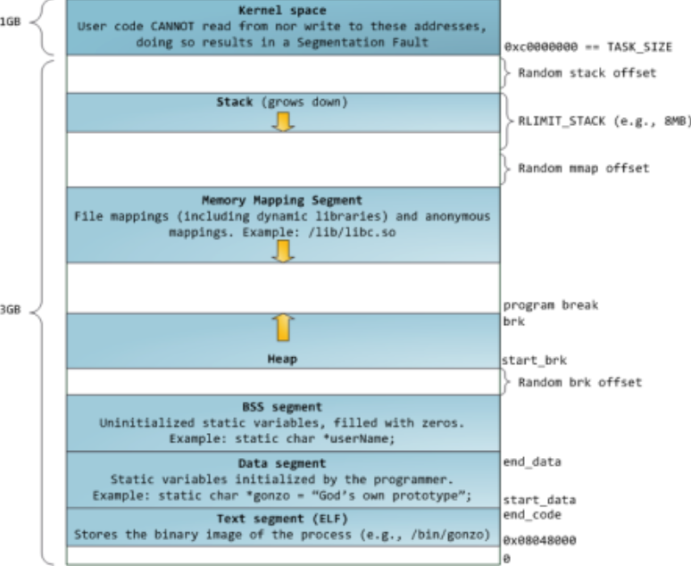

32bitCPU可寻址4G线性空间，每个进程都有各自独立的4G逻辑地址，其中0~3G是用户态空间，3~4G是内核空间，不同进程相同的逻辑地址会映射到不同的物理地址中。其逻辑地址其划分如下：

各个段说明如下：

3G用户空间和1G内核空间

- 静态区域：

  text segment(代码段):包括只读存储区和文本区，其中只读存储区存储字符串常量，文本区存储程序的机器代码。

  data segment(数据段)：存储程序中已初始化的全局变量和静态变量

  bss segment：存储未初始化的全局变量和静态变量（局部+全局），以及所有被初始化为0的全局变量和静态变量，对于未初始化的全局变量和静态变量，程序运行main之前时会统一清零。即未初始化的全局变量编译器会初始化为0

- 动态区域：

  heap（堆）： 当进程未调用malloc时是没有堆段的，只有调用malloc时采用分配一个堆，并且在程序运行过程中可以动态增加堆大小(移动break指针)，从低地址向高地址增长。分配小内存时使用该区域。  堆的起始地址由mm_struct 结构体中的start_brk标识，结束地址由brk标识。

  memory mapping segment(映射区):存储动态链接库等文件映射、申请大内存（malloc时调用mmap函数）

  stack（栈）：使用栈空间存储函数的返回地址、参数、局部变量、返回值，从高地址向低地址增长。在创建进程时会有一个最大栈大小，Linux可以通过ulimit命令指定。

## 请你来回答一下什么是memory leak，也就是内存泄漏

内存泄漏(memory leak)是指由于`疏忽或错误`造成了`程序未能释放掉不再使用的内存`的情况。内存泄漏并非指内存在物理上的消失，而是应用程序分配某段内存后，由于设计错误，`失去了对该段内存的控制`，因而<u>造成了内存的浪费</u>。

内存泄漏的分类：

1. `堆内存泄漏` （Heap leak）。对内存指的是程序运行中根据需要分配通过malloc,realloc new等从堆中分配的一块内存，再是完成后必须通过调用对应的 free或者delete 删掉。如果程序的设计的错误导致这部分内存没有被释放，那么此后这块内存将不会被使用，就会产生Heap Leak.

2. `系统资源泄露`（Resource Leak）。主要指程序使用系统分配的资源比如 <u>Bitmap,handle ,SOCKET</u>等没有使用相应的函数释放掉，导致系统资源的浪费，严重可导致系统效能降低，系统运行不稳定。

3. <u>没有将基类的`析构函数`定义为虚函数</u>。当基类指针指向子类对象时，如果基类的析构函数不是virtual，那么子类的析构函数将不会被调用，子类的资源没有正确是释放，因此造成内存泄露。

## 请你回答一下如何判断内存泄漏？

内存泄漏通常是由于调用了malloc/new等内存申请的操作，但是`缺少了对应的free/delete`。

#### **Linux:**

我们一方面可以使用linux环境下的内存泄漏检查工具**<u>==Valgrind==</u>**,另一方面我们在写代码时可以添加内存申请和释放的统计功能，统计当前申请和释放的内存是否一致，以此来判断内存是否泄露。

Valgrind：

编译：g++ -g -o test test.cpp

使用：valgrind --tool=memcheck ./test

可以检测如下问题：

使用未初始化的内存（全局/静态变量初始化为0，局部变量/动态申请初始化为随机值）；

内存读写越界；

内存覆盖（strcpy/strcat/memcpy）；

动态内存管理（申请释放方式不同，忘记释放等）；

内存泄露（动态内存用完后没有释放，又无法被其他程序使用）。

#### **Windows(vs)**

_CrtDumpMemoryLeaks()就是检测从程序开始到执行该函数进程的堆使用情况，通过使用 _CrtDumpMemoryLeaks()我们可以进行简单的内存泄露检测。

```c++
#define CRTDBG_MAP_ALLOC //放在程序最前
#include <iostream>
#include <stdlib.h>  
#include <crtdbg.h> 
using namespace std;
int main(){
    int *a = new int [10];
    int *p = new int[1000];
    _CrtDumpMemoryLeaks(); //放在程序最后  //会输出在第几行 泄露了多少
    system("pause");
    return 0;
}
```

## 请你来说一下什么时候会发生段错误

段错误通常发生在访问非法内存地址的时候，具体来说分为以下几种情况：

1. `使用野指针`（指针常量没有初始化；指向一块内存已经释放掉的地址；指针操作超过了定义域）

2. <u>试图修改字符串常量的内容</u>

## 请你来回答一下new和malloc的区别

1. new分配内存按照`数据类型`进行分配，malloc分配内存按照指定的大小分配；
2. new`返回`的是<u>指定对象的指针</u>，而malloc返回的是<u>void*</u>，因此malloc的返回值一般都需要进行类型转化。
3. new不仅分配一段内存，而且会调`用构造函数`，malloc不会。
4. new分配的内存要用`delete`销毁，malloc要用`free`来销毁；delete销毁的时候会调用对象的<u>析构</u>函数，而free则不会。
5. new是一个操作符可以`重载`，malloc是一个库函数。
6. malloc分配的内存不够的时候，可以用realloc`扩容`。扩容的原理？new没用这样操作。
7. new如果`分配失败`了会抛出bad_malloc的异常（`程序中断`），而malloc失败了会返回NULL。
8. 申请数组时： `new[]`一次分配所有内存，.0.0`多次调用构造函数`，搭配使用`delete[]`，delete[]`多次调用析构函数`，销毁数组中的每个对象。而malloc则只能sizeof(int) * n。


## 请你详细介绍一下C++11中的可变参数模板、右值引用和lambda这几个新特性。

### [可变参数模板](https://qianxunslimg.github.io/2022/03/16/c-ba-gu/#2-3-C-11中的可变参数模板)

C++11的可变参数模板，`对参数进行了高度泛化`，可以表示任意数目、任意类型的参数，其语法为：在class或typename后面带上`省略号`”。

例如：

```c++
Template<class ... T>
void func(T ... args){
	cout<<”num is”<<sizeof ...(args)<<endl;
}
```

func();//args不含任何参数

func(1);//args包含一个int类型的实参

func(1,2.0);//args包含一个int一个double类型的实参

其中T叫做模板参数包，args叫做函数参数包

<u>省略号作用如下：</u>

1）`声明`一个包含0到任意个模板参数的`参数包`

2）在模板定义得右边，可以将参数包展成一个个独立的参数

C++11可以使用递归函数的方式展开参数包，获得可变参数的每个值。通过递归函数展开参数包，需要提供一个参数包展开的函数和一个递归终止函数。例如：

```c++
#include<iostream>
using namespace std;
// 最终递归函数
void print(){
  cout << "empty" << endl;
}

// 展开函数
template <class T, class ...Args>
void print(T head, Args... args){
  cout << "parameter " << head << endl;
  print(args...);
}

int main(){
  print(1, 2, 3, 4); return 0;
}
```

参数包Args …在展开的过程中递归调用自己，没调用一次参数包中的参数就会少一个，直到所有参数都展开为止。当没有参数时就会调用非模板函数printf终止递归过程


### [右值引用](https://qianxunslimg.github.io/2022/03/16/c-ba-gu/#1-9-C-11右值引用)

右值引用是C++11中引入的新特性 , 它实现了转移语义和精确传递。它的主要目的有两个方面：

1. `消除`两个对象交互时`不必要的对象拷贝`，节省运算存储资源，提高效率。

2. 能够更`简洁明确地定义泛型函数`。

 

##### 左值和右值的概念：

左值：`能对表达式取地址`、或具名对象/变量。一般指表达式结束后依然存在的`持久对象`。

右值：`不能对表达式取地址`，或匿名对象。一般指表达式结束就不再存在的`临时对象`。

C++11中，右值引用就是对一个右值进行引用的类型。由于右值通常不具有名字，所以我们一般只能通过右值表达式获得其引用，比如：

T && a=ReturnRvale();

假设ReturnRvalue()函数返回一个右值，那么上述语句声明了一个名为a的右值引用，其值等于ReturnRvalue函数返回的临时变量的值。

 

可以使用move将对左值进行右值引用

```c++
 int k = 4;
 int&& s = move(k);
```

此时s和k地址一样。

##### 1.9.1. 移动构造

基于右值引用可以实现`转移语义`和`完美转发`新特性。

移动语义：

- 对于一个包含指针成员变量的类，由于编译器默认的拷贝构造函数都是浅拷贝，所有我们一般需要通过实现深拷贝的拷贝构造函数，为指针成员分配新的内存并进行内容拷贝，从而避免悬挂指针的问题。

- 但是如下列代码所示：

```c++
#include <iostream>
using namespace std;

class HasPtrMem{
public:
  HasPtrMem() : d(new int(0)){
    cout<<"Construct:"<<++n_cstr<<endl;
  }
  HasPtrMem(const HasPtrMem &h) : d(new (int(*h.d))){
    cout<<"Copy construct:"<<++n_cptr<<endl;
	}
  ~HasPtrMem(){
    cout<<"Destruct:"<<++n_dstr<<endl;
	}
  int *d;
  static int n_cstr;
  static int n_dstr;
  static int n_cptr;
};

int HasPtrMem::n_cstr == 0;
int HasPtrMem::n_dstr == 0;
int HasPtrMem::n_cptr == 0;

HasPtrMem GetTemp(){retrun HasPtrMem();}

int main(){
  HasPtrMem a = GetTemp();
}

HasPtrMem(HasPtrMem && h) : d(h.d){ //移动构造函数
  h.d = nullptr;										//将移动值的指针成员置空
  cout<<"Move construct:"<<++n_mvtr<<endl;
}
```

- 当类HasPtrMem包含一个成员函数GetTemp,其返回值类型是HasPtrMem,如果我们定义了深拷贝的拷贝构造函数，那么在调用该函数时需要调用两次拷贝构造函数。第一次是生成GetTemp函数返回时的临时变量，第二次是将该返回值赋值给main函数中的变量a。与此对应需要调用三次析构函数来释放内存。

- 而在上述过程中，使用临时变量构造a时会调用拷贝构造函数分配对内存，而临时对象在语句结束后会释放它所使用的堆内存。这样重复申请和释放内存，在申请内存较大时会严重影响性能。因此C++使用移动构造函数，从而保证使用临时对象构造a时不分配内存，从而提高性能。

- 如下列代码所示，移动构造函数接收一个右值引用作为参数，使用右值引用的参数初始化其指针成员变量。

- 使用右值引用直接使用h里面的h.d。

  否则将会用h.d构造d，因为拷贝构造不能浅拷贝指针，所以不能直接赋值。

```c++
HasPtrMem(HasPtrMem && h) : d(h.d){ //移动构造函数
  h.d = nullptr;										//将移动值的指针成员置空
  cout<<"Move construct:"<<++n_mvtr<<endl;
}
```

- 其原理就是使用在构造对象a时，使用h.d来初始化a，然后将临时对象h的成员变量d指向nullptr，从而保证临时变量析构时不会释放对内存。

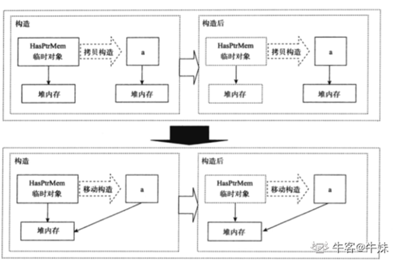

### [完美转发](https://blog.csdn.net/xiangbaohui/article/details/103673177)

std::forward被称为完美转发，它的作用是保持原来的值属性不变。啥意思呢？通俗的讲就是，如果原来的值是左值，经std::forward处理后该值还是左值；如果原来的值是右值，经std::forward处理后它还是右值。

```c++
template <typename T>
T&& forward(typename std::remove_reference<T>::type& param)
{
  return static_cast<T&&>(param);
}

template <typename T>
T&& forward(typename std::remove_reference<T>::type&& param)
{
  return static_cast<T&&>(param);
}
```

### [C++11 Lambda表达式](https://qianxunslimg.github.io/2022/03/16/c-ba-gu/#1-11-C-11-Lambda表达式)

Lambda表达式定义一个`匿名函数`，并且可以捕获一定范围内的变量，其定义如下：

[capture] (params)mutable->return-type{statement}

其中，

- [capture]：捕获列表，捕获上下变量以供lambda使用。编译器根据符号[]判断接下来代码是否是lambda函数。
- (Params)：参数列表，与普通函数的参数列表一致，如果不需要传递参数，则可以连通括号一起省略。
- mutable是修饰符，默认情况下lambda函数总是一个const函数，Mutable可以取消其常量性。在使用该修饰符时，参数列表不可省略。
- ->return-type:返回类型是返回值类型
- {statement}:函数体，内容与普通函数一样，除了可以使用参数之外，还可以使用所捕获的变量。

Lambda表达式与普通函数最大的区别就是其可以通过捕获列表访问一些上下文中的数据。其形式如下:

> -  [var]表示值传递方式捕捉变量var
> -  [=]表示值传递方式捕捉所有父作用域的变量（包括this)
> -  [&var]表示引用传递捕捉变量var
> -  [&]表示引用传递捕捉所有父作用域的变量（包括this）
> -  [this]表示值传递方式捕捉当前的this指针

Lambda的类型被定义为“闭包”的类，其通常用于STL库中，在某些场景下可用于简化仿函数的使用，同时`Lambda作为局部函数，也会提高复杂代码的开发加速，轻松在函数内重用代码，无须费心设计接口`。

## 数组与链表的区别

从逻辑结构上来说，这两种数据结构都属于线性表。所谓线性表，就是所有数据都排列在只有一个维度的“线”上，就像羊肉串一样，把数据串成一串。对其中任意一个节点来说，除了头尾，只有一个前趋，也只有一个后继。

### 从物理上来说，

即在内存中，这两种逻辑结构所对应的物理存储分布上看，`数组占用的是一块连续的内存区`，而`链表在内存中，是分散的`，因为是分散的，就需要一种东西把他们串起来，这样才能形成逻辑上的线性表，不像数组，与生俱来具有“线性”的成分。因为链表比数组多了一个“串起来”的额外操作，这个操作就是加了个指向下个节点的指针，所以对于链表来说，存储一个节点，所要消耗的资源就多了。也正因为这种物理结构上的差异，导致了他们在**访问、增加、删除**节点这三种操作上所带来的时间复杂度不同。

### 对于**访问**，

- 数组在物理内存上是连续存储的，硬件上支持“随机访问”，所谓随机访问，就是你访问一个a[3]的元素与访问一个a[10000]，使用数组下标访问时，这两个元素的时间消耗是一样的。

- 但是对于链表就不是了，链表也没有下标的概念，只能通过头节点指针，从每一个节点，依次往下找，因为下个节点的位置信息只能通过上个节点知晓（这里只考虑单向链表），所以访链表中的List(3)与List(10000)，时间就不一样了，访问List(3)，只要通过前两个节点，但要想访问List(10000)，不得不通过前面的9999个节点；而数组是一下子就跳到了a[10000]，无需逐个访问a[10000]之前的这些个元素。
- 所以**对于访问，数组和链表时间复杂度分别是O(1)与O(n)，方式一种是“随机访问”，一种是“顺序访问”。**

**数组在内存中的样子**


**链表在内存中的样子**


### 对于**增加**，

- 因为数组在内存中是连续存储的，要想在某个节点之前增加，且保持增加后数组的线性与完整性，必须要把此节点往后的元素依次后移。要是插在第一个节点之前，那就GG了，数组中所有元素位置都得往后移一格，最后把这个后来的“活宝元素”，稳稳的放在第一个腾出来的空闲位置上，真是不考虑其他元素的感受，就像我们日常生活排队时，出现的“加塞”现象一样。“加塞”位置前的人没什么意见，因为他们的领先位置没动，还是按原来的顺序先到先得的享受服务，“加塞”位置后的人就有意见了，他们不得不都往后挪一个位置，很有可能面对突然的后挪，踩到后面人的脚，享受服务的顺序也往后挪了一位。对于数组来说，有“加塞”时，一定要先做好数据迁移，不然就会踩到脚，数组元素丢了，而且数组下标也要往后+1，享受服务的顺序往后推了一位。


- 而链表却为其他元素着想多了。由上图可知，链表中只需要改变节点中的“指针”，就可以实现增加。自身在内存中所占据的位置不变，只是这个节点所占据的这块内存中数据（指针）改变了，相对于数组“牵一发而动全身”的大动作，链表则要显示温和的多，局部数据改写就可以了。如下图所示：

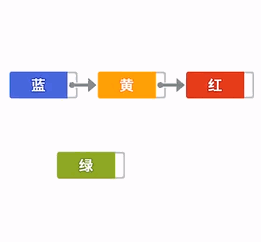


### 删除操作，同理。

### 在操作系统**内存管理**方面也有不同。

正因为数组与链表的物理存储结构不同，<u>在内存预读方面，内存管理会将连续的存储空间提前读入缓存（局部性原理），所以数组往往会被都读入到缓存中，这样`进一步提高了访问的效率`</u>，<u>而链表由于在内存中分布是分散的，往往不会都读入到缓存中，这样本来访问效率就低，这样`效率反而更低`了</u>。在实际应用中，因为`链表带来的动态扩容`的便利性，在做为算法的容器方面，用的更普遍一点。

# 操作系统

## 请你来说一下reactor模型组成

[ 线程模型2：Reactor 模式](https://qianxunslimg.github.io/2022/03/16/cao-zuo-xi-tong-ba-gu/#线程模型2：Reactor-模式)

reactor模型要求`主线程只负责监听`文件描述上`是否有事件发生`，有的话就立即将该事件`通知`工作线程，除此之外，主线程不做任何其他实质性的工作，<u>读写数据、接受新的连接以及处理客户请求均`在工作线程`中完成</u>。


## 请自己设计一下如何采用单线程的方式处理高并发

单线程解决高并发的思路就是`非阻塞IO + 异步编程`。 

- ​    采用`非阻塞`的IO复用方式（`epoll`，poll要强于select），epoll突破了文件描述符上限，底层使用红黑树实现，同时维护了一个ready list，当有活动产生时，会自动触发epoll回调函数通知epoll文件描述符，内核将事件表中就绪的事件添加在ready list里面，使用epoll_wait等待调用，      

  > 注意  select poll epoll都是非阻塞io, 用epoll应该是因为 处理高并发效率高

- ​    事件处理（proactor），当有新请求来到，主线程接受并得到一个socket，然后主线程往epoll事件表中注册socket上的就绪事件，当socket上右数据可读时，epoll_wait通知主线程从socket上循环读取数据，然后把数据封装成一个请求对象插入到请求队列中。

  > reactor从定义上就不符合要求 主线程监听 子线程读写数据，接受新的连接，以及处理客户请求 不是单线程
  >
  > Proactor 模式将所有 `I/O` 操作都交给主线程和内核来处理（进行`读、写`），工作线程仅仅负责业务逻辑。
  >


## 请你说一下`进程与线程`的概念，以及为什么要有进程线程，其中有什么区别，他们各自又是怎么同步的

### 基本概念：

- <u>进程是对`运行时程序`的`封装`，是`系统`进行`资源调度`和`分配`的的基本单位，实现了`操作系统的并发`；</u>

  > 1. 运行时程序的封装
  > 2. 系统 资源调度和分配的 基本单位
  > 3. 操作系统的并发

- 1. 线程是进程的子任务，是==CPU调度和分派的基本单位==，用于保证程序的实时性，实现`进程内部的并发`；
  2. 线程是操作系统可识别的==最小执行和调度单位==。每个线程都独自占用一个虚拟处理器：独自的寄存器组，指令计数器和处理器状态。每个线程完成不同的任务，但是==共享==同一`地址空间`（也就是同样的动态内存，映射文件，目标代码等等），打开的`文件队列`和其他`内核资源`。

  > 1. 是进程的`子任务`，
  > 2. `CPU调度和分配`的基本单位  操作系统可识别的最小执行和调度单位
  > 3. 实现`进程内部的并发`

### 线程产生的原因：

1. 进程可以使多个程序能并发执行，以提高资源的利用率和系统的吞吐量；但是其具有一些缺点：

   - 进程在同一时间只能干一件事（`一次一件事`）；
   - 进程在执行的过程中如果阻塞，整个进程就会挂起，即使进程中有些工作不依赖于等待的资源，仍然不会执行（`阻塞挂起整个`）。

2. （`为了减小并发的时空开销`）因此，操作系统引入了比进程粒度更小的线程，作为并发执行的基本单位，从而减少程序在并发执行时所付出的时空开销，提高并发性。和进程相比，线程的优势如下：

   - （相同的地址空间，所以`节省资源`）从资源上来讲，线程是一种非常"节俭"的多任务操作方式。在linux系统下，启动一个新的进程必须分配给它独立的地址空间，建立众多的数据表来维护它的代码段、堆栈段和数据段，这是一种"昂贵"的多任务工作方式。 

   - （相同的地址空间，所以`切换快`）从切换效率上来讲，运行于一个进程中的多个线程，它们之间使用相同的地址空间，而且线程间彼此切换所需时间也远远小于进程间切换所需要的时间。据统计，一个进程的开销大约是一个线程开销的30倍左右。

   - （相同的地址空间，所以`通信快捷方便`）从通信机制上来讲，线程间方便的通信机制。对不同进程来说，它们具有独立的数据空间，要进行数据的传递只能通过进程间通信的方式进行，这种方式不仅费时，而且很不方便。线程则不然，由于同一进城下的线程之间贡献数据空间，所以一个线程的数据可以直接为其他线程所用，这不仅快捷，而且方便。

   - 除以上优点外，多线程程序作为一种多任务、并发的工作方式，还有如下优点：

     1、使多CPU系统更加有效。操作系统会保证当线程数不大于CPU数目时，<u>不同的线程运行于不同的CPU上</u>。

     2、改善程序结构。一个既长又复杂的进程可以考虑分为多个线程，成为几个独立或半独立的运行部分，这样的程序才会利于理解和修改。


### 区别：

1. （`从属关系`）一个线程只能属于一个进程，而一个进程可以有多个线程，但至少有一个线程。线程`依赖`于进程而存在。

2. （`资源区别`）进程有独立的系统资源，而同一进程内的线程共享进程的大部分系统资源,包括堆、代码段、数据段，每个线程只拥有一些在运行中必不可少的私有属性，比如tcb,线程Id,栈、寄存器。

3. （`单位`）进程是资源分配的最小单位，线程是CPU调度的最小单位；

4. （`系统开销`)： 由于在创建或撤消进程时，系统都要为之分配或回收资源，如内存空间、I／o设备等。因此，操作系统所付出的开销将显著地大于在创建或撤消线程时的开销。

   类似地，在进行进程切换时，涉及到整个当前进程CPU环境的保存以及新被调度运行的进程的CPU环境的设置。而线程切换只须保存和设置少量寄存器的内容，并不涉及存储器管理方面的操作。可见，进程切换的开销也远大于线程切换的开销。

5. （`通信`)：由于同一进程中的多个线程具有相同的地址空间，致使它们之间的同步和通信的实现，也变得比较容易。进程间通信IPC，线程间可以直接读写进程数据段（如全局变量）来进行通信——需要进程同步和互斥手段的辅助，以保证数据的一致性。在有的系统中，线程的切换、同步和通信都无须操作系统内核的干预

6. （`调试难度可靠性`）进程编程调试简单可靠性高，但是创建销毁开销大；线程正相反，开销小，切换速度快，但是编程调试相对复杂。

7. （`相互影响`）进程间不会相互影响 ；线程一个线程挂掉将导致整个进程挂掉


### [进程间通信方式](https://qianxunslimg.github.io/2022/03/16/cao-zuo-xi-tong-ba-gu/#3-进程间通信方式-必考)

进程间通信主要包括`管道`、`内存映射` 系统IPC（包括消息队列、信号量、`信号`、`共享内存`等）、以及套接字socket。


### [线程通信同步方式](https://qianxunslimg.github.io/2022/03/16/cao-zuo-xi-tong-ba-gu/#多线程，线程同步的几种方式)

临界区：通过多线程的串行化来访问公共资源或一段代码，速度快，适合控制数据访问；

线程通信方式：`互斥锁，条件变量，信号量`

## 请你说一说Linux虚拟地址空间

### [Linux虚拟地址空间](https://qianxunslimg.github.io/2022/03/16/cao-zuo-xi-tong-ba-gu/#Linux虚拟地址空间)

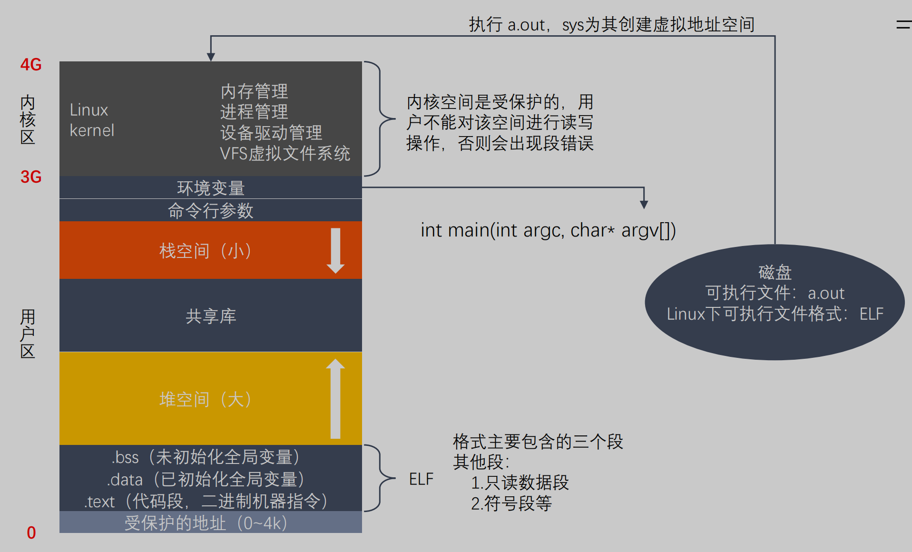

`为了防止不同进程同一时刻在物理内存中运行而对物理内存的争夺和践踏`，<u>采用了虚拟内存</u>。

>直接使用物理内存会产生一些问题
>
>1. 内存空间利用率的问题 （`内存碎片化`）
>2. 读写内存的安全性问题（访问`权限`与`安全`问题）
>3. `进程间的安全`问题
>4. 内存读写的`效率`问题

- 虚拟内存技术使得不同进程在运行过程中，<u>它所看到的是自己`独自占有`了当前系统的4G内存</u>。所有进程共享同一物理内存，每个进程只把自己目前需要的虚拟内存空间`映射并存储`到物理内存上。 

- <u>事实上，在每个进程创建加载时，内核只是为进程“创建”了虚拟内存的布局，具体就是初始化进程控制表中内存相关的链表，实际上并不立即就把虚拟内存对应位置的程序数据和代码（比如.text .data段）拷贝到物理内存中，只是建立好虚拟内存和磁盘文件之间的映射就好（叫做存储器映射）</u>，等到运行到对应的程序时，才会通过缺页异常，来拷贝数据。还有进程运行过程中，`要动态分配内存`，比如malloc时，也`只是分配了虚拟内存`，即为这块虚拟内存对应的页表项做相应设置，`当进程真正访问到此数据时，才引发缺页异常`。

- 请求分页系统、请求分段系统和请求段页式系统都是针对虚拟内存的，通过请求实现内存与外存的信息置换。

  

### **虚拟内存的好处：**

1. `扩大`地址空间；

2. 内存`保护`：每个进程运行在各自的虚拟内存地址空间，互相不能干扰对方。虚存还对特定的内存地址提供写保护，可以防止代码或数据被恶意篡改。  （==<u>互不干扰，防止进程互相恶意篡改</u>==）

3. `公平`内存分配。采用了虚存之后，每个进程都相当于有同样大小的虚存空间。

4. 当进程`通信`时，可采用`虚存共享`的方式实现。   （==<u>实现共享内存</u>==）

5. 当不同的进程使用同样的代码时，比如库文件中的代码，物理内存中可以只存储一份这样的代码，不同的进程只需要把自己的虚拟内存映射过去就可以了，`节省内存`

6. 虚拟内存很适合在多道程序设计系统中使用，许多程序的片段同时保存在内存中。当一个程序等待它的一部分读入内存时，可以把CPU交给另一个进程使用。<u>在内存中可以保留多个进程</u>，系统`并发度提高`

7. 在程序需要分配连续的内存空间的时候，只需要在虚拟内存空间分配连续空间，而不需要实际物理内存的连续空间，可以利用碎片

    

### **虚拟内存的代价：**

1. 虚存的管理需要建立很多数据结构，这些数据结构要占用`额外的内存`

2. 虚拟地址到物理地址的转换，增加了指令的`执行时间`。

3. 页面的换入换出需要`磁盘I/O`，这是很`耗时`的

4. <u>如果一页中只有一部分数据，会浪费内存。</u>

   

## [请你说一说操作系统中的程序的内存结构](https://qianxunslimg.github.io/2022/03/16/cao-zuo-xi-tong-ba-gu/#操作系统中的程序的内存结构)

## [请你说一说操作系统中的缺页中断](https://qianxunslimg.github.io/2022/03/16/cao-zuo-xi-tong-ba-gu/#9-6-操作系统中的缺页中断)

malloc()和mmap()等内存分配函数，<u>在分配时`只是建立了进程虚拟地址空间`</u>，<u>并`没有分配虚拟内存对应的物理内存`</u>。<u>当进程访问这些没有建立映射关系的虚拟内存时，处理器自动触发一个缺页异常</u>。  

> （分配了虚拟的地址空间 但没有分配映射到物理内存，访问时会缺页异常）

**缺页中断：**在请求分页系统中，可以<u>通过查询页表中的`状态位`来确定所要访问的`页面是否存在于内存`中</u>。每当所要访问的页面不在内存时，会产生一次缺页中断，此时操作系统会根据页表中的外存地址在外存中找到所缺的一页，将其调入内存。

缺页本身是一种中断，与一般的中断一样，需要经过4个处理步骤：

> 1、保护CPU现场
>
> 2、分析中断原因
>
> 3、转入缺页中断处理程序进行处理
>
> 4、恢复CPU现场，继续执行

但是缺页中断是由于所要访问的页面不存在于内存时，由硬件所产生的一种特殊的中断，因此，与一般的中断存在区别：

> 1、<u>在指令执行期间产生和处理缺页中断信号</u>
>
> 2、<u>一条指令在执行期间，可能产生多次缺页中断</u>
>
> 3、<u>缺页中断返回是，执行产生中断的一条指令，而一般的中断返回是，执行下一条指令</u>。

## [请你回答一下fork和vfork的区别](https://qianxunslimg.github.io/2022/03/16/cao-zuo-xi-tong-ba-gu/#2-16-fork和vfork的区别)

## 请问如何修改文件最大句柄数？

linux默认最大文件句柄数是1024个，在linux服务器文件并发量比较大的情况下，系统会报"too many open files"的错误。故在linux服务器高并发调优时，往往需要预先调优Linux参数，修改Linux最大文件句柄数。

有两种方法：

\1. ulimit -n <可以同时打开的文件数>，将当前进程的最大句柄数修改为指定的参数（注：该方法只针对当前进程有效，重新打开一个shell或者重新开启一个进程，参数还是之前的值）

首先用ulimit -a查询Linux相关的参数，如下所示：

```
core file size          (blocks, -c) 0
data seg size           (kbytes, -d) unlimited
scheduling priority             (-e) 0
file size               (blocks, -f) unlimited
pending signals                 (-i) 94739
max locked memory       (kbytes, -l) 64
max memory size         (kbytes, -m) unlimited
open files                      (-n) 1024
pipe size            (512 bytes, -p) 8
POSIX message queues     (bytes, -q) 819200
real-time priority              (-r) 0
stack size              (kbytes, -s) 8192
cpu time               (seconds, -t) unlimited
max user processes              (-u) 94739
virtual memory          (kbytes, -v) unlimited
file locks                      (-x) unlimited
```

其中，open files就是最大文件句柄数，默认是1024个。

修改Linux最大文件句柄数：  ulimit -n 2048， 将最大句柄数修改为 2048个。


\2. 对所有进程都有效的方法，修改Linux系统参数

vi /etc/security/limits.conf 添加

*　　soft　　nofile　　65536

*　　hard　　nofile　　65536

将最大句柄数改为65536

修改以后保存，注销当前用户，重新登录，修改后的参数就生效了

## [请你说一说并发(concurrency)和并行(parallelism)](https://qianxunslimg.github.io/2022/03/16/cao-zuo-xi-tong-ba-gu/#7-并行并发)

1. 并发（concurrency）：指宏观上看起来两个程序在同时运行，比如说在单核cpu上的多任务。但是从微观上看两个程序的指令是交织着运行的，你的指令之间穿插着我的指令，我的指令之间穿插着你的，在单个周期内只运行了一个指令。这种并发并不能提高计算机的性能，只能提高效率。
2. 并行（parallelism）：指严格物理意义上的同时运行，比如多核cpu，两个程序分别运行在两个核上，两者之间互不影响，单个周期内每个程序都运行了自己的指令，也就是运行了两条指令。这样说来并行的确提高了计算机的效率。所以现在的cpu都是往多核方面发展。

## 请问MySQL的端口号是多少，如何修改这个端口号

#### 查看端口号：

- 使用命令show global variables like 'port';查看端口号 ，mysql的默认端口是3306。（补充：sqlserver默认端口号为：1433；oracle默认端口号为：1521；DB2默认端口号为：5000；PostgreSQL默认端口号为：5432）

#### 修改端口号：

- 修改端口号：编辑/etc/my.cnf文件，早期版本有可能是my.conf文件名，增加端口参数，并且设定端口，注意该端口未被使用，保存退出。

## 请你说一说操作系统中的页表寻址

页式内存管理，内存分成固定长度的一个个页片。<u>操作系统为每一个进程维护了一个从虚拟地址到物理地址的映射关系的数据结构，叫`页表`，</u>页表的内容就是该进程的虚拟地址到物理地址的一个映射。页表中的每一项都记录了这个页的基地址。通过页表，由逻辑地址的高位部分先找到逻辑地址对应的页基地址，再由页基地址偏移一定长度就得到最后的物理地址，偏移的长度由逻辑地址的低位部分决定。一般情况下，这个过程都可以由硬件完成，所以效率还是比较高的。页式内存管理的优点就是比较灵活，内存管理以较小的页为单位，方便内存换入换出和扩充地址空间。


### Linux最初的两级页表机制：

两级分页机制将32位的虚拟空间分成三段，低十二位表示页内偏移，高20分成两段分别表示两级页表的偏移。

- PGD(Page Global Directory): 最高10位，全局页目录表索引

- PTE(Page Table Entry)：中间10位，页表入口索引

1. 当在进行地址转换时，结合在CR3寄存器中存放的页目录(page directory, PGD)的这一页的物理地址，再加上从虚拟地址中抽出高10位叫做页目录表项(内核也称这为pgd)的部分作为偏移, 即定位到可以描述该地址的pgd；
2. 从该pgd中可以获取可以描述该地址的页表的物理地址，再加上从虚拟地址中抽取中间10位作为偏移, 即定位到可以描述该地址的pte；
3. 在这个pte中即可获取该地址对应的页的物理地址, 加上从虚拟地址中抽取的最后12位，即形成该页的页内偏移, 即可最终完成从虚拟地址到物理地址的转换。

从上述过程中，可以看出，对虚拟地址的分级解析过程，实际上就是<u>不断深入页表层次</u>，<u>逐渐定位到最终地址的过程</u>，所以这一过程被叫做page talbe walk。


### Linux的三级页表机制：

当X86引入物理地址扩展(Pisycal Addrress Extension, PAE)后，可以支持大于4G的物理内存(36位），但虚拟地址依然是32位，原先的页表项不适用，它实际多4 bytes被扩充到8 bytes，这意味着，每一页现在能存放的pte数目从1024变成512了(4k/8)。相应地，页表层级发生了变化，Linus新增加了一个层级，叫做页中间目录(page middle directory, PMD), 变成：

字段      描述            位数

cr3      指向一个PDPT      crs寄存器存储

PGD    指向PDPT中4个项中的一个  位31~30

PMD    指向页目录中512项中的一个  位29~21

PTE      指向页表中512项中的一个  位20~12

page offset  4KB页中的偏移      位11~0


现在就同时存在2级页表和3级页表，在代码管理上肯定不方便。巧妙的是，Linux采取了一种抽象方法：所有架构全部使用3级页表: 即PGD -> PMD -> PTE。那只使用2级页表(如非PAE的X86)怎么办？

办法是针对使用2级页表的架构，把PMD抽象掉，即虚设一个PMD表项。这样在page table walk过程中，PGD本直接指向PTE的，现在不了，指向一个虚拟的PMD，然后再由PMD指向PTE。这种抽象保持了代码结构的统一。


### Linux的四级页表机制：

硬件在发展，3级页表很快又捉襟见肘了，原因是64位CPU出现了, 比如X86_64， 它的硬件是实实在在支持4级页表的。它支持48位的虚拟地址空间1。如下：

字段      描述            位数

PML4    指向一个PDPT      位47~39

PGD    指向PDPT中4个项中的一个  位38~30

PMD    指向页目录中512项中的一个  位29~21

PTE      指向页表中512项中的一个  位20~12

page offset  4KB页中的偏移      位11~0


Linux内核针为使用原来的3级列表(PGD->PMD->PTE)，做了折衷。即采用一个唯一的，共享的顶级层次，叫PML4。这个PML4没有编码在地址中，这样就能套用原来的3级列表方案了。不过代价就是，由于只有唯一的PML4, 寻址空间被局限在(239=)512G, 而本来PML4段有9位, 可以支持512个PML4表项的。现在为了使用3级列表方案，只能限制使用一个， 512G的空间很快就又不够用了，解决方案呼之欲出。

在2004年10月，当时的X86_64架构代码的维护者Andi Kleen提交了一个叫做4level page tables for Linux的PATCH系列，为Linux内核带来了4级页表的支持。在他的解决方案中，不出意料地，按照X86_64规范，新增了一个PML4的层级, 在这种解决方案中，X86_64拥一个有512条目的PML4, 512条目的PGD, 512条目的PMD, 512条目的PTE。对于仍使用3级目录的架构来说，它们依然拥有一个虚拟的PML4,相关的代码会在编译时被优化掉。 这样，就把Linux内核的3级列表扩充为4级列表。这系列PATCH工作得不错，不久被纳入Andrew Morton的-mm树接受测试。不出意外的话，它将在v2.6.11版本中释出。但是，另一个知名开发者Nick Piggin提出了一些看法，他认为Andi的Patch很不错，不过他认为最好还是把PGD作为第一级目录，把新增加的层次放在中间，并给出了他自己的Patch:alternate 4-level page tables patches。Andi更想保持自己的PATCH, 他认为Nick不过是玩了改名的游戏，而且他的PATCH经过测试很稳定，快被合并到主线了，不宜再折腾。不过Linus却表达了对Nick Piggin的支持，理由是Nick的做法conceptually least intrusive。毕竟作为Linux的扛把子，稳定对于Linus来说意义重大。最终，不意外地，最后Nick Piggin的PATCH在v2.6.11版本中被合并入主线。在这种方案中，4级页表分别是：PGD -> PUD -> PMD -> PTE。

## 请你说一说有了进程，为什么还要有线程？

1. 进程可以使多个程序能并发执行，以提高资源的利用率和系统的吞吐量；但是其具有一些缺点：

   - 进程在同一时间只能干一件事（`一次一件事`）；
   - 进程在执行的过程中如果阻塞，整个进程就会挂起，即使进程中有些工作不依赖于等待的资源，仍然不会执行（`阻塞挂起整个`）。

2. （`为了减小并发的时空开销`）因此，操作系统引入了比进程粒度更小的线程，作为并发执行的基本单位，从而减少程序在并发执行时所付出的时空开销，提高并发性。和进程相比，线程的优势如下：

   - （相同的地址空间，所以`节省资源`）从资源上来讲，线程是一种非常"节俭"的多任务操作方式。在linux系统下，启动一个新的进程必须分配给它独立的地址空间，建立众多的数据表来维护它的代码段、堆栈段和数据段，这是一种"昂贵"的多任务工作方式。 

   - （相同的地址空间，所以`切换快`）从切换效率上来讲，运行于一个进程中的多个线程，它们之间使用相同的地址空间，而且线程间彼此切换所需时间也远远小于进程间切换所需要的时间。据统计，一个进程的开销大约是一个线程开销的30倍左右。

   - （相同的地址空间，所以`通信快捷方便`）从通信机制上来讲，线程间方便的通信机制。对不同进程来说，它们具有独立的数据空间，要进行数据的传递只能通过进程间通信的方式进行，这种方式不仅费时，而且很不方便。线程则不然，由于同一进城下的线程之间贡献数据空间，所以一个线程的数据可以直接为其他线程所用，这不仅快捷，而且方便。

   - 除以上优点外，多线程程序作为一种多任务、并发的工作方式，还有如下优点：

     1、使多CPU系统更加有效。操作系统会保证当线程数不大于CPU数目时，<u>不同的线程运行于不同的CPU上</u>。

     2、改善程序结构。一个既长又复杂的进程可以考虑分为多个线程，成为几个独立或半独立的运行部分，这样的程序才会利于理解和修改。

## 请问单核机器上写多线程程序，是否需要考虑加锁，为什么？

在单核机器上写多线程程序，`仍然需要`线程锁。因为线程锁`通常用来实现线程的同步和通信`。在单核机器上的多线程程序，`仍然存在线程同步的问题`。因为在抢占式操作系统中，通常为每个线程分配一个时间片，当某个线程时间片耗尽时，操作系统会将其挂起，然后运行另一个线程。<u>如果这两个线程共享某些数据，不使用线程锁的前提下，可能会导致共享数据修改引起冲突</u>。

## 请问线程需要保存哪些上下文，SP、PC、EAX这些寄存器是干嘛用的

线程在切换的过程中需要保存`当前线程Id`、`线程状态`、`堆栈`、`寄存器状态`等信息。其中寄存器主要包括SP PC EAX等寄存器，其主要功能如下：

- `SP:堆栈指针`，指向当前栈的栈顶地址 （`存地址`）

- `PC:程序计数器`，存储下一条将要执行的指令（`存下一条指令`）

- `EAX:累加寄存器`，用于加法乘法的缺省寄存器 ？

  > 在[中央处理器](https://zh.wikipedia.org/wiki/中央處理器)中，**累加器** (accumulator) 是一种寄存器，用来储存计算产生的中间结果。如果没有像累加器这样的寄存器，那么在每次计算 (加法，乘法，移位等等) 后就必须要把结果写回到 [内存](https://zh.wikipedia.org/wiki/記憶體)，也许马上就得读回来。然而存取主存的速度是比从[算术逻辑单元](https://zh.wikipedia.org/wiki/算术逻辑单元)到有直接路径的累加器存取更慢。

## [请你说一说线程间的同步方式，最好说出具体的系统调用]([操作系统面试 | qianxunslimgのblog](https://qianxunslimg.github.io/2022/03/16/cao-zuo-xi-tong-ba-gu/#线程间的同步方式，最好说出具体的系统调用))

==信号量==

信号量是一种特殊的变量，可用于线程同步。它只取自然数值，并且只支持两种操作：

P(SV):如果信号量SV大于0，将它减一；如果SV值为0，则挂起该线程。 ==消费==线程 

> 假设sv = 1, sv大于0表示有苹果 可以吃  --， 然后sv = 0还想吃 则挂起

V(SV)：如果有其他进程因为等待SV而挂起，则唤醒，然后将SV+1；否则直接将SV+1。 ==生产==线程

其系统调用为：

sem_wait（sem_t *sem）：以原子操作的方式将信号量减1，如果信号量值为0，则sem_wait将被阻塞，直到这个信号量具有非0值。

sem_post（sem_t *sem)：以原子操作将信号量值+1。当信号量大于0时，其他正在调用sem_wait等待信号量的线程将被唤醒。

 

==互斥量==

互斥量又称互斥锁，主要用于线程互斥，不能保证按序访问，可以和条件锁一起实现同步。当进入临界区时，需要获得互斥锁并且加锁；当离开临界区时，需要对互斥锁解锁，以唤醒其他等待该互斥锁的线程。其主要的系统调用如下：

pthread_mutex_init:初始化互斥锁

pthread_mutex_destroy：销毁互斥锁

pthread_mutex_lock：以原子操作的方式给一个互斥锁加锁，如果目标互斥锁已经被上锁，pthread_mutex_lock调用将阻塞，直到该互斥锁的占有者将其解锁。

pthread_mutex_unlock:以一个原子操作的方式给一个互斥锁解锁。

 

==条件变量==

条件变量，又称条件锁，用于在线程之间同步共享数据的值。条件变量提供一种线程间通信机制：当某个共享数据达到某个值时，唤醒等待这个共享数据的一个/多个线程。即，当某个共享变量等于某个值时，调用 signal/broadcast。此时操作共享变量时需要加锁。其主要的系统调用如下：

pthread_cond_init:初始化条件变量

pthread_cond_destroy：销毁条件变量

pthread_cond_signal：唤醒一个等待目标条件变量的线程。哪个线程被唤醒取决于调度策略和优先级。

pthread_cond_wait：等待目标条件变量。需要一个加锁的互斥锁确保操作的原子性。该函数中在进入wait状态前首先进行解锁，然后接收到信号后会再加锁，保证该线程对共享资源正确访问。

## 游戏服务器应该为每个用户开辟一个线程还是一个进程，为什么？

游戏服务器应该为每个用户开辟一个==<u>进程</u>==。

因为同一进程间的线程会`相互影响`，一个线程死掉会影响其他线程，从而`导致进程崩溃`。因此<u>为了保证不同用户之间不会相互影响，应该为每个用户开辟一个进程</u>

## [请你说一说OS缺页置换算法](https://qianxunslimg.github.io/2022/03/16/cao-zuo-xi-tong-ba-gu/#8-11-OS缺页置换算法)

当访问一个内存中不存在的页，并且==<u>内存已满</u>==，则需要从内存中调出一个页或将数据送至磁盘对换区，替换一个页，这种现象叫做缺页置换。当前操作系统最常采用的缺页置换算法如下：

1. `先进先出(FIFO)算法`：置换最先调入内存的页面，即置换在内存中驻留时间最久的页面。按照进入内存的先后次序排列成队列，从队尾进入，从队首删除。  ==（那最早调入的替换掉）==

2. `最近最少使用（LRU）算法`: 置换最近一段时间以来最长时间未访问过的页面。根据程序局部性原理，刚被访问的页面，可能马上又要被访问；而较长时间内没有被访问的页面，可能最近不会被访问。  ==（替换最长时间没有使用的页面）==
3. `最佳置换算法（OPT）算法`：最佳置换算法是由 **Belady** 于1966年提出的一种理论上的算法。`每次选择以后永不使用的`， 或许是在最长(未来)时间内不再被访问的页面的页面被淘汰。显然OPT算法是`最优`的，但是在实际操作往往无法预知未来，所以OPT只存在理论而`不能真的实现`，通常用于衡量其他置换算法的优劣。
4. `时钟置换（Clock/NRU）算法`：也称为NRU算法（最近未使用算法）是LRU和FIFO的折中算法。

当前最常采用的就是LRU算法。

## 请你说一下多进程和多线程的使用场景

多进程模型的优势是`CPU`，适用于`CPU密集型`。同时，多进程模型也适用于`多机分布式场景`中，易于多机扩展。

多线程模型主要优势为`线程间切换代价较小`，因此适用于`I/O密集型`的工作场景，因此I/O密集型的工作场景经常会由于I/O阻塞导致频繁的切换线程。同时，多线程模型也适用于`单机多核分布式场景`。

## 请你说一说死锁发生的条件以及如何解决死锁

**死锁是指两个或两个以上进程在执行过程中，因争夺资源而造成的下相互等待的现象。死锁发生的四个必要条件如下：**

- 互斥条件：进程对所分配到的资源不允许其他进程访问，若其他进程访问该资源，只能等待，直至占有该资源的进程使用完成后释放该资源；  （`互斥指的是资源的互斥 只能一个进程访问`）
- 请求和保持条件：进程获得一定的资源后，又对其他资源发出请求，但是该资源可能被其他进程占有，此时请求阻塞，但该进程不会释放自己已经占有的资源  （`我阻塞 但我不放手自己的资源`）
- 不可剥夺条件：进程已获得的资源，在未完成使用之前，不可被剥夺，只能在使用后自己释放  （`资源只能我自己释放`）
- 环路等待条件：进程发生死锁后，必然存在一个进程-资源之间的环形链  （`我需要你的 你需要他 他需要我...`）

**解决死锁的方法即破坏上述四个条件之一，主要方法如下：**

- 资源`一次性分配`，从而剥夺请求和保持条件
- `可剥夺`资源：即当进程新的资源未得到满足时，释放已占有的资源，从而破坏不可剥夺的条件
- 资源`有序分配`法：系统给每类资源赋予一个序号，每个进程按编号递增的请求资源，释放则相反，从而破坏环路等待的条件

## 请问虚拟内存和物理内存怎么对应

### 概念：

#### 物理地址(physical address)

- <u>用于内存芯片级的单元寻址</u>，与`处理器`和`CPU连接的地址总线`相对应。

- 虽然可以直接把物理地址理解成插在机器上那根内存本身，把内存看成一个从0字节一直到最大空量逐字节的编号的大数组，然后把这个数组叫做物理地址，但是事实上，这只是一个硬件提供给软件的抽像，内存的寻址方式并不是这样。所以，说它是“与地址总线相对应”，是更贴切一些，不过抛开对物理内存寻址方式的考虑，直接把物理地址与物理的内存一一对应，也是可以接受的。也许错误的理解更利于形而上的抽像。

#### 虚拟地址(virtual memory)

- 这是对整个内存（不要与机器上插那条对上号）的抽像描述。它是相对于物理内存来讲的，可以直接理解成“不直实的”，“假的”内存，例如，一个0x08000000内存地址，它并不对就物理地址上那个大数组中0x08000000 - 1那个地址元素；

- 之所以是这样，是因为现代操作系统都提供了一种内存管理的抽像，即虚拟内存（virtual memory）。进程使用虚拟内存中的地址，由操作系统协助相关硬件，把它“转换”成真正的物理地址。这个“转换”，是所有问题讨论的关键。

- 有了这样的抽像，一个程序，就可以使用比`真实物理地址大得多的地址空间`。<u>甚至多个进程可以使用相同的地址。不奇怪，因为</u>`转换后的物理地址并非相同的`。

- ——可以把连接后的程序反编译看一下，发现连接器已经为程序分配了一个地址，例如，要调用某个函数A，代码不是call A，而是call 0x0811111111 ，也就是说，函数A的地址已经被定下来了。没有这样的“转换”，没有虚拟地址的概念，这样做是根本行不通的。

### 地址转换

第一步：CPU段式管理中——`逻辑地址转线性地址`

CPU要利用其段式内存管理单元，先将为个逻辑地址转换成一个线程地址。

一个逻辑地址由两部份组成，【段标识符：段内偏移量】。

段标识符是由一个16位长的字段组成，称为段选择符。其中前13位是一个索引号。后面3位包含一些硬件细节，如图：


通过段标识符中的索引号从GDT或者LDT找到该段的段描述符，段描述符中的base字段是段的起始地址

段描述符：Base字段，它描述了一个段的开始位置的线性地址。

一些全局的段描述符，就放在“`全局段描述符表(GDT)`”中，一些局部的，例如每个进程自己的，就放在所谓的“`局部段描述符表(LDT)`”中。

GDT在内存中的地址和大小存放在CPU的gdtr控制寄存器中，而LDT则在ldtr寄存器中。

段起始地址+ 段内偏移量 = 线性地址

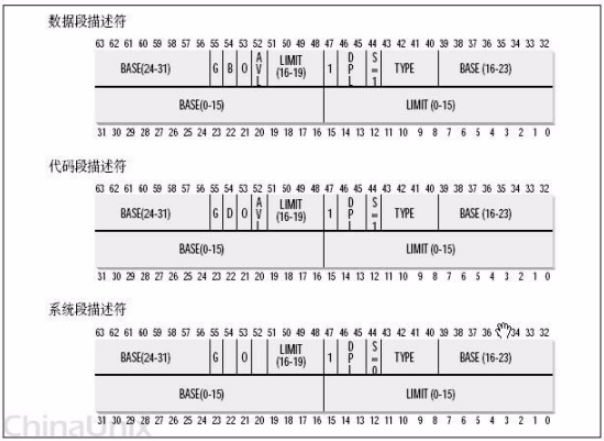

首先，给定一个完整的逻辑地址[段选择符：段内偏移地址]，

1. 看段选择符的T1=0还是1，知道当前要转换是GDT中的段，还是LDT中的段，再根据相应寄存器，得到其地址和大小。我们就有了一个数组了。
2. 拿出段选择符中前13位，可以在这个数组中，查找到对应的段描述符，这样，它了Base，即基地址就知道了。
3. 把Base + offset，就是要转换的线性地址了。

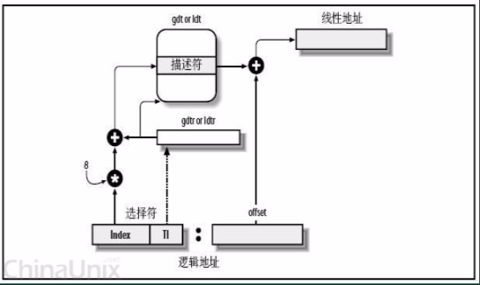

第一步：页式管理——线性地址转物理地址


再利用其页式内存管理单元，转换为最终物理地址。


linux假的段式管理


Intel要求两次转换，这样虽说是兼容了，但是却是很冗余，但是这是intel硬件的要求。


其它某些硬件平台，没有二次转换的概念，Linux也需要提供一个高层抽像，来提供一个统一的界面。


所以，Linux的段式管理，事实上只是“哄骗”了一下硬件而已。


按照Intel的本意，全局的用GDT，每个进程自己的用LDT——不过Linux则对所有的进程都使用了相同的段来对指令和数据寻址。即用户数据段，用户代码段，对应的，内核中的是内核数据段和内核代码段。


在Linux下，逻辑地址与线性地址总是一致的，即逻辑地址的偏移量字段的值与线性地址的值总是相同的。


linux页式管理


CPU的页式内存管理单元，负责把一个线性地址，最终翻译为一个物理地址。


线性地址被分为以固定长度为单位的组，称为页(page)，例如一个32位的机器，线性地址最大可为4G，可以用4KB为一个页来划分，这页，整个线性地址就被划分为一个tatol_page[2^20]的大数组，共有2的20个次方个页。


另一类“页”，我们称之为物理页，或者是页框、页桢的。是分页单元把所有的物理内存也划分为固定长度的管理单位，它的长度一般与内存页是一一对应的。

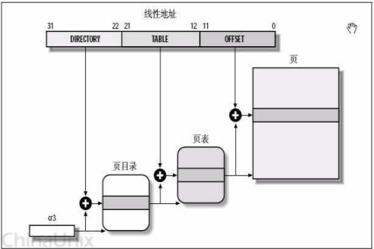

每个进程都有自己的页目录，当进程处于运行态的时候，其页目录地址存放在cr3寄存器中。


每一个32位的线性地址被划分为三部份，【页目录索引(10位)：页表索引(10位)：页内偏移(12位)】


依据以下步骤进行转换：

从cr3中取出进程的页目录地址（操作系统负责在调度进程的时候，把这个地址装入对应寄存器）；


根据线性地址前十位，在数组中，找到对应的索引项，因为引入了二级管理模式，页目录中的项，不再是页的地址，而是一个页表的地址。（又引入了一个数组），页的地址被放到页表中去了。


根据线性地址的中间十位，在页表（也是数组）中找到页的起始地址；


将页的起始地址与线性地址中最后12位相加。


### 目的：

内存节约：如果一级页表中的一个页表条目为空，那么那所指的二级页表就根本不会存在。这表现出一种巨大的潜在节约，因为对于一个典型的程序，4GB虚拟地址空间的大部份都会是未分配的；

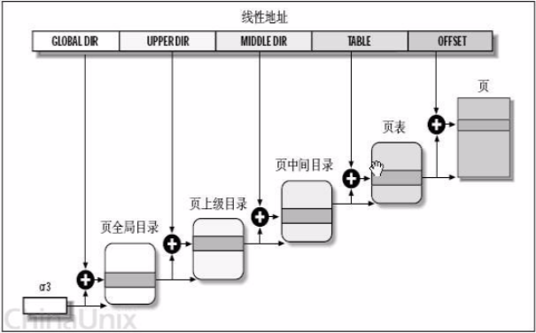

32位，PGD = 10bit，PUD = PMD = 0，table = 10bit，offset = 12bit

64位，PUD和PMD ≠ 0

## [请你说一说操作系统中的结构体对齐，字节对齐](https://qianxunslimg.github.io/2022/03/16/cao-zuo-xi-tong-ba-gu/#10-4-说操作系统中的结构体对齐，字节对齐)
