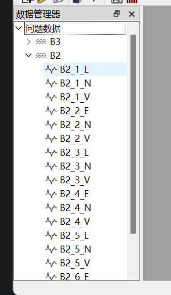
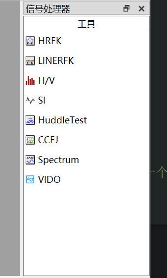
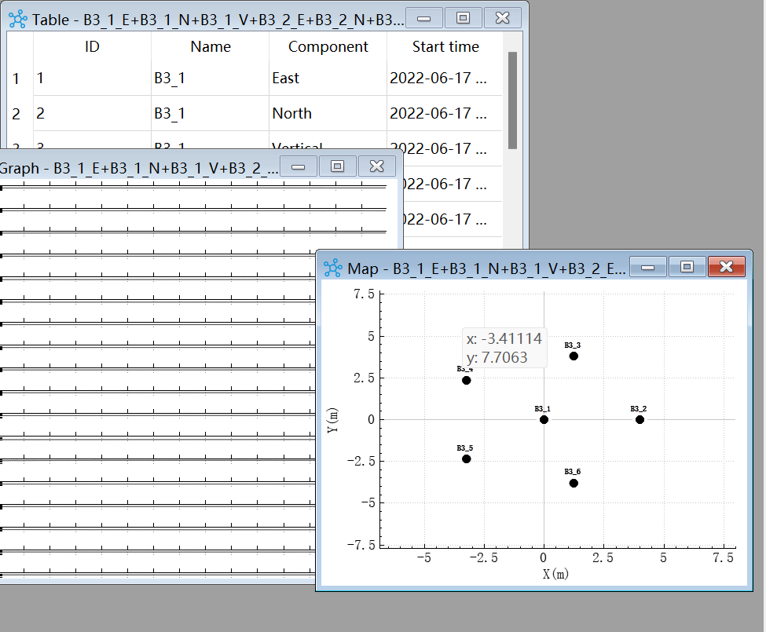
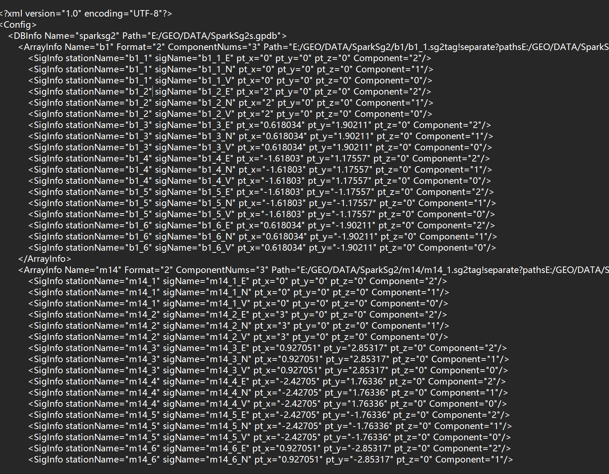

## ==QT/MFC框架相关问题==

### QT的`跨平台`是如何实现的

- 就像标准C库函数一样，`QT框架的函数在不同的平台调用该不同系统的api从而实现跨平台`

- 针对每一种OS平台，QT都有一套对应的**底层类库**，而接口是完全一致的。因此只要是在QT库上开发的程序，放在任何一种平台下都可以编译运行（前提条件是：程序中没有使用某**OS**特有的机能，需要先在平台上安装qt）。也就是说在`OS和应用层之间，增加了一个平台层来保证可移植性。`

- Qt跨平台是指 代码跨平台而不是编译出来的文件跨平台，`同一份代码需要放到另一个平台上时，需要重新编译`。

  

### [QT的信号槽是如何实现的](https://zhuanlan.zhihu.com/p/80539605)

#### 使用

1. 要使用信号-槽功能，先决条件是继承`QObject`类，并在类声明中增加`Q_OBJECT宏`。

2. 之后在”signals:” 字段之后声明一些函数，这些函数就是信号。

3. 在”public slots:” 之后声明的函数，就是槽函数。
4. 信号-槽都准备好了，接下来创建两个对象实例，并使用QObject::connect将信号和槽连接起来。
5. 最后使用emit发送信号，就会自动触发槽函数了。

#### 实现

<u>以Tom类 miao信号 jerry connect 为例</u>

信号和槽的`本质都是函数`。

C++中的函数要有声明(declare)，也要有实现(implement), 而`信号只要声明，不需要写实现。这是因为moc会为我们自动生成`。

另外触发信号时，不写emit关键字，直接调用信号函数，也是没有问题的。这是因为`emit是一个空的宏`

#####  **Q_OBJECT宏** 

在moc生成的cpp文件中 声明了一个只读的静态成员变量`staticMetaObject`，以及3个public的成员函数

```cpp
static const QMetaObject staticMetaObject; 
virtual const QMetaObject *metaObject() const; 
virtual void *qt_metacast(const char *); 
virtual int qt_metacall(QMetaObject::Call, int, void **);
```

还有一个private的静态成员函数`qt_static_metacall`

```cpp
static void qt_static_metacall(QObject *, QMetaObject::Call, int, void **)
```

生成的cpp文件中，就是变量staticMetaObject以及 那几个函数的实现。

- staticMetaObject是一个结构体，用来存储Tom这个类的信号、槽等元信息，并把

- qt_static_metacall静态函数作为函数指针存储起来。

- 因为是`静态成员` （指`staticMetaObject`），所以实例化多少个Tom对象，它们的元信息都是一样的。

- qt_static_metacall函数提供了两种“元调用的实现”：

  > 如果是InvokeMetaMethod类型的调用，则直接 把参数中的QObject对象，
  >
  > 转换成Tom类然后调用其miao函数
  >
  > 如果是IndexOfMethod类型的调用，即获取元函数的索引号，则计算miao函数的偏移并返回。

而moc_Tom.cpp末尾的  miao  就是信号函数的实现。

```cpp
// SIGNAL 0
void Tom::miao(){
  QMetaObject::activate(this, &staticMetaObject, 0, nullptr);
}
```

##### **信号的触发**

miao信号的实现，直接调用了QMetaObject::activate函数。其中0代表miao这个函数的索引号。

QMetaObject::activate函数的实现，在Qt源码的QObject.cpp文件中，略微复杂一些，且不同版本的Qt，实现差异都比较大，

这里总结一下大致的实现：

`先找出与当前信号连接的所有对象-槽函数，再逐个处理`。

这里处理的方式，分为三种：

```cpp
if((c->connectionType == Qt::AutoConnection && !receiverInSameThread)
                || (c->connectionType == Qt::QueuedConnection)) {
    // 队列处理
} else if (c->connectionType == Qt::BlockingQueuedConnection) {
    // 阻塞处理
    // 如果同线程，打印潜在死锁。
} else {
    //直接调用槽函数或回调函数
}
```

receiverInSameThread表示当前线程id和接收信号的对象的所在线程id是否相等。

> 如果信号-槽连接方式为QueuedConnection，不论是否在同一个线程，按队列处理。
>
> 如果信号-槽连接方式为Auto，且不在同一个线程，也按队列处理。
>
> 如果信号-槽连接方式为阻塞队列BlockingQueuedConnection，按阻塞处理。
>
> (注意同一个线程就不要按阻塞队列调用了。因为同一个线程，同时只能做一件事，本身就是阻塞的，直接调用就好了，
>
> 如果走阻塞队列，则多了加锁的过程。如果槽中又发了同样的信号，就会出现死锁：加锁之后还未解锁，又来申请加锁。)
>
> 队列处理，就是把槽函数的调用，转化成了QMetaCallEvent事件，通过QCoreApplication::postEvent放进了事件循环。
>
> 等到下一次事件分发，相应的线程才会去调用槽函数。


### [Qt信号槽连接方式](https://blog.csdn.net/qq_33266987/article/details/79527495)

##### signal/slot在底层会使用三种方式传递消息。参见QObject::connect()方法：

bool QObject::connect ( const QObject * sender, const char * signal, const QObject * receiver, const char * method, Qt::ConnectionType type = Qt::AutoCompatConnection )
最后一个参数是就是传递消息的方式了，有四个取值：

**Qt::DirectConnection**
When emitted, the signal is immediately delivered to the slot.
假设当前有4个slot连接到QPushButton::clicked(bool)，当按钮被按下时，QT就把这4个slot按连接的时间顺序调用一遍。显然这种方式不能跨线程（传递消息）。

**Qt::QueuedConnection**
When emitted, the signal is queued until the event loop is able to deliver it to the slot.
假设当前有4个slot连接到QPushButton::clicked(bool)，当按钮被按下时，QT就把这个signal包装成一个 QEvent，放到消息队列里。QApplication::exec()或者线程的QThread::exec()会从消息队列里取消息，然后调用 signal关联的几个slot。这种方式既可以在线程内传递消息，也可以跨线程传递消息。

**Qt::BlockingQueuedConnection**
Same as QueuedConnection, except that the current thread blocks until the slot has been delivered. This connection type should only be used for receivers in a different thread. Note that misuse of this type can lead to dead locks in your application.
与Qt::QueuedConnection类似，但是会阻塞等到关联的slot都被执行。这里出现了阻塞这个词，说明它是专门用来多线程间传递消息的。

**Qt::AutoConnection**
If the signal is emitted from the thread in which the receiving object lives, the slot is invoked directly, as with Qt::DirectConnection; otherwise the signal is queued, as with Qt::QueuedConnection.
这种连接类型根据signal和slot是否在同一个线程里自动选择Qt::DirectConnection或Qt::QueuedConnection

这样看来，第一种类型的效率肯定比第二种高，毕竟第二种方式需要将消息存储到队列，而且可能会涉及到大对象的复制（考虑sig_produced(BigObject bo)，bo需要复制到队列里）。


### 讲述Qt信号槽机制与优势与不足

优点：

1. `类型安全`。需要关联的信号槽的签名必须是等同的。即信号的参数类型和参数个数同接受该信号的槽的参数类型和参数个数相同。若信号和槽签名不一致，编译器会报错。  （`参数检查`）
2. `松散耦合`。信号和槽机制减弱了Qt对象的耦合度。激发信号的Qt对象无需知道是那个对象的那个信号槽接收它发出的信号，它只需在适当的时间发送适当的信号即可，而不需要关心是否被接受和那个对象接受了。Qt就保证了适当的槽得到了调用，即使关联的对象在运行时被删除。程序也不会奔溃。  （`只管发送 不管谁接受了`）
3. `灵活性`。一个信号可以关联多个槽，或多个信号关联同一个槽。

不足：

- `速度较慢`。与回调函数相比，信号和槽机制运行速度比直接调用非虚函数`慢10倍`。
- 原因：
  1. 需要定位接收信号的对象。  (`定位对象`)
  2. 安全地遍历所有关联槽。 （`遍历槽`）
  3. 编组、解组传递参数。     （`传参`）
  4. 多线程的时候，信号需要排队等待。（然而，与创建对象的new操作及删除对象的delete操作相比，信号和槽的运行代价只是他们很少的一部分。信号和槽机制导致的这点性能损耗，对实时应用程序是可以忽略的。）   （`多线程需要排队`）


### Qt信号和槽的本质是什么 

- **回调函数。**
  1. 信号是传递值，或是传递动作变化；
  2. 槽函数响应信号或是接收值，或者根据动作变化来做出对应操作。


### 描述QT中的文件流(QTextStream)和数据流(QDataStream)的区别

1. 文件流(QTextStream)。操作`轻量级数据`（int,double,QString）数据写入文本件中以后以文本的方式呈现。
2. 数据流(QDataStream)。通过数据流可以操作`各种数据类型`，`包括对象`，存储到文件中数据为二进制。

文件流，数据流都可以操作磁盘文件，也可以操作内存数据。通过流对象可以将对象打包到内存，进行数据的传输。、

> 数据流更加强大

### 描述QT的TCP通讯流程

#### 服务端：（QTcpServer）

1. 创建QTcpServer对象
2. 监听list需要的参数是地址和端口号
3. 当有新的客户端连接成功回发送newConnect信号
4. 在newConnection信号槽函数中，调用nextPendingConnection函数获取新连接QTcpSocket对象
5. 连接QTcpSocket对象的readRead信号
6. 在readRead信号的槽函数使用read接收数据
7. 调用write成员函数发送数据

```c++
Widget::Widget(QWidget *parent) :
    QWidget(parent),
    ui(new Ui::Widget){
    ui->setupUi(this);
    tcpServer = new QTcpServer;
    tcpServer->listen(QHostAddress("192.168.0.111"),1234);
    connect(tcpServer,SIGNAL(newConnection()),this,SLOT(new_connect()));
}
 
Widget::~Widget(){
    delete ui;
}
 
void Widget::new_connect(){
    qDebug("--new connect--");
    QTcpSocket* tcpSocket = tcpServer->nextPendingConnection();
    connect(tcpSocket,SIGNAL(readyRead()),this,SLOT(read_data()));
    socketArr.push_back(tcpSocket);
}
 
void Widget::read_data(){
    for(int i=0; i<socketArr.size(); i++){
        if(socketArr[i]->bytesAvailable()){
            char buf[256] = {};
            socketArr[i]->read(buf,sizeof(buf));
            qDebug("---read:%s---",buf);
        }
    }
}
```

#### 客户端：（QTcpSocket）

1. 创建QTcpSocket对象
2. 当对象与Server连接成功时会发送connected 信号
3. 调用成员函数`connectToHost`连接服务器，需要的参数是地址和端口号
4. connected信号的槽函数开启发送数据
5. 使用write发送数据，read接收数据

```c++
Widget::Widget(QWidget *parent) : QWidget(parent), ui(new Ui::Widget){
    ui->setupUi(this);
    tcpSocket = new QTcpSocket;
    connect(tcpSocket,SIGNAL(connected()),this,SLOT(connect_success()));
    tcpSocket->connectToHost("172.20.10.3",1234);
}
 
Widget::~Widget(){
    delete ui;
}
 
void Widget::on_send_clicked(){
    std::string msg = ui->msg->text().toStdString();
    int ret = tcpSocket->write(msg.c_str(),msg.size()+1);
    qDebug("--send:%d--",ret);
}
 
void Widget::connect_success(){
    ui->send->setEnabled(true);
}
```

### 描述UDP 之 UdpSocket通讯

> UDP（User Datagram Protocol即用户数据报协议）是一个轻量级的，不可靠的，面向数据报的无连接协议。在网络质量令人十分不满意的环境下，UDP协议数据包丢失严重。由于UDP的特性：它不属于连接型协议，因而具有资源消耗小，处理速度快的优点，所以通常音频、视频和普通数据在传送时使用UDP较多，因为它们即使偶尔丢失一两个数据包，也不会对接收结果产生太大影响。所以QQ这种对保密要求并不太高的聊天程序就是使用的UDP协议。

在Qt中提供了QUdpSocket 类来进行UDP数据报（datagrams）的发送和接收。Socket简单地说，就是一个IP地址加一个port端口  。

流程：

1. 创建QUdpSocket套接字对象 
2. 如果需要接收数据，必须绑定端口 
3. 发送数据用writeDatagram，接收数据用 readDatagram 。

### 多线程使用使用方法

方法一：

1. 创建一个类从QThread类派生
2. 在子线程类中重写 run 函数, 将处理操作写入该函数中 
3. 在主线程中创建子线程对象, 启动子线程, 调用start()函数

方法二：

1. 将业务处理抽象成一个业务类, 在该类中创建一个业务处理函数
2. 在主线程中创建一QThread类对象 
3. 在主线程中创建一个业务类对象 
4. 将业务类对象移动到子线程中 
5. 在主线程中启动子线程 
6. 通过信号槽的方式, 执行业务类中的业务处理函数

多线程使用注意事项: 
* 业务对象, 构造的时候不能指定父对象 
* 子线程中不能处理ui窗口(ui相关的类) 
* 子线程中只能处理一些数据相关的操作, 不能涉及窗口

### 多线程下，信号槽分别在什么线程中执行，如何控制

可以通过`connect的第五个参数`进行控制信号槽执行时所在的线程

connect有几种连接方式，直接连接和队列连接、自动连接

1. 直接连接（Qt::DirectConnection）：信号槽在信号发出者所在的线程中执行
2. 队列连接 (Qt::QueuedConnection)：信号在信号发出者所在的线程中执行，槽函数在信号接收者所在的线程中执行
3. 自动连接  (Qt::AutoConnection)：多线程时为队列连接函数，单线程时为直接连接函数。

### 事件机制：QT程序是事件驱动的，事件到处都可以遇到。能说说平时经常使用到哪些事件吗？

常见的QT事件类型如下:

1. 键盘事件: 按键按下和松开    
2. 鼠标事件: 鼠标移动,鼠标按键的按下和松开
3. 拖放事件: 用鼠标进行拖放    滚轮事件: 鼠标滚轮滚动
4. 绘屏事件: 重绘屏幕的某些部分    定时事件: 定时器到时
5. 焦点事件: 键盘焦点移动   进入和离开事件: 鼠标移入widget之内,或是移出
6. 移动事件: widget的位置改变    大小改变事件: widget的大小改变
7. 显示和隐藏事件: widget显示和隐藏    窗口事件: 窗口是否为当前窗口

### **信号槽机制**：

能说下你的理解吗？

能用什么方法替代？槽函数可以是虚函数吗？

答：回调函数。可以。

### **信号槽同步与异步**：

#### 信号槽是同步的还是异步的？分别如何实现？

答：通常使用的connect，实际上最后一个参数使用的是Qt::AutoConnection类型：Qt支持6种连接方式，其中3中最主要:

1. Qt::DirectConnection（==直连==方式）（信号与槽函数关系类似于函数调用，同步执行）

   当信号发出后，相应的槽函数将立即被调用。emit语句后的代码将在所有槽函数执行完毕后被执行。

2. Qt::QueuedConnection（==排队==方式）（此时信号被塞到信号队列里了，信号与槽函数关系类似于消息通信，异步执行）

   当信号发出后，排队到信号队列中，需等到接收对象所属线程的事件循环取得控制权时才取得该信号，调用相应的槽函数。emit语句后的代码将在发出信号后立即被执行，无需等待槽函数执行完毕。

3. Qt::AutoConnection（==自动==方式）

   Qt的默认连接方式，如果信号的发出和接收这个信号的对象同属一个线程，那个工作方式与直连方式相同；否则工作方式与排队方式相同。

4. Qt::BlockingQueuedConnection(信号和槽必须在不同的线程中，否则就产生死锁)

   这个是完全同步队列只有槽线程执行完成才会返回，否则发送线程也会一直等待，相当于是不同的线程可以同步起来执行。

5. Qt::UniqueConnection

   与默认工作方式相同，只是不能重复连接相同的信号和槽，因为如果重复连接就会导致一个信号发出，对应槽函数就会执行多次。

6. Qt::AutoCompatConnection

   是为了连接Qt4与Qt3的信号槽机制兼容方式，工作方式与Qt::AutoConnection一样。

#### **如果这个参数不设置的话，默认表示的是那种方式呢？**

没加的话与直连方式相同：当信号发出后，相应的槽函数将立即被调用。emit语句后的代码将在所有槽函数执行完毕后被执行。在这个线程内是顺序执行、同步的，但是与其它线程之间肯定是异步的了。如果使用多线程，仍然需要手动同步。


### QT`事件过滤`

答：根据对Qt事件机制的分析, 我们可以得到5种级别的事件过滤,处理办法. 以功能从弱到强, 排列如下:

1. `重载特定事件处理函数`.

   最常见的事件处理办法就是重载象mousePressEvent(), keyPressEvent(), paintEvent() 这样的特定事件处理函数.

2. 重载`event()函数`.

   通过重载event()函数,我们可以在事件被特定的事件处理函数处理之前(象keyPressEvent())处理它. 比如, 当我们想改变tab键的默认动作时,一般要重载这个函数. 在处理一些不常见的事件(比如:LayoutDirectionChange)时,evnet()也很有用,因为这些函数没有相应的特定事件处理函数. 当我们重载event()函数时, 需要调用父类的event()函数来处理我们不需要处理或是不清楚如何处理的事件.

3. 在Qt对象上安装`事件过滤器`.

   安装事件过滤器有两个步骤: (假设要用A来监视过滤B的事件)

   1. 首先调用B的installEventFilter( const QOject *obj ), 以A的指针作为参数. 这样所有发往B的事件都将先由A的eventFilter()处理.

   2. 然后, A要重载QObject::eventFilter()函数, 在eventFilter() 中书写对事件进行处理的代码.

4. `给QAppliction对象安装事件过滤器`

   一旦我们给qApp(每个程序中唯一的QApplication对象)装上过滤器,那么所有的事件在发往任何其他的过滤器时,都要先经过当前这个 eventFilter(). 在debug的时候,这个办法就非常有用, 也常常被用来处理失效了的widget的鼠标事件,通常这些事件会被QApplication::notify()丢掉. ( 在QApplication::notify() 中, 是先调用qApp的过滤器, 再对事件进行分析, 以决定是否合并或丢弃)

5. 继承QApplication类,并重载`notify()`函数.

   Qt 是用QApplication::notify()函数来分发事件的.想要在任何事件过滤器查看任何事件之前先得到这些事件,重载这个函数是唯一的办法. 通常来说事件过滤器更好用一些, 因为不需要去继承QApplication类. 而且可以给QApplication对象安装任意个数的事件。


### QDialog的show()和exec()的区别

#### **1、exec()**

**int QDialog::exec()**

> 将对话框显示为`模态对话框`，直到用户关闭为止。该函数返回一个DialogCode结果。如果对话框是application模式的，用户不能与同一application中的任何其他窗口交互，直到他们关闭对话框。如果对话框是窗口模式的，只有与父窗口的交互在对话框打开时被阻止。默认情况下，对话框是应用程序模态的。

#### **2、show()**

**void QWidget::show()   QWidget中没有exec()函数**

> 显示一个`非模态对话框`。控制权即刻返回给调用函数。弹出窗口是否模式对话框，取决于modal属性的值。   <u>也可以设置为模态 但是`程序继续执行` 所以不接受返回值</u>

**弹出子对话框，然后父窗口不可点击**

> 方法一：在对话框show之前加上
>
> **m_pHintDialog->setWindowModality(Qt::ApplicationModal);** //设置界面不可点击m_pHintDialog->show();
>
> 方法二：
>
> 直接使用**exec()\**来显示窗体。或者\**setModel(true)**；然后在**show();**来显示

### `QT`和[`MFC`](https://so.csdn.net/so/search?q=MFC&spm=1001.2101.3001.7020)对比

面试的时候可能都会问，为什么开发C++用QT而不用MFC，查阅了一些资料，总结有以下几点，面试可以这样回答：

先说QT：
\1. 跨平台，可在Windows、 Linux、Unix等多平台开发。
\2. QT做的[GUI](https://so.csdn.net/so/search?q=GUI&spm=1001.2101.3001.7020)开发要比MFC要好，并且QT界面库支持CSS，界面设计更方便更美观。
\3. [面向对象](https://so.csdn.net/so/search?q=面向对象&spm=1001.2101.3001.7020)的特性体现的比MFC明显，在命名，继承，类的组织等方面保持了优秀的一致性，代码写起来比较优雅。
\4. 近几年MFC没有太大的发展，QT一直在更新，功能也越来越强大。

再说MFC:
\1. MFC主要是对`Windows API`的封装，所以只能用于windows平台，在windows平台下的地位毋庸置疑。
\2. MFC运行程序的效率比QT高。
\3. MFC的库比QT更全。

个人总结：
\1. 现阶段还是MFC的用户量较大，近几年QT暂时还不能撼动MFC的地位，但是应该看得更加长远一些。
\2. 无论是QT还是MFC都只是编程的开发工具，程序最重要的是架构，其次是算法，最后是界面实现。更应该注重基础: C/C++的特性，数据结构与算法之类等。

## ==QT Vido微动处理系统相关问题==

### 1. 你的信号处理的软件的`处理流程`是什么样的

微动处理系统主要是对采集到的原始信号进行分析，通过一系列算法运算，分析得到地下信息

#### 1.原始信号的导入

信号的原始信号是规范格式的二进制文件，seg2或者sac，首先读取文件头信息到结构体，例如几道信号，信号的起始时间，检波器的坐标和分量信息等，然后读取数据段内存

#### 2.信号预处理

采集到的原始信号经常是存在坏点的，需要对信号进行坏点筛除和有效信号的提取，用到了sta/lta算法，和阈值百分比的方法去筛选坏点，一般的算法运算都需要转到频域，因此还需要一个按频点分窗fft的过程

#### 3.算法实现

这主要设计一些地址算法的实现过程了，hv是水平垂直的功率谱比。 fk是频率波数域求解相速度， si的计算相干系数拟合到贝塞尔曲线去求解相速度。

用到了多线程 qt::concurrent实现单个台站的线程， qt::concurrent::map实现单台站多频点的多线程实现

#### 4.结果的导出与展示

做一个结果的导出工作，然后基于qcustomplot对计算结果 例如频散曲线，概率分布极值点，做一个图像化的显示

### 2. 用到了哪些控件

#### 主界面上主要是如下几个控件

#### QDockWidget

使用他的主要原因就是有个title 可以作为目录树或者内嵌的 tablewidget的大标题

#### QTreeView

在项目中使用QTreeView设计了工程的目录树结构



使用的model:   `QStandardItemModel` -> `QStandardItem`

```c++
void CMainWindow::updateTree() {
  _model->clear();   //QStandardItemModel`
  QStandardItem *rootItem = new QStandardItem(_db.name);
  SigIndex var(-1, 0);
  rootItem->setData(QVariant::fromValue(var), Qt::UserRole + 1);
  for (int i = 0; i < _db.arrays.size(); i++) {
    ArrayInfo seg = _db.arrays[i];
    const QVector<Signal> &sigs = _signalsDB[i];

    QStandardItem *segItem = new QStandardItem(seg.name);
    segItem->setIcon(QIcon(":CMainWindow/Resources/signals_seg.png"));
    QVariant val = QVariant::fromValue(SigIndex(i, -1));
    segItem->setData(val, Qt::UserRole + 1);

    for (int j = 0; j < sigs.size(); j++) {
      QString signame = sigs[j].name();
      QStandardItem *sigItem = new QStandardItem(signame);
      sigItem->setIcon(QIcon(":CMainWindow/Resources/signals.png"));
      SigIndex var(i, j);
      sigItem->setData(QVariant::fromValue(var), Qt::UserRole + 1);
      segItem->appendRow(sigItem);
    }
    rootItem->appendRow(segItem);
  }
  _model->appendRow(rootItem);
  ui.treeViewDB->setModel(_model);
  ui.treeViewDB->expand(_model->index(0, 0));  // treeview设置展开第一个台阵信号
  ui.treeViewDB->expand(_model->index(0, 0, _model->index(0, 0)));
}
```

#### QTableWidget

主要是显示一些软法的 入口,  对mdiarea中的信号进行获取 并进行对应的算法处理



#### QMdiArea

主要是用来 装载内嵌的widget, 使软件运行过程中的小widget从属于大的界面 避免用户点飞, 

另外除了没关外, 使用mdiarea还有一个好处是 关闭程序的时候关闭主程序界面就可以了, 不然小的widget不从属于主界面的话 还得单独关闭所有的小widget, 用户体验也差

但是 我在使用过程中感觉到一个不好的地方是, 虽然mdiarea提供了很多的属性供用户设置 但是 不足的地方: mdi内的小widget缩小的话 不显示windowtitle 只显示放大和关闭的标志,  需要继承重写mdi实现



#### 不算控件的控件

QCustomPlot进行一个简单的快速成图 包括二维点线图, 二维的色域图?

### 3. 用到了哪些QT的特性

#### 信号槽

用到的最qt的特性肯定就是信号槽了, 我在项目中信号槽用的很多 主要在下面几个方面

1. ui事件通知: 例如按钮的信号槽响应,  右键添加action的响应
2. 程序处理过程中的事件通知: 比如进度条, 多线程的按顺序执行步骤等 
3. 数据传递: 主要就是不同窗口之间的数据传递, 但是注意 普通的数据可以直接传递, 但是自定义数据的话 需要`qRegisterMetaType< FkData>("FkData");`

#### ==QDataStream==  + QByteArray

使用QDataStream进行原始采集的二进制数据的读取, 对每种类型的地址原始数据编写对应的头信息结构体, 先读取头信息(QByteArray接收比较), 再通过对应的偏移和数据类型读取采集数据

```c++
  // 填充数据
  f.seek(offsetInFile);
  float val;
  double conversionFactor = newSignal->unitPerCount();
  newSignal->data = new double[newSignal->_nSamples];
  for (int i = 0; i < newSignal->_nSamples; i++) {
    s >> val; //QDataStream  
    newSignal->data[i] = Number::toDouble(val) * conversionFactor;
  }

  sig = newSignal;
  return sig;
```

#### ==QT的多线程模型==

我项目中几个使用多线程的地方

1. **原始数据文件的并行读取**

   因为一次可以加载多个工程, 而单个工程中的文件数量可能很多, 单个文件的数据量也可能很大, 所以设计了使用多线程来加速文件内容的读取 

   使用的线程模型为 future-result模型

   ```c++
         QVector<QFuture<QVector<Signal>>> future_pool(seg.paths.size());
         for (int i = 0; i < seg.paths.size(); i++) {
           QFileInfo single_file(seg.paths[i]);
           QString suffix = single_file.suffix();
           if (suffix.compare("sg2", Qt::CaseInsensitive) == 0 ||
               suffix.compare("seg2", Qt::CaseInsensitive) == 0) {
             QString fname = single_file.absoluteFilePath();
             future_pool[i] =
                 QtConcurrent::run(loadSeg2, seg.paths[i]); //_parallel
           }
         }
   ```

2. **多台站并行计算**

   可以选择多个台站同时进行相同参数 相同算法的计算

   设计流程: 

   1. 在台站之间的多线程采用的是future-result模型, 一个台站一个线程

      ```c++
      QFuture<void> future = QtConcurrent::run(g, &HRFKTool::main_process_parallel);
      ```

   2. 单台站每个算法都涉及到了多频点的计算, 由于频点计算的算法相同, 而且频点较多, 因此我采用了QtConcurrent::mapped模型, 首先初始化所有频点的参数, 然后进入一个task进行多线程计算 mapped自动进行结果的整合, 这样我实测单个台站可以开到十几个线程

      ```c++
        tasks.resize(0);
        _hrfk_task.init(_station_signal, &_param); //并行之前，先初始化
        // 1.初始化并行序列
        QList<ParallelParam> vector;
        for (int i = 0; i < _param.samples_num; ++i) {
          ParallelParam d;
          d.index = i;
          // d.array = &_station_signal;
          d.arr = &_station_signal;
          d.hrfk_task = &_hrfk_task;
          vector.append(d);
        }
      
        // 2.并行运算
        connect(&_futureWatcher, &QFutureWatcher<QPair<TTT, TT>>::finished, this,
                &HRFKTool::OnFinished);
        connect(&_futureWatcher,
                &QFutureWatcher<QPair<TTT, TT>>::progressRangeChanged, this,
                &HRFKTool::OnRangeChanged);
        connect(&_futureWatcher,
                &QFutureWatcher<QPair<TTT, TT>>::progressValueChanged, this,
                &HRFKTool::OnProgressValueChanged);
        // QThreadPool::globalInstance()->setMaxThreadCount(2);
        QFuture<QPair<TTT, TT>> f =
            QtConcurrent::mapped(vector.begin(), vector.end(),
                                 HRFKTool::Function); //按顺序执行
        _futureWatcher.setFuture(f);
        _futureWatcher.waitForFinished();
      
        _hrfk_task.clearShift();
      
        // 3.处理返回结果
        QList<QPair<TTT, TT>> re1 =
            f.results(); // QList的size = freqNum, QMap的size = 3 表示三个分量
      ```

   3. 小功能的不同阶段的并行加速

      这主要是我对结果文件的二次处理用到的 场景是, 我输出了结果文件, 需要对结果文件进行一个重新分析, 中间结果文件可能很大, 所以可以选择 但我选择这个文件之后立马开辟一个线程进行数据的导入, 那么不影响我配置界面的参数, 而且 配置完参数后可以保证立马进行计算

      > 其中用到信号槽做一些同步工作

   4. 多线程调试? 

      主要用了vs的冻结和并行调试 但是效果并不是很好, 

      因为我的程序涉及到线程间的通信和同步挺少的, 所以我一般就是使用qt的setMaxThreadCount(2), 修改为单线程进行调试

#### ==QSettings==

用到了QSettings进行默认参数的保存 .ini 简单类型参数的保存很简单, 我用到的主要还是一个自定的大的参数类(我的计算参数)的保存

流程为: 选择ini文件->设置beginGroup->读取/写入QVariant->结束group

```c++
	//保存
	QSettings settings("./setting.ini", QSettings::IniFormat);
  settings.beginGroup("HRFK");
  CalcParam params;
  QVariant var = settings.value("settings");
  if (var != QVariant()) {
    params = var.value<CalcParam>();
  }
	//读取
  QSettings settings("./setting.ini", QSettings::IniFormat);
  settings.beginGroup("HRFK");
  CalcParam par_save = params;
  par_save.outputFile =
      par_save.outputFile.left(par_save.outputFile.lastIndexOf("/") + 1);
  QVariant v = QVariant::fromValue(par_save);
  settings.setValue("settings", v);
  settings.endGroup();
```

#### ==QString==

个人认为是见到的分装最好的string类, 几乎实现了string的各种方法接口

- 基础单元不是char，是QChar，储存的是utf-16字符。即，内部统一编码为unicode，再无编码之累。
- 任何常用字符串输入，不管std::string、std::u16string、std::u32string、char*、wchar_t、char32_t、CFString、NSString等，都有对应的接口转换为QString，并且转换时需指定编码（可以用latin1、utf8或者local8bit，local8bit一般是系统本地编码，比如windows下的ansi）。
- 编码转换方面，采用单一职责原则，通过专门的QTextCodec类进行。但有特例——Unicode和latin1之间的转换，是用asm/sse默认提供的。
- 支持从QChar* 的rawData指针构造字符串，此时不分配内部存储，而是直接使用rawData指针作为数据内容。QChar大小为16bit，所以可以直接从双字节字符串指针强转为QChar*。
- QChar提供了海量的字符操作方法，如isDigit、isLower、isSpace、isMark、isPrint等。
- 提供了split、left、right、mid、chop等等各种分割方法。
- 提供了contains、find、indexOf等字符串搜索方法。
- 提供toUpper、toLower、trimmed、simplified、repeat等格式化方法。
- 由QString的方法切割、搜索等生成的字串，是由QStringRef构成的，共享原字符串的内存，在做出修改操作时才会实际拷贝过去。
- QString的拷贝构造是隐式共享，通过引用计数共享同样的内部成员，在进行非const操作时才会触发深拷贝。因此可以放心的到处乱传，不用担心拷贝开销。
- 同样支持容器类应有的正向/反向迭代器，以及reserve和squeeze（即shrink）。
- 性能上么……可以下个Qt查看下QString的源码，注意要下Qt5的。源码里的私有函数，几乎全是用**asm/sse**写的。
- 提供完美的格式化输出方式。不是sprintf这种落后的，无编译校验的写法，而是QString("%2 %1 %2 %3).arg(1).arg(3.14).arg("hello world")这样的，arg方法会依次替换%1到%99的对象，比如这里输出就是"3.14 1 3.14 hello world"。arg方法可以附带更多的参数，用来指定整数进制、位数、填充字符、浮点表示格式、浮点位数……
- 提供QString tr(QString str)函数，和本地化框架对接，可以把输入的字符串翻译为当前语言的目标字符串。翻译来源为外部加载的翻译文件，若无对应则保留原始内容。
- QString.arg()这种可以通过 %1 %2 到 %99 任意对替换参数排序的机制，也是Qt Linguist本地化框架的核心。在编写多语言版本的翻译文件时，可以任意替换关键字的顺序，从而完美满足不同语言的语法顺序。比如形为**"%1 the %2"**的英文字符串，在中文模式下翻译为"**%2%1**"，于是同样是str.arg(name).arg(title)，三个字符串拼接之后，在英文模式下是"**Geralt the witcher**"，在中文模式下就是"**狩魔猎人杰洛特**“。
- 提供QStringLiteral(str)宏，可以在编译期把代码里的常量字符串str直接构造为QString对象，于是运行时就不需要构造开销。
- QString并没有使用sso，因为隐式共享内存占用更少，拷贝构造性能也更好。至于单对象，不产生拷贝构造时的性能么，就需要一波benchmark了。

#### ==QT布局==

对于qt和mfc都使用过的我来说 qt最直观的好处就是ui布局比较友好, mfc的那一堆缺点就不说了 该有的基本都没有

1. 约束布局 水平竖直横铺之类的, 拉伸比较友好
2. 弹簧 使布局更加简单
3. 分裂模式 比如平铺 或者网格之类的
4. 控件更加细化, 最直观的比如说tabwidget新增可以在designer上 手动选择在哪个界面上放置控件
5. 等等

#### ==QXml==

我使用xml主要进行的是 工程原始文件存储的目录结构设计 可以理解为一个小的数据库 只不过里面是明文存储为文件路径和一下小信息, 进行一个文件层次结构的切分

QXmlStreamReader  QXmlStreamWriter

目录结构中

1. 首先是 dbInfo,  存储的数据库的名称 和数据库文件的存储路径
2. 然后是单台站的arrayInfo, 存储的是台站的名称, 数据格式, 分量数, 以及所有单道信号的存储路径
3. 然后再是单道信号的sigInfo, 存储信号的基本信息, 在这里进行了所有数据格式信息的补充和统一



### 4. 用到了哪些面向对象的特性/设计模式?

#### 1. `策略模式`

主要是对又相似属性和用法的窗口做了一个抽象, 对于信号, 我可以选择显示他们的波形图, 也可以选择显示他们的table信息, 也可以显示一个map地图之类的, 对比他们的相对位置,(这三个在我的界面上都加入到了右键menu中, 都应先显示在mdiarea区域)

调用位置和方法类似, 一次对他们做了一个抽象

1. SubPoolWindow继承QWidget 

   ```c++
   #pragma once
   #include "SubSignalPool.h"
   #include <QWidget>
   
   class SubPoolWindow : public QWidget {
     Q_OBJECT
   public:
     SubPoolWindow(QWidget *parent = nullptr);
     virtual ~SubPoolWindow();
   
     void setSubPool(const SubSignalPool &subPool);
     SubSignalPool &subPool() { return _subPool; }
     const SubSignalPool &subPool() const { return _subPool; }
   
     void setSubPoolDataType(bool b);
     bool getSubPoolDataType() { return _isIntermediateData; }
     virtual void setWindowTitle(QString title);
   
     virtual void subPoolUpdate() = 0;
   
   protected:
     // virtual void closeEvent(QCloseEvent * e);
   
   private:
     SubSignalPool _subPool;
     bool _isIntermediateData; // 是否为中间数据，中间数据在析构时，要释放内存
   };
   ```

2. MapWindow GraphWindow TableWindow继承自SubPoolWindow并重写设置信号池等方法

   ```c++
   #pragma once
   #include "SubPoolWindow.h"
   
   class QCustomPlot;
   class MapWindow : public SubPoolWindow {
     Q_OBJECT
   public:
     MapWindow(QWidget *parent = 0);
     ~MapWindow() {}
   
     virtual void setWindowTitle(QString title);
     virtual void subPoolUpdate();
     virtual void myMoveEvent(QMouseEvent *e);
   
   private:
     QCustomPlot *_qcustom;
   };
   ```

3. 多态调用

   ```c++
   void CMainWindow::OnActionMap() {
     SubSignalPool subPool = getSubPool();
     SubPoolWindow *mapWin = new MapWindow(this);
     mapWin->setSubPool(subPool);
     mapWin->setWindowTitle(subPool.name());
     ui.mdiArea->addSubWindow(mapWin);
     mapWin->show();
   }
   ```

#### 2. `工具类`

在算法的流程中, 大部分都是对信号的处理, 对相似的处理方法可以整合为一个抽象类, 我写了很多这种工具用与信号的处理, 具体方法是 内部封装的全部是public的静态成员函数

例如 滤波类: 里面全是我要用到的滤波方法, 比如用队列实现的n点平滑啊, 地质学上的vondrak滤波, 均值滤波,等等

```c++
#pragma once
#include <QtCore>

class CurveFilter {
public:
  // Vondrak 输入 x深度 y速度 返回 速度V
  static QVector<double> vondrak(const QVector<double> &x,
                                 const QVector<double> &y,
                                 double epsilon, // 0.01    精度
                                 double sigma);  // 100000
  //返回值 重新填充的Depth
  static QVector<double> fitDepth(const QVector<double> &freq,
                                  const QVector<double> &dep);

  //返回值 重新填充的Depth
  static QVector<double> fitDepthLog(const QVector<double> &Freq_data,
                                     const QVector<double> &Dep_data);
  // n点的平滑滤波
  static QVector<double> CurveFilter::nAveSmooth(QVector<double> originData,
                                                 int aveFilterWidth);

private:
  static float expCurveFitter(const QVector<double> x_data,
                              const QVector<double> y_data, double &a,
                              double &b, double &c);
};

```

### 5. 项目中遇到了哪些难点

#### 目录结构

xml文件结构的设计, 我自己把他称为一个小的数据库, 意思是存储我所有相关的台站的原始二进制文件的一个目录结构

地质的原始数据格式有很多种,  各种格式的原始二进制文件保存的信息也不尽相同, 所以需要在外部的存储文件中做一个信息上的统一, 通过qxml设计了目录的层次结构

#### 多线程设计与调试

1. qt设置全局线程为2 改为单线程调试
2. 线程少的情况下 可以使用vs的冻结线程和并行监视

#### 算法实现与优化

1. 傅里叶的优化 调整窗口长度优化傅里叶变换的效率 增速40%
2. 项目中涉及到找最大的 几个极值点的问题 使用小顶堆进行优化
3. 灵活使用多线程

#### 界面, 用户行为习惯设计 与甲方的沟通协调

### 6. 用过qt的重绘吗

没有


## MFC剖面成图软件软件

### 1. 使用了opencv的哪些图像算法

- resize插值函数
- opencv的一些绘制函数 例如 line
- opencv的findContours函数 搭配line进行轮廓图的绘制
- GaussianBlur函数 实现一个平滑的功能

### 2. 项目中的难点

1. 首先遇到的困难就是剖面图 距离的按比例划分
2. 主要的模块 剖面图的绘制功能 opencv的findContours函数 搭配line进行轮廓图的绘制
3. opencv的resize不是万能的 更多的需要自己实现
4. 工程化 必须搭配比例尺 这就设计到对bmp文件头的具体理解和实现
5. 在甲方的需求上, 在这个成图软件上也加入了一下自动化的算法, 例如多数据匹配, 拟合自动绘制基岩面


## ==web项目问题==

### ==I/O 多路复用==

IO多路复用是指内核一旦发现进程指定的一个或者多个IO条件准备读取，它就通知该进程。

与多进程和多线程技术相比，`I/O多路复用技术的最大优势是系统开销小，系统不必创建进程/线程`，也不必维护这些进程/线程，从而大大减小了系统的开销。

目前支持I/O多路复用的系统调用有 `select，pselect，poll，epoll`，I/O多路复用就是`通过一种机制，一个进程可以监视多个描述符，一旦某个描述符就绪（一般是读就绪或者写就绪），能够通知程序进行相应的读写操作`。`但select，pselect，poll，epoll本质上都是同步I/O`，因为他们都需要在读写事件就绪后自己负责进行读写，也就是说这个读写过程是阻塞的，而异步I/O则无需自己负责进行读写，异步I/O的实现会负责把数据从内核拷贝到用户空间。

#### `select/poll`

==<u>**select**</u>== 使用固定长度的 BitsMap，表示文件描述符集合，而且所⽀持的文件描述符的个数是有限制的，在 Linux 系统中，由内核中的 `FD_SETSIZE` 限制， 默认最大值为 1024 ，只能监听 0~1023 的文件描述符。

> 2 次「遍历」文件描述符集合，一次是在内核态⾥，一个次是在用户态⾥ ，而且还会发⽣ 2 次「拷贝」文件描述符集合，先从用户空间传入内核空间，由内核修改后，再传出到用户空间中。

<u>缺点: 1. 数量限制 2. 两次fd数组的拷贝 3. On的遍历开销</u>

==<u>**poll**</u>== 不再用 BitsMap 来存储所关注的文件描述符，取而代之用动态数组，以链表形式来组织，突破了 select 的文件描述符个数限制，当然还会受到系统文件描述符限制。

但是 poll 和 select `并没有太大的本质区别`，都是使用「线性结构」存储进程关注的 Socket集合，因此<u>都需要遍历文件描述符集合来找到可读或可写的 Socket，时间复杂度为 O(n)</u>，而且也需要在用户态与内核态之间拷贝文件描述符集合，这种方式随着并发数上来.

> 突然想起来 select限制为1024除了进程角度回答1024外，可能还有`On时间复杂度`的关系，还有拷贝所有文件描述符的关系，过多的话这两个会大幅度降低 整理一下:
>
> 为什么select是1024
>
> 1. 进程默认的最大描述符1024, 可以unlimit修改
> 2. 操作系统设置的是1024, 改的话需要重新编译系统
> 3. select的时间复杂度是On, 而且需要两次拷贝, 过大的话, 严重降低速度

#### ==<u>**epoll**</u>==

epoll 通过`两个方面`，很好解决了 select/poll 的问题

- 第一点，epoll 在内核⾥使用`红⿊树`来跟踪进程所有待检测的文件描述字，把需要监控的socket 通过epoll_ctl() 函数加入内核中的红⿊树⾥，红⿊树是个高效的数据结构，增删查一般时间复杂度是O(logn) ，通过对这棵⿊红树进行操作，这样就<u>不需要像 select/poll 每次操作时都`传入整个`socket 集合，只需要`传入一个`待检测的 socket</u>，减少了内核和用户空间大量的数据拷贝和内存分配。
- 第⼆点，epoll 使用<u>==**事件驱动**==</u>的机制，内核⾥维护了一个链表来记录就绪事件，<u>当某个socket 有事件发⽣时，通过回调函数内核会将其加入到这个就绪事件列表中</u>，当用户调用epoll_wait() 函数时，只会返回有事件发⽣的文件描述符的个数，不需要像 select/poll 那样轮询扫描整个 socket 集合，大大提高了检测的效率。


epoll 的方式即使监听的 Socket 数量越多的时候，效率不会大幅度降低，能够同时监听的Socket 的数目也非常的多了，<u>上限就为`系统定义的进程打开的最大文件描述符个数`</u>。因而，<u>==**epoll 被称为解决 C10K 问题的利器。**==</u>


#### ==epoll的优点：==

1. **没有最大并发连接的限制，能打开的FD的上限远大于1024（1G的内存上能监听约10万个端口）**；==（数量大）==

2. 效率提升，不是轮询的方式，不会随着FD数目的增加效率下降。只有活跃可用的FD才会`调用callback函数`；即Epoll最大的优点就在于它只管你“活跃”的连接，而跟连接总数无关，因此在实际的网络环境中，Epoll的效率就会远远高于select和poll。 ==（效率高 O1）==

3. 内存拷贝，利用mmap()文件映射内存加速与内核空间的消息传递；即epoll使用mmap`减少复制开销`。  ==（开销小）==


==要根据具体的使用场合选择==

1. 表面上看epoll的性能最好，但是在`连接数少并且连接都十分活跃`的情况下，`select和poll的性能可能比epoll好`，毕竟epoll的通知机制需要很多函数回调。
2. select低效是因为每次它都需要轮询。但`低效也是相对`的，视情况而定，也可通过良好的`设计`改善


### 为什么 I/O 多路复用==内部==需要使用非阻塞I/O

<u>==如果阻塞了还怎么轮询呢~==</u>

I/O 多路复用**内部**会遍历集合中的每个文件描述符，判断其是否就绪：

```c
for fd in read_set
    if(readable(fd)) // 判断 fd 是否就绪
        count++
        FDSET(fd, &res_rset) // 将 fd 添加到就绪集合中
        break
...
return count
```

这里的 `readable(fd)` 就是一个非阻塞 I/O 调用。试想，如果这里使用阻塞 I/O，那么 `fd` 未就绪时，`select` 会阻塞在这个文件描述符上，无法检查下个文件描述符。

注意：这里说的是 I/O 多路复用的==内部实现==，而不是说，使用 I/O 多路复用就必须使用非阻塞 I/O，见下文为什么边缘触发必须使用非阻塞 I/O。


### epoll水平触发与边沿触发

1.  LT模式

    - LT(level triggered)是`缺省的工作方式`，并且同时支持block和no-block socket.在这种做法中，内核告诉你一个文件描述符是否就绪了，然后你可以对这个就绪的fd进行IO操作。==如果你不作任何操作，内核还是会继续通知你的。==
    - 比如说我们采用epoll水平触发模式监听一个文件描述符的可读，当这个文件可读就绪时，epoll会触发一个通知，然后`我们执行一次读取操作`，但这次操作我们并`没有`把该文件描述符的数据`全部读取完`。当下一次调用epoll监听该文件描述符时，`epoll还会再次触发通知`，直到该事件被处理完。这就意味着，<u>当epoll触发通知后，我们可以不立即处理该事件，当下次调用epoll监听时，然后会再次向应用程序通告此事件，此时我们再处理也不晚。</u>

2.  ET模式
    - ET(edge-triggered)是高速工作方式，==只支持no-block socket==。在这种模式下，当描述符从未就绪变为就绪时，内核通过epoll告诉你。然后它会假设你知道文件描述符已经就绪，并且不会再为那个文件描述符发送更多的就绪通知，直到你做了某些操作导致那个文件描述符不再为就绪状态了(比如，你在发送，接收或者接收请求，或者发送接收的数据少于一定量时导致了一个EWOULDBLOCK 错误）。但是请注意，如果一直不对这个fd作IO操作(从而导致它再次变成未就绪)，内核不会发送更多的通知(only once)
    - ET模式在很大程度上<u>减少了epoll事件被重复触发的次数，因此效率要比LT模式高</u>。epoll工作在ET模式的时候，==必须使用非阻塞套接口==，以避免由于一个文件句柄的阻塞读/阻塞写操作把处理多个文件描述符的任务饿死。
    - 当文件描述符收到I/O事件通知时，通常我们并不知道要处理多少I/O（例如有多少字节可读）。如果程序采用循环来对文件描述符执行尽可能多的I/O，而文件描述符又被设置为可阻塞的，那么最终当没有更多的I/O可执行时，I/O系统调用就会阻塞。

3.  LT模式与ET模式的区别如下：
    - LT模式：当epoll_wait检测到描述符事件发生并将此事件通知应用程序，应用程序==可以不立即处理该事件==。下次调用epoll_wait时，会再次响应应用程序并通知此事件。
    - ET模式：当epoll_wait检测到描述符事件发生并将此事件通知应用程序，==应用程序必须立即处理该事件==。如果不处理，下次调用epoll_wait时，不会再次响应应用程序并通知此事件。


### 为什么`边缘触发`必须使用`非阻塞` I/O？

-   每次通过 `read` 系统调用读取数据时，最多只能读取缓冲区大小的字节数；如果某个文件描述符一次性收到的数据超过了缓冲区的大小，那么需要对其 `read` 多次才能全部读取完毕
-   **`select` 可以使用阻塞 I/O**。通过 `select` 获取到所有可读的文件描述符后，遍历每个文件描述符，`read` **一次**数据（见上文 [select 示例](https://imageslr.com/2020/02/27/select-poll-epoll.html#selectdemo)）
    -   这些文件描述符都是可读的，因此即使 `read` 是阻塞 I/O，也一定可以读到数据，不会一直阻塞下去 ==但是 也只是限于读这一次==
    -   `select` 采用水平触发模式，因此如果第一次 `read` 没有读取完全部数据，那么下次调用 `select` 时依然会返回这个文件描述符，可以再次 `read`
    -   **`select` 也可以使用非阻塞 I/O**。当遍历某个可读文件描述符时，使用 `for` 循环调用 `read` **多次**，直到读取完所有数据为止（返回 `EWOULDBLOCK`）。这样做会多一次 `read` 调用，但可以减少调用 `select` 的次数
-   在 `epoll` 的边缘触发模式下，只会在文件描述符的==可读/可写状态发生切换==时，才会收到操作系统的通知
    -   因此，如果使用 `epoll` 的**边缘触发模式**，在收到通知时，**必须使用非阻塞 I/O，并且必须循环调用 `read` 或 `write` 多次，直到返回 `EWOULDBLOCK` 为止**，然后再调用 `epoll_wait` 等待操作系统的下一次通知
    -   如果没有一次性读/写完所有数据，那么在操作系统看来这个文件描述符的状态没有发生改变，将不会再发起通知，调用 `epoll_wait` 会使得该文件描述符一直等待下去，服务端也会一直等待客户端的响应，业务流程无法走完
    -   这样做的好处是每次调用 `epoll_wait` 都是**有效**的——保证数据全部读写完毕了，等待下次通知。在水平触发模式下，如果调用 `epoll_wait` 时数据没有读/写完毕，会直接返回，再次通知。因此边缘触发能显著减少事件被触发的次数
    -   为什么 `epoll` 的**边缘触发模式不能使用阻塞 I/O**？很显然，边缘触发模式需要循环读/写一个文件描述符的所有数据。如果使用阻塞 I/O，那么一定会在最后一次调用（没有数据可读/写）时阻塞，导致无法正常结束


### EPOLLONESHOT

即使可以使用边缘触发模式，一个socket上的某个时间还是可能被触发多次。比如一个线程在读取完某个socket上的数据后开始处理这些数据，而在数据的处理过程中，socket上又有了新数据可以读（EPOLLIN再次被触发），此时另外一个线程被唤醒来读取这些新的数据。就会出现两个线程同时操作一个socket的局面。**一个socket连接在任意时刻都只被一个线程处理，可以使用epoll EPOLLONESHOT实现**。

对于注册了EPOLLONESHOT事件的文件描述符有，操作系统最多出发其注册的一个可读、可写或异常事件，且只触发一次。除非我们使用epoll\_ctl函数重置该文件描述符上注册的EPOLLONESHOT事件。

这样一个线程在处理某个socket时，其他线程是不可能有机会操作该socket，但反过来要注意，注册了EPOLLONESHOT事件的socket一旦被某个线程处理完毕，该线程就应该立即重置socket上的EPOLLONESHOT事件，**以确保这个socket下一次可读时，其EPOLLIN事件能被触发，进而可以让其他线程有几回处理这个socket。**


### ==线程池==设计

使用多线程充分利用多核CPU，并使用线程池避免线程频繁创建、销毁加大系统开销。

-   创建一个线程池来管理多线程，线程池中主要包含**任务队列** 和**工作线程**集合，将任务添加到队列中，然后在创建线程后，自动启动这些任务。使用了一个固定线程数的工作线程，限制线程最大并发数。
-   多个线程共享任务队列，所以需要进行线程间同步，工作线程之间对任务队列的竞争采用**条件变量**和**互斥锁**结合使用
-   一个工作线程**先加互斥锁**，当任务队列中任务数量为0时候，阻塞在条件变量，当任务数量大于0时候，用条件变量通知阻塞在条件变量下的线程，这些线程来继续竞争获取任务
-   对任务队列中任务的调度采用**先来先服务**算法


### 根据并发量、任务执行时间使用线程池

> **1\. 高并发、任务执行时间短的业务怎样使用线程池？**
>
> **2\. 并发不高、任务执行时间长的业务怎样使用线程池？**
>
> **3\. 并发高、业务执行时间长的业务怎样使用线程池？**

线程池本质上是**生产者和消费者**模型，包括三要素：

-   往线程池队列中投**递任务的生产者**；
-   **任务队列**；
-   从任务队列取出任务执行的**工作线程（消费者）**。

要想合理的配置线程池的大小，得分析线程池任务的特性，可以从以下几个方面来分析：

-   根据任务的性质来分：CPU 密集型任务；IO 密集型任务；混合型任务。

-   根据任务的优先级：高、中、低

-   根据任务的执行时间：长、中、短

不同性质的任务可以交给不同配置的线程池执行。


### 线程池的`线程数量`

最直接的限制因素是CPU处理器的个数。

-   如果CPU是4核的，那么对于CPU密集的任务，线程池的线程数量`最好也为4`，或者`+1`防止其他因素导致阻塞。

-   如果是IO密集的任务，一般要多于CPU的核数，因为 IO 操作不占用 CPU，线程间竞争的不是CPU资源而是IO，IO的处理一般比较慢，多于核数的线程将为CPU争取更多的任务，不至于在线程处理IO的时候造成CPU空闲导致资源浪费。

-   而对于`混合型的任务`，如果可以拆分，拆分成 IO 密集型和 CPU 密集型分别处理，前提是两者运行的时间是差不多的，如果处理时间相差很大，则没必要拆分了。

如果**任务执行时间长**，在工作线程数量有限的情况下，工作线程很快就很被任务占完，导致后续任务不能及时被处理，此时应适当**增加工作线程数量**；反过来，如果**任务执行时间短**，那么**工作线程数量不用太多**，太多的工作线程会导致过多的时间浪费在线程上下文切换上。

回到这个问题本身来，这里的“高并发”应该是生产者生产任务的速度比较快，此时需要适当**增大任务队列上限**。

但是对于第三个问题并发高、业务执行时间长这种情形单纯靠线程池解决方案是不合适的，即使服务器有再高的资源配置，每个任务长周期地占用着资源，最终服务器资源也会很快被耗尽，因此对于这种情况，应该配合**业务解耦**，做些模块拆分优化整个系统结构。


### ==文件传输==是怎么实现的

实际上 所有的数据收发 我全部使用的==聚集读写== iov

发送数据使用的是两个缓冲区 一个缓冲区负责报文的发送, 一个缓冲区负责文件的发送

> 1. `响应类组织响应报文`  并存入一个聚集写的缓冲区
> 2. 如果存在文件 将文件存入第二个聚集写的缓冲区

1. 项目里是用的 mmap+write 实现的, mmap() 系统调用函数会直接把内核缓冲区⾥的数据==「映射」到用户空间==，这样，操作系统内核与用户空间就不需要再进行任何的数据拷贝操作。通过<u>使用mmap() 来代替read()</u>，可以==减少一次数据拷贝的过程==。

2. 但其实有更好的方式 就是sendfile, 在 Linux 内核版本 2.1新增了这个方法来 替代前面的read() 和write() 这两个系统调用,减少一次系统调用，也就减少了 2 次上下文切换的开销, 但是 这并不是真正的零拷贝

3. 从 Linux 内核2.4 版本开始起，<u>对于⽀持网卡⽀持 `SG-DMA` 技术的情况下， sendfile() 系统调用的过程发⽣了点变化</u>，具体过程如下：

   - 第一步，通过 DMA 将磁盘上的数据拷贝到内核缓冲区⾥；

   - 第⼆步，缓冲区描述符和数据长度传到 socket 缓冲区，这样网卡的 SG-DMA 控制器就可以<u>直接将内核缓存中的数据拷贝到网卡的缓冲区</u>⾥，此过程不需要将数据从操作系统内核缓冲区拷贝到 socket 缓冲区中，这样就减少了一次数据拷贝；

   - 这是==真正的零拷贝== 总体来看，零拷贝技术可以把文件传输的性能提高至少一倍以上。

     ==零拷贝技术是基于 PageCache 的==

4. `大文件传输`用什么方式实现

   1. 不能使用非直接io 和零拷贝 原因如下:

      1. PageCache 由于长时间	被大文件占据，其他「热点」的小文件可能就无法充分使用到PageCache，于是这样磁盘读写的性能就会下降了；
      2. PageCache 中的大文件数据，由于没有享受到缓存带来的好处，但却耗费 DMA 多拷贝到 PageCache 一次

   2. 于是，在高并发的场景下，针对大文件的传输的方式，应该使用「`异步 I/O + 直接 I/O`」来替代零拷贝技术。

      所以，传输文件的时候，我们要根据文件的大小来使用不同的方式：

      1. <u>传输大文件的时候，使用「==异步== I/O + ==直接== I/O」</u>
      2. <u>传输小文件的时候，则使用「==零拷贝==技术」</u>

      在 `nginx` 中，我们可以用如下配置，来根据文件的大小来使用不同的方式：

      ```c++
      location /video/ { 
          sendfile on; 
          aio on;
          directio 1024m; 
      }
      ```

      当文件大小大于directio 值后，使用「异步 I/O + 直接 I/O」，否则使用「零拷贝技术」


### 为什么使用非阻塞文件io

1. 首先 对于边沿触发 必须使用给非阻塞io
2. 其次 非阻塞io的效率更高 具体的原因是更少的系统调用
   1. 如果使用阻塞io, 每次检测到可读事件, 只能读一次 这是因为不能保证下一次socket缓冲区是不是恰好没有数据, 如果没有数据的话, 直接导致阻塞, 而且没读完 重新监听 重新提醒 调用过多
   2. 非阻塞io则可以使用while循环 一次性读取完所有数据 根本不会阻塞


### ==解析HTTP==`请求`

1. - proactor模式将所有IO读写操作 都交给主线程和内核来处理，工作线程仅仅负责业务逻辑。
   - 如果采用reactor事件处理模式，主线程只负责监听IO，获取io请求后把请求对象放入请求队列，交给工作线程，工作线程负责数据读取以及逻辑处理。

2. 在主线程循环监听到读写套接字有报文传过来以后，在工作线程调用requestData中的handleRequest进行使用**状态机**解析了HTTP请求

   - http报文解析和报文响应 解析过程状态机如上图所示。

     在一趟循环过程中，状态机先read一个数据包，然后根据当前状态变量判断如何处理该数据包。当数据包处理完之后，状态机通过给当前状态变量传递目标状态值来实现状态转移。那么当状态机进行下一趟循环时，将执行新的状态对应的逻辑。

3.  HTTP请求内容：请求行，请求头，空行，请求体

    一个有报文的请求到服务器时，请求头里都会有**content\_length**，这个指定了报文的大小。报文如果很大的时候，会通过一部分一部分的发送请求，直到结束。当这个过程中，出现多个请求，第一个请求会带有请求头信息，前面一个请求的发送的报文如果没有满时，会把后面一个请求的内容填上，这个操作就叫粘包。这样粘包后，它会通过content\_length字段的大小，来做拆包。

#### GET和POST报文解析

值得注意的是这里支持了两种类型GET和POST报文的解析

```cpp
 //get报文:请求访问的资源。（客户端：我想访问你的某个资源）
 GET /0606/01.php HTTP/1.1\r\n  请求行:请求方法 空格 URL 空格 协议版本号 回车符 换行符
 Host: localhost\r\n         首部行 首部行后面还有其他的这里忽略
 \r\n                空行分割
 空                实体主体

 //post报文:传输实体主体。（客户端：我要把这条信息告诉你）
 POST /0606/02.php HTTP/1.1 \r\n   请求行
 Host: localhost\r\n             首部行 首部行中必须有Contenr-length，告诉服务器我要给你发的实体主体有多少字节 
 Content-type: application/x-www-form-urlencoded\r\n
 Contenr-length: 23\r\n       
  \r\n                                                       空行分割
 username=zhangsan&age=9 \r\n    实体主体 长度23
```

如果是post报文的话，首部行里面必然会有`Content-length`字段而get没有，所以取出这个字段，求出后面实体主体时候要取用的长度。然后往下走回送相应的http响应报文即可。

> 静态页面 使用消息首部字段==Content-Length==
>
> 故名思意，`Conent-Length表示实体内容长度`，客户端（服务器）可以根据这个值来判断数据是否接收完成。但是如果消息中没有Conent-Length，那该如何来判断呢？又在什么情况下会没有Content-Length呢？ （==静态页面的请求==）
>
> 动态页面使用消息首部字段==Transfer-Encoding==
>
> 当客户端向服务器请求一个静态页面或者一张图片时，服务器可以很清楚的知道内容大小，然后通过Content-length消息首部字段告诉客户端需要接收多少数据。但是如果是动态页面等时，服务器是不可能预先知道内容大小，这时就可以使用Transfer-Encoding：chunk模式来传输数据了。即如果要一边产生数据，一边发给客户端，服务器就需要使用”Transfer-Encoding: chunked”这样的方式来代替Content-Length。

而get报文，实体主体是空的，直接读取请求行的url数据，然后往下走回送相应的http响应报文即可。

- 当得到一个完整的，正确的HTTP请求时，就到了`analysisReques`代码部分，我们需要首先对GET请求和不同POST请求（登录，注册，请求图片，视频等等）做不同的处理，然后**分析目标文件的属性**，若目标文件存在、对所有用户可读且不是目录时，则==**使用`mmap`将其映射到内存地址`m_file_address`处**\==，并告诉调用者获取文件成功。

- 在这是支持**长连接 keep-alive**

  在首部行读取出来数据以后如果请求方设置了长连接，则Connection字段为keep-alive以此作为依据

  如果读取到这个字段的话就在报文解析，报文回送完毕之后将requestData重置

  然后将该套接字属性也用==epoll\_ctl==重置，再次加入epoll监听。  


### ==定时器==优化

实现了一个**小根堆**的定时器及时==剔除超时请求==，使用了**STL的优先队列**来管理定时器

- 优化：原本是一个基于升序链表的定时器，升序定时器链将其中的定时器按照超时时间做升序排列。但是基于升序链表的定时器，添加定时器的效率偏低O(n)，而使用了**优先队列**管理定时器，优先队列的底层是小根堆，添加一个定时器的时间复杂度是O(log(n))，删除定时器的时间复杂度是O(log(n))，执行定时器任务的时间复杂度是O(1)。

  > **alarm函数周期性地触发SIGALRM信号，该信号处理函数利用管道通知主循环执行定时器时间堆上的定时任务。**

默认是短连接，如果在任务处理时检测到是长连接的话，则加入epoll继续响应，并且设置一个定时器（mytimer），放入优先队列中。


### ==锁==的使用

1. 第一处是请求任务队列的添加和取操作，都需要加锁，并配合条件变量，跨越了多个线程。
2. 第二处是定时器结点的添加和删除，需要加锁，主线程和工作线程都要操作定时器队列。
3. 第三处是日志系统：阻塞队列中，写日志


#### ==Webbench==是什么，介绍一下原理

```c++
webbench -c 1000 -t 60 http://192.168.80.157/phpinfo.php
1000个客户端 测试时间60s
```

1. 父进程fork若干个子进程，
2. 每个子进程在用户要求时间或默认的时间内对目标web循环发出实际访问请求，父子进程通过管道进行通信，
3. 子进程通过管道写端向父进程传递在若干次请求访问完毕后记录到的总信息，父进程通过管道读端读取子进程发来的相关信息，
4. 子进程在时间到后结束，父进程在所有子进程退出后统计并给用户显示最后的测试结果，然后退出


### ==其他问题==

### 怎样应对服务器的`大流量`、`高并发`

-   客户端：
    -   尽量减少请求数量：依靠客户端自身的缓存或处理能力
    -   尽量减少对服务端资源的不必要耗费：重复使用某些资源，如连接池
    -   尽量客户端去分散的承担timewait 避免服务器端口被过多的timewait阶段占用
-   服务端：
    -   增加资源供给：更大的网络带宽，使用更高配置的服务器
    -   请求分流：使用集群,分布式的系统架构
    -   应用优化：使用更高效的编程语言,优化处理业务逻辑的算法


### 客户端`断开连接`，服务端epoll监听到的事件是什么

1. EPOLLIN + read 判断
   - read返回0，对方正常调用 close 关闭链接
   - read返回-1，需要通过 errno 来判断，如果不是 EAGAIN/EWOULDBLOCK 和 (send)EINTR，那么就是对方异常断开链接
2. EPOLLIN | EPOLLRDHUP
3. **EPOLLERR   只有采取动作时，才能知道是否对方异常。即对方突然断掉，是不可能
   有此事件发生的。只有自己采取动作（当然自己此刻也不知道），read，write时，出EPOLLERR错，说明对方已经异常断开。**

在使用 epoll 时，客户端正常断开连接（调用 close()），在服务器端会触发一个 epoll 事件。**在早期的内核中，这个 epoll 事件一般是 EPOLLIN**，即 0x1，代表连接可读。

连接池检测到某个连接发生 EPOLLIN 事件且没有错误后，会认为有请求到来，将连接交给上层进行处理。这样一来，上层尝试在对端已经 close() 的连接上读取请求，只能读到 EOF（文件末尾），会认为发生异常，报告一个错误。

后期的内核中增加了 EPOLLRDHUP 事件，代表对端断开连接。**对端连接断开触发的 epoll 事件会包含 EPOLLIN | EPOLLRDHUP**，即 0x2001。有了这个事件，对端断开连接的异常就可以在底层进行处理了，不用再移交到上层


### `SO_REUSEDADDR`和`SO_REUSEDPORT`

在TCP连接下，如果服务器主动关闭连接（比如ctrl+c结束服务器进程），那么由于服务器这边会出现time\_wait状态，所以不能立即重新启动服务器进程。在标准文档中，2MSL时间为两分钟。

-   一个端口释放后会等待两分钟之后才能再被使用，SO\_REUSEADDR是让端口释放后立即就可以被再次使用。

如果不进行端口重用的话，客户端可能不受什么影响，因为在客户端主动关闭后，客户端可以使用另一个端口与服务端再次建立连接；但是服务端主动关闭连接后，其周知端口在两分钟内不能再次使用，就很麻烦


### `epoll的线程安全`

**简要结论就是epoll是通过锁来保证线程安全的, epoll中粒度最小的自旋锁ep->lock(spinlock)用来保护就绪的队列, 互斥锁ep->mtx用来保护epoll的重要数据结构红黑树**

主要的两个函数：

-   epoll\_ctl()：当需要根据不同的operation通过ep\_insert() 或者ep\_remove()等接口对epoll自身的数据结构进行操作时都提前获得了ep->mtx锁
-   epll\_wait()：获得自旋锁 ep->lock来保护就绪队列

## ==web代码流程==

### 服务端 webserver

1. 使用config构造webserver实例并初始化

   1. 获取当前路径并初始化资源路径
   2. 初始化 Epoller  数据库连接池 threadPool timer 日志系统
   3. 设置webServer的监听socket  `InitSocket_lfd`
      1. 设置addr:  ipv4协议 和端口号
      2. 设置socket stream SOCK_STREAM提供面向连接的稳定数据传输，即TCP协议。
      3. 设置套接字Linger属性  setsockopt()函数
      4. 设置套接字reuse 重用属性  setsockopt()函数
      5. listen监听fd 并设置同一时刻的最大连接数 backlog
      6. 插入到epoll进行监听
      7. 设置文件描述符为非阻塞

2. Launch 服务运行

   1. 清理超时节点 获取临近的超时间隔t  `timeMS = timer_->nextNodeClock() * 1000;`

   2. 调用epoll_wait 阻塞时间为t  `int eventCnt = epoller_->Wait(timeMS); //等待多少ms`

   3. 遍历处理每一个event  

      > `int fd = epoller_->GetEventFd(i); //得到每一个响应的fd`
      >
      > `uint32_t events = epoller_->GetEvents(i); //感兴趣的事件和被触发的事件`

      1. ==如果为监听文件描述符:== 

         > accept 连接进来 返回fd
         >
         > 判断连接数是否从超过MAXFD 65536 超过的话sendError 关闭fd return掉
         >
         > 如果正常 则`AddClient_(fd, addr);` 添加时间节点, 将fd插入到epoll  设置文件非阻塞

      2. 如果文件描述符发生错误`EPOLLERR`或者被挂断`EPOLLHUP`:  

         > `epoller_->DelFd(client->GetFd());`:
         >
         > ```c++
         > epoll_event ev = {0};
         > return 0 == epoll_ctl(epollFd_, EPOLL_CTL_DEL, fd, &ev);
         > ```
         >
         > `client->Close();` 1. ==取消内存映射== 2. useCount-- 3. 关闭fd

      3. 如果为可读事件`EPOLLIN`:  `DealRead_`

         > 1. 扩充当前客户端对应的定时器事件
         > 2. 线程池AddTask, 线程池唤醒一个线程进行处理
         > 3. 线程执行`WebServer::OnRead_`函数
         >    1. while读取数据 返回读取到的数据的长度
         >    2. 如果数据大小<=0 或者errno不为EAGAIN 关闭客户端 return
         >    3. `OnProcess(client); //处理客户端的请求`  后面全部为HttpConn模块负责
         >       1. 解析数据 `client->processData()`
         >       2. 解析成功 做出响应 `OnProcess`
         >          1. 插入写事件 准备发送数据 `epoller_->ModFd(client->GetFd(), connEvent_ | EPOLLOUT);`
         >             1. 注意 是替换send 因为缓冲区满会gg
         >          2. 如果数据不足以做出响应 继续插入到读事件 `EPOLLIN`

   >          3. 注意 epoll的监听事件是==读写来回切换==的

3. 如果为可写事件`EPOLLOUT`:  `DealWrite_`

       > 1. 扩充当前客户端对应的定时器事件
       > 2. 线程池AddTask, 线程池唤醒一个线程进行处理
       > 3. 线程执行`WebServer::OnWrite_`函数
       >    1. 写入 对应客户端的响应数据 `iov`
       >    2. 长连接 ? 继续process
       >    3. 没有数据写入, 重新监听?

### 线程池 ThreadPool


```c++
class ThreadPool {
public:
  explicit ThreadPool(size_t threadCount = 8)
      : pool_(std::make_shared<Pool>()) {
    assert(threadCount > 0);
    for (size_t i = 0; i < threadCount; i++) { //循环创建线程
      // lamda
      std::thread([pool = pool_] {
        // unique_lock具有lock_guard的所有功能，而且更为灵活。
        // 虽然二者的对象都不能复制，但是unique_lock可以移动(movable)
        // 因此用unique_lock管理互斥对象，可以作为函数的返回值，也可以放到STL的容器中。
        std::unique_lock<std::mutex> locker(pool->mtx);
        while (true) {
          if (!pool->tasks.empty()) {
            //被唤醒, 执行队列头部的任务
            auto task = std::move(pool->tasks.front());
            pool->tasks.pop();
            locker.unlock();
            task();
            locker.lock();
          } else if (pool->isClosed)
            break;
          else
            pool->cond.wait(locker);
        }
      }).detach();
      //.detach()
      //作用:
      //把线程放在后台运行，线程的所有权和控制权交给 C++ Runtime Library
      //当前对象将不再和任何线程相关联
      //调用后.joinable() 将永远返回 false
    }
  }

  ThreadPool() = default;
  ThreadPool(ThreadPool &&) = default;
  ~ThreadPool() {
    if (static_cast<bool>(pool_)) {
      {
        std::lock_guard<std::mutex> locker(pool_->mtx);
        pool_->isClosed = true;
      }
      //置位关闭 唤醒所有线程 进行清理
      pool_->cond.notify_all();
    }
  }

  template <class F> void AddTask(F &&task) {
    {
      std::lock_guard<std::mutex> locker(pool_->mtx);
      pool_->tasks.emplace(std::forward<F>(task));
    }
    //唤醒一个线程处理task
    pool_->cond.notify_one();
  }

private:
  struct Pool {
    std::mutex mtx;
    std::condition_variable cond;
    bool isClosed;
    std::queue<std::function<void()>> tasks;
  };

  //任务队列
  std::shared_ptr<Pool> pool_;
};
```

#### 注意的几个点

1. 在构造时 使用`std::thread + lamda`创建线程
2. 任务队列存储`function闭包函数指针` 即任务函数
3. 线程内 使用`unique_lock`获取`任务队列的锁`
4. 任务队列为空 被任务队列的条件变量`阻塞`
5. 被唤醒 任务队列非空: 拿到任务队列头部函数指针 `执行` 知道执行完毕 又检测到队列为空 `阻塞`
6. 当线程池调用`AddTask` 时 使用条件变量唤醒一个线程

### 配置 config

config存储配置参数  (可通过命令行启动参数修改)

```c++
config::config() {
  port_ = 9999;   // p  端口
  trigMode_ = 3;  // t  触发模式
  timeoutS_ = 10; // m  超时时间 s
  optLinger_ = false;

  sqlPort_ = 3306;
  sqlUsr_ = "root";
  sqlPSWD_ = "123456";
  dbName_ = "dbkrain";
  sqlPoolNum_ = 6;    // s  sql连接池
  threadPoolNum_ = 8; // n  线程池
  openLog_ = true;    // o  打开日志
  logQueSize_ = 1024; // l  日志队列
}
```

1. 网络相关
   1. epoll触发模式 设置为et
   2. 本机开启的端口号
   3. keepalive超时时间 默认10s
2. mysql相关
   1. 数据库端口号 
   2. 数据库名称  用户及密码
   3. 连接池的额最大数目 6
3. 线程池相关的配置
   2. 线程池最大线程数 8
4. 日志相关
   1. 开启/关闭状态 1
   2. 日志队列大小 1024

### 日志系统 Log

#### 注意的点

1. 使用饿汉单例模式 局部静态首次调用时进行初始化

   ```c++
   Log *Log::Instance() {
     // static实现简单的单例模式
     static Log logObject;
     return &logObject;
   }
   ```

2. 异步写入日志

   1. 目的 : 避免写日志操作 阻塞原本线程

   2. 实现: 队列 互斥锁 条件变量 单一的工作线程

      1. queue< string>存储要写入的日志队列

      2. mutex logmtx_ 对写入日志文件这个临界区进行加锁

      3. 异步写入时 日志队列不为空则唤醒工作线程进行写入操作

         ```c++
         void Log::logAdd(LOG_LEVEL level, const char *format, ...) {
           ......
         	if (isAsync_) {
             logQue_.push(buff_.RecycleAllReturnStr());
             que_not_empty.notify_one(); //唤醒一个线程
           } else
             fputs(buff_.Peek(), fileptr_);
           buff_.RecycleAll();
         }
         
         void Log::asyncWriteLog() {
           while (true) {
             unique_lock<mutex> locker(logmtx_);
             if (logQue_.empty()) {
               que_not_empty.wait(locker);
             }
         
             fputs(logQue_.front().c_str(), fileptr_);
             fflush(fileptr_);
             logQue_.pop();
           }
         }
         ```

      4. 使用`va_list`来解决变参问题

      5. 日志文件太大怎么办: 判断日志行数 如果超过5000行 新建文件+后缀 -1 -2 -3...

### 数据库连接池 SqlConnPool

#### 基本实现

1. 使用饿汉单例模式 局部静态首次调用时进行初始化

   ```c++
   SqlConnPool::Instance()->Init(
         "localhost", cfgObj->sqlPort_, cfgObj->sqlUsr_.c_str(),
         cfgObj->sqlPSWD_.c_str(), cfgObj->dbName_.c_str(), cfgObj->sqlPoolNum_);
   
   SqlConnPool *SqlConnPool::Instance() {
     static SqlConnPool connPool;
     return &connPool;
   }
   ```

2. 初始化10个MSQL实例

   1. 每个MYSQL实例都进行`mysql_init`
   2. 每个MYSQL实例都连接到数据库 sql = `mysql_real_connect`(sql, host, user, pwd, dbName, port, nullptr, 0);
   3. 将每个MYSQL实例压入 ==数据库队列==`connQue_`
   4. 初始化信号量为0 sem_init(&semId_ , 0, MAX_CONN_);

3. 使用

   1. `GetConn` 获取一个MSQL实例 sql队列不为空则 sem_wait -1 加锁取头部sql 返回sql
   2. `FreeConn` 加锁压回sql队列 sem_post +1
   3. `ClosePool` 加锁循环出队列, 依次关闭每个sql连接`mysql_close`
   4. `GetFreeConnCount` 获取当前空闲sql实例的个数

#### RAII实现

使用SqlConnRAII对象实现sql队列的管理: 构造GetConn析构FreeConn

```c++
class SqlConnRAII {
public:
  SqlConnRAII(MYSQL **sql, SqlConnPool *connpool) {
    assert(connpool);
    *sql = connpool->GetConn();
    sql_ = *sql;
    connpool_ = connpool;
  }

  ~SqlConnRAII() {
    if (sql_) {
      connpool_->FreeConn(sql_);
    }
  }

private:
  MYSQL *sql_;
  SqlConnPool *connpool_;
};
```

`为什么要多此一举 使用一个RAII去包装他`

就像stl里面的lock_guard对锁进行包装一样 或者智能指针 <u>为了避免调用了获取sql实例 但是忘记释放的情况</u> 忘记释放连接池就被饿死了


### `Http模块 HttpConn`

#### HttpConn

注: webserver内存储的是一个map 文件描述符int到httpconn的映射 `std::unordered_map<int, HttpConn> users_; //维护所有的http连接`

```c++
class HttpConn {
public:
  HttpConn();  // fd_ = -1;  addr_ = {0};  isClose_ = true;
  ~HttpConn(); // Close();

  void init(int sockFd, const sockaddr_in &addr);
  ssize_t read(int *saveErrno);  //非阻塞 所以循环读
  ssize_t write(int *saveErrno); //非阻塞 所以循环写
  void Close();                  // usercnt-- 关闭fd response_.UnmapFile();

  int GetFd() const;
  int GetPort() const;
  const char *GetIP() const;
  sockaddr_in GetAddr() const;

  bool processData(); // main 主要操作函数

  int ToWriteBytes() {
    return iov_[0].iov_len + iov_[1].iov_len;
  } //返回聚集写 两个缓冲区含有的数据长度之和
  bool IsKeepAlive() const { return request_.IsKeepAlive(); }

  static bool isET;                  //边沿触发
  static const char *srcDir;         //资源文件夹路径
  static std::atomic<int> userCount; //用户数

private:
  int fd_;                  // socket文件描述符
  struct sockaddr_in addr_; // ip和协议族
  bool isClose_;
  int iovCnt_;            // iov缓冲区个数
  struct iovec iov_[2];   //聚集写  内部缓冲区首地址和长度
  Buffer readBuff_;       // 读缓冲
  Buffer writeBuff_;      // 写缓冲
  HttpRequest request_;   //请求类
  HttpResponse response_; //响应类
};
```

==**循环读写忽略 只是while 然后写的话 写完要更新iov内部base指针和长度**==

#### 处理数据

```c++
// main 处理数据
bool HttpConn::processData() {
  request_.Init(); //初始化请求类
  if (readBuff_.ReadableBytes() <= 0) {
    return false;
  } else if (request_.parseData(readBuff_)) { //解析数据
    LOG_DEBUG("%s", request_.path().c_str());
    // 初始化响应的基本信息
    response_.Init(srcDir, request_.path(), request_.IsKeepAlive(), 200);
  } else {
    // 400 bad request
    response_.Init(srcDir, request_.path(), false, 400);
  }

  response_.MakeResponse(writeBuff_); //响应报文
  // 响应报文 存入一个聚集写的缓冲区
  iov_[0].iov_base = const_cast<char *>(writeBuff_.Peek());
  iov_[0].iov_len = writeBuff_.ReadableBytes();
  iovCnt_ = 1;
  // 文件存入第二个iov缓冲区
  if (response_.FileLen() > 0 && response_.File()) {
    iov_[1].iov_base = response_.File();
    iov_[1].iov_len = response_.FileLen();
    iovCnt_ = 2;
  }
  LOG_DEBUG("filesize:%d, %d  to %d", response_.FileLen(), iovCnt_,
            ToWriteBytes());
  return true;
}
```

1. 初始化请求类
2. 请求类解析数据
3. 成功则初始化响应类为200 continue 失败则初始化响应类为400 bad request
4. `响应类组织响应报文`  并存入一个聚集写的缓冲区
5. 如果存在文件 将文件存入第二个聚集写的缓冲区

#### Http报文

```c++
 //get报文:请求访问的资源。（客户端：我想访问你的某个资源）
 GET /0606/01.php HTTP/1.1\r\n  //请求行:请求方法 空格 URL 空格 协议版本号 回车符 换行符
 Host: localhost\r\n         //首部行 首部行后面还有其他的这里忽略
 \r\n                //空行分割
 空                //实体主体

 //post报文:传输实体主体。（客户端：我要把这条信息告诉你）
 POST /0606/02.php HTTP/1.1 \r\n   //请求行
 Host: localhost\r\n             //首部行 首部行中必须有Contenr-length，告诉服务器我要给你发的实体主体有多少字节 
 Content-type: application/x-www-form-urlencoded\r\n
 Contenr-length: 23\r\n       
  \r\n                           //空行分割
 username=zhangsan&age=9 \r\n    //实体主体 长度23
```

#### HttpRequest类

```c++
bool HttpRequest::parseData(Buffer &buff) {
  const char CRLF[] = "\r\n"; //回车加换行
  if (buff.ReadableBytes() <= 0) {
    return false;
  }
  //四个状态 变换状态 switch切换处理逻辑
  while (buff.ReadableBytes() && master_state_ != FINISH) {
    const char *lineEnd = search(buff.Peek(), buff.BeginWriteConst(), CRLF,
                                 CRLF + 2); //在buff中匹配\r\n
    std::string line(buff.Peek(), lineEnd);
    switch (master_state_) {
    case REQUEST_LINE:
      if (!ParseRequestLine_(line)) { //解析请求行
        return false;
      }
      //方法get/post 路径path version http1.1
      ParsePath_();
      buff.RecycleTo(lineEnd + 2);
      break;
    case HEADERS:
      ParseHeader_(line); //解析请求头
      if (buff.ReadableBytes() <= 2) {
        master_state_ = FINISH;
      }
      buff.RecycleTo(lineEnd + 2);
      break;
    case BODY:
      body_ = &buff;
      //解析请求体 根据post拼接响应文件的路径或者解析上传的文件
      ParseBody_();
      break;
    default:
      break;
    }
  }
  buff.RecycleAll();
  LOG_DEBUG("[%s], [%s], [%s]", method_.c_str(), path_.c_str(),
            version_.c_str());
  return true;
}
```

1. 设置状态机 while中switch切换
2. 解析请求行
3. 解析请求头
4. 解析请求体 根据post拼接响应文件的路径或者解析上传的文件

#### HttpResponse

```c++
class HttpResponse {
public:
  HttpResponse();
  ~HttpResponse();

  void Init(const std::string &srcDir, std::string &path,
            bool isKeepAlive = false, int code = -1);
  void MakeResponse(Buffer &buff);
  void MakeResponse_FILE(Buffer &buff); //响应文件
  void MakeResponse_MENU(Buffer &buff); //响应文件夹
  void UnmapFile();                     //接触文件映射

  char *File();
  size_t FileLen() const;
  void ErrorContent(Buffer &buff, std::string message); //响应一个错误页面
  int Code() const { return code_; }

private:
  void AddStateLine_(Buffer &buff); //状态行
  void AddHeader_(Buffer &buff);    //响应头
  void AddContent_(Buffer &buff);   //添加消息体
  void AddMenuHTML(Buffer &buff);   //在消息主体拼一个目录页面
  void encode_str(std::string &from);
  unsigned char ToHex(unsigned char x);

  void ErrorHtml_();
  std::string GetFileType_();

  int code_; //响应状态码
  bool isKeepAlive_;

  std::string path_;   //响应路径
  std::string srcDir_; //响应文件夹的路径

  char *mmFile_; //文件映射
  struct stat mmFileStat_;

  static const std::unordered_map<std::string, std::string> SUFFIX_TYPE;
  static const std::unordered_map<std::string, std::string> SOURCE_FOLDER;
  static const std::unordered_map<int, std::string> CODE_STATUS;   //状态码
  static const std::unordered_map<int, std::string> ERR_CODE_PATH; //错误页面
};
```

```c++
void HttpResponse::MakeResponse(Buffer &buff) {
  char fileSuffix[10];
  *fileSuffix = '.';
  if (path_ == "upload_ok") {
    code_ = 200;
    buff.Append("upload file ok !");
  } else if (path_ == "upload_err") {
    code_ = 400;
    buff.Append("something error happened !");
  } else if (-1 != sscanf(path_.data(), "%*[^.].%[^.]", fileSuffix + 1)) {
    if (SOURCE_FOLDER.find(fileSuffix) == SOURCE_FOLDER.end())
      code_ = 404;
    else
      path_ = SOURCE_FOLDER.find(fileSuffix)->second + path_;
    MakeResponse_FILE(buff);
  } else {
    MakeResponse_MENU(buff);
  }
  return;
}
```

##### 主要响应两个部分 

1. 对请求的html进行响应
   1. 将响应的html mmap映射到文件描述符 关闭原html
2. 对请求的menu进行响应
   1. 在body中用string组织起html来. 并组织起文件夹下的目录 ==(注意 这里没有将文件压入buff)==
   2. 将string添加到buff中

3. 后序 httpconn中的操作
   1. 第一个iov的缓冲区存储响应报文
   2. 第二个iov的缓冲区存储响应的文件
   3. 最后 两个iov是在webserver中 writev写入写缓冲区的
