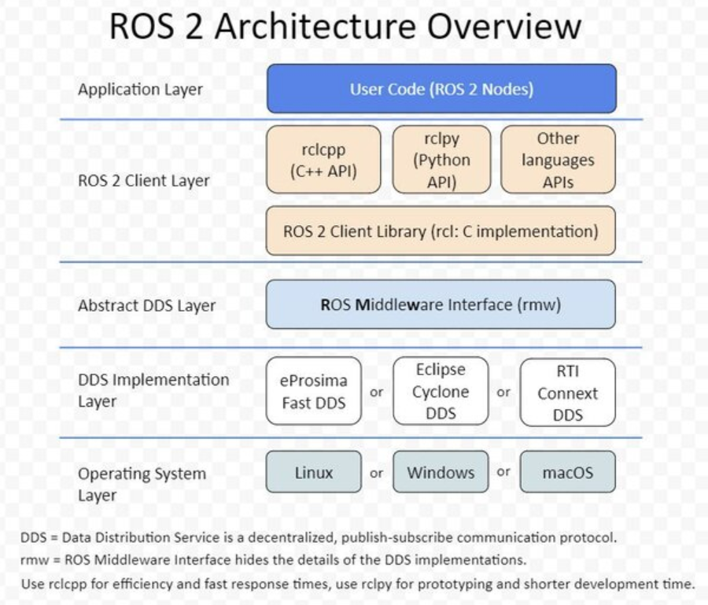
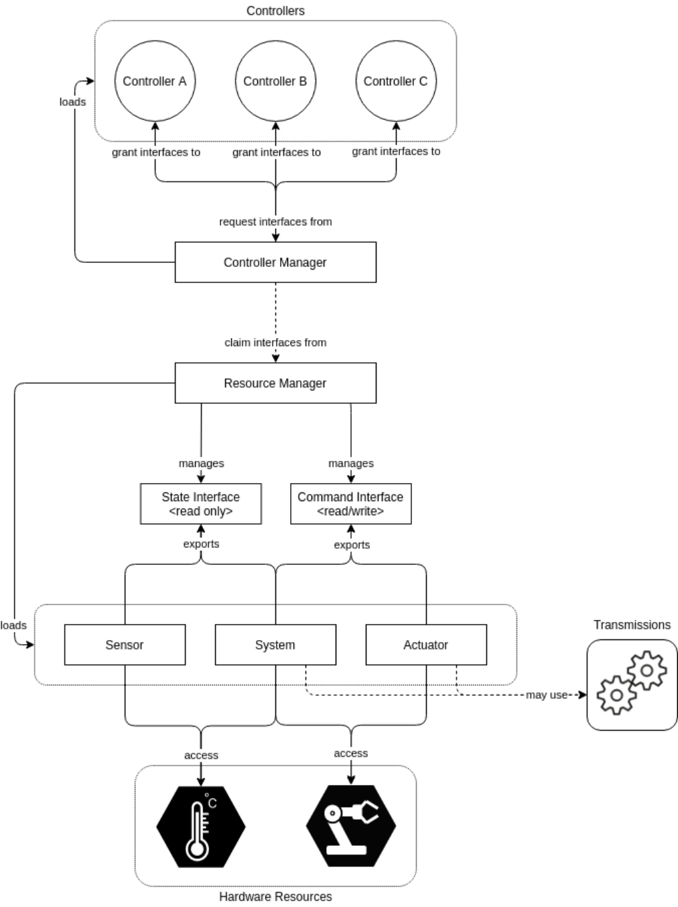
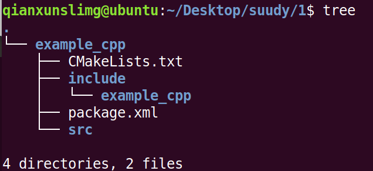
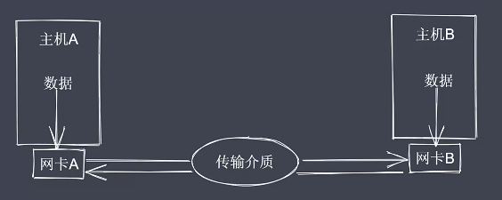
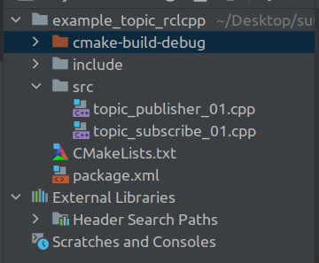
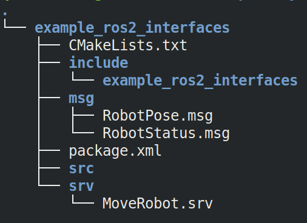
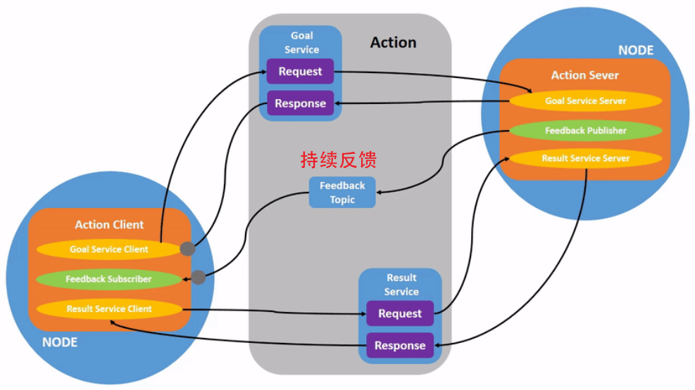
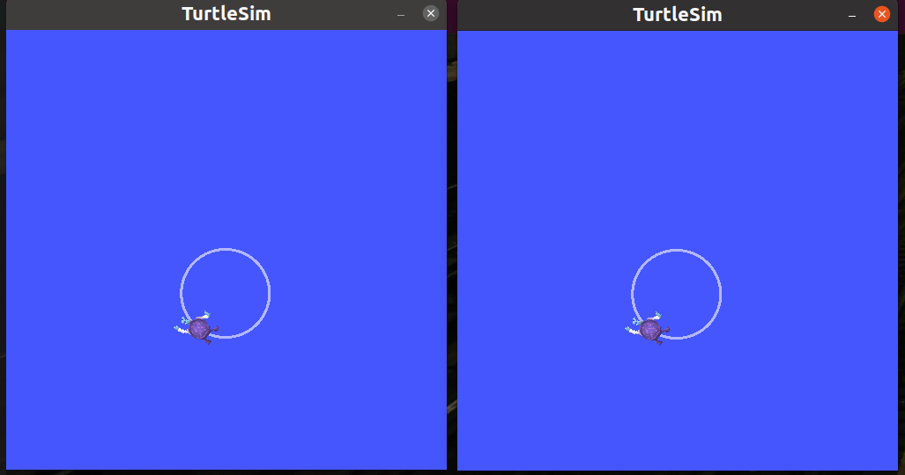
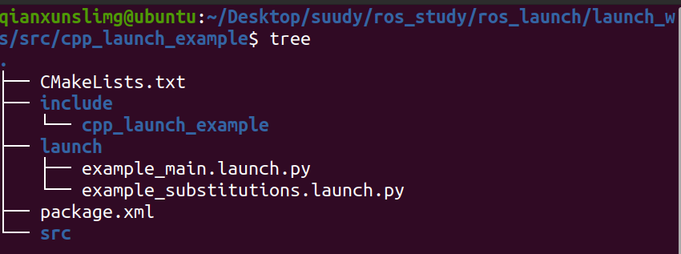
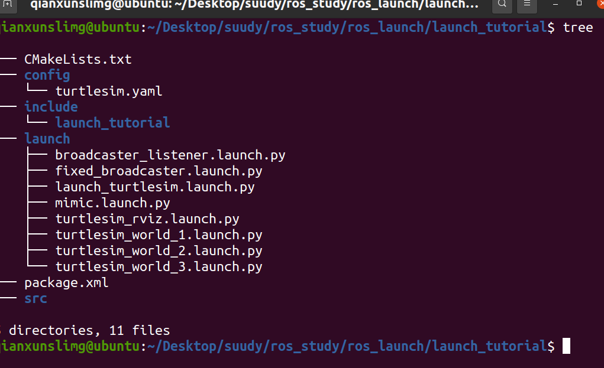

参考资料

> [动手学ROS2 (fishros.com)](https://fishros.com/d2lros2/#/)
>
> https://docs.ros.org/en/foxy/index.html
>
> 各种官方的demo

# 1. 安装

参考网站[小鱼的一键安装系列 | 鱼香ROS (fishros.org.cn)](https://fishros.org.cn/forum/topic/20/小鱼的一键安装系列?lang=zh-CN)

直接输入指令

```bash
wget http://fishros.com/install -O fishros && . fishros
```

根据需求 选择即可 ps:ubuntu1804不要安装dashing 缺少很多指令 安装E*

测试1：根据如下教程`测试ros2是否安装成功`

1. 新开一个terminal，运行以下命令，打开小乌龟窗口：

   ```bash
   ros2 run turtlesim turtlesim_node       # 启动乌龟GUI节点界面，乌龟可以在界面中运动
   ```

2. 新开一个terminal，运行以下命令，打开乌龟控制窗口，可使用方向键控制乌龟运动：

   ```bash
   ros2 run turtlesim turtle_teleop_key    # 启动键盘控制节点，可以通过键盘控制乌龟运动
   ```

测试2

1. 新开一个terminal，运行以下命令，启动listener

   ```bash
   ros2 run demo_nodes_py listener
   ```

2. 新开一个terminal，运行以下命令，启动talker

   ```bash
   ros2 run demo_nodes_py talker
   ```

# 2. 系统架构

### ROS2的架构

ros2整体的系统架构如下：



ros2的系统架构是一个分布式的实时系统架构，它由多个组件（称为节点）组成，这些组件可以是机器人中的传感器、运动控制器、检测算法、人工智能算法、导航算法等。这些组件通过DDS中间件进行数据交换，DDS是一个开放标准的通信协议，它支持去中心化的发布订阅模式。ros2的控制组织体架构可以用下图表示：



图中的每个方框代表一个节点，每个节点可以有多个接口（称为command_interface或state_interface），用于发送或接收数据。每个接口都有一个名称和一个类型，比如position、velocity、effort等。节点之间通过话题（topic）或服务（service）进行通信，话题是一种基于发布订阅模式的异步通信方式，服务是一种基于请求响应模式的同步通信方式。ros2_control是一个用于控制机器人运动的框架，它提供了一种统一的方式来描述和管理机器人的硬件和控制器。ros2_control中有三种主要的组件类型：system、actuator和sensor。system组件代表了一个完整的机器人系统，它可以包含多个关节和传感器，并且可以提供多种类型的接口。actuator组件代表了一个单独的执行器，它只有一个关节，并且只提供一种类型的接口。sensor组件代表了一个单独的传感器，它只提供state_interface，并且不需要command_interface。ros2_control还提供了一种称为transmission的机制，用于在不同类型的接口之间进行转换，比如将position转换为effort

### ROS2的特点

- 基于DDS（Data Distribution Service）中间件，支持去中心化的发布订阅模式，提高了通信的实时性、可靠性、安全性和标准性
- 支持多种操作系统和编程语言，提高了跨平台和多语言的兼容性
- 支持多机器人协同和嵌入式系统，提高了扩展性和适应性
- 继承了ROS1的生态系统，提供了丰富的软件库和工具集，方便了机器人的开发和测试

### ROS2的概念

- 节点（Node）：一个可执行程序，可以实现机器人的某个功能，比如控制、感知、规划等
- 接口（Interface）：节点之间通信的数据类型，分为命令接口（Command Interface）和状态接口（State Interface），分别用于发送或接收数据
- 话题（Topic）：一种基于发布订阅模式的异步通信方式，节点可以发布或订阅话题，实现数据的广播
- 服务（Service）：一种基于请求响应模式的同步通信方式，节点可以提供或调用服务，实现数据的交互
- 参数（Parameter）：节点的配置信息，可以在运行时动态修改
- Action：一种基于目标驱动模式的通信方式，节点可以发送或执行Action，实现数据的反馈

### ROS2的工具

- ros2命令行工具：用于管理ROS2系统，包括创建、运行、停止、列出、查看节点、话题、服务、参数等
- rviz可视化工具：用于展示机器人的模型、传感器数据、导航信息等
- rqt图形化工具：用于监控和调试ROS2系统，包括查看日志、绘制图表、发送消息等
- gazebo仿真工具：用于模拟机器人在真实环境中的运动和感知
- ros2_control控制框架：用于管理机器人的硬件和控制器，提供了一种统一的方式来描述和控制机器人
- ros2_launch启动工具：用于同时启动多个节点和设置参数

# 3.节点通信

## 节点构建

### 节点相关的CLI

#### 运行节点

```bash
ros2 run <package_name> <executable_name>

#例如 小乌龟模拟器
ros2 run turtlesim turtlesim_node
```

#### 查看节点列表

```bash
ros2 node list
```

#### 查看节点信息

```bash
ros2 node info <node_name>
```

#### 重映射节点名称

```bash
ros2 run turtlesim turtlesim_node --ros-args --remap __node:=my_turtle
```

#### 运行节点时设置参数

```bash
ros2 run example_parameters_rclcpp parameters_basic --ros-args -p rcl_log_level:=10
```

### 手动构建

#### c++构建

cpp代码：first_ros2_node.cpp

```cpp
 #include "rclcpp/rclcpp.hpp"
//#include "rclcpp/rclcpp.hpp"

int main(int argc, char **argv)
{
    // 调用rclcpp的初始化函数
    rclcpp::init(argc, argv);
    // 调用rclcpp的循环运行我们创建的first_node节点
    rclcpp::spin(std::make_shared<rclcpp::Node>("first_node"));
    return 0;
}
```

CMakeLists:两种写法

```cmake
cmake_minimum_required(VERSION 3.10)

project(first_node)

#include_directories 添加特定的头文件搜索路径 ，相当于指定g++编译器的-I参数
include_directories(/opt/ros/dashing/include/)

# no need for this
#include_directories(/opt/ros/dashing/include/rclcpp/)
#include_directories(/opt/ros/dashing/include/rcl/)
#include_directories(/opt/ros/dashing/include/rcutils/)
#include_directories(/opt/ros/dashing/include/rcl_yaml_param_parser/)
#include_directories(/opt/ros/dashing/include/rosidl_runtime_c/)
#include_directories(/opt/ros/dashing/include/rosidl_typesupport_interface/)
#include_directories(/opt/ros/dashing/include/rcpputils/)
#include_directories(/opt/ros/dashing/include/builtin_interfaces/)
#include_directories(/opt/ros/dashing/include/rmw/)
#include_directories(/opt/ros/dashing/include/rosidl_runtime_cpp/)
#include_directories(/opt/ros/dashing/include/tracetools/)
#include_directories(/opt/ros/dashing/include/libstatistics_collector/)
#include_directories(/opt/ros/dashing/include/statistics_msgs/)

# link_directories - 向工程添加多个特定的库文件搜索路径，相当于指定g++编译器的-L参数
link_directories(/opt/ros/dashing/lib/)

# add_executable - 生成first_node可执行文件
add_executable(first_node first_ros2_node.cpp)

# target_link_libraries - 为first_node(目标) 
# 添加需要动态链接库，相同于指定g++编译器-l参数
target_link_libraries(first_node rclcpp rcutils)
```

```cmake
cmake_minimum_required(VERSION 3.10)

project(first_node)

find_package(ament_cmake REQUIRED)
find_package(rclcpp REQUIRED)

add_executable(${PROJECT_NAME} first_ros2_node.cpp)

ament_target_dependencies(${PROJECT_NAME} rclcpp)

# this was wrong, because 
# ament_target_dependencies 和 target_link_libraries 的区别在于，
# 前者只适用于使用 find_package 找到的包，而后者适用于本地编译的库。
# 如果你使用的库没有通过 find_package 找到，需要使用 target_link_libraries。
# 使用的是 ROS 2 的库，而 ROS 2 的库通常是通过 find_package 找到的。
## target_link_libraries(${PROJECT_NAME} rclcpp::rclcpp)
```

编译运行 然后 `ros2 node list` 查看

#### python构建

py文件

```python
import rclpy
from rclpy.node import Node
# 调用rclcpp的初始化函数
rclpy.init() 
# 调用rclcpp的循环运行我们创建的second_node节点
rclpy.spin(Node("second_node"))
```

编译运行 然后 `ros2 node list` 查看


### 规范构建：使用RCLCPP编写节点

创建example功能包

```bash
ros2 pkg create example_cpp --build-type ament_cmake --dependencies rclcpp
```

- pkg create 是创建包的意思
- --build-type 用来指定该包的编译类型，一共有三个可选项`ament_python`、`ament_cmake`、`cmake`
- --dependencies 指的是这个功能包的依赖，这里给了一个ros2的python客户端接口`rclpy`

目录结构如下

- 当前文件夹下生成一个大的example_cpp的pkg文件



- 需要注意的是 在哪一级目录执行colcon build在那一级目录下生成 build log和install文件夹

在src中新建node_01.cpp

```c++
#include "rclcpp/rclcpp.hpp"

int main(int argc, char **argv){
    //init
    rclcpp::init(argc, argv);
    //creat a node
    auto node = std::make_shared<rclcpp::Node>("node_01");
    //print a introduce
    RCLCPP_INFO(node->get_logger(), "node_01 has started...");
    //run the node and list for quit signal
    rclcpp::spin(node);
    //stop
    rclcpp::shutdown();
    return 0;
}
```

修改CMakeLists.txt，在最后添加如下几行

```bash
add_executable(node_01 src/node_01.cpp)
ament_target_dependencies(node_01 rclcpp)
install(TARGETS
  node_01
  DESTINATION lib/${PROJECT_NAME}
)
```

然后使用colcon编译 并运行

```bash
# 编译
colcon build
# ?
source install/setup.sh
# 运行节点
ros2 run example_cpp node_01
```

## 节点通信

### 底层实现



ros2的通信方式

1. 基于`TCP/UDP`的网络通信。
2. 基于`共享内存`的进程间通信（IPC）。

### 通信中间件

消息中间件是一种软件，它提供了应用程序之间的通信机制。常见的消息中间件有 ZeroMQ、RabbitMQ、ActiveMQ、`Kafka` 等

<u>ROS2 使用 `DDS` 作为中间件，DDS 是一种分布式数据服务，它提供了一种分布式数据交换机制，使得不同计算机上的应用程序可以相互通信</u>


ZeroMQ（也称为 ØMQ、0MQ 或 ZMQ）是一个异步消息库，旨在用于分布式或并发应用程序。它提供了一个消息队列，但与面向消息的中间件不同，ZeroMQ 系统可以在没有专用消息代理的情况下运行；名称中的零表示零代理。该库的 API 设计类似于 Berkeley sockets

ZeroMQ 的套接字实现“呈现异步消息队列的抽象”，与常规套接字同步方式不同。这些套接字的工作方式取决于所选择的套接字类型。发送的消息流取决于所选择的模式，其中有四种：请求-响应、发布-订阅、推送-拉取和管道

`ZeroMQ 和 DDS 都是消息中间件`，但是它们有很多不同之处。以下是它们之间的一些区别 ：

- ZeroMQ 是一种轻量级的消息中间件，而 DDS 是一种重量级的消息中间件。
- ZeroMQ 是一种点对点的通信模式，而 DDS 是一种发布-订阅模式。
- ZeroMQ 不支持 QoS（Quality of Service）和数据持久化，而 DDS 支持 QoS 和数据持久化。
- ZeroMQ 的性能比 DDS 更高，但 DDS 的可靠性更高。

ROS2使用`DDS`（Data Distribution Service）作为其中间件，DDS是一种分布式系统的通信协议，它可以在不同的进程之间进行高效的数据交换。ROS2中的<u>话题和服务都是通过DDS进行通信的</u>。当一个节点发布一个话题时，它会将消息发送到DDS中，然后DDS会将消息传递给所有订阅该话题的节点。当一个节点请求一个服务时，它会将请求发送到DDS中，然后DDS会将请求传递给提供该服务的节点。

## 话题和服务

在ROS2中，话题（Topic）和服务（Service）都是用于进程间通信的机制。

- `话题是一种发布/订阅机制`，它允许多个节点之间进行异步通信。在话题中，一个节点可以发布一个消息，而其他节点可以订阅该消息。当一个节点发布一个消息时，所有订阅该消息的节点都会收到该消息。
- 服务是一种`请求/响应机制`，它允许一个节点向另一个节点发送请求，并等待响应。在服务中，一个节点可以请求另一个节点执行某个操作，并等待该节点的响应。

举个例子，假设我们有两个节点：Node A和Node B。Node A想要向Node B请求某个服务，那么它会向Node B发送一个请求消息。Node B接收到请求消息后，会执行相应的操作，并将结果作为响应消息发送回给Node A。

> 这个例子中的功能同样可以用话题实现，但是`可能会导致网络阻塞`，并且可能会影响其他节点的性能

### 话题的发布和订阅

构建工程

```bash
ros2 pkg create example_topic_cpp --build-type ament_cmake --dependencies rclcpp
```

src下新建发布和订阅cpp，pkg整体目录结构如下



topic_publisher_01.cpp

```c++
#include "rclcpp/rclcpp.hpp"
#include "std_msgs/msg/string.hpp"

class TopicPublisher01 : public rclcpp::Node
{
public:
    // 构造函数,有一个参数为节点名称
    TopicPublisher01(std::string name) : Node(name)
    {
        RCLCPP_INFO(this->get_logger(), "hello, i am %s.", name.c_str());
        // 创建发布者
        command_publisher_ = this->create_publisher<std_msgs::msg::String>("command", 10);
        // 创建定时器，500ms为周期，定时发布
        timer_ = this->create_wall_timer(std::chrono::milliseconds(500), std::bind(&TopicPublisher01::timer_callback, this));
    }

private:
    void timer_callback()
    {
        // 创建消息
        std_msgs::msg::String message;
        message.data = "forward";
        // 日志打印
        RCLCPP_INFO(this->get_logger(), "Publishing: '%s'", message.data.c_str());
        // 发布消息
        command_publisher_->publish(message);
    }
    // 声名定时器指针
    rclcpp::TimerBase::SharedPtr timer_;
    // 声明话题发布者指针
    rclcpp::Publisher<std_msgs::msg::String>::SharedPtr command_publisher_;
};

int main(int argc, char **argv)
{
    rclcpp::init(argc, argv);
    /*创建对应节点的共享指针对象*/
    auto node = std::make_shared<TopicPublisher01>("topic_publisher_01");
    /* 运行节点，并检测退出信号*/
    rclcpp::spin(node);
    rclcpp::shutdown();
    return 0;
}

```

topic_subscribe_01.cpp

```c++
//
// Created by qianxunslimg on 4/19/23.
//
#include "rclcpp/rclcpp.hpp"
#include "std_msgs/msg/string.hpp"

using Msg = std_msgs::msg::String;
class TopicSubscribe01 : public rclcpp::Node{
public:
    TopicSubscribe01(std::string name) : Node(name){
        RCLCPP_INFO(this->get_logger(), "Hello, i am %s", name.c_str());
        command_subscribe_ = this->create_subscription<std_msgs::msg::String>
                ("command", 10, std::bind(&TopicSubscribe01::command_callback, this, std::placeholders::_1));
    }
private:
    rclcpp::Subscription<Msg>::SharedPtr command_subscribe_;
    void command_callback(const Msg::SharedPtr msg){
        double speed = 0.0f;
        if(msg->data == "forward"){
            speed = 0.2f;
        }
        RCLCPP_INFO(this->get_logger(), "receive order %s, speed %f", msg->data.c_str(), speed);
    }
};

int main(int argc, char **argv){
    rclcpp::init(argc, argv);
    auto node = std::make_shared<TopicSubscribe01>("topic_subscribe_01");
    rclcpp::spin(node);
    rclcpp::shutdown();
    return 0;
}
```

对应的cmakelist添加

```cmake
add_executable(topic_publisher_01 src/topic_publisher_01.cpp)
ament_target_dependencies(topic_publisher_01 rclcpp std_msgs)

install(TARGETS
  topic_publisher_01
  DESTINATION lib/${PROJECT_NAME}
)


add_executable(topic_subscribe_01 src/topic_subscribe_01.cpp)
ament_target_dependencies(topic_subscribe_01 rclcpp std_msgs)

install(TARGETS
  topic_subscribe_01
  DESTINATION lib/${PROJECT_NAME}
)
```

package.xml添加

```xml
  <depend>std_msgs</depend>
```

直接colcon build就可以了 直接用clion体验更佳

```bash
colcon build  # 全部编译
# colcon build --packages-select example_topic_rclcpp
source install/setup.bash
ros2 run example_topic_rclcpp topic_subscribe_01

source install/setup.bash
ros2 run example_topic_rclcpp topic_publisher_01

rqt #查看逻辑图
```

### 服务

#### 服务常用指令

```bash
ros2 service list  #查看服务列表
ros2 run examples_rclpy_minimal_service service  #启动服务端
ros2 service call /add_two_ints example_interfaces/srv/AddTwoInts "{a: 5,b: 10}"  #手动调用服务
ros2 service call /add_two_ints example_interfaces/srv/AddTwoInts #不写参数调用 默认值 a = 0 b = 0
ros2 service type /add_two_ints #查看服务端口类型  dashing没有这个指令
ros2 service find example_interfaces/srv/AddTwoInts #dashing没有这个指令
```

#### 服务RCLCPP实现


==构建工程==

```bash
ros2 pkg create example_topic_cpp --build-type ament_cmake --dependencies rclcpp
```

src下新建发布和订阅cpp，pkg整体目录结构如下


service_client.cpp

```c++
#include "rclcpp/rclcpp.hpp"
#include "example_interfaces/srv/add_two_ints.hpp"

class ServiceClient01 : public rclcpp::Node {
public:
    // 构造函数,有一个参数为节点名称
    ServiceClient01(std::string name) : Node(name) {
        RCLCPP_INFO(this->get_logger(), "节点已启动：%s.", name.c_str());
        // 创建客户端
        client_ = this->create_client<example_interfaces::srv::AddTwoInts>("add_two_ints_srv");
    }

    void send_request(int a, int b) {
        RCLCPP_INFO(this->get_logger(), "计算%d+%d", a, b);

        // 1.等待服务端上线
        while (!client_->wait_for_service(std::chrono::seconds(1))) {
            //等待时检测rclcpp的状态
            if (!rclcpp::ok()) {
                RCLCPP_ERROR(this->get_logger(), "等待服务的过程中被打断...");
                return;
            }
            RCLCPP_INFO(this->get_logger(), "等待服务端上线中");
        }

        // 2.构造请求的
        auto request =
                std::make_shared<example_interfaces::srv::AddTwoInts_Request>();
        request->a = a;
        request->b = b;

        // 3.发送异步请求，然后等待返回，返回时调用回调函数
        client_->async_send_request(
                request, std::bind(&ServiceClient01::result_callback_, this,
                                   std::placeholders::_1));
    };

private:
    // 声明客户端
    rclcpp::Client<example_interfaces::srv::AddTwoInts>::SharedPtr client_;

    void result_callback_(
            rclcpp::Client<example_interfaces::srv::AddTwoInts>::SharedFuture
            result_future) {
        auto response = result_future.get();
        RCLCPP_INFO(this->get_logger(), "计算结果：%ld", response->sum);
    }
};

int main(int argc, char** argv) {
    rclcpp::init(argc, argv);
    /*创建对应节点的共享指针对象*/
    auto node = std::make_shared<ServiceClient01>("service_client_01");
    /* 运行节点，并检测退出信号*/
    //增加这一行，node->send_request(5, 6);，计算5+6结果
    node->send_request(5, 6);
    rclcpp::spin(node);
    rclcpp::shutdown();
    return 0;
}
```

service_server.cpp

```c++
#include "rclcpp/rclcpp.hpp"

#include "example_interfaces/srv/add_two_ints.hpp"
#include "rclcpp/rclcpp.hpp"

class ServiceServer01 : public rclcpp::Node {
public:
    ServiceServer01(std::string name) : Node(name) {
        RCLCPP_INFO(this->get_logger(), "节点已启动：%s.", name.c_str());
        // 创建服务
        add_ints_server_ =
                this->create_service<example_interfaces::srv::AddTwoInts>(
                        "add_two_ints_srv",
                        std::bind(&ServiceServer01::handle_add_two_ints, this,
                                  std::placeholders::_1, std::placeholders::_2));
    }

private:
    // 声明一个服务
    rclcpp::Service<example_interfaces::srv::AddTwoInts>::SharedPtr
            add_ints_server_;

    // 收到请求的处理函数
    void handle_add_two_ints(
            const std::shared_ptr<example_interfaces::srv::AddTwoInts::Request> request,
            std::shared_ptr<example_interfaces::srv::AddTwoInts::Response> response) {
        RCLCPP_INFO(this->get_logger(), "收到a: %ld b: %ld", request->a,
                    request->b);
        response->sum = request->a + request->b;
    };
};


int main(int argc, char** argv) {
    rclcpp::init(argc, argv);
    auto node = std::make_shared<ServiceServer01>("service_server_01");
    rclcpp::spin(node);
    rclcpp::shutdown();
    return 0;
}

```

对应的cmakelist添加

```cmake
add_executable(client src/service_client_01.cpp)
add_executable(server src/service_server_01.cpp)

ament_target_dependencies(client rclcpp example_interfaces)
ament_target_dependencies(server rclcpp example_interfaces)

install(TARGETS
        client
        DESTINATION lib/${PROJECT_NAME}
        )

install(TARGETS
        server
        DESTINATION lib/${PROJECT_NAME}
        )
```

package.xml添加

```xml
  <depend>example_interfaces</depend>
```

直接clion调试

## 接口

接口可以理解为统一的数据结构

#### 自带接口

查看自带传感器类的sensor_msgs的接口

```bash
ros2 interface package sensor_msgs
```

### 接口文件内容

#### 可以定义的接口三种类型

ROS2提供了四种通信方式：

- 话题-Topics
- 服务-Services
- 动作-Action
- 参数-Parameters

除了参数之外，`话题、服务和动作`都支持自定义接口，所定义的接口被分为话题接口、服务接口、动作接口三种。


#### 接口形式

话题接口格式：`xxx.msg`

```bash
# 话题接口定义了话题消息的数据结构
# 每个字段由一个类型和一个名称组成，中间用空格分隔
# 这里定义了一个名为num的int64类型的字段
int64 num
```

服务接口格式：`xxx.srv`

```bash
# 服务接口定义了服务请求和响应的数据结构
# 服务请求和响应之间用三个连字符（---）分隔
# 这里定义了一个名为a和b的int64类型的请求字段
int64 a
int64 b
---
# 这里定义了一个名为sum的int64类型的响应字段
int64 sum
```

动作接口格式：`xxx.action`

```bash
# 动作接口定义了动作目标，结果和反馈的数据结构
# 动作目标，结果和反馈之间用三个连字符（---）分隔
# 这里定义了一个名为order的int32类型的目标字段
int32 order
---
# 这里定义了一个名为sequence的int32数组类型的结果字段
int32[] sequence
---
# 这里定义了一个名为partial_sequence的int32数组类型的反馈字段
int32[] partial_sequence
```

#### 接口数据类型

根据引用方式不同可以分为基础类型和包装类型两类。

`基础类型`有（同时后面加上[]可形成数组）

```sh
# 基础类型是一些简单的数据类型，如布尔值，字节，字符，浮点数，整数和字符串
# 它们可以直接在接口文件中使用，也可以组成数组
# 例如，bool[]表示一个布尔值的数组
bool
byte
char
float32,float64
int8,uint8
int16,uint16
int32,uint32
int64,uint64
string
```

`包装类型` 即在已有的接口类型上进行包含，可以理解为结构体

```sh
# 包装类型是一些复杂的数据类型，如其他接口文件定义的消息，服务或动作
# 它们可以通过包名/接口名的形式在接口文件中引用，也可以组成数组
# 例如，sensor_msgs/Image表示一个图像消息，sensor_msgs/Image[]表示一个图像消息的数组
uint32 id # 这是一个基础类型的字段
string image_name # 这也是一个基础类型的字段
sensor_msgs/Image # 这是一个包装类型的字段，它引用了sensor_msgs包中定义的Image消息接口
```

### 自定义接口并包编

#### 定义接口

服务接口`MoveRobot.srv`

```
# 前进后退的距离
float32 distance
---
# 当前的位置
float32 pose
```

话题接口，采用基础类型 `RobotStatus.msg`

```
uint32 STATUS_MOVEING = 1
uint32 STATUS_STOP = 1
uint32  status
float32 pose
```

话题接口，混合包装类型 `RobotPose.msg`

```shell
uint32 STATUS_MOVEING = 1
uint32 STATUS_STOP = 2
uint32  status
geometry_msgs/Pose pose
```

#### 包编

创建功能包

```shell
ros2 pkg create example_ros2_interfaces --build-type ament_cmake --dependencies rosidl_default_generators geometry_msgs
```

注意功能包类型必须为：ament_cmake

依赖`rosidl_default_generators`必须添加，`geometry_msgs`视内容情况添加（这里有`geometry_msgs/Pose pose`所以要添加）。

接着创建文件夹和文件将3.2中文件写入，注意话题接口放到`msg`文件夹下，以`.msg`结尾。服务接口放到`srv`文件夹下，以`srv`结尾。



接着修改`CMakeLists.txt`

```cmake
find_package(rosidl_default_generators REQUIRED)
find_package(geometry_msgs REQUIRED)
# 添加下面的内容
rosidl_generate_interfaces(${PROJECT_NAME}
  "msg/RobotPose.msg"
  "msg/RobotStatus.msg"
  "srv/MoveRobot.srv"
  DEPENDENCIES geometry_msgs
)
```

接着修改`package.xml`

```xml
  <buildtool_depend>ament_cmake</buildtool_depend>

  <depend>rosidl_default_generators</depend>
  <depend>geometry_msgs</depend>
  
  <member_of_group>rosidl_interface_packages</member_of_group> #添加这一行

  <test_depend>ament_lint_auto</test_depend>
  <test_depend>ament_lint_common</test_depend>
```

保存即可编译

```shell
colcon build --packages-select example_ros2_interfaces
```

编译完成后在`install/example_ros2_interfaces/include`下可以看到C++的头文件。

接下来的代码里就可以通过头文件导入和使用自定义的接口了。

### 自定义接口RCLCPP实战

创建工程

```bash
ros2 pkg create example_interfaces_rclcpp --build-type ament_cmake --dependencies rclcpp example_ros2_interfaces --destination-directory src --node-name example_interfaces_robot_01 
# 还需添加control节点
touch example_interfaces_rclcpp/src/example_interfaces_control_01.cpp
```

cmakelist修改 注意 要用clion调试的话需要 添加的几行 因为会提示找不到接口的一个.so文件

```cmake
cmake_minimum_required(VERSION 3.5)
project(example_interfaces_rclcpp)

# Default to C99
if(NOT CMAKE_C_STANDARD)
  set(CMAKE_C_STANDARD 99)
endif()

# Default to C++14
if(NOT CMAKE_CXX_STANDARD)
  set(CMAKE_CXX_STANDARD 14)
endif()

if(CMAKE_COMPILER_IS_GNUCXX OR CMAKE_CXX_COMPILER_ID MATCHES "Clang")
  add_compile_options(-Wall -Wextra -Wpedantic)
endif()

################################################################
#add for solve clion debug due to can not find the so of interface
##link_directories(/home/qianxunslimg/Desktop/suudy/ros_study/d2lros2/chapt3/chapt_ws/build/example_ros2_interfaces)
add_library(example_ros2_interfaces SHARED IMPORTED)
set_property(TARGET example_ros2_interfaces PROPERTY IMPORTED_LOCATION /home/qianxunslimg/Desktop/suudy/ros_study/d2lros2/chapt3/chapt_ws/build/example_ros2_interfaces/libexample_ros2_interfaces__rosidl_typesupport_fastrtps_cpp.so)
################################################################

# find dependencies
find_package(ament_cmake REQUIRED)
find_package(rclcpp REQUIRED)
find_package(example_ros2_interfaces REQUIRED)


add_executable(example_interfaces_robot_01 src/example_interfaces_robot_01.cpp)
target_include_directories(example_interfaces_robot_01 PUBLIC
  $<BUILD_INTERFACE:${CMAKE_CURRENT_SOURCE_DIR}/include>
  $<INSTALL_INTERFACE:include>)
ament_target_dependencies(
  example_interfaces_robot_01
  "rclcpp"
  "example_ros2_interfaces"
)

################################################################
#add for solve clion debug due to can not find the so of interface
target_link_libraries(example_interfaces_robot_01 example_ros2_interfaces)
################################################################

install(TARGETS example_interfaces_robot_01
  EXPORT export_${PROJECT_NAME}
  DESTINATION lib/${PROJECT_NAME})
  

# add /
add_executable(example_interfaces_control_01 src/example_interfaces_control_01.cpp)
target_include_directories(example_interfaces_control_01 PUBLIC
        $<BUILD_INTERFACE:${CMAKE_CURRENT_SOURCE_DIR}/include>
        $<INSTALL_INTERFACE:include>)
target_compile_features(example_interfaces_control_01 PUBLIC c_std_99 cxx_std_17)  # Require C99 and C++17
ament_target_dependencies(
        example_interfaces_control_01
        "rclcpp"
        "example_ros2_interfaces"
)

################################################################
#add for solve clion debug due to can not find the so of interface
target_link_libraries(example_interfaces_control_01 example_ros2_interfaces)
################################################################

install(TARGETS example_interfaces_control_01
        DESTINATION lib/${PROJECT_NAME})
# add /

if(BUILD_TESTING)
  find_package(ament_lint_auto REQUIRED)
  # the following line skips the linter which checks for copyrights
  # uncomment the line when a copyright and license is not present in all source files
  #set(ament_cmake_copyright_FOUND TRUE)
  # the following line skips cpplint (only works in a git repo)
  # uncomment the line when this package is not in a git repo
  #set(ament_cmake_cpplint_FOUND TRUE)
  ament_lint_auto_find_test_dependencies()
endif()

ament_package()
```

会有循环警告，但不影响程序执行

```
CMake Warning at CMakeLists.txt:31 (add_executable):
  Cannot generate a safe runtime search path for target
  example_interfaces_robot_01 because there is a cycle in the constraint
  graph:

    dir 0 is [/opt/ros/eloquent/lib]
    dir 1 is [/home/qianxunslimg/Desktop/suudy/ros_study/d2lros2/chapt3/install/example_ros2_interfaces/lib]
      dir 2 must precede it due to runtime library [libexample_ros2_interfaces__rosidl_typesupport_fastrtps_cpp.so]
    dir 2 is [/home/qianxunslimg/Desktop/suudy/ros_study/d2lros2/chapt3/chapt_ws/build/example_ros2_interfaces]
      dir 1 must precede it due to runtime library [libexample_ros2_interfaces__rosidl_typesupport_c.so]

  Some of these libraries may not be found correctly.
```

控制端

```bash
source install/setup.bash
ros2 run example_interfaces_rclcpp example_interfaces_control_01
```

服务端

```bash
source install/setup.bash
ros2 run example_interfaces_rclcpp  example_interfaces_robot_01
```

## QoS

[Rviz显示不出数据了！一文搞懂Qos (qq.com)](https://mp.weixin.qq.com/s/J63fO4c_QIseLGQd5W2fAw)

ROS2的QoS是指服务质量（Quality of Service）的缩写，它是一组策略，用于控制节点之间通信的可靠性、持久性、延迟等属性。ROS2利用了底层DDS传输的灵活性，提供了多种QoS策略，可以根据不同的应用场景进行调整。

ROS2的QoS策略包括以下几种：

- 历史记录（History）：决定了订阅者节点可以接收到多少历史消息，可以设置为保留最后（Keep last）或保留全部（Keep all），并指定一个队列深度（Depth）。
- 可靠性（Reliability）：决定了发布者节点是否保证消息送达，可以设置为尽力而为（Best effort）或可靠（Reliable）。
- 持久性（Durability）：决定了发布者节点是否保留消息，以便后来加入的订阅者节点可以接收到，可以设置为易变性（Volatile）或瞬态本地（Transient local）。
- 时间期限（Deadline）：决定了发布者节点和订阅者节点之间的最大时间间隔，如果超过这个时间间隔没有收到消息，则认为出现错误。
- 寿命（Lifespan）：决定了消息在发布后的有效期限，如果超过这个期限没有被接收，则认为消息过期并丢弃。
- 活力（Liveliness）：决定了发布者节点如何向订阅者节点证明自己还存活，可以设置为自动申明（Automatic）、按话题手动申明（Manual by topic）或按节点手动申明（Manual by node），并指定一个租期（Lease Duration），即最长的无响应时间。

ROS2提供了一些预定义的QoS配置文件，用于常见的用例，例如传感器数据、参数、服务等。也可以自定义QoS配置文件，但要注意发布者和订阅者之间的QoS配置文件必须`兼容`才能建立连接。

## 通信参数与动作

### 参数

创建功能包和测试节点

```shell
ros2 pkg create example_parameters_rclcpp --build-type ament_cmake --dependencies rclcpp --destination-directory src --node-name parameters_basic
```

parameters_basic.cpp

```cpp
#include <cstdio>
#include <chrono>
#include "rclcpp/rclcpp.hpp"

/*
    # declare_parameter            声明和初始化一个参数
    # describe_parameter(name)  通过参数名字获取参数的描述
    # get_parameter                通过参数名字获取一个参数
    # set_parameter                设置参数的值
*/
class ParametersBasicNode : public rclcpp::Node {
public:
    // 构造函数,有一个参数为节点名称
    explicit ParametersBasicNode(std::string name) : Node(name) {
        RCLCPP_INFO(this->get_logger(), "节点已启动：%s.", name.c_str());
        this->declare_parameter("rcl_log_level", 0);     /*声明参数*/
        this->get_parameter("rcl_log_level", log_level); /*获取参数*/
        /*设置日志级别*/  //注意foxy语句不同
        rcutils_logging_set_logger_level(this->get_logger().get_name(), log_level);
        // this->get_logger().set_level((rclcpp::Logger::Level)log_level);
        using namespace std::literals::chrono_literals;
        timer_ = this->create_wall_timer(
                2000ms, std::bind(&ParametersBasicNode::timer_callback, this));
    }

private:
    int log_level;
    rclcpp::TimerBase::SharedPtr timer_;

    void timer_callback() {
        this->get_parameter("rcl_log_level", log_level); /*get par to loglevel*/
        /*设置日志级别*/
        srand(time(0));
        log_level = 0 + rand() % 5;
        rcutils_logging_set_logger_level(this->get_logger().get_name(), log_level);
        //this->get_logger().set_level((rclcpp::Logger::Level)log_level);
        std::cout << "======================================================" << std::endl;
        switch (log_level) {
            case 0:
                RCLCPP_DEBUG(this->get_logger(), "我是DEBUG级别的日志，我被打印出来了!");
                break;
            case 1:
                RCLCPP_INFO(this->get_logger(), "我是INFO级别的日志，我被打印出来了!");
                break;
            case 2:
                RCLCPP_WARN(this->get_logger(), "我是WARN级别的日志，我被打印出来了!");
                break;
            case 3:
                RCLCPP_ERROR(this->get_logger(), "我是ERROR级别的日志，我被打印出来了!");
                break;
            case 4:
                RCLCPP_FATAL(this->get_logger(), "我是FATAL级别的日志，我被打印出来了!");
                break;
            default:
                break;
        }
    }
};

int main(int argc, char **argv) {
    rclcpp::init(argc, argv);
    /*创建对应节点的共享指针对象*/
    auto node = std::make_shared<ParametersBasicNode>("parameters_basic");
    /* 运行节点，并检测退出信号*/
    rclcpp::spin(node);
    rclcpp::shutdown();
    return 0;
}
```

### 动作通信

动作是 ROS 2 中的通信类型之一，适用于`长时间运行的任务`。 它们由三部分组成：目标、反馈和结果。



[5.动作之CPP实现 (fishros.com)](https://fishros.com/d2lros2/#/humble/chapt4/get_started/5.动作之CPP实现)

创建example_action_rclcpp功能包，添加`robot_control_interfaces`、`rclcpp_action`、`rclcpp`三个依赖，自动创建`action_robot_01`节点，并手动创建`action_control_01.cpp`节点。

```shell
cd chapt4_ws/
ros2 pkg create example_action_rclcpp --build-type ament_cmake --dependencies rclcpp rclcpp_action robot_control_interfaces --destination-directory src --node-name action_robot_01 --maintainer-name "fishros" --maintainer-email "fishros@foxmail.com"
touch src/example_action_rclcpp/src/action_control_01.cpp
```

接着创建Robot类的头文件和CPP文件。

```
touch src/example_action_rclcpp/include/example_action_rclcpp/robot.h
touch src/example_action_rclcpp/src/robot.cpp
```

创建完成后目录结构

```
.
├── CMakeLists.txt
├── include
│   └── example_action_rclcpp
│       └── robot.h 
├── package.xml
└── src
    ├── action_control_01.cpp
    ├── action_robot_01.cpp
    └── robot.cpp

3 directes, 6 files
```

cmakelists

```cmake
find_package(ament_cmake REQUIRED)
find_package(rclcpp REQUIRED)
find_package(robot_control_interfaces REQUIRED)
find_package(example_interfaces REQUIRED)
find_package(rclcpp_action REQUIRED)

# action_robot节点

add_executable(action_robot_01 
    src/robot.cpp
    src/action_robot_01.cpp
)
target_include_directories(action_robot_01 PUBLIC
  $<BUILD_INTERFACE:${CMAKE_CURRENT_SOURCE_DIR}/include>
  $<INSTALL_INTERFACE:include>)
target_compile_features(action_robot_01 PUBLIC c_std_99 cxx_std_17)  # Require C99 and C++17
ament_target_dependencies(
  action_robot_01
  "rclcpp"
  "rclcpp_action"
  "robot_control_interfaces"
  "example_interfaces"
)

install(TARGETS action_robot_01
  DESTINATION lib/${PROJECT_NAME})

# action_control节点

add_executable(action_control_01 
  src/action_control_01.cpp
)
target_include_directories(action_control_01 PUBLIC
$<BUILD_INTERFACE:${CMAKE_CURRENT_SOURCE_DIR}/include>
$<INSTALL_INTERFACE:include>)
target_compile_features(action_control_01 PUBLIC c_std_99 cxx_std_17)  # Require C99 and C++17
ament_target_dependencies(
  action_control_01
  "rclcpp"
  "rclcpp_action"
  "robot_control_interfaces"
  "example_interfaces"
)

install(TARGETS action_control_01
DESTINATION lib/${PROJECT_NAME})
```

package.xml

```xml
  <buildtool_depend>ament_cmake</buildtool_depend>

  <depend>rclcpp</depend>
  <depend>rclcpp_action</depend>
  <depend>robot_control_interfaces</depend>
```

robot.h

```cpp
#ifndef EXAMPLE_ACTIONI_RCLCPP_ROBOT_H_
#define EXAMPLE_ACTIONI_RCLCPP_ROBOT_H_
#include "rclcpp/rclcpp.hpp"
#include "robot_control_interfaces/action/move_robot.hpp"

class Robot {
public:
    using MoveRobot = robot_control_interfaces::action::MoveRobot;
    Robot() = default;
    ~Robot() = default;
    float move_step(); /*移动一小步，请间隔500ms调用一次*/
    bool set_goal(float distance); /*移动一段距离*/
    float get_current_pose();
    int get_status();
    bool close_goal(); /*是否接近目标*/
    void stop_move();  /*停止移动*/

private:
    float current_pose_ = 0.0;             /*声明当前位置*/
    float target_pose_ = 0.0;              /*目标距离*/
    float move_distance_ = 0.0;            /*目标距离*/
    std::atomic<bool> cancel_flag_{false}; /*取消标志*/
    int status_ = MoveRobot::Feedback::STATUS_STOP;
};

#endif  // EXAMPLE_ACTIONI_RCLCPP_ROBOT_H_
```

robot.cpp

```cpp
#include "example_action_rclcpp/robot.h"
#include "cmath"

/*移动一小步，请间隔500ms调用一次*/
float Robot::move_step() {
    int direct = move_distance_ / fabs(move_distance_);
    float step = direct * fabs(target_pose_ - current_pose_) *
                 0.1; /* 每一步移动当前到目标距离的1/10*/
    current_pose_ += step;
    std::cout << "移动了：" << step << "当前位置：" << current_pose_ << std::endl;
    return current_pose_;
}

/*移动一段距离*/
bool Robot::set_goal(float distance) {
    move_distance_ = distance;
    target_pose_ += move_distance_;

    /* 当目标距离和当前距离大于0.01同意向目标移动 */
    if (close_goal()) {
        status_ = MoveRobot::Feedback::STATUS_STOP;
        return false;
    }
    status_ = MoveRobot::Feedback::STATUS_MOVEING;
    return true;
}

float Robot::get_current_pose() { return current_pose_; }
int Robot::get_status() { return status_; }
/*是否接近目标*/
bool Robot::close_goal() { return fabs(target_pose_ - current_pose_) < 0.01; }
void Robot::stop_move() {
    status_ = MoveRobot::Feedback::STATUS_STOP;
} /*停止移动*/
```

action_control_01.cpp

```c++
#include "rclcpp/rclcpp.hpp"
#include "rclcpp_action/rclcpp_action.hpp"
#include "robot_control_interfaces/action/move_robot.hpp"

class ActionControl01 : public rclcpp::Node {
public:
    using MoveRobot = robot_control_interfaces::action::MoveRobot;
    using GoalHandleMoveRobot = rclcpp_action::ClientGoalHandle<MoveRobot>;

    explicit ActionControl01(
            std::string name,
            const rclcpp::NodeOptions& node_options = rclcpp::NodeOptions())
            : Node(name, node_options) {
        RCLCPP_INFO(this->get_logger(), "节点已启动：%s.", name.c_str());

        this->client_ptr_ =
                rclcpp_action::create_client<MoveRobot>(this, "move_robot");

        this->timer_ =
                this->create_wall_timer(std::chrono::milliseconds(500),
                                        std::bind(&ActionControl01::send_goal, this));
    }

    void send_goal() {
        using namespace std::placeholders;

        this->timer_->cancel();

        if (!this->client_ptr_->wait_for_action_server(std::chrono::seconds(10))) {
            RCLCPP_ERROR(this->get_logger(),
                         "Action server not available after waiting");
            rclcpp::shutdown();
            return;
        }

        auto goal_msg = MoveRobot::Goal();
        goal_msg.distance = 10;

        RCLCPP_INFO(this->get_logger(), "Sending goal");

        auto send_goal_options =
                rclcpp_action::Client<MoveRobot>::SendGoalOptions();

        ///////////////////////////////////////////////////////////////
        // call back is different
        send_goal_options.goal_response_callback =
              std::bind(&ActionControl01::goal_response_callback, this, _1);
        ///////////////////////////////////////////////////////////////

        send_goal_options.feedback_callback =
                std::bind(&ActionControl01::feedback_callback, this, _1, _2);
        send_goal_options.result_callback =
                std::bind(&ActionControl01::result_callback, this, _1);
        
        this->client_ptr_->async_send_goal(goal_msg, send_goal_options);
    }

private:
    rclcpp_action::Client<MoveRobot>::SharedPtr client_ptr_;
    rclcpp::TimerBase::SharedPtr timer_;

    //right  its ROS2 Foxy GoalResponseCallback:
    void goal_response_callback(std::shared_future<GoalHandleMoveRobot::SharedPtr> goal_handle)
    {
        if (!goal_handle.get()->is_result_aware()) {
            RCLCPP_ERROR(this->get_logger(), "Goal was rejected by server");
        } else {
            RCLCPP_INFO(this->get_logger(),
                        "Goal accepted by server, waiting for result");
        }
    }
    // wrong  its ROS2 Humble GoalResponseCallback:
    //    void goal_response_callback(GoalHandleMoveRobot::SharedPtr goal_handle) {
    //        if (!goal_handle) {
    //            RCLCPP_ERROR(this->get_logger(), "Goal was rejected by server");
    //        } else {
    //            RCLCPP_INFO(this->get_logger(),
    //                        "Goal accepted by server, waiting for result");
    //        }
    //    }

    void feedback_callback(
            GoalHandleMoveRobot::SharedPtr,
            const std::shared_ptr<const MoveRobot::Feedback> feedback) {
        RCLCPP_INFO(this->get_logger(), "Feedback current pose:%f", feedback->pose);
    }

    void result_callback(const GoalHandleMoveRobot::WrappedResult& result) {
        switch (result.code) {
            case rclcpp_action::ResultCode::SUCCEEDED:
                break;
            case rclcpp_action::ResultCode::ABORTED:
                RCLCPP_ERROR(this->get_logger(), "Goal was aborted");
                return;
            case rclcpp_action::ResultCode::CANCELED:
                RCLCPP_ERROR(this->get_logger(), "Goal was canceled");
                return;
            default:
                RCLCPP_ERROR(this->get_logger(), "Unknown result code");
                return;
        }

        RCLCPP_INFO(this->get_logger(), "Result received: %f", result.result->pose);
        // rclcpp::shutdown();
    }
};  // class ActionControl01


int main(int argc, char** argv) {
    rclcpp::init(argc, argv);
    auto action_client = std::make_shared<ActionControl01>("action_robot_cpp");
    rclcpp::spin(action_client);
    rclcpp::shutdown();
    return 0;
}
```

action_robot_01.cpp

```cpp
#include "example_action_rclcpp/robot.h"
#include "rclcpp/rclcpp.hpp"
#include "rclcpp_action/rclcpp_action.hpp"
#include "robot_control_interfaces/action/move_robot.hpp"
#include <cmath>

class ActionRobot01 : public rclcpp::Node {
public:
    using MoveRobot = robot_control_interfaces::action::MoveRobot;
    using GoalHandleMoveRobot = rclcpp_action::ServerGoalHandle<MoveRobot>;

    explicit ActionRobot01(std::string name) : Node(name) {
        RCLCPP_INFO(this->get_logger(), "节点已启动：%s.", name.c_str());

        using namespace std::placeholders;  // NOLINT

        this->action_server_ = rclcpp_action::create_server<MoveRobot>(
                this, "move_robot",
                std::bind(&ActionRobot01::handle_goal, this, _1, _2),
                std::bind(&ActionRobot01::handle_cancel, this, _1),
                std::bind(&ActionRobot01::handle_accepted, this, _1));
    }

private:
    Robot robot;
    rclcpp_action::Server<MoveRobot>::SharedPtr action_server_;

    rclcpp_action::GoalResponse handle_goal(
            const rclcpp_action::GoalUUID& uuid,
            std::shared_ptr<const MoveRobot::Goal> goal) {
        RCLCPP_INFO(this->get_logger(), "Received goal request with distance %f",
                    goal->distance);
        (void)uuid;
        if (fabs(goal->distance > 100)) {
            RCLCPP_WARN(this->get_logger(), "目标距离太远了，本机器人表示拒绝！");
            return rclcpp_action::GoalResponse::REJECT;
        }
        RCLCPP_INFO(this->get_logger(),
                    "目标距离%f我可以走到，本机器人接受，准备出发！",
                    goal->distance);
        return rclcpp_action::GoalResponse::ACCEPT_AND_EXECUTE;
    }

    rclcpp_action::CancelResponse handle_cancel(
            const std::shared_ptr<GoalHandleMoveRobot> goal_handle) {
        RCLCPP_INFO(this->get_logger(), "Received request to cancel goal");
        (void)goal_handle;
        robot.stop_move(); /*认可取消执行，让机器人停下来*/
        return rclcpp_action::CancelResponse::ACCEPT;
    }

    void execute_move(const std::shared_ptr<GoalHandleMoveRobot> goal_handle) {
        const auto goal = goal_handle->get_goal();
        RCLCPP_INFO(this->get_logger(), "开始执行移动 %f 。。。", goal->distance);

        auto result = std::make_shared<MoveRobot::Result>();
        rclcpp::Rate rate = rclcpp::Rate(2);
        robot.set_goal(goal->distance);
        while (rclcpp::ok() && !robot.close_goal()) {
            robot.move_step();
            auto feedback = std::make_shared<MoveRobot::Feedback>();
            feedback->pose = robot.get_current_pose();
            feedback->status = robot.get_status();
            goal_handle->publish_feedback(feedback);
            /*检测任务是否被取消*/
            if (goal_handle->is_canceling()) {
                result->pose = robot.get_current_pose();
                goal_handle->canceled(result);
                RCLCPP_INFO(this->get_logger(), "Goal Canceled");
                return;
            }
            RCLCPP_INFO(this->get_logger(), "Publish Feedback"); /*Publish feedback*/
            rate.sleep();
        }

        result->pose = robot.get_current_pose();
        goal_handle->succeed(result);
        RCLCPP_INFO(this->get_logger(), "Goal Succeeded");
    }

    void handle_accepted(const std::shared_ptr<GoalHandleMoveRobot> goal_handle) {
        using std::placeholders::_1;
        std::thread{std::bind(&ActionRobot01::execute_move, this, _1), goal_handle}
                .detach();
    }
};

int main(int argc, char** argv) {
    rclcpp::init(argc, argv);
    auto action_server = std::make_shared<ActionRobot01>("action_robot_01");
    rclcpp::spin(action_server);
    rclcpp::shutdown();
    return 0;
}
```


### 通信机制对比总结

#### 话题

话题（Topic）是一种轻量级的通信方式，用于实现发布-订阅模式，即一个节点发布数据，另一个节点订阅数据。话题是一种单向的通信方式，发布者发布数据后，无法获知数据是否被订阅者成功接收。话题的数据类型可以是ROS中定义的任意消息类型。常见的使用话题实现的场景包括传感器数据的传递、节点间的状态信息交换等。

#### 服务

服务是双向的，提供了一种客户端-服务器模式，即客户端向服务器发送请求，服务器响应请求并返回结果。服务可以实现双向通信，并且支持传递任意的ROS消息类型。服务的实现需要定义两个消息类型，一个用于请求，一个用于响应。常见的使用服务实现的场景包括节点之间的命令调用、请求数据等。

#### 参数

参数（Parameter）是ROS 2中节点的一种配置机制，它可以用于对节点进行设置。参数可以存储整数、浮点数、布尔值、字符串等基本类型数据，也可以存储ROS消息类型。参数的读写操作可以通过服务实现。在节点启动时，可以通过ROS参数服务器将参数传递给节点，也可以在运行时动态修改参数。常见的使用参数的场景包括节点的配置、调试等。，原理基于服务。

#### 动作

动作（Action）是ROS 2中的高级通信机制，它可以实现异步的双向通信，并且支持取消、暂停、恢复等操作。动作通常用于需要执行较长时间的任务，如机器人的导航、物体识别等。与服务不同，动作可以通过话题实时发布执行状态、进度等信息，以便客户端监控执行情况。动作的实现需要定义三个消息类型，一个用于请求，一个用于响应，一个用于反馈。常见的使用动作的场景包括机器人的自主导航、物体抓取等。


## launch

```python
# 导入launch模块，用于启动ROS 2应用程序
from launch import LaunchDescription
# 导入launch_ros模块，用于启动ROS 2节点
from launch_ros.actions import Node

# 定义一个函数，生成启动描述，返回一个LaunchDescription对象
def generate_launch_description():
    # 返回一个LaunchDescription对象，包含了启动三个节点的动作
    return LaunchDescription([
        # 创建一个Node对象，用于启动turtlesim包中的turtlesim_node可执行文件，设置其命名空间为turtlesim1，节点名为sim
        Node(
            package='turtlesim',
            namespace='turtlesim1',
            executable='turtlesim_node',
            name='sim'
        ),
        # 创建一个Node对象，用于启动turtlesim包中的turtlesim_node可执行文件，设置其命名空间为turtlesim2，节点名为sim
        Node(
            package='turtlesim',
            namespace='turtlesim2',
            executable='turtlesim_node',
            name='sim'
        ),
        # 创建一个Node对象，用于启动turtlesim包中的mimic可执行文件，设置其节点名为mimic，并重映射输入和输出的话题
        Node(
            package='turtlesim',
            executable='mimic',
            name='mimic',
            remappings=[
                ('/input/pose', '/turtlesim1/turtle1/pose'),
                ('/output/cmd_vel', '/turtlesim2/turtle1/cmd_vel'),
            ]
        )
    ])

```

这个启动文件实现了一个简单的仿真功能，它启动了两个turtlesim_node节点，分别在turtlesim1和turtlesim2命名空间下，显示了两只乌龟的图形界面。然后它启动了一个mimic节点，用于让turtlesim2中的乌龟模仿turtlesim1中的乌龟的动作。它通过重映射话题，让mimic节点订阅turtlesim1中的乌龟的姿态信息，并发布给turtlesim2中的乌龟的速度控制话题。这样，当用户用键盘控制turtlesim1中的乌龟移动时，turtlesim2中的乌龟也会跟随移动。

mimic节点的功能是让一个乌龟模仿另一个乌龟的动作，它需要知道被模仿的乌龟的姿态信息，也就是位置和方向，然后根据这些信息计算出一个合适的速度指令，发布给模仿的乌龟，让它跟随被模仿的乌龟移动。所以，订阅姿态发布到速度是一种转换，而不是直接对应。

To run the launch file created above, enter into the directory you created earlier and run the following command:

```
cd launch
ros2 launch turtlesim_mimic_launch.py
```

It is possible to launch a launch file directly (as we do above), or provided by a package. When it is provided by a package, the syntax is:

```
ros2 launch <package_name> <launch_file_name>
```


You learned about creating packages in [Creating a package](https://docs.ros.org/en/foxy/Tutorials/Beginner-Client-Libraries/Creating-Your-First-ROS2-Package.html).

For packages with launch files, it is a good idea to add an `exec_depend` dependency on the `ros2launch` package in your package’s `package.xml`:

```
<exec_depend>ros2launch</exec_depend>
```


This helps make sure that the `ros2 launch` command is available after building your package. It also ensures that all [launch file formats](https://docs.ros.org/en/foxy/How-To-Guides/Launch-file-different-formats.html) are recognized.

Two turtlesim windows will open, and you will see the following `[INFO]` messages telling you which nodes your launch file has started:

```
[INFO] [launch]: Default logging verbosity is set to INFO
[INFO] [turtlesim_node-1]: process started with pid [11714]
[INFO] [turtlesim_node-2]: process started with pid [11715]
[INFO] [mimic-3]: process started with pid [11716]
```


To see the system in action, open a new terminal and run the `ros2 topic pub` command on the `/turtlesim1/turtle1/cmd_vel` topic to get the first turtle moving:

```sh
ros2 topic pub -r 1 /turtlesim1/turtle1/cmd_vel geometry_msgs/msg/Twist "{linear: {x: 2.0, y: 0.0, z: 0.0}, angular: {x: 0.0, y: 0.0, z: -1.8}}"


# 使用ros2 topic pub命令，发布一个话题到ROS 2系统中
ros2 topic pub
# 设置发布频率为每秒1次，使用-r选项
-r 1
# 设置话题名为/turtlesim1/turtle1/cmd_vel，这是控制turtlesim1中的乌龟的速度指令话题
/turtlesim1/turtle1/cmd_vel
# 设置话题类型为geometry_msgs/msg/Twist，这是一个包含线性速度和角速度的消息类型
geometry_msgs/msg/Twist
# 设置话题内容为一个Twist消息的字面量，使用双引号括起来，并用花括号表示消息结构
"{linear: {x: 2.0, y: 0.0, z: 0.0}, angular: {x: 0.0, y: 0.0, z: -1.8}}"
# Twist消息包含两个字段，分别是linear和angular，它们都是Vector3类型的消息，表示线性速度和角速度
# Vector3消息包含三个字段，分别是x, y, z，表示三个方向上的分量
# 在这里，我们设置linear的x分量为2.0，表示向前的速度为2.0 m/s，其他分量都为0.0
# 我们设置angular的z分量为-1.8，表示绕z轴的角速度为-1.8 rad/s，也就是逆时针旋转，其他分量都为0.0
```


You will see both turtles following the same path



# 4. ESP32 & MicroRos & PIO

参考教程[**ROS2硬件控制篇**](https://fishros.com/d2lros2/#/humble/chapt13/章节导读)

## PIO配置文件

```ini
[env:featheresp32]
platform = espressif32
board = featheresp32
framework = arduino
board_microros_transport = wifi  ;wifi与microros通信
；monitor_speed = 115200  ;不使用wifi通信则默认串口 设置波特率
lib_deps = 
    https://gitee.com/ohhuo/micro_ros_platformio.git  ；MicroRos包
    madhephaestus/ESP32Servo@^0.12.0 ;驱动舵机
    adafruit/Adafruit SSD1306@^2.5.7 ;oled驱动
    adafruit/Adafruit GFX Library@^1.11.5 ;oled驱动的依赖
    adafruit/Adafruit BusIO@^1.14.1  ;oled驱动的依赖
    https://ghproxy.com/https://github.com/rfetick/MPU6050_light.git ；六轴传感器的运动处理组件
    paulstoffregen/Time@^1.6.1  ;设置系统时间的插件
    arduino-libraries/Stepper   ;步进电机控制
    SPI  ;不接这些可能会找不到头文件 编译失败 偶发性
    Wire
    Wifi
```

## 调试命令

### micro ros agent命令

串口micro ros agent

```bash
sudo docker run -it --rm -v /dev:/dev -v /dev/shm:/dev/shm --privileged --net=host microros/micro-ros-agent:$ROS_DISTRO serial --dev /dev/ttyUSB0 -v6
```

wifi micro ros agent

```bash
sudo docker run -it --rm -v /dev:/dev -v /dev/shm:/dev/shm --privileged --net=host microros/micro-ros-agent:$ROS_DISTRO udp4 --port 8888 -v6
```

> - `-it`表示以交互模式运行容器，并分配一个伪终端。这样你可以在容器内输入和输出信息。
> - `--rm`表示在容器退出后自动删除容器。这样可以避免产生过多的无用容器。
> - `-v /dev:/dev -v /dev/shm:/dev/shm`表示将主机上的/dev和/dev/shm目录挂载到容器内的同名目录。这样可以让容器访问主机上的设备和共享内存。
> - `--privileged`表示给予容器特权模式，让容器拥有主机上的所有权限。这样可以让容器执行一些需要高级权限的操作，比如加载内核模块等。
> - `--net=host`表示让容器使用主机上的网络接口和配置。这样可以让容器和主机共享网络资源，比如端口号等。
> - `microros/micro-ros-agent:$ROS_DISTRO`表示要使用的镜像名称，其中$ROS_DISTRO是一个环境变量，表示ROS（机器人操作系统）的发行版名称，比如foxy, galactic等。
> - `udp4 --port 8888 -v6`表示要在容器内执行的命令和参数，这里是启动一个micro-ros-agent服务，使用udp4协议，监听8888端口，并打印详细日志。

### 通用命令

查看串口是否连接(查看usb设备)

```bash
ls /dev/ttyUSB*
```

设置设备权限

```bash
sudo chmod 666 /dev/ttyUSB0 #临时设置

#永久修改
sudo usermod -a -G dialout $USER
sudo usermod -a -G plugdev $USER
```


## 开发板配置

[FishBot配套资料教程汇总 | 鱼香ROS (fishros.org.cn)](https://fishros.org.cn/forum/topic/923/fishbot配套资料教程汇总)

### wifi配置

首先 使用配置软件烧录固件

```bash
xhost + && sudo docker run -it --rm --privileged -v /dev:/dev -v /tmp/.X11-unix:/tmp/.X11-unix -e DISPLAY=unix$DISPLAY fishros2/fishbot-tool:v1.0.0.20230105 python3 main.py
```

点击 一键下载 

然后配置网络：配置项选择wifi_ssid 然后输入wifi名称 点击一键配置，再选择wifi_pswd输入当前wifi密码，点击一键配置，成功则oled显示ip


代码中若选择wifi通信则需要代码中设置当前主机ip，ip查看命令

```bash
ip -4 a | grep inet
```


> 我有两个网络 一个是2.4g 一个是5g 固件烧录wifi为2.4g 主机端2.4g 5g均可，主机ip不会变化 可以正常通信  但是大佬推荐的是固件烧录最好是2.4g

## 代码示例

### oled显示

```cpp
#include <Adafruit_GFX.h>     // 加载Adafruit_GFX库
#include <Adafruit_SSD1306.h> // 加载Adafruit_SSD1306库

Adafruit_SSD1306 display; // 声明对象

void oled_init()
{
  Wire.begin(18, 19);
  display = Adafruit_SSD1306(128, 64, &Wire);
  display.begin(SSD1306_SWITCHCAPVCC, 0x3C);         // 设置OLED的I2C地址，默认0x3C
  display.clearDisplay();                            // 清空屏幕
  display.setTextSize(2);                            // 设置字体大小，最小为1
  display.setCursor(0, 0);                           // 设置开始显示文字的坐标
  display.setTextColor(SSD1306_WHITE);               // 设置字体颜色
  display.println("hello! let us show distance..."); // 输出的字符
  display.display();                                 // 必须有
}                          
```

### Wifi通信

```cpp
#include <Arduino.h>
#include <micro_ros_platformio.h>
#include <WiFi.h>
#include <rcl/rcl.h>
#include <rclc/rclc.h>
#include <rclc/executor.h>

rclc_executor_t executor;
rclc_support_t support;
rcl_allocator_t allocator;
rcl_node_t node;

/**
 * @brief MicroROSTASK,打印ID
 *
 * @param param
 */
void microros_task(void *param)
{
  // 设置通过WIFI进行MicroROS通信
  IPAddress agent_ip;
  agent_ip.fromString("192.168.31.191");  //主要这里是agent的ip
  // 设置wifi名称，密码，电脑IP,端口号
  set_microros_wifi_transports("WHCKKJ", "WHCKKJ456", agent_ip, 8888);
  
  // 原始的串口通信
  // set_microros_serial_transports(Serial);

  // 延时时一段时间，等待设置完成
  delay(2000);
  // 初始化内存分配器
  allocator = rcl_get_default_allocator();
  // 创建初始化选项
  rclc_support_init(&support, 0, NULL, &allocator);
  // 创建节点 microros_wifi
  rclc_node_init_default(&node, "microros_wifi", "", &support);
  // 创建执行器
  rclc_executor_init(&executor, &support.context, 1, &allocator);
  while (true)
  {
    delay(100);
    Serial.printf("microros_task on core:%d\n", xPortGetCoreID());
    // 循环处理数据
    rclc_executor_spin_some(&executor, RCL_MS_TO_NS(100));
  }
}

void setup()
{
  Serial.begin(115200);
  xTaskCreatePinnedToCore(microros_task, "microros_task", 10240, NULL, 1, NULL, 0);
}

void loop()
{
  delay(1000);
  Serial.printf("do some control on core:%d\n", xPortGetCoreID());
}
```

### 雷达扫描 oled显示 wifi通信 ros-rviz2显示

```cpp
#include <Arduino.h>
#include <micro_ros_platformio.h>
#include <WiFi.h>
#include <rcl/rcl.h>
#include <rclc/rclc.h>
#include <rclc/executor.h>
#include <ESP32Servo.h>

#include <sensor_msgs/msg/laser_scan.h>
#include <micro_ros_utilities/string_utilities.h>

#define PCOUNT 10
#define Trig 27 // 设定SR04连接的Arduino引脚
#define Echo 21

#include <Adafruit_GFX.h>     // 加载Adafruit_GFX库
#include <Adafruit_SSD1306.h> // 加载Adafruit_SSD1306库

Adafruit_SSD1306 display; // 声明对象

rclc_executor_t executor;
rclc_support_t support;
rcl_allocator_t allocator;
rcl_node_t node;

rcl_publisher_t publisher;           // 声明话题发布者
sensor_msgs__msg__LaserScan pub_msg; // 声明消息文件

Servo servo1;
bool connected_agent = false;

void microros_task(void *param)
{

  IPAddress agent_ip;                                                    // 设置通过WIFI进行MicroROS通信
  agent_ip.fromString("192.168.31.191");                                 // 从字符串获取IP地址
  set_microros_wifi_transports("WHCKKJ", "WHCKKJ456", agent_ip, 8888);   // 设置wifi名称，密码，电脑IP,端口号
  delay(2000);                                                           // 延时时一段时间，等待设置完成
  allocator = rcl_get_default_allocator();                               // 初始化内存分配器
  rclc_support_init(&support, 0, NULL, &allocator);                      // 创建初始化选项
  rclc_node_init_default(&node, "example20_simple_laser", "", &support); // 创建节点
  rclc_publisher_init_default(                                           // 发布初始化
      &publisher,
      &node,
      ROSIDL_GET_MSG_TYPE_SUPPORT(sensor_msgs, msg, LaserScan),
      "/scan");

  rclc_executor_init(&executor, &support.context, 1, &allocator);                             // 创建执行器
  pub_msg.header.frame_id = micro_ros_string_utilities_set(pub_msg.header.frame_id, "laser"); // 初始化消息内容
  pub_msg.angle_increment = 1.0 / 180 * PI;
  pub_msg.range_min = 0.05;
  pub_msg.range_max = 5.0;

  while (true)
  {
    delay(10);
    if (!rmw_uros_epoch_synchronized()) // 判断时间是否同步
    {
      rmw_uros_sync_session(1000); //  同步时间
      continue;
    }
    connected_agent = true;
    rclc_executor_spin_some(&executor, RCL_MS_TO_NS(100)); // 循环处理数据
  }
}

float get_distance(int angle)
{
  static double mtime;
  servo1.write(angle);     // 移动到指定角度
  delay(25);               // 稳定身形
  digitalWrite(Trig, LOW); // 测量距离
  delayMicroseconds(2);
  digitalWrite(Trig, HIGH);
  delayMicroseconds(10); // 产生一个10us的高脉冲去触发SR04
  digitalWrite(Trig, LOW);
  mtime = pulseIn(Echo, HIGH);                  // 检测脉冲宽度，注意返回值是微秒us
  float detect_distance = mtime / 58.0 / 100.0; // 计算出距离,输出的距离的单位是厘米cm
  Serial.printf("point(%d,%f)\n", angle, detect_distance);

  // oled show distace
  display.clearDisplay();  // 清空屏幕
  display.setCursor(0, 0); // 设置开始显示文字的坐标

  std::string str = "angle: ";
  str += std::to_string(angle);
  display.println(str.c_str());

  str = "distance: ";
  str += std::to_string(detect_distance);
  display.println(str.c_str());
  display.display();

  return detect_distance;
}

void oled_init()
{
  Wire.begin(18, 19);
  display = Adafruit_SSD1306(128, 64, &Wire);
  display.begin(SSD1306_SWITCHCAPVCC, 0x3C);         // 设置OLED的I2C地址，默认0x3C
  display.clearDisplay();                            // 清空屏幕
  display.setTextSize(2);                            // 设置字体大小，最小为1
  display.setCursor(0, 0);                           // 设置开始显示文字的坐标
  display.setTextColor(SSD1306_WHITE);               // 设置字体颜色
  display.println("hello! let us show distance..."); // 输出的字符
  display.display();                                 // 必须有
}

void setup()
{
  Serial.begin(115200);
  pinMode(Trig, OUTPUT);     // 初始化舵机和雷达
  pinMode(Echo, INPUT);      // 要检测引脚上输入的脉冲宽度，需要先设置为输入状态
  servo1.setPeriodHertz(50); // Standard 50hz servo
  servo1.attach(4, 500, 2500);
  servo1.write(90.0);
  xTaskCreatePinnedToCore(microros_task, "microros_task", 10240, NULL, 1, NULL, 0);

  oled_init();
}

void loop()
{
  if (!connected_agent)
    return;

  static float ranges[PCOUNT + 1];
  for (int i = 0; i < int(180 / PCOUNT); i++)
  {
    int64_t start_scan_time = rmw_uros_epoch_millis();
    for (int j = 0; j < PCOUNT; j++)
    {
      int angle = i * 10 + j;
      ranges[j] = get_distance(angle);
    }
    pub_msg.angle_min = float(i * 10) / 180 * PI;       // 结束角度
    pub_msg.angle_max = float(i * (10 + 1)) / 180 * PI; // 结束角度

    int64_t current_time = rmw_uros_epoch_millis();
    pub_msg.scan_time = float(current_time - start_scan_time) * 1e-3;
    pub_msg.time_increment = pub_msg.scan_time / PCOUNT;
    pub_msg.header.stamp.sec = current_time * 1e-3;
    pub_msg.header.stamp.nanosec = current_time - pub_msg.header.stamp.sec * 1000;
    pub_msg.ranges.data = ranges;
    pub_msg.ranges.capacity = PCOUNT;
    pub_msg.ranges.size = PCOUNT;
    rcl_publish(&publisher, &pub_msg, NULL);
  }
}
```

### 步进电机驱动

```cpp
#include <Arduino.h>
#include <Stepper.h>

// 设置步进电机旋转一圈是多少步
const int stepsPerRevolution = 100; //测出
// 16 17 34 35
// 这里特别注意 ，后面4个参数分别是驱动板上的 IN1 , IN3 , IN2 , IN4
Stepper myStepper = Stepper(stepsPerRevolution, 32, 22, 33, 23);

void setup()
{
  // 设置转速
  myStepper.setSpeed(350); //测出
  Serial.begin(115200);
}

void loop()
{
  // 这个电机转一圈是 2048步
  // 先顺时针转360
  Serial.printf("forward ");
  myStepper.step(2048);
  delay(500);

  // 逆时针转360
  Serial.printf("backward ");
  myStepper.step(-2048); // 倒转
  delay(500);
}
```


# `foxy_examples`

## timer

#### lamda

```cpp
#include <chrono>
#include <memory>

#include "rclcpp/rclcpp.hpp"

using namespace std::chrono_literals;

/* This example creates a subclass of Node and uses a fancy C++11 lambda
 * function to shorten the timer syntax, at the expense of making the
 * code somewhat more difficult to understand at first glance if you are
 * unaccustomed to C++11 lambda expressions. */

class MinimalTimer : public rclcpp::Node
{
public:
  MinimalTimer()
  : Node("minimal_timer")
  {
    auto timer_callback = [this]() -> void {RCLCPP_INFO(this->get_logger(), "Hello, world!");};
    timer_ = create_wall_timer(500ms, timer_callback);
  }

private:
  rclcpp::TimerBase::SharedPtr timer_;
};

int main(int argc, char * argv[])
{
  rclcpp::init(argc, argv);
  rclcpp::spin(std::make_shared<MinimalTimer>());
  rclcpp::shutdown();
  return 0;
}
```

#### member_function

```cpp
#include <chrono>
#include <memory>

#include "rclcpp/rclcpp.hpp"

using namespace std::chrono_literals;

/* This example creates a subclass of Node and uses std::bind() to register a
 * member function as a callback from the timer. */

class MinimalTimer : public rclcpp::Node
{
public:
  MinimalTimer()
  : Node("minimal_timer")
  {
    timer_ = create_wall_timer(
      500ms, std::bind(&MinimalTimer::timer_callback, this));
  }

private:
  void timer_callback()
  {
    RCLCPP_INFO(this->get_logger(), "Hello, world!");
  }
  rclcpp::TimerBase::SharedPtr timer_;
};

int main(int argc, char * argv[])
{
  rclcpp::init(argc, argv);
  rclcpp::spin(std::make_shared<MinimalTimer>());
  rclcpp::shutdown();
  return 0;
}
```

## topics

### minimal_publisher

#### lamda

```cpp
#include <chrono>
#include <memory>

#include "rclcpp/rclcpp.hpp"

using namespace std::chrono_literals;

/* This example creates a subclass of Node and uses std::bind() to register a
 * member function as a callback from the timer. */

class MinimalTimer : public rclcpp::Node
{
public:
  MinimalTimer()
  : Node("minimal_timer")
  {
    timer_ = create_wall_timer(
      500ms, std::bind(&MinimalTimer::timer_callback, this));
  }

private:
  void timer_callback()
  {
    RCLCPP_INFO(this->get_logger(), "Hello, world!");
  }
  rclcpp::TimerBase::SharedPtr timer_;
};

int main(int argc, char * argv[])
{
  rclcpp::init(argc, argv);
  rclcpp::spin(std::make_shared<MinimalTimer>());
  rclcpp::shutdown();
  return 0;
}
```

#### member_function

```cpp
#include <chrono>
#include <memory>

#include "rclcpp/rclcpp.hpp"
#include "std_msgs/msg/string.hpp"

using namespace std::chrono_literals;

/* This example creates a subclass of Node and uses std::bind() to register a
 * member function as a callback from the timer. */

class MinimalPublisher : public rclcpp::Node
{
public:
  MinimalPublisher()
  : Node("minimal_publisher"), count_(0)
  {
    publisher_ = this->create_publisher<std_msgs::msg::String>("topic", 10);
    timer_ = this->create_wall_timer(
      500ms, std::bind(&MinimalPublisher::timer_callback, this));
  }

private:
  void timer_callback()
  {
    auto message = std_msgs::msg::String();
    message.data = "Hello, world! " + std::to_string(count_++);
    RCLCPP_INFO(this->get_logger(), "Publishing: '%s'", message.data.c_str());
    publisher_->publish(message);
  }
  rclcpp::TimerBase::SharedPtr timer_;
  rclcpp::Publisher<std_msgs::msg::String>::SharedPtr publisher_;
  size_t count_;
};

int main(int argc, char * argv[])
{
  rclcpp::init(argc, argv);
  rclcpp::spin(std::make_shared<MinimalPublisher>());
  rclcpp::shutdown();
  return 0;
}
```

#### not_composable

```cpp
#include <iostream>
#include <chrono>
#include "rclcpp/rclcpp.hpp"
#include "std_msgs/msg/string.hpp"

using namespace std::chrono_literals;

/* We do not recommend this style anymore, because composition of multiple
 * nodes in the same executable is not possible. Please see one of the subclass
 * examples for the "new" recommended styles. This example is only included
 * for completeness because it is similar to "classic" standalone ROS nodes. */

int main(int argc, char * argv[])
{
  rclcpp::init(argc, argv);
  auto node = rclcpp::Node::make_shared("minimal_publisher");
  auto publisher = node->create_publisher<std_msgs::msg::String>("topic", 10);
  std_msgs::msg::String message;
  auto publish_count = 0;
  rclcpp::WallRate loop_rate(500ms);

  while (rclcpp::ok()) {
    message.data = "Hello, world! " + std::to_string(publish_count++);
    RCLCPP_INFO(node->get_logger(), "Publishing: '%s'", message.data.c_str());
    try {
      publisher->publish(message);
      rclcpp::spin_some(node);
    } catch (const rclcpp::exceptions::RCLError & e) {
      RCLCPP_ERROR(
        node->get_logger(),
        "unexpectedly failed with %s",
        e.what());
    }
    loop_rate.sleep();
  }
  rclcpp::shutdown();
  return 0;
}
```


### minimal_subscriber

#### lamda

```cpp
#include <iostream>
#include <memory>

#include "rclcpp/rclcpp.hpp"
#include "std_msgs/msg/string.hpp"

class MinimalSubscriber : public rclcpp::Node
{
public:
  MinimalSubscriber()
  : Node("minimal_subscriber")
  {
    subscription_ = this->create_subscription<std_msgs::msg::String>(
      "topic",
      10,
      [this](std_msgs::msg::String::UniquePtr msg) {
        RCLCPP_INFO(this->get_logger(), "I heard: '%s'", msg->data.c_str());
      });
  }

private:
  rclcpp::Subscription<std_msgs::msg::String>::SharedPtr subscription_;
};

int main(int argc, char * argv[])
{
  rclcpp::init(argc, argv);
  rclcpp::spin(std::make_shared<MinimalSubscriber>());
  rclcpp::shutdown();
  return 0;
}
```

#### member_function

```cpp
#include <memory>

#include "rclcpp/rclcpp.hpp"
#include "std_msgs/msg/string.hpp"
using std::placeholders::_1;

class MinimalSubscriber : public rclcpp::Node
{
public:
  MinimalSubscriber()
  : Node("minimal_subscriber")
  {
    subscription_ = this->create_subscription<std_msgs::msg::String>(
      "topic", 10, std::bind(&MinimalSubscriber::topic_callback, this, _1));
  }

private:
  void topic_callback(const std_msgs::msg::String::SharedPtr msg) const
  {
    RCLCPP_INFO(this->get_logger(), "I heard: '%s'", msg->data.c_str());
  }
  rclcpp::Subscription<std_msgs::msg::String>::SharedPtr subscription_;
};

int main(int argc, char * argv[])
{
  rclcpp::init(argc, argv);
  rclcpp::spin(std::make_shared<MinimalSubscriber>());
  rclcpp::shutdown();
  return 0;
}
```

#### not_composable

```cpp
#include "rclcpp/rclcpp.hpp"
#include "std_msgs/msg/string.hpp"

rclcpp::Node::SharedPtr g_node = nullptr;

/* We do not recommend this style anymore, because composition of multiple
 * nodes in the same executable is not possible. Please see one of the subclass
 * examples for the "new" recommended styles. This example is only included
 * for completeness because it is similar to "classic" standalone ROS nodes. */

void topic_callback(const std_msgs::msg::String::SharedPtr msg)
{
  RCLCPP_INFO(g_node->get_logger(), "I heard: '%s'", msg->data.c_str());
}

int main(int argc, char * argv[])
{
  rclcpp::init(argc, argv);
  g_node = rclcpp::Node::make_shared("minimal_subscriber");
  auto subscription =
    g_node->create_subscription<std_msgs::msg::String>("topic", 10, topic_callback);
  rclcpp::spin(g_node);
  rclcpp::shutdown();
  // TODO(clalancette): It would be better to remove both of these nullptr
  // assignments and let the destructors handle it, but we can't because of
  // https://github.com/eProsima/Fast-RTPS/issues/235 .  Once that is fixed
  // we should probably look at removing these two assignments.
  subscription = nullptr;
  g_node = nullptr;
  return 0;
}
```

## services

### minimal_client

```cpp
#include <chrono>
#include <cinttypes>
#include <memory>
#include "example_interfaces/srv/add_two_ints.hpp"
#include "rclcpp/rclcpp.hpp"

using AddTwoInts = example_interfaces::srv::AddTwoInts;

int main(int argc, char * argv[])
{
  rclcpp::init(argc, argv);
  auto node = rclcpp::Node::make_shared("minimal_client");
  auto client = node->create_client<AddTwoInts>("add_two_ints");
  while (!client->wait_for_service(std::chrono::seconds(1))) {
    if (!rclcpp::ok()) {
      RCLCPP_ERROR(node->get_logger(), "client interrupted while waiting for service to appear.");
      return 1;
    }
    RCLCPP_INFO(node->get_logger(), "waiting for service to appear...");
  }

  auto request = std::make_shared<AddTwoInts::Request>();
  request->a = 41;
  request->b = 1;

  //异步地向服务发送请求，并将返回的std::shared_future对象赋值给result_future。这个对象表示未来会得到的响应结果
  auto result_future = client->async_send_request(request);

  //判断是否成功地得到响应结果。这个函数表示让节点处理事件直到未来结果完成。
  //如果结果完成并且成功，就会返回rclcpp::FutureReturnCode::SUCCESS。
  //如果结果完成但失败或者未完成或者出错，就会返回其他值
  if (rclcpp::spin_until_future_complete(node, result_future) !=
    rclcpp::FutureReturnCode::SUCCESS)
  {
    RCLCPP_ERROR(node->get_logger(), "service call failed :(");
    return 1;
  }
  auto result = result_future.get();
  RCLCPP_INFO(
    node->get_logger(), "result of %" PRId64 " + %" PRId64 " = %" PRId64,
    request->a, request->b, result->sum);
  rclcpp::shutdown();
  return 0;
}
```

### minimal_service

```cpp
#include <inttypes.h>
#include <memory>
#include "example_interfaces/srv/add_two_ints.hpp"
#include "rclcpp/rclcpp.hpp"

using AddTwoInts = example_interfaces::srv::AddTwoInts;
rclcpp::Node::SharedPtr g_node = nullptr;

void handle_service(
  const std::shared_ptr<rmw_request_id_t> request_header,
  const std::shared_ptr<AddTwoInts::Request> request,
  const std::shared_ptr<AddTwoInts::Response> response)
{
  //请求头对象，包含了请求的元数据，比如序列号、客户端标识等。这里使用(void)request_header表示不使用这个参数。
  //(void)request_header;的作用是告诉编译器这个参数是故意不使用的，避免编译器发出未使用参数的警告。如果你直接不管它，可能会导致编译器认为你忘记了这个参数，或者这个参数是多余的，从而给你一些提示或警告。如果你不想看到这些提示或警告，可以使用(void)request_header;来消除它们。当然，这不是必须的，只是一种编程习惯。
  (void)request_header;
  
  RCLCPP_INFO(
    g_node->get_logger(),
    "request: %" PRId64 " + %" PRId64, request->a, request->b);
  response->sum = request->a + request->b;
}

int main(int argc, char ** argv)
{
  rclcpp::init(argc, argv);
  g_node = rclcpp::Node::make_shared("minimal_service");
  auto server = g_node->create_service<AddTwoInts>("add_two_ints", handle_service);
  rclcpp::spin(g_node);
  rclcpp::shutdown();
  g_node = nullptr;
  return 0;
}
```

## executors

[ROS2探索（二）executor](https://blog.csdn.net/qq_16893195/article/details/113123386)

```cpp
#include <chrono>
#include <functional>
#include <memory>
#include <string>
#include <thread>

#include "rclcpp/rclcpp.hpp"
#include "std_msgs/msg/string.hpp"

using namespace std::chrono_literals;

/**
 * A small convenience function for converting a thread ID to a string
 **/
std::string string_thread_id()
{
  auto hashed = std::hash<std::thread::id>()(std::this_thread::get_id());
  return std::to_string(hashed);
}

/* For this example, we will be creating a publishing node like the one in minimal_publisher.
 * We will have a single subscriber node running 2 threads. Each thread loops at different speeds, and
 * just repeats what it sees from the publisher to the screen.
 */

class PublisherNode : public rclcpp::Node
{
public:
  PublisherNode()
  : Node("PublisherNode"), count_(0)
  {
    publisher_ = this->create_publisher<std_msgs::msg::String>("topic", 10);
    auto timer_callback =
      [this]() -> void {
        auto message = std_msgs::msg::String();
        message.data = "Hello World! " + std::to_string(this->count_++);

        // Extract current thread
        auto curr_thread = string_thread_id();

        // Prep display message
        auto info_message = "\n<<THREAD " + curr_thread + ">> Publishing '%s'";
        RCLCPP_INFO(this->get_logger(), info_message, message.data.c_str());
        this->publisher_->publish(message);
      };
    timer_ = this->create_wall_timer(500ms, timer_callback);
  }

private:
  rclcpp::TimerBase::SharedPtr timer_;
  rclcpp::Publisher<std_msgs::msg::String>::SharedPtr publisher_;
  size_t count_;
};

class DualThreadedNode : public rclcpp::Node
{
public:
  DualThreadedNode()
  : Node("DualThreadedNode")
  {
    /* These define the callback groups
     * They don't really do much on their own, but they have to exist in order to
     * assign callbacks to them. They're also what the executor looks for when trying to run multiple threads
     */
    callback_group_subscriber1_ = this->create_callback_group(
      rclcpp::CallbackGroupType::MutuallyExclusive);
    callback_group_subscriber2_ = this->create_callback_group(
      rclcpp::CallbackGroupType::MutuallyExclusive);

    // Each of these callback groups is basically a thread
    // Everything assigned to one of them gets bundled into the same thread
    auto sub1_opt = rclcpp::SubscriptionOptions();
    sub1_opt.callback_group = callback_group_subscriber1_;
    auto sub2_opt = rclcpp::SubscriptionOptions();
    sub2_opt.callback_group = callback_group_subscriber2_;

    subscription1_ = this->create_subscription<std_msgs::msg::String>(
      "topic",
      rclcpp::QoS(10),
      // std::bind is sort of C++'s way of passing a function
      // If you're used to function-passing, skip these comments
      std::bind(
        &DualThreadedNode::subscriber1_cb,  // First parameter is a reference to the function
        this,                               // What the function should be bound to
        std::placeholders::_1),             // At this point we're not positive of all the
                                            // parameters being passed
                                            // So we just put a generic placeholder
                                            // into the binder
                                            // (since we know we need ONE parameter)
      sub1_opt);                  // This is where we set the callback group.
                                  // This subscription will run with callback group subscriber1

    subscription2_ = this->create_subscription<std_msgs::msg::String>(
      "topic",
      rclcpp::QoS(10),
      std::bind(
        &DualThreadedNode::subscriber2_cb,
        this,
        std::placeholders::_1),
      sub2_opt);
  }

private:
  /**
   * Simple function for generating a timestamp
   * Used for somewhat ineffectually demonstrating that the multithreading doesn't cripple performace
   */
  std::string timing_string()
  {
    rclcpp::Time time = this->now();
    return std::to_string(time.nanoseconds());
  }

  /**
   * Every time the Publisher publishes something, all subscribers to the topic get poked
   * This function gets called when Subscriber1 is poked (due to the std::bind we used when defining it)
   */
  void subscriber1_cb(const std_msgs::msg::String::SharedPtr msg)
  {
    auto message_received_at = timing_string();

    // Extract current thread
    auto thread_string = "THREAD " + string_thread_id();
    thread_string += " => Heard '%s' at " + message_received_at;  // Prep display message
    RCLCPP_INFO(this->get_logger(), thread_string, msg->data.c_str());
  }

  /**
   * This function gets called when Subscriber2 is poked
   * Since it's running on a separate thread than Subscriber 1, it will run at (more-or-less) the same time!
   */
  void subscriber2_cb(const std_msgs::msg::String::SharedPtr msg)
  {
    auto message_received_at = timing_string();

    // Extract current thread
    auto thread_string = "THREAD " + string_thread_id();

    // Prep display message
    thread_string += " => Heard '%s' at " + message_received_at;
    RCLCPP_INFO(this->get_logger(), thread_string, msg->data.c_str());
  }

  rclcpp::CallbackGroup::SharedPtr callback_group_subscriber1_;
  rclcpp::CallbackGroup::SharedPtr callback_group_subscriber2_;
  rclcpp::Subscription<std_msgs::msg::String>::SharedPtr subscription1_;
  rclcpp::Subscription<std_msgs::msg::String>::SharedPtr subscription2_;
};

int main(int argc, char * argv[])
{
  rclcpp::init(argc, argv);

  // You MUST use the MultiThreadedExecutor to use, well, multiple threads
  rclcpp::executors::MultiThreadedExecutor executor;
  auto pubnode = std::make_shared<PublisherNode>();
  auto subnode = std::make_shared<DualThreadedNode>();  // This contains BOTH subscriber callbacks.
                                                        // They will still run on different threads
                                                        // One Node. Two callbacks. Two Threads
  executor.add_node(pubnode);
  executor.add_node(subnode);
  executor.spin();
  rclcpp::shutdown();
  return 0;
}
```

# 项目各模块

## LAUNCH

### 一个示例明确各部分

```python
from launch import LaunchDescription
from launch.actions import DeclareLaunchArgument, IncludeLaunchDescription
from launch.launch_description_sources import PythonLaunchDescriptionSource
from launch.substitutions import LaunchConfiguration, TextSubstitution

def generate_launch_description():
    # 声明参数
    declared_arguments = [
        DeclareLaunchArgument(
            "my_param",
            default_value="default_value",
            description="This is a sample parameter."
        )
    ]
    
    # 初始化参数
    my_param = LaunchConfiguration("my_param")

    # 包含的启动文件路径
    included_launch_file = PythonLaunchDescriptionSource("/path/to/included_launch_file.py")
    
    # 设置要传递的参数
    parameters = {
        "param1": my_param,
        "param2": TextSubstitution("some_value")
    }
    
    # 创建IncludeLaunchDescription实例，并传递参数
    include_launch = IncludeLaunchDescription(
        included_launch_file,
        launch_arguments=parameters.items()
    )

    # 创建主启动过程
    ld = LaunchDescription()
    ld.add_action(*declared_arguments)
    ld.add_action(include_launch)

    return ld
```

在上面的示例中，我们完成了以下操作：

1. 使用`DeclareLaunchArgument`声明了一个名为`my_param`的参数。
2. 使用`LaunchConfiguration`初始化了参数`my_param`，该参数可以在启动时通过命令行或launch文件进行修改。
3. 创建了一个字典`parameters`，其中包含要传递给被包含的启动文件的参数。其中，`param1`的值为`my_param`，`param2`的值为`TextSubstitution`对象，表示一个固定的文本值。
4. 创建了一个`IncludeLaunchDescription`实例，并将`included_launch_file`和`parameters`作为参数传递。
5. 创建了主启动过程，并添加了声明的参数和被包含的启动文件。

这样，当运行主启动文件时，可以通过命令行或launch文件修改参数`my_param`的值，并将其传递给被包含的启动文件。被包含的启动文件可以使用`LaunchConfiguration`来获取参数的值，并在启动过程中使用它们。


`included_launch_file.py` 实际启动

```python
import os
from launch import LaunchDescription
from launch.actions import Node
#from launch_ros.actions import Node  #foxy
from launch.substitutions import LaunchConfiguration


def generate_launch_description():
    # 获取 my_param 参数值
    my_param = LaunchConfiguration("my_param")
    
    ld = LaunchDescription()

    # 启动 talker 节点，并传递 my_param 参数
    talker_node = Node(
        package="demo_package",
        executable="talker",
        output="screen",
        parameters=[{"my_param": my_param}]
    )

    # 启动 listener 节点，并传递 my_param 参数
    listener_node = Node(
        package="demo_package",
        executable="listener",
        output="screen",
        parameters=[{"my_param": my_param}]
    )

    ld.add_action(talker_node)
    ld.add_action(listener_node)

    return ld
```


#### LaunchDescription

`LaunchDescription`是ROS 2 Launch系统中的一个核心对象，用于描述和定义一个Launch文件的内容。它是由launch系统提供的一个Python类。

`LaunchDescription`对象可以包含一系列的Launch节点、参数配置、引用其他Launch文件等。通过创建和配置`LaunchDescription`对象，可以定义整个ROS系统的启动流程和配置。

以下是`LaunchDescription`对象的一些常用属性和方法：

- `add_action(action)`：将一个Launch动作（`Action`）添加到`LaunchDescription`对象中。动作可以是启动节点、设置参数等。
- `add_actions(actions)`：将多个Launch动作一次性添加到`LaunchDescription`对象中。
- `add_launch_description(launch_description)`：将另一个`LaunchDescription`对象作为子Launch描述添加到当前`LaunchDescription`对象中。
- `get_action_names()`：返回当前`LaunchDescription`对象中所有动作的名称列表。
- `get_action_by_name(name)`：根据名称获取指定的Launch动作。
- `get_sub_launch_descriptions()`：返回当前`LaunchDescription`对象中所有的子Launch描述。
- `get_sub_launch_description_by_name(name)`：根据名称获取指定的子Launch描述。

通过配置`LaunchDescription`对象，可以定义启动的节点、参数、传递参数给其他Launch文件，以及指定节点之间的依赖关系。在启动ROS系统时，Launch系统会根据`LaunchDescription`对象的定义来加载和执行相应的节点和配置。

需要注意的是，`LaunchDescription`对象是一个用于描述Launch文件内容的数据结构，并不直接执行实际的操作。执行Launch文件需要使用相应的工具或命令，如`ros2 launch`命令行工具或使用Launch系统提供的API进行编程控制。


#### DeclareLaunchArgument

`DeclareLaunchArgument`是ROS 2中的一个类，用于声明启动文件的参数（LaunchArgument）。

在ROS 2中，启动文件可以接受外部传递的参数，这些参数可以在启动文件中使用，并在系统启动时进行配置。`DeclareLaunchArgument`用于在启动文件中声明这些参数，以便在启动时接收和使用它们。

`DeclareLaunchArgument`的构造函数接受以下参数:

- `name`（必需）: 参数的名称，以字符串形式指定。
- `default_value`（可选）: 参数的默认值，在未提供参数值时使用。它可以是字符串、整数、浮点数或布尔值。
- `description`（可选）: 参数的描述信息，用于解释参数的用途和含义。

通过使用`DeclareLaunchArgument`，可以在启动文件中声明参数，并指定其名称、默认值和描述。声明的参数可以在启动文件中的其他地方使用，例如配置节点的参数、指定节点间的关系等。

在启动文件运行时，可以通过命令行参数或LaunchConfiguration对象来为参数传递实际值。这样，参数的值可以根据实际需求进行动态配置，从而增加了启动文件的灵活性和可配置性。

```python
from launch import LaunchDescription
from launch.actions import DeclareLaunchArgument

def generate_launch_description():
    # 声明一个启动参数
    declared_arguments = [
        DeclareLaunchArgument(
            'my_param',
            default_value='default_value',
            description='This is my parameter'
        )
    ]

    # 其他启动文件组件...

    return LaunchDescription(declared_arguments + other_components)
```

在上述示例中，我们使用`DeclareLaunchArgument`声明了一个名为`my_param`的启动参数。它具有默认值`default_value`和描述`This is my parameter`。可以根据需要添加多个`DeclareLaunchArgument`来声明多个启动参数。

通过声明启动参数，我们可以在启动文件中定义配置选项，使其在启动时可以接收外部提供的值，从而实现启动文件的灵活配置和定制化部署。


#### LaunchConfiguration

`LaunchConfiguration`是ROS 2中的一个类，用于表示启动文件中的参数配置。

在ROS 2的启动文件中，可以使用`LaunchConfiguration`来引用和获取参数的值。它提供了一种方便的方式来访问在启动文件中声明的参数，并将其用作其他部分的配置。

示例：

```python
from launch import LaunchDescription
from launch.actions import DeclareLaunchArgument
from launch.substitutions import LaunchConfiguration

def generate_launch_description():
    # 声明一个启动参数
    declared_arguments = [
        DeclareLaunchArgument(
            'my_param',
            default_value='default_value',
            description='This is my parameter'
        )
    ]

    # 使用参数配置节点
    my_node = Node(
        package='my_package',
        executable='my_node',
        parameters=[
            {'my_parameter': LaunchConfiguration('my_param')}
        ]
    )

    return LaunchDescription(declared_arguments + [my_node])
```

在上述示例中，我们首先通过`DeclareLaunchArgument`声明了一个名为`my_param`的启动参数，并设置了默认值和描述。然后，在创建节点`my_node`时，我们使用了`LaunchConfiguration('my_param')`来获取参数`my_param`的值，并将其作为节点的参数进行配置。

通过这种方式，我们可以在启动文件中声明参数，并在需要的地方引用和使用这些参数值，从而实现启动文件的灵活配置和定制化部署。


#### 修改my_param

在ROS 2中，==启动==参数可以通过命令行或参数文件进行修改。

要修改一个已声明的启动参数，可以使用以下方法之一：

1. 通过命令行参数：在运行启动文件时，可以通过命令行选项来指定参数的值。使用`--`后跟参数名和新值的方式来修改参数。

   示例：

   ```
   ros2 launch my_package my_launch.py --my_param new_value
   ```

   在上述示例中，`my_param`参数的值被设置为`new_value`。

2. 通过参数文件：可以将参数值写入一个参数文件，然后在运行启动文件时指定该参数文件。参数文件使用YAML格式，指定参数名和对应的值。

   示例：

   ```yaml
   # params.yaml
   my_param: new_value
   ```

   ```bash
   ros2 launch my_package my_launch.py --params-file params.yaml
   ```

   在上述示例中，`my_param`参数的值被设置为`new_value`。

通过这些方式，你可以修改已声明的启动参数，从而影响节点、启动器或其他组件的行为。


#### IncludeLaunchDescription

`IncludeLaunchDescription`是用于在一个启动文件中包含另一个启动文件的功能。

它允许将其他启动文件作为子启动过程包含在当前启动过程中。这对于模块化和组织复杂系统非常有用，可以将系统划分为更小的模块，并将其组合在一起以构建完整的系统。

下面是一个示例，演示如何使用`IncludeLaunchDescription`来包含另一个启动文件：

```python
from launch import LaunchDescription
from launch.actions import IncludeLaunchDescription
from launch.launch_description_sources import PythonLaunchDescriptionSource

def generate_launch_description():
    # 包含的启动文件路径
    included_launch_file = PythonLaunchDescriptionSource("/path/to/included_launch_file.py")
    
    # 创建IncludeLaunchDescription实例
    include_launch = IncludeLaunchDescription(included_launch_file)

    # 创建主启动过程
    ld = LaunchDescription()
    ld.add_action(include_launch)

    return ld
```

在上面的示例中，通过创建`IncludeLaunchDescription`实例，指定要包含的启动文件的路径，并将其添加到主启动过程中。

请注意，`IncludeLaunchDescription`还提供了其他可选参数，例如`launch_arguments`，允许您向被包含的启动文件传递参数。

需要注意的是，被包含的启动文件也可以包含其他启动文件，从而形成启动文件的嵌套结构。这样可以更好地组织和管理复杂的系统配置。


#### launch_arguments

`launch_arguments`是`IncludeLaunchDescription`中的一个参数，用于向被包含的启动文件传递参数。通过使用`launch_arguments`，可以在主启动文件中设置值，并将其传递给被包含的启动文件。

`launch_arguments`是一个字典，其中键是参数的名称，值是参数的值。被包含的启动文件可以通过`LaunchConfiguration`获取这些参数的值。

下面是一个示例，演示如何使用`launch_arguments`向被包含的启动文件传递参数：

```python
from launch import LaunchDescription
from launch.actions import IncludeLaunchDescription
from launch.launch_description_sources import PythonLaunchDescriptionSource
from launch.substitutions import LaunchConfiguration

def generate_launch_description():
    # 包含的启动文件路径
    included_launch_file = PythonLaunchDescriptionSource("/path/to/included_launch_file.py")
    
    # 设置要传递的参数
    parameters = {
        "param1": "value1",
        "param2": "value2"
    }
    
    # 创建IncludeLaunchDescription实例，并传递参数
    include_launch = IncludeLaunchDescription(
        included_launch_file,
        launch_arguments=parameters.items()
    )

    # 创建主启动过程
    ld = LaunchDescription()
    ld.add_action(include_launch)

    return ld
```

在上面的示例中，通过将参数作为字典传递给`launch_arguments`，主启动文件将`param1`和`param2`的值设置为"vaue1"和"value2"。被包含的启动文件可以使用`LaunchConfiguration`来获取这些参数的值。

被包含的启动文件可以通过以下方式使用`LaunchConfiguration`获取参数的值：

```python
from launch import LaunchContext
from launch.substitutions import LaunchConfiguration

def generate_launch_description(context: LaunchContext):
    param1_value = LaunchConfiguration("param1").perform(context)
    param2_value = LaunchConfiguration("param2").perform(context)
    
    # 使用参数的值进行其他操作

    return LaunchDescription()
```

在上面的示例中，`LaunchConfiguration("param1").perform(context)`获取参数`param1`的值。通过这种方式，被包含的启动文件可以访问并使用传递的参数值。


### 一个嵌套/子文件/替换 py示例



#### cmakelist添加

```cmake
# Install launch files.
install(DIRECTORY
  launch
  DESTINATION share/${PROJECT_NAME}/
)
```

#### example_main.launch.py

```python
# 导入必要的模块
from launch_ros.substitutions import FindPackageShare
from launch import LaunchDescription
from launch.actions import IncludeLaunchDescription
from launch.launch_description_sources import PythonLaunchDescriptionSource
from launch.substitutions import PathJoinSubstitution, TextSubstitution

def generate_launch_description():
    # 定义一个颜色字典，其中只有一个条目
    colors = {
        'background_r': '200'
    }

    # 创建一个 LaunchDescription 对象
    return LaunchDescription([
        IncludeLaunchDescription(
            # 使用 PythonLaunchDescriptionSource 包含另一个 launch 文件
            PythonLaunchDescriptionSource([
                PathJoinSubstitution([
                    # 使用 FindPackageShare 定位包及其共享目录
                    FindPackageShare('cpp_launch_example'),
                    'launch',
                    'example_substitutions.launch.py'
                ])
            ]),
            # 为包含的 launch 文件提供启动参数 这几个参数在子启动文件中
            launch_arguments={
                'turtlesim_ns': 'turtlesim2',
                'use_provided_red': 'True',
                'new_background_r': TextSubstitution(text=str(colors['background_r']))
            }.items()  # 将启动参数字典转换为键值对列表
        )
    ])

```

这段代码定义了一个名为 `generate_launch_description()` 的 Python 函数，它返回一个 `LaunchDescription` 对象。`LaunchDescription` 对象是一系列操作，描述了如何启动节点和配置 ROS 系统。

以下是代码的详细解释：

- 导入必要的模块：
  - `FindPackageShare`：一个用于定位包及其共享目录的替代方案。
  - `LaunchDescription`：表示一个启动描述的类。
  - `IncludeLaunchDescription`：一个用于包含其他 launch 文件的操作。
  - `PythonLaunchDescriptionSource`：用于包含一个使用 Python 编写的 launch 文件的源。
  - `PathJoinSubstitution`：将多个路径组件连接成单个路径的替代方案。
  - `TextSubstitution`：用指定的值替换文本的替代方案。
- 定义一个名为 `colors` 的字典，其中包含一个条目。
- 创建一个 `LaunchDescription` 对象，作为返回值。
- 在 `LaunchDescription` 对象中包含一个 `IncludeLaunchDescription` 操作，用于包含另一个 launch 文件。
- 使用 `PythonLaunchDescriptionSource` 指定要包含的 launch 文件的路径。在这里，使用 `FindPackageShare` 来定位包和其共享目录，并指定要包含的文件路径。
- 为被包含的 launch 文件提供启动参数。使用 `launch_arguments` 参数将启动参数以字典形式传递。这里提供了三个启动参数，分别是 `turtlesim_ns`、`use_provided_red` 和 `new_background_r`。
  - `turtlesim_ns` 设置为 'turtlesim2'。
  - `use_provided_red` 设置为 'True'。
  - `new_background_r` 使用 `TextSubstitution` 将 `colors['background_r']` 的值转换为字符串，并作为启动参数。
- 使用 `.items()` 将启动参数字典转换为键值对列表，并作为 `IncludeLaunchDescription` 操作的参数。

#### example_substitutions.launch.py

```python
# 导入必要的模块和类
from launch_ros.actions import Node
from launch import LaunchDescription
from launch.actions import DeclareLaunchArgument, ExecuteProcess, TimerAction
from launch.conditions import IfCondition
from launch.substitutions import LaunchConfiguration, PythonExpression

def generate_launch_description():
    # 定义启动参数
    turtlesim_ns = LaunchConfiguration('turtlesim_ns')
    use_provided_red = LaunchConfiguration('use_provided_red')
    new_background_r = LaunchConfiguration('new_background_r')

    # 声明启动参数
    turtlesim_ns_launch_arg = DeclareLaunchArgument(
        'turtlesim_ns',
        default_value='turtlesim1'
    )
    use_provided_red_launch_arg = DeclareLaunchArgument(
        'use_provided_red',
        default_value='False'
    )
    new_background_r_launch_arg = DeclareLaunchArgument(
        'new_background_r',
        default_value='200'
    )

    # 创建节点
    turtlesim_node = Node(
        package='turtlesim',
        namespace=turtlesim_ns,
        executable='turtlesim_node',
        name='sim'
    )

    # 执行进程操作：调用服务进行乌龟的生成
    spawn_turtle = ExecuteProcess(
        cmd=[
            'ros2 service call ',
            turtlesim_ns,
            '/spawn ',
            'turtlesim/srv/Spawn ',
            '"{x: 2, y: 2, theta: 0.2}"'
        ],
        shell=True
    )

    # 执行进程操作：修改背景颜色为固定值
    change_background_r = ExecuteProcess(
        cmd=[
            'ros2 param set ',
            turtlesim_ns,
            '/sim background_r ',
            '120'
        ],
        shell=True
    )

    # 执行进程操作：根据条件修改背景颜色
    change_background_r_conditioned = ExecuteProcess(
        condition=IfCondition(
            PythonExpression([
                new_background_r,
                ' == 200',
                ' and ',
                use_provided_red
            ])
        ),
        cmd=[
            'ros2 param set ',
            turtlesim_ns,
            '/sim background_r ',
            new_background_r
        ],
        shell=True
    )

    # 创建 LaunchDescription 对象并返回
    return LaunchDescription([
        turtlesim_ns_launch_arg,
        use_provided_red_launch_arg,
        new_background_r_launch_arg,
        turtlesim_node,
        spawn_turtle,
        change_background_r,
        TimerAction(
            period=2.0,
            actions=[change_background_r_conditioned],
        )
    ])

```

#### 启动过程

```bash
colcon build #构建项目 包括install
source install/setup.sh #引入环境变量
ros2 launch cpp_launch_example example_main.launch.py
```

#### 思考

1. 修改cmakelist 添加了install指令复制了launch内的文件到系统share目录
2. colcon build包括install命令


### 一个事件处理启动文件

#### example_event_handlers.launch.py

```python
from launch_ros.actions import Node

from launch import LaunchDescription
from launch.actions import (DeclareLaunchArgument, EmitEvent, ExecuteProcess,
                            LogInfo, RegisterEventHandler, TimerAction)
from launch.conditions import IfCondition
from launch.event_handlers import (OnExecutionComplete, OnProcessExit,
                                OnProcessIO, OnProcessStart, OnShutdown)
from launch.events import Shutdown
from launch.substitutions import (EnvironmentVariable, FindExecutable,
                                LaunchConfiguration, LocalSubstitution,
                                PythonExpression)


def generate_launch_description():
    turtlesim_ns = LaunchConfiguration('turtlesim_ns')
    use_provided_red = LaunchConfiguration('use_provided_red')
    new_background_r = LaunchConfiguration('new_background_r')

    turtlesim_ns_launch_arg = DeclareLaunchArgument(
        'turtlesim_ns',
        default_value='turtlesim1'
    )
    use_provided_red_launch_arg = DeclareLaunchArgument(
        'use_provided_red',
        default_value='False'
    )
    new_background_r_launch_arg = DeclareLaunchArgument(
        'new_background_r',
        default_value='200'
    )

    turtlesim_node = Node(
        package='turtlesim',
        namespace=turtlesim_ns,
        executable='turtlesim_node',
        name='sim'
    )
    spawn_turtle = ExecuteProcess(
        cmd=[[
            FindExecutable(name='ros2'),
            ' service call ',
            turtlesim_ns,
            '/spawn ',
            'turtlesim/srv/Spawn ',
            '"{x: 2, y: 2, theta: 0.2}"'
        ]],
        shell=True
    )
    change_background_r = ExecuteProcess(
        cmd=[[
            FindExecutable(name='ros2'),
            ' param set ',
            turtlesim_ns,
            '/sim background_r ',
            '120'
        ]],
        shell=True
    )
    change_background_r_conditioned = ExecuteProcess(
        condition=IfCondition(
            PythonExpression([
                new_background_r,
                ' == 200',
                ' and ',
                use_provided_red
            ])
        ),
        cmd=[[
            FindExecutable(name='ros2'),
            ' param set ',
            turtlesim_ns,
            '/sim background_r ',
            new_background_r
        ]],
        shell=True
    )

    return LaunchDescription([
        turtlesim_ns_launch_arg,
        use_provided_red_launch_arg,
        new_background_r_launch_arg,
        turtlesim_node,
        RegisterEventHandler(
            OnProcessStart(
                target_action=turtlesim_node,
                on_start=[
                    LogInfo(msg='Turtlesim started, spawning turtle'),
                    spawn_turtle
                ]
            )
        ),
        RegisterEventHandler(
            OnProcessIO(
                target_action=spawn_turtle,
                on_stdout=lambda event: LogInfo(
                    msg='Spawn request says "{}"'.format(
                        event.text.decode().strip())
                )
            )
        ),
        RegisterEventHandler(
            OnExecutionComplete(
                target_action=spawn_turtle,
                on_completion=[
                    LogInfo(msg='Spawn finished'),
                    change_background_r,
                    TimerAction(
                        period=2.0,
                        actions=[change_background_r_conditioned],
                    )
                ]
            )
        ),
        RegisterEventHandler(
            OnProcessExit(
                target_action=turtlesim_node,
                on_exit=[
                    LogInfo(msg=(EnvironmentVariable(name='USER'),
                            ' closed the turtlesim window')),
                    EmitEvent(event=Shutdown(
                        reason='Window closed'))
                ]
            )
        ),
        RegisterEventHandler(
            OnShutdown(
                on_shutdown=[LogInfo(
                    msg=['Launch was asked to shutdown: ',
                        LocalSubstitution('event.reason')]
                )]
            )
        ),
    ])
```


#### test

```bash
qianxunslimg@ubuntu:~/Desktop/suudy/ros_study/ros_launch/launch_ws$ ros2 launch cpp_launch_example example_event_handlers.launch.py turtlesim_ns:='turtlesim3' use_provided_red:='True' new_background_r:=200
[INFO] [launch]: All log files can be found below /home/qianxunslimg/.ros/log/2023-05-23-07-36-35-462330-ubuntu-7180
[INFO] [launch]: Default logging verbosity is set to INFO
[INFO] [turtlesim_node-1]: process started with pid [7182]
[INFO] [launch.user]: Turtlesim started, spawning turtle
[INFO] [Spawn "{x: 2, y: 2, theta: 0.2}"-2]: process started with pid [7184]
[turtlesim_node-1] [INFO] [1684852595.704742838] [turtlesim3.sim]: Starting turtlesim with node name /turtlesim3/sim
[turtlesim_node-1] [INFO] [1684852595.708226086] [turtlesim3.sim]: Spawning turtle [turtle1] at x=[5.544445], y=[5.544445], theta=[0.000000]
[turtlesim_node-1] [INFO] [1684852596.417598136] [turtlesim3.sim]: Spawning turtle [turtle2] at x=[2.000000], y=[2.000000], theta=[0.200000]
[INFO] [launch.user]: Spawn request says "requester: making request: turtlesim.srv.Spawn_Request(x=2.0, y=2.0, theta=0.2, name='')

response:
turtlesim.srv.Spawn_Response(name='turtle2')"
[INFO] [Spawn "{x: 2, y: 2, theta: 0.2}"-2]: process has finished cleanly [pid 7184]
[INFO] [launch.user]: Spawn finished
[INFO] [sim background_r 120-3]: process started with pid [7220]
[INFO] [sim background_r 120-3]: process has finished cleanly [pid 7220]
[INFO] [sim background_r 200-4]: process started with pid [7236]
[INFO] [sim background_r 200-4]: process has finished cleanly [pid 7236]
[INFO] [turtlesim_node-1]: process has finished cleanly [pid 7182]
[INFO] [launch.user]: qianxunslimg closed the turtlesim window
[INFO] [launch.user]: Launch was asked to shutdown: Window closed
```


#### 解释

这段代码是一个使用 launch 文件编写的 ROS 2 Launch 文件。Launch 文件用于描述和配置 ROS 2 系统中的节点和执行过程。

代码的主要目的是在 ROS 2 系统中启动一个名为 `turtlesim_node` 的节点，并执行一系列与该节点相关的操作。让我们逐个解释代码的每个部分：

1. 导入所需的模块和类：

   ```python
   rom launch_ros.actions import Node
   from launch import LaunchDescription
   from launch.actions import (DeclareLaunchArgument, EmitEvent, ExecuteProcess, LogInfo, RegisterEventHandler, TimerAction)
   from launch.conditions import IfCondition
   from launch.event_handlers import (OnExecutionComplete, OnProcessExit, OnProcessIO, OnProcessStart, OnShutdown)
   from launch.events import Shutdown
   from launch.substitutions import (EnvironmentVariable, FindExecutable, LaunchConfiguration, LocalSubstitution, PythonExpression)
   ```

2. 定义启动参数：

   ```python
   turtlesim_ns = LaunchConfiguration('turtlesim_ns')
   use_provided_red = LaunchConfiguration('use_provided_red')
   new_background_r = LaunchConfiguration('new_background_r')
   
   turtlesim_ns_launch_arg = DeclareLaunchArgument('turtlesim_ns', default_value='turtlesim1')
   use_provided_red_launch_arg = DeclareLaunchArgument('use_provided_red', default_value='False')
   new_background_r_launch_arg = DeclareLaunchArgument('new_background_r', default_value='200')
   ```

   这些代码段定义了启动参数，并为每个参数指定了默认值。启动参数可以在运行 Launch 文件时提供，以便在配置节点和执行过程时使用。

3. 创建节点对象：

   ```python
   turtlesim_node = Node(
       package='turtlesim',
       namespace=turtlesim_ns,
       executable='turtlesim_node',
       name='sim'
   )
   ```

   这段代码创建了一个名为 `turtlesim_node` 的节点对象。它使用了前面定义的启动参数，并指定了节点的包名、命名空间、可执行文件名和节点名。

4. 创建执行过程对象：

   ```python
   spawn_turtle = ExecuteProcess(
       cmd=[[
           FindExecutable(name='ros2'),
           ' service call ',
           turtlesim_ns,
           '/spawn ',
           'turtlesim/srv/Spawn ',
           '"{x: 2, y: 2, theta: 0.2}"'
       ]],
       shell=True
   )
   
   change_background_r = ExecuteProcess(
       cmd=[[
           FindExecutable(name='ros2'),
           ' param set ',
           turtlesim_ns,
           '/sim background_r ',
           '120'
       ]],
       shell=True
   )
   
   change_background_r_conditioned = ExecuteProcess(
       condition=IfCondition(
           PythonExpression([
               new_background_r,
               ' == 200',
               ' and ',
               use_provided_red
           ])
       ),
       cmd=[[
           FindExecutable(name='ros2'),
           ' param set ',
           turtlesim_ns,
           '/sim background_r ',
           new_background_r
       ]],
       shell=True
   )
   ```

   这些代码段分别创建了三个执行过程对象。每个执行过程对象代表一个要在系统中执行的命令。它们使用了前面定义的启动参数，并使用 `ExecuteProcess` 类来执行命令。

5. ==创建事件处理程序：==

   ```python
   RegisterEventHandler(
       OnProcessStart(
           target_action=turtlesim_node,
           on_start=[            LogInfo(msg='Turtlesim started, spawning turtle'),            spawn_turtle        ]
       )
   ),
   
   RegisterEventHandler(
       OnProcessIO(
           target_action=spawn_turtle,
           on_stdout=lambda event: LogInfo(
               msg='Spawn request says "{}"'.format(
                   event.text.decode().strip())
           )
       )
   ),
   
   RegisterEventHandler(
       OnExecutionComplete(
           target_action=spawn_turtle,
           on_completion=[
               LogInfo(msg='Spawn finished'),
               change_background_r,
               TimerAction(
                   period=2.0,
                   actions=[change_background_r_conditioned],
               )
           ]
       )
   ),
   
   RegisterEventHandler(
       OnProcessExit(
           target_action=turtlesim_node,
           on_exit=[
               LogInfo(msg=(EnvironmentVariable(name='USER'),
                           ' closed the turtlesim window')),
               EmitEvent(event=Shutdown(reason='Window closed'))
           ]
       )
   ),
   
   RegisterEventHandler(
       OnShutdown(
           on_shutdown=[LogInfo(
               msg=['Launch was asked to shutdown: ',
                    LocalSubstitution('event.reason')]
           )]
       )
   ),
   ```

   这些代码段创建了一系列事件处理程序，用于在节点和执行过程的不同阶段触发特定的操作。例如，`OnProcessStart` 处理程序在节点开始时触发，`OnProcessIO` 处理程序在执行过程的标准输出时触发，`OnExecutionComplete` 处理程序在执行过程完成时触发，`OnProcessExit` 处理程序在节点退出时触发，`OnShutdown` 处理程序在系统关闭时触发。

6. 返回 Launch 描述对象：

   ```python
   return LaunchDescription([
       turtlesim_ns_launch_arg,
       use_provided_red_launch_arg,
       new_background_r_launch_arg,
       turtlesim_node,
       RegisterEventHandler(...),
       RegisterEventHandler(...),
       RegisterEventHandler(...),
       RegisterEventHandler(...),
       RegisterEventHandler(...)
   ])
   ```

   最后，将启动参数、节点对象和事件处理程序对象添加到 `LaunchDescription` 中，并返回该对象作为 Launch 文件的描述。这个描述将在运行 Launch 文件时使用，以配置和启动 ROS 2 系统中的节点和执行过程。


### 管理大型项目

[Managing large projects — ROS 2 Documentation: Foxy documentation](https://docs.ros.org/en/foxy/Tutorials/Intermediate/Launch/Using-ROS2-Launch-For-Large-Projects.html)

机器人上的大型应用程序通常涉及`几个互连的节点`，每个节点都可以有`许多参数`。在海龟模拟器中模拟多只海龟可以作为一个很好的例子。乌龟模拟由多个乌龟节点、世界配置、TF广播器和侦听器节点组成。在所有节点之间，存在大量影响这些节点的行为和外观的ROS参数。ROS 2启动文件允许我们在一个地方启动所有节点并设置相应的参数。在教程结束时，您将在launch_tutorial包中构建launch_turtlesim.lonch.py启动文件。这个启动文件将带来负责模拟两个模拟的不同节点，启动TF广播和侦听器，加载参数，并启动RViz配置。在本教程中，我们将介绍这个启动文件以及所使用的所有相关功能。



cmake添加

```cmake
install(DIRECTORY launch/
    DESTINATION share/${PROJECT_NAME}/launch
)

install(DIRECTORY config/
    DESTINATION share/${PROJECT_NAME}/config
)
```

turtlesim.yaml

```yaml
/**: //所有空间
   ros__parameters:
      background_b: 255
      background_g: 86
      background_r: 150
```

[launch_turtlesim.launch.py](https://github.com/qianxunslimg/ros_launch/blob/main/launch_tutorial/src/launch/launch_turtlesim.launch.py)

```python
import os

from ament_index_python.packages import get_package_share_directory

from launch import LaunchDescription
from launch.actions import IncludeLaunchDescription
from launch.launch_description_sources import PythonLaunchDescriptionSource

from launch.actions import GroupAction
from launch_ros.actions import PushRosNamespace

def generate_launch_description():
   turtlesim_world_1 = IncludeLaunchDescription(
      PythonLaunchDescriptionSource([os.path.join(
         get_package_share_directory('launch_tutorial'), 'launch'),
         '/turtlesim_world_1.launch.py'])
      )
   # turtlesim_world_2 = IncludeLaunchDescription(
   #    PythonLaunchDescriptionSource([os.path.join(
   #       get_package_share_directory('launch_tutorial'), 'launch'),
   #       '/turtlesim_world_2.launch.py'])
   #    )
   
   broadcaster_listener_nodes = IncludeLaunchDescription(
      PythonLaunchDescriptionSource([os.path.join(
         get_package_share_directory('launch_tutorial'), 'launch'),
         '/broadcaster_listener.launch.py']),
      launch_arguments={'target_frame': 'carrot1'}.items(),
      )
   mimic_node = IncludeLaunchDescription(
      PythonLaunchDescriptionSource([os.path.join(
         get_package_share_directory('launch_tutorial'), 'launch'),
         '/mimic.launch.py'])
      )
   fixed_frame_node = IncludeLaunchDescription(
      PythonLaunchDescriptionSource([os.path.join(
         get_package_share_directory('launch_tutorial'), 'launch'),
         '/fixed_broadcaster.launch.py'])
      )
   rviz_node = IncludeLaunchDescription(
      PythonLaunchDescriptionSource([os.path.join(
         get_package_share_directory('launch_tutorial'), 'launch'),
         '/turtlesim_rviz.launch.py'])
      )

   #add
   turtlesim_world_2 = IncludeLaunchDescription(
      PythonLaunchDescriptionSource([os.path.join(
         get_package_share_directory('launch_tutorial'), 'launch'),
         '/turtlesim_world_2.launch.py'])
      )
   turtlesim_world_2_with_namespace = GroupAction(
     actions=[
         PushRosNamespace('turtlesim2'),
         turtlesim_world_2,
      ]
   )

   return LaunchDescription([
      turtlesim_world_1,
      turtlesim_world_2_with_namespace,
      broadcaster_listener_nodes,
      mimic_node,
      fixed_frame_node,
      rviz_node
   ])
```


其他见：[ros_launch/launch_tutorial/src at main · qianxunslimg/ros_launch (github.com)](https://github.com/qianxunslimg/ros_launch/tree/main/launch_tutorial/src)


## TF2：坐标系变换

tf2的全称是"Transform Library for ROS 2"，其中tf2代表"Transform"，是ROS 2中用于处理坐标系变换的库。

### 元问题

1. TF2的基本概念：了解TF2是什么，它在ROS 2中的作用是什么，以及它的核心概念和术语是什么。
2. TF2的数据结构：了解TF2中使用的数据结构，例如Transform、TransformStamped等，以及它们的含义和用途。
3. TF2的坐标系：了解TF2中坐标系的概念，如父坐标系和子坐标系的关系，如何表示坐标系之间的变换关系等。
4. TF2的变换查询：了解如何使用TF2进行变换查询，如如何查询两个坐标系之间的变换关系，如何查询特定时刻的变换等。
5. TF2的变换广播：了解如何使用TF2进行变换广播，如如何发布静态变换、动态变换等。
6. TF2的使用案例：了解TF2在实际ROS 2应用中的使用场景和案例，如机器人导航中的坐标系变换、传感器数据融合等。
7. TF2和其他ROS 2功能的结合：了解TF2如何与其他ROS 2功能进行结合，例如如何与机器人建模、导航、感知等功能进行集成。

[ROS学习——tf2_tf2_ros::messagefilter_white_Learner的博客-CSDN博客](https://blog.csdn.net/Kalenee/article/details/107593033)

#### TF2的基本概念：了解TF2是什么，它在ROS 2中的作用是什么，以及它的核心概念和术语是什么。

TF2（Transform Library 2）是ROS 2中用于处理坐标系变换的库。它的主要作用是提供一个灵活而强大的工具集，用于在机器人系统中管理和应用坐标系之间的变换关系。

TF2的核心概念和术语包括：

1. 坐标系（Frame）：坐标系是三维空间中的一个参考框架，用于表示位置和方向。在TF2中，每个坐标系都有一个唯一的名称。
2. 变换（Transform）：变换指的是从一个坐标系到另一个坐标系的映射关系，包括平移和旋转。TF2使用Transform数据结构来表示变换。
3. 变换树（Transform Tree）：变换树是由多个坐标系和它们之间的变换组成的层次结构。在TF2中，变换树用于描述机器人系统中各个坐标系之间的关系。
4. 坐标系变换查询（Transform Lookup）：坐标系变换查询是指根据变换树中的关系，查询两个坐标系之间的变换关系。TF2提供了函数和工具来进行变换查询，以便获取坐标系之间的变换。
5. 变换广播（Transform Broadcasting）：变换广播是指将坐标系的变换信息发布出去，使其他节点可以订阅并获取变换信息。TF2提供了变换广播器（Transform Broadcaster）来实现这一功能。

TF2的设计目标是提供一个灵活且易于使用的库，用于在机器人系统中管理坐标系的变换关系。它可以帮助实现机器人导航、感知、运动控制等功能，确保各个组件之间的坐标系一致性，并提供方便的接口进行坐标系变换查询和广播。


#### 变换广播是面向全局的吗 一个变换广播所有的节点都可以订阅吗 他是一个主题吗 主题的名字是什么 提供简单的示例

变换广播是面向全局的，它允许所有节点在ROS 2系统中订阅和接收变换信息。变换广播器是一个独立的节点，它将变换信息发布到TF2系统中，其他节点可以通过订阅TF2系统中的变换信息来获取坐标系之间的变换关系。

在TF2中，变换广播器使用`tf2_ros::TransformBroadcaster`类来实现。它可以在ROS 2中创建一个发布者，将变换信息发布到`/tf`和`/tf_static`两个主题。

- `/tf`主题是用于发布动态的坐标系变换信息，其中包含了时间戳信息，表示变换的实时性。其他节点可以通过订阅`/tf`主题来获取实时的坐标系变换信息。
- `/tf_static`主题是用于发布静态的坐标系变换信息，其中不包含时间戳信息。这些静态的变换信息在整个运行过程中保持不变。其他节点可以通过订阅`/tf_static`主题来获取静态的坐标系变换信息。

下面是一个简单的示例，演示了如何使用TF2广播器发布一个静态的坐标系变换：

```cpp
#include <memory>
#include "geometry_msgs/msg/transform_stamped.hpp"
#include "rclcpp/rclcpp.hpp"
#include "tf2_ros/static_transform_broadcaster.h"

int main(int argc, char* argv[])
{
  rclcpp::init(argc, argv);
  auto node = std::make_shared<rclcpp::Node>("transform_broadcaster");

  tf2_ros::StaticTransformBroadcaster broadcaster(node);

  geometry_msgs::msg::TransformStamped transformStamped;
  transformStamped.header.frame_id = "parent_frame";
  transformStamped.child_frame_id = "child_frame";
  transformStamped.transform.translation.x = 1.0;
  transformStamped.transform.translation.y = 0.0;
  transformStamped.transform.translation.z = 0.0;
  transformStamped.transform.rotation.x = 0.0;
  transformStamped.transform.rotation.y = 0.0;
  transformStamped.transform.rotation.z = 0.0;
  transformStamped.transform.rotation.w = 1.0;

  broadcaster.sendTransform(transformStamped);

  rclcpp::spin(node);
  rclcpp::shutdown();

  return 0;
}
```

在上述示例中，我们创建了一个静态变换广播器`tf2_ros::StaticTransformBroadcaster`，然后定义了一个`geometry_msgs::msg::TransformStamped`类型的变换消息，并设置了相应的变换关系。最后，通过调用广播器的`sendTransform()`函数来将变换信息发布出去。其他节点可以订阅`/tf_static`主题来获取这个静态的坐标系变换信息。


#### 什么是静态坐标系 变换 什么是动态坐标系变换 有什么区别

在TF2中，静态坐标系变换和动态坐标系变换是两种不同的方式来描述坐标系之间的变换关系。

1. 静态坐标系变换（Static Transform）：
   - 静态坐标系变换是指坐标系之间的关系在运行时保持不变的变换。
   - 静态坐标系变换通常用于描述固定的坐标系关系，例如两个传感器之间的固定相对位置，或者地图中的固定地标的位置关系。
   - 静态变换通过发布静态变换信息到`/tf_static`主题来进行广播，这些变换在整个运行过程中保持不变。
2. 动态坐标系变换（Dynamic Transform）：
   - 动态坐标系变换是指坐标系之间的关系在运行时可能会发生改变的变换。
   - 动态坐标系变换通常用于描述移动的物体或者动态的传感器位置关系，例如机器人的位姿变化。
   - 动态变换通过发布动态变换信息到`/tf`主题来进行广播，这些变换包含了时间戳信息，表示变换的实时性。

区别：

- 静态坐标系变换是固定不变的，一旦发布了静态变换信息，其关系将保持不变。
- 动态坐标系变换是实时的，随着时间的推移，坐标系之间的关系可能会发生变化。

在TF2中，静态变换通过`/tf_static`主题进行广播，而动态变换通过`/tf`主题进行广播。这两种变换方式提供了灵活性和实时性，使得节点可以根据需要订阅相应的主题来获取坐标系变换信息。


#### 详细讲解一下坐标变换广播信息的组成吧

坐标变换广播信息通常由以下几个组成部分构成：

1. Header（头部信息）：包含了时间戳和坐标系的信息。常见的字段有：
   - `stamp`：时间戳，表示变换信息的时间戳。
   - `frame_id`：父坐标系的名称，即变换的起始坐标系。
   - `child_frame_id`：子坐标系的名称，即变换的目标坐标系。
2. Transform（变换信息）：描述了从父坐标系到子坐标系的变换关系。包含了平移和旋转信息。常见的字段有：
   - `translation`：平移信息，包含x、y和z三个分量，表示在父坐标系中子坐标系的平移位置。
   - `rotation`：旋转信息，通常使用四元数表示，包含x、y、z和w四个分量，表示在父坐标系中子坐标系的旋转姿态。

综合起来，坐标变换广播信息的结构可以表示为：

```cpp
Header:
  stamp: time
  frame_id: parent_frame
  child_frame_id: child_frame

Transform:
  translation:
    x: translation_x
    y: translation_y
    z: translation_z
  rotation:
    x: rotation_x
    y: rotation_y
    z: rotation_z
    w: rotation_w
```

其中，`parent_frame`表示父坐标系的名称，`child_frame`表示子坐标系的名称，`time`表示时间戳，`translation_x`、`translation_y`、`translation_z`表示平移分量，`rotation_x`、`rotation_y`、`rotation_z`、`rotation_w`表示旋转四元数的分量。

通过发布这样的坐标变换广播信息，其他节点可以订阅并获取相应的坐标变换关系，从而实现坐标系之间的转换和计算。


#### TF2的数据结构：了解TF2中使用的数据结构，例如Transform、TransformStamped等，以及它们的含义和用途。

1. Transform（变换）：表示从一个坐标系到另一个坐标系的变换关系。它包含了平移和旋转信息。
   - 平移信息通过`Vector3`数据结构表示，包含了x、y和z三个分量。
   - 旋转信息通常使用四元数（Quaternion）表示，包含了x、y、z和w四个分量。
2. TransformStamped（时间戳的变换）：是对Transform的扩展，除了包含变换信息外，还包含了时间戳和坐标系的信息。
   - 时间戳表示变换信息的时间。
   - 坐标系信息包括父坐标系的名称和子坐标系的名称。
3. Quaternion（四元数）：一种表示旋转的数据结构，用于描述三维空间中的旋转姿态。它包含了x、y、z和w四个分量，可以用于旋转变换的计算。
4. Vector3（三维向量）：表示三维空间中的向量，用于表示平移的分量。它包含了x、y和z三个分量。

这些数据结构在TF2中用于表示坐标变换信息，并在广播和接收坐标变换时使用。TransformStamped结构通常用于广播坐标变换信息，而Transform结构用于执行具体的坐标变换计算。Quaternion和Vector3则用于描述旋转和平移的分量。

通过使用这些数据结构，TF2提供了方便的接口和功能，使得在ROS 2中进行坐标变换的处理变得更加简单和灵活。


#### TF2的坐标系：了解TF2中坐标系的概念，如父坐标系和子坐标系的关系，如何表示坐标系之间的变换关系等。

在TF2中，坐标系是一种表示物体位置和姿态的概念，用于描述物体在空间中的位置和方向。TF2使用父坐标系和子坐标系的概念来表示坐标系之间的关系。

- 父坐标系（Parent Frame）：父坐标系是一个相对于其他坐标系而言的参考坐标系，它为子坐标系提供了位置和方向的参考点。父坐标系通常被认为是固定的或静态的，其他坐标系相对于父坐标系进行变换。
- 子坐标系（Child Frame）：子坐标系是相对于父坐标系而言的，它的位置和方向是相对于父坐标系的。子坐标系可以通过平移和旋转相对于父坐标系进行变换。

TF2使用变换关系来表示父坐标系和子坐标系之间的关系。变换关系包括平移和旋转信息，表示子坐标系相对于父坐标系的位置和方向。变换关系通过Transform数据结构来表示，其中包含了平移信息（Vector3）和旋转信息（Quaternion）。

TF2中的广播和接收机制允许节点发布和接收坐标变换信息，从而建立坐标系之间的关系。通过广播变换关系，其他节点可以订阅并获得坐标系之间的变换信息。这样，节点可以根据接收到的变换信息，将一个坐标系中的数据转换到另一个坐标系中，实现坐标变换的功能。

总结起来，TF2通过父坐标系和子坐标系的关系以及变换关系来描述坐标系之间的关系。这种机制使得在ROS 2中进行坐标变换的处理变得更加简单和灵活。


#### TF2的变换查询：了解如何使用TF2进行变换查询，如如何查询两个坐标系之间的变换关系，如何查询特定时刻的变换等。

在TF2中，可以使用tf2_ros库中提供的工具函数和类来进行变换查询。

1. 查询两个坐标系之间的变换关系： 使用tf2_ros::Buffer类中的`lookupTransform()`函数可以查询两个坐标系之间的变换关系。该函数需要指定目标坐标系和源坐标系的名称，以及查询的时间点。它会返回一个geometry_msgs::TransformStamped消息，其中包含了两个坐标系之间的变换关系。

2. 查询特定时刻的变换： 使用tf2_ros::Buffer类中的`lookupTransform()`函数时，可以通过设置时间参数来指定查询的时间点。例如，可以使用当前时间点`ros::Time::now()`作为查询时间，也可以使用特定的时间戳。

   另外，可以使用`tf2_ros::Buffer`类中的`setTransform()`函数来手动设置特定时间点的变换关系。这样，之后的查询就可以获取到这个特定时间点的变换信息。

TF2还提供了一些其他的查询函数和工具，例如计算两个坐标系之间的偏移量、获取坐标系的关系树等。你可以根据具体的需求，使用TF2提供的函数和类进行变换查询操作。

需要注意的是，为了进行变换查询，需要创建一个tf2_ros::Buffer对象，并且在查询之前确保已经接收到了所需的变换信息。可以通过订阅变换广播的消息，将变换信息缓存到tf2_ros::Buffer中，以便后续的查询操作。

总结起来，TF2提供了丰富的工具和函数用于进行变换查询，包括查询两个坐标系之间的变换关系、查询特定时刻的变换等。这些查询操作可以帮助你在ROS 2中进行坐标变换的处理和计算。

当使用TF2进行变换查询时，需要创建一个tf2_ros::Buffer对象，并且确保已经接收到了所需的变换信息。下面是使用TF2进行变换查询的示例代码：

```cpp
#include <tf2/transform_datatypes.h>
#include <tf2_ros/transform_listener.h>

int main(int argc, char** argv) {
  // 初始化ROS节点
  ros::init(argc, argv, "transform_listener");
  ros::NodeHandle node;

  // 创建tf2_ros::Buffer对象和tf2_ros::TransformListener对象
  tf2_ros::Buffer tfBuffer;
  tf2_ros::TransformListener tfListener(tfBuffer);

  // 等待变换信息可用
  ros::Duration(1.0).sleep();

  // 查询两个坐标系之间的变换关系
  std::string targetFrame = "target_frame";
  std::string sourceFrame = "source_frame";
  try {
    // 查询source_frame到target_frame的变换关系
    geometry_msgs::TransformStamped transformStamped = tfBuffer.lookupTransform(
        targetFrame, sourceFrame, ros::Time(0), ros::Duration(1.0));

    // 打印变换关系
    ROS_INFO("Transform from %s to %s:", sourceFrame.c_str(), targetFrame.c_str());
    ROS_INFO("Translation: [%f, %f, %f]", transformStamped.transform.translation.x,
             transformStamped.transform.translation.y, transformStamped.transform.translation.z);
    ROS_INFO("Rotation: [%f, %f, %f, %f]", transformStamped.transform.rotation.x,
             transformStamped.transform.rotation.y, transformStamped.transform.rotation.z,
             transformStamped.transform.rotation.w);
  } catch (tf2::TransformException& ex) {
    ROS_WARN("Failed to lookup transform: %s", ex.what());
  }

  // 查询特定时刻的变换
  std::string frame = "my_frame";
  ros::Time queryTime = ros::Time(1634100000);  // 假设查询时间为1634100000
  try {
    // 查询frame在特定时刻的变换关系
    geometry_msgs::TransformStamped transformStamped = tfBuffer.lookupTransform(
        "world", frame, queryTime, ros::Duration(1.0));

    // 打印变换关系
    ROS_INFO("Transform of frame %s at time %f:", frame.c_str(), queryTime.toSec());
    ROS_INFO("Translation: [%f, %f, %f]", transformStamped.transform.translation.x,
             transformStamped.transform.translation.y, transformStamped.transform.translation.z);
    ROS_INFO("Rotation: [%f, %f, %f, %f]", transformStamped.transform.rotation.x,
             transformStamped.transform.rotation.y, transformStamped.transform.rotation.z,
             transformStamped.transform.rotation.w);
  } catch (tf2::TransformException& ex) {
    ROS_WARN("Failed to lookup transform: %s", ex.what());
  }

  ros::spin();
  return 0;
}
```

在上述示例中，首先创建了tf2_ros::Buffer对象和tf2_ros::TransformListener对象。然后，使用tfBuffer对象的lookupTransform()函数进行变换查询。通过指定目标坐标系和源坐标系的名称，以及查询的时间点，可以获取到两个坐标系之间的变换关系。获取到的变换关系存储在geometry_msgs::TransformStamped消息中，可以从中提取出平移和旋转信息。

在第一个查询中，查询了source_frame到target_frame的变换关系，并将结果打印出来。在第二个查询中，查询了frame在特定时刻queryTime的变换关系，并将结果打印出来。

需要注意的是，在实际使用TF2进行变换查询时，应该进行错误处理，以处理查询失败的情况。

这个示例演示了如何使用TF2进行坐标系变换的查询操作，包括查询两个坐标系之间的变换关系和查询特定时刻的变换。根据具体的需求，你可以根据示例代码进行修改和扩展。


#### TF2的变换广播：了解如何使用TF2进行变换广播，如如何发布静态变换、动态变换等。

使用TF2进行变换广播需要使用tf2_ros::TransformBroadcaster类。下面是使用TF2进行变换广播的示例代码：

```cpp
#include <tf2/LinearMath/Quaternion.h>
#include <tf2_ros/transform_broadcaster.h>

int main(int argc, char** argv) {
  // 初始化ROS节点
  ros::init(argc, argv, "transform_broadcaster");
  ros::NodeHandle node;

  // 创建tf2_ros::TransformBroadcaster对象
  tf2_ros::TransformBroadcaster broadcaster;

  // 发布静态变换
  geometry_msgs::TransformStamped staticTransformStamped;
  staticTransformStamped.header.stamp = ros::Time::now();
  staticTransformStamped.header.frame_id = "parent_frame";
  staticTransformStamped.child_frame_id = "child_frame";

  staticTransformStamped.transform.translation.x = 1.0;
  staticTransformStamped.transform.translation.y = 0.0;
  staticTransformStamped.transform.translation.z = 0.0;

  tf2::Quaternion staticQuaternion;
  staticQuaternion.setRPY(0, 0, 1.5708);  // 旋转90度
  staticTransformStamped.transform.rotation.x = staticQuaternion.x();
  staticTransformStamped.transform.rotation.y = staticQuaternion.y();
  staticTransformStamped.transform.rotation.z = staticQuaternion.z();
  staticTransformStamped.transform.rotation.w = staticQuaternion.w();

  broadcaster.sendTransform(staticTransformStamped);

  // 发布动态变换
  ros::Rate rate(10.0);
  while (ros::ok()) {
    geometry_msgs::TransformStamped dynamicTransformStamped;
    dynamicTransformStamped.header.stamp = ros::Time::now();
    dynamicTransformStamped.header.frame_id = "parent_frame";
    dynamicTransformStamped.child_frame_id = "dynamic_child_frame";

    dynamicTransformStamped.transform.translation.x = 0.0;
    dynamicTransformStamped.transform.translation.y = 1.0;
    dynamicTransformStamped.transform.translation.z = 0.0;

    tf2::Quaternion dynamicQuaternion;
    dynamicQuaternion.setRPY(0, 0, 0.7854);  // 旋转45度
    dynamicTransformStamped.transform.rotation.x = dynamicQuaternion.x();
    dynamicTransformStamped.transform.rotation.y = dynamicQuaternion.y();
    dynamicTransformStamped.transform.rotation.z = dynamicQuaternion.z();
    dynamicTransformStamped.transform.rotation.w = dynamicQuaternion.w();

    broadcaster.sendTransform(dynamicTransformStamped);

    rate.sleep();
  }

  ros::spin();
  return 0;
}
```

在上述示例中，首先创建了tf2_ros::TransformBroadcaster对象。然后，使用sendTransform()函数分别发布了静态变换和动态变换。

对于静态变换，创建一个geometry_msgs::TransformStamped消息，并设置其header、parent_frame_id、child_frame_id以及平移和旋转信息。然后使用sendTransform()函数发布静态变换。

对于动态变换，在一个循环中不断发布变换，创建一个geometry_msgs::TransformStamped消息，并设置其header、parent_frame_id、child_frame_id以及平移和旋转信息。然后使用sendTransform()函数发布动态变换。在示例中，设置了一个10Hz的发布频率。

需要注意的是，在实际使用TF2进行变换广播时，应根据具体的需求设置变换信息的各个字段，并根据实际情况调整发布的频率。

这个示例演示了如何使用TF2进行变换广播，包括发布静态变换和动态变换。根据具体的需求，你可以根据示例代码进行修改和扩展。

#### 旋转设置

```cpp
tf2::Quaternion staticQuaternion;
staticQuaternion.setRPY(0, 0, 1.5708);  // 旋转90度
```

staticQuaternion.setRPY(0, 0, 1.5708);  // 旋转90度

当使用`staticQuaternion.setRPY(0, 0, 1.5708)`时，表示在静态变换中对应的旋转分量将进行一个绕Z轴的旋转，旋转角度为1.5708弧度，即90度。

在TF2中，旋转可以用多种方式表示，包括欧拉角（Euler angles）、旋转矩阵（Rotation matrix）和四元数（Quaternion）。其中，欧拉角使用三个角度分量（roll、pitch、yaw）来表示旋转，而四元数使用四个分量（x、y、z、w）来表示旋转。

在示例代码中，`staticQuaternion.setRPY(0, 0, 1.5708)`使用欧拉角形式设置旋转分量，表示对应的静态变换将绕Z轴旋转90度。具体来说，(0, 0, 1.5708)表示绕X轴旋转0度，绕Y轴旋转0度，绕Z轴旋转1.5708弧度（约90度）。

通过这种设置，我们可以将静态变换中的旋转分量应用于相应的坐标系变换，从而实现旋转效果。

==如果使用四元数：==

```cpp
tf2::Quaternion staticQuaternion;
staticQuaternion.setRotation(tf2::Vector3(0, 0, 1), 1.5708);  // 绕Z轴旋转90度
```

在这个示例中，`staticQuaternion`是一个`tf2::Quaternion`对象，通过调用`setRotation()`函数设置旋转。函数的第一个参数是旋转轴的向量表示，这里表示绕Z轴旋转。第二个参数是旋转的角度，单位为弧度，这里设置为1.5708弧度（约90度）。

请注意，使用四元数进行旋转设置更加灵活和精确，因为它可以避免欧拉角的万向节锁问题，并且可以表示任意旋转。


#### TF2的使用案例：了解TF2在实际ROS 2应用中的使用场景和案例，如机器人导航中的坐标系变换、传感器数据融合等。

TF2在ROS 2应用中有广泛的使用场景，特别是在机器人导航和传感器数据融合方面。下面是两个使用TF2的实际案例示例：

1. 机器人导航中的坐标系变换：

在机器人导航中，通常涉及多个坐标系之间的变换，例如机器人的基座坐标系、地图坐标系、目标点坐标系等。TF2提供了方便的坐标系变换功能，可以帮助机器人在不同坐标系下进行导航。

例如，在一个机器人导航系统中，假设有一个机器人基座坐标系`base_link`和一个目标点坐标系`goal`，我们需要将目标点坐标系的坐标转换到机器人基座坐标系下，以便机器人能够导航到目标点。使用TF2，我们可以轻松地完成这个坐标系变换操作。

```cpp
#include "rclcpp/rclcpp.hpp"
#include "tf2_ros/transform_listener.h"
#include "tf2_geometry_msgs/tf2_geometry_msgs.h"
#include "geometry_msgs/msg/pose_stamped.hpp"

class RobotNavigationNode : public rclcpp::Node
{
public:
  RobotNavigationNode() : Node("robot_navigation_node")
  {
    // 创建一个TF2的监听器
    tfBuffer_ = std::make_shared<tf2_ros::Buffer>(this->get_clock());
    tfListener_ = std::make_shared<tf2_ros::TransformListener>(*tfBuffer_);

    // 创建一个定时器，每秒钟进行一次坐标系变换和输出
    timer_ = this->create_wall_timer(
        std::chrono::seconds(1),
        std::bind(&RobotNavigationNode::performCoordinateTransform, this));
  }

private:
  void performCoordinateTransform()
  {
    // 坐标系变换
    geometry_msgs::msg::PoseStamped goal_pose; // 目标点在目标点坐标系下的位姿
    geometry_msgs::msg::PoseStamped base_link_pose; // 目标点在机器人基座坐标系下的位姿

    // 获取当前时间
    rclcpp::Time now = this->get_clock()->now();

    // 设置目标点在目标坐标系下的位姿
    goal_pose.header.frame_id = "goal";
    goal_pose.header.stamp = now;
    goal_pose.pose.position.x = 2.0;
    goal_pose.pose.position.y = 3.0;
    goal_pose.pose.position.z = 0.0;  // 在2D平面上，Z轴位置为0
    goal_pose.pose.orientation.x = 0.0;
    goal_pose.pose.orientation.y = 0.0;
    goal_pose.pose.orientation.z = 0.0;
    goal_pose.pose.orientation.w = 1.0;  // 无旋转，四元数的W分量为1
    
    try {
      // 进行坐标系变换
      tfBuffer_->transform(goal_pose, base_link_pose, "base_link", tf2::durationFromSec(1.0));
    } catch (tf2::TransformException &ex) {
      RCLCPP_ERROR(this->get_logger(), "Failed to transform goal pose: %s", ex.what());
      return;
    }

    // 输出目标点在机器人基座坐标系下的位姿
    RCLCPP_INFO(this->get_logger(), "Goal pose in base_link frame: x = %f, y = %f",
                base_link_pose.pose.position.x, base_link_pose.pose.position.y);
  }

  std::shared_ptr<tf2_ros::Buffer> tfBuffer_;
  std::shared_ptr<tf2_ros::TransformListener> tfListener_;
  rclcpp::TimerBase::SharedPtr timer_;
};

int main(int argc, char **argv)
{
  rclcpp::init(argc, argv);
  auto node = std::make_shared<RobotNavigationNode>();
  rclcpp::spin(node);
  rclcpp::shutdown();
  return 0;
}
```

在上述示例中，我们使用TF2的`TransformListener`来监听坐标系变换，并通过`transform()`函数将目标点的位姿从目标点坐标系转换到机器人基座坐标系下。最后，我们输出了目标点在机器人基座坐标系下的位姿。

2. 传感器数据融合：

在机器人感知中，常常需要将来自不同传感器的数据进行融合，以获取更准确和完整的环境信息。TF2可以帮助我们进行传感器数据的坐标系变换和数据融合。

例如，在一个机器人感知系统中，假设有一个激光雷达传感器和一个摄像头传感器，它们分别位于机器人基座坐标系下的不同位置。我们需要将激光雷达和摄像头传感器的数据转换到同一个参考坐标系下进行数据融合。使用TF2，我们可以方便地进行传感器数据的坐标系变换和数据融合。

```cpp
#include "rclcpp/rclcpp.hpp"
#include "tf2_ros/transform_listener.h"
#include "sensor_msgs/msg/laser_scan.hpp"
#include "sensor_msgs/msg/image.hpp"
#include "tf2_sensor_msgs/tf2_sensor_msgs.h"

class SensorDataFusionNode : public rclcpp::Node
{
public:
  SensorDataFusionNode() : Node("sensor_data_fusion_node")
  {
    tfBuffer_ = std::make_shared<tf2_ros::Buffer>(this->get_clock());
    tfListener_ = std::make_shared<tf2_ros::TransformListener>(*tfBuffer_);

    // 创建激光雷达数据的订阅者
    laserScanSubscriber_ = this->create_subscription<sensor_msgs::msg::LaserScan>(
        "/laser_scan", 10, std::bind(&SensorDataFusionNode::laserScanCallback, this, std::placeholders::_1));

    // 创建摄像头图像数据的订阅者
    imageSubscriber_ = this->create_subscription<sensor_msgs::msg::Image>(
        "/camera_image", 10, std::bind(&SensorDataFusionNode::imageCallback, this, std::placeholders::_1));
  }

private:
  void laserScanCallback(const sensor_msgs::msg::LaserScan::SharedPtr msg)
  {
    // 进行坐标系变换
    sensor_msgs::msg::LaserScan transformed_scan;
    tf2::doTransform(*msg, transformed_scan, *tfBuffer_);

    // 在这里进行激光雷达数据和其他传感器数据的融合操作
    // ...
  }

  void imageCallback(const sensor_msgs::msg::Image::SharedPtr msg)
  {
    // 进行坐标系变换
    sensor_msgs::msg::Image transformed_image;
    tf2::doTransform(*msg, transformed_image, *tfBuffer_);

    // 在这里进行摄像头图像数据和其他传感器数据的融合操作
    // ...
  }

  std::shared_ptr<tf2_ros::Buffer> tfBuffer_;
  std::shared_ptr<tf2_ros::TransformListener> tfListener_;
  rclcpp::Subscription<sensor_msgs::msg::LaserScan>::SharedPtr laserScanSubscriber_;
  rclcpp::Subscription<sensor_msgs::msg::Image>::SharedPtr imageSubscriber_;
};

int main(int argc, char** argv)
{
  rclcpp::init(argc, argv);
  auto node = std::make_shared<SensorDataFusionNode>();
  rclcpp::spin(node);
  rclcpp::shutdown();

  return 0;
}
```

在上述示例中，我们使用TF2的`TransformListener`来监听坐标系变换，并使用`doTransform()`函数将激光雷达数据和摄像头图像数据从各自传感器坐标系转换到同一个参考坐标系下。然后，我们可以在数据回调函数中进行传感器数据的融合操作。

这些示例展示了TF2在实际ROS 2应用中的使用场景，包括机器人导航中的坐标系变换和传感器数据融合。TF2提供了强大的工具和接口，简化了坐标系变换和数据融合的操作，帮助开发者更轻松地处理复杂的机器人应用场景。


#### 详细解释下transform和doTransform函数

```cpp
#include <geometry_msgs/PointStamped.h>
#include <geometry_msgs/Pose.h>
#include <ros/ros.h>
#include <tf2_ros/transform_listener.h>

void transformPoint(const tf2_ros::Buffer &buffer)
{
  //设置原本坐标
  geometry_msgs::PointStamped base_point;
  base_point.header.frame_id = "base";
  base_point.header.stamp = ros::Time::now();
  base_point.point.x = 0.0;
  base_point.point.y = 0.0;
  base_point.point.z = 0.0;

  //坐标转换，显示转换后的坐标
  try
  {
    geometry_msgs::PointStamped world_point;
    
    // 方式一：坐标变换关系后，再调用doTransform变换
    // geometry_msgs::TransformStamped base_to_world;
    // base_to_world = buffer.lookupTransform("world", "base", past, ros::Duration(1.0));
    // tf2::doTransform(base_point, world_point, base_to_world);

    // 方式二：直接变换
    buffer.transform(base_point, world_point, "world");

    ROS_INFO("base_point: (%.2f, %.2f. %.2f) -----> world_point: (%.2f, %.2f, "
             "%.2f) at time %.2f",
             base_point.point.x, base_point.point.y, base_point.point.z, world_point.point.x, world_point.point.y,
             world_point.point.z, world_point.header.stamp.toSec());
  }
  catch (tf2::TransformException &ex)
  {
    ROS_ERROR("Received an exception trying to transform a point from "
              "\"base_point\" to \"world_point\": %s",
              ex.what());
  }
}

int main(int argc, char **argv)
{
  ros::init(argc, argv, "tf_listener");
  ros::NodeHandle n;

  // 设置接收器
  tf2_ros::Buffer tfBuffer;
  tf2_ros::TransformListener tfListener(tfBuffer);

  // 定时获取坐标变换
  ros::Timer timer = n.createTimer(ros::Duration(1.0), boost::bind(&transformPoint, boost::ref(tfBuffer)));
  ros::spin();
}

```

方式一使用了两步操作来实现坐标变换：

1. 首先，使用`buffer.lookupTransform()`函数获取从"world"坐标系到"base"坐标系的变换关系`base_to_world`。这个变换关系表示了如何将点从"base"坐标系变换到"world"坐标系。
2. 然后，使用`tf2::doTransform()`函数将`base_point`在变换关系`base_to_world`下进行坐标变换，将结果保存在`world_point`中。这样就得到了在"world"坐标系下的坐标。

方式二直接使用了`buffer.transform()`函数进行坐标变换：

1. `buffer.transform()`函数接受三个参数：待变换的点`base_point`、目标坐标系的消息类型`world_point`以及目标坐标系的名称"world"。
2. `buffer.transform()`函数在内部自动获取从`base_point`所在的坐标系到"world"坐标系的变换关系，并将`base_point`在该变换关系下进行坐标变换，将结果保存在`world_point`中。这样就得到了在"world"坐标系下的坐标。

总结起来，方式一通过显式地获取变换关系，再使用`doTransform()`函数进行坐标变换；方式二则是直接使用`transform()`函数进行坐标变换，函数内部会自动获取变换关系。两种方式最终都实现了将`base_point`从"base"坐标系转换到"world"坐标系，并输出转换后的坐标`world_point`


### TF2示例学习

#### broadcaster

> `tf2_ros::TransformBroadcaster` 是 ROS 中的一个类，用于发布变换信息。下面是对其进行详细解释：
>
> `tf2_ros::TransformBroadcaster` 类属于 `tf2_ros` 包，它提供了在 ROS 中发布变换信息的功能。`tf2_ros` 是 ROS 的一个软件包，用于实现变换（Transform）相关的功能。
>
> `tf2_ros::TransformBroadcaster` 类具有一个重要的成员函数 `sendTransform()`，用于发布变换信息。该函数的作用是向 ROS 系统广播一个变换信息，告诉系统中的其他节点两个坐标系之间的关系。
>
> 在使用 `sendTransform()` 函数时，需要传递一个 `geometry_msgs::msg::TransformStamped` 类型的变量，该变量描述了两个坐标系之间的变换信息，包括平移和旋转。通过调用 `sendTransform()` 函数，将这个变换信息发布到 ROS 系统中。
>
> 发布的变换信息将被 `tf2_ros::TransformListener` 或其他订阅者节点接收，并可以用于实现坐标系之间的转换、坐标点的转换等任务。
>
> 使用 `tf2_ros::TransformBroadcaster` 需要注意以下几点：
>
> - 在发布变换信息之前，需要确保 ROS 节点已经初始化。
> - `TransformBroadcaster` 对象通常在节点的构造函数中创建。
> - 在调用 `sendTransform()` 函数之前，需要创建一个 `geometry_msgs::msg::TransformStamped` 类型的变量，并设置其中的各个字段，包括时间戳、坐标系关系等。
> - `sendTransform()` 函数可以被多次调用，以发布多个不同的变换信息。
>
> 总之，`tf2_ros::TransformBroadcaster` 类提供了在 ROS 中发布变换信息的功能，通过调用 `sendTransform()` 函数，可以向 ROS 系统广播两个坐标系之间的变换关系。

```cpp
#include <functional>
#include <memory>
#include <sstream>
#include <string>

#include "geometry_msgs/msg/transform_stamped.hpp"
#include "rclcpp/rclcpp.hpp"
#include "tf2/LinearMath/Quaternion.h"
#include "tf2_ros/transform_broadcaster.h"
#include "turtlesim/msg/pose.hpp"

class FramePublisher : public rclcpp::Node
{
public:
  FramePublisher()
      : Node("turtle_tf2_frame_publisher")
  {
    // Declare and acquire `turtlename` parameter
    turtlename_ = this->declare_parameter<std::string>("turtlename", "turtle");

    // Initialize the transform broadcaster
    tf_broadcaster_ =
        std::make_unique<tf2_ros::TransformBroadcaster>(*this);

    // Subscribe to a turtle{1}{2}/pose topic and call handle_turtle_pose
    // callback function on each message
    std::ostringstream stream;
    stream << "/" << turtlename_.c_str() << "/pose";
    std::string topic_name = stream.str(); //"/turtle/pose"

    subscription_ = this->create_subscription<turtlesim::msg::Pose>(
        topic_name, 10,
        std::bind(&FramePublisher::handle_turtle_pose, this, std::placeholders::_1));
  }

private:
  void handle_turtle_pose(const std::shared_ptr<turtlesim::msg::Pose> msg)
  {
    geometry_msgs::msg::TransformStamped t;  //消息类型：带时间戳的变换信息

    t.header.stamp = this->get_clock()->now(); // 设置时间戳为当前时间
    t.header.frame_id = "world"; // 设置父坐标系为 "world"
    t.child_frame_id = turtlename_.c_str(); // 设置子坐标系为 turtlename_

    t.transform.translation.x = msg->x; // 设置平移变换的 x 坐标
    t.transform.translation.y = msg->y; // 设置平移变换的 y 坐标
    t.transform.translation.z = 0.0; // 设置平移变换的 z 坐标为 0

    tf2::Quaternion q;
    q.setRPY(0, 0, msg->theta); // 创建一个四元数，表示绕 z 轴旋转 msg->theta 弧度
    t.transform.rotation.x = q.x(); // 设置旋转变换的 x 分量
    t.transform.rotation.y = q.y(); // 设置旋转变换的 y 分量
    t.transform.rotation.z = q.z(); // 设置旋转变换的 z 分量
    t.transform.rotation.w = q.w(); // 设置旋转变换的 w 分量

    tf_broadcaster_->sendTransform(t); // 发布变换信息
  }

  rclcpp::Subscription<turtlesim::msg::Pose>::SharedPtr subscription_;
  std::unique_ptr<tf2_ros::TransformBroadcaster> tf_broadcaster_;
  std::string turtlename_
};

int main(int argc, char *argv[])
{
  rclcpp::init(argc, argv);
  rclcpp::spin(std::make_shared<FramePublisher>());
  rclcpp::shutdown();
  return 0;
}

```

该示例代码实现了一个ROS节点，用于监听指定乌龟的姿态信息，并将其转换为tf变换发布出去。下面是每个类和函数的详细解释：

- `FramePublisher` 类继承自 `rclcpp::Node`，用于创建ROS节点，并定义了处理乌龟姿态信息的回调函数。
- `FramePublisher()` 构造函数初始化了节点名称为 "turtle_tf2_frame_publisher"。
- `turtlename_` 是乌龟的名称，默认为 "turtle"。
- `tf_broadcaster_` 是一个指向 `tf2_ros::TransformBroadcaster` 对象的智能指针，用于发布tf变换。
- `subscription_` 是一个指向 `rclcpp::Subscription<turtlesim::msg::Pose>` 对象的智能指针，用于订阅乌龟姿态信息。
- `handle_turtle_pose()` 是乌龟姿态信息的回调函数，==接收乌龟的姿态消息，并将其转换为tf变换信息发布出去==。
- 在 `handle_turtle_pose()` 函数中，首先创建一个 `geometry_msgs::msg::TransformStamped` 对象 `t`，用于存储tf变换信息。
- 然后，根据接收到的乌龟姿态消息，设置变换信息的各个字段，包括时间戳、父坐标系、子坐标系、平移和旋转信息。
- 最后，调用 `tf_broadcaster_->sendTransform(t)` 将变换信息发布出去。
- `main()` 函数是程序的入口点，初始化ROS节点，创建 `FramePublisher` 对象，并进入ROS消息循环。


#### Listener

```cpp
#include <chrono>     // 引入时间相关头文件
#include <functional> // 引入函数相关头文件
#include <memory>     // 引入内存管理相关头文件
#include <string>     // 引入字符串处理相关头文件

#include "geometry_msgs/msg/transform_stamped.hpp" // 引入geometry_msgs中TransformStamped消息类型的头文件
#include "geometry_msgs/msg/twist.hpp"             // 引入geometry_msgs中Twist消息类型的头文件
#include "rclcpp/rclcpp.hpp"                       // 引入ROS 2中的rclcpp库的头文件
#include "tf2/exceptions.h"                        // 引入tf2库中的异常处理头文件
#include "tf2_ros/transform_listener.h"            // 引入tf2_ros库中的TransformListener类的头文件
#include "tf2_ros/buffer.h"                        // 引入tf2_ros库中的Buffer类的头文件
#include "turtlesim/srv/spawn.hpp"                 // 引入turtlesim包中的Spawn服务的头文件

using namespace std::chrono_literals; // 使用C++14中的时间字面量

class FrameListener : public rclcpp::Node
{
public:
    FrameListener()
        : Node("turtle_tf2_frame_listener"),     // 创建名为"turtle_tf2_frame_listener"的节点
          turtle_spawning_service_ready_(false), // 初始化成员变量
          turtle_spawned_(false)
    { // 声明并获取名为"target_frame"的参数，默认值为"turtle1"
        target_frame_ = this->declare_parameter<std::string>("target_frame", "turtle1");
        // 创建tf2_ros::Buffer对象，并使用节点的时钟
        tf_buffer_ = std::make_unique<tf2_ros::Buffer>(this->get_clock());
        // 创建tf2_ros::TransformListener对象，传入tf2_ros::Buffer对象的指针
        tf_listener_ = std::make_shared<tf2_ros::TransformListener>(*tf_buffer_);
        // 创建turtlesim包中Spawn服务的客户端
        spawner_ = this->create_client<turtlesim::srv::Spawn>("spawn");
        // 创建turtle2速度发布器，发布到"turtle2/cmd_vel"话题上
        publisher_ = this->create_publisher<geometry_msgs::msg::Twist>("turtle2/cmd_vel", 1);
        // 创建1秒的定时器，定时调用on_timer函数
        timer_ = this->create_wall_timer(10ms, std::bind(&FrameListener::on_timer, this));
    }

private:
    void on_timer()
    {
        std::string fromFrameRel = target_frame_.c_str(); // 将target_frame_转换为字符串类型 turtle1
        std::string toFrameRel = "turtle2";               // 设置toFrameRel为"turtle2"

        if (turtle_spawning_service_ready_)
        {
            if (turtle_spawned_)
            {
                geometry_msgs::msg::TransformStamped t;

                try
                {
                    t = tf_buffer_->lookupTransform(
                        toFrameRel, fromFrameRel,
                        tf2::TimePointZero); // 查找目标帧和turtle2帧之间的变换
                }
                catch (const tf2::TransformException &ex)
                {
                    RCLCPP_INFO(
                        this->get_logger(), "Could not transform %s to %s: %s",
                        toFrameRel.c_str(), fromFrameRel.c_str(), ex.what()); // 捕获tf2异常，并打印异常信息
                    return;
                }

                geometry_msgs::msg::Twist msg;

                static const double scaleRotationRate = 4;
                // 计算角速度，使turtle2朝向目标帧
                msg.angular.z = scaleRotationRate * atan2(
                                                        t.transform.translation.y,
                                                        t.transform.translation.x);
                // 计算线速度，使turtle2向目标帧移动
                static const double scaleForwardSpeed = 2;
                msg.linear.x = scaleForwardSpeed * sqrt(
                                                       pow(t.transform.translation.x, 2) +
                                                       pow(t.transform.translation.y, 2));

                publisher_->publish(msg); // 发布速度消息给turtle2
            }
            else
            {
                RCLCPP_INFO(this->get_logger(), "Successfully spawned"); // 打印成功生成小乌龟的信息
                turtle_spawned_ = true;
            }
        }
        else
        {
            if (spawner_->service_is_ready())
            {
                auto request = std::make_shared<turtlesim::srv::Spawn::Request>();
                request->x = 4.0;
                request->y = 2.0;
                request->theta = 0.0;
                request->name = "turtle2";

                using ServiceResponseFuture =
                    rclcpp::Client<turtlesim::srv::Spawn>::SharedFuture;
                auto response_received_callback = [this](ServiceResponseFuture future)
                {
                    auto result = future.get();
                    if (strcmp(result->name.c_str(), "turtle2") == 0)
                    {
                        turtle_spawning_service_ready_ = true;
                    }
                    else
                    {
                        RCLCPP_ERROR(this->get_logger(), "Service callback result mismatch");
                    }
                };
                auto result = spawner_->async_send_request(request, response_received_callback); // 异步发送生成小乌龟的请求，并设置回调函数处理响应
            }
            else
            {
                RCLCPP_INFO(this->get_logger(), "Service is not ready"); // 打印服务未准备好的信息
            }
        }
    }

    bool turtle_spawning_service_ready_;                                         // 存储生成小乌龟服务是否准备好的信息
    bool turtle_spawned_;                                                        // 存储小乌龟是否生成的信息
    rclcpp::Client<turtlesim::srv::Spawn>::SharedPtr spawner_{nullptr};          // 小乌龟生成服务的客户端指针
    rclcpp::TimerBase::SharedPtr timer_{nullptr};                                // 定时器指针
    rclcpp::Publisher<geometry_msgs::msg::Twist>::SharedPtr publisher_{nullptr}; // 发布器指针，用于发布小乌龟速度
    std::shared_ptr<tf2_ros::TransformListener> tf_listener_{nullptr};           // TransformListener指针，用于监听变换
    std::unique_ptr<tf2_ros::Buffer> tf_buffer_;                                 // Buffer对象指针，用于存储变换信息
    std::string target_frame_;                                                   // 目标帧的名称
};

int main(int argc, char *argv[])
{
    rclcpp::init(argc, argv);                        // 初始化ROS节点
    rclcpp::spin(std::make_shared<FrameListener>()); // 创建FrameListener对象并进行自旋
    rclcpp::shutdown();                              // 关闭ROS节点
    return 0;
}

```


## ROS CONTROL

很好的课程 比官方的好多了 [Course Simulation - ROS2 Control Framework - Robotics & ROS Online Courses | The Construct (theconstructsim.com)](https://app.theconstructsim.com/Desktop)


ROS Control是一个针对机器人控制的软件框架，旨在提供一种通用的机器人控制架构和工具集，使机器人控制变得更加模块化、可配置和可重用。它提供了一种结构化的方式来管理机器人的硬件接口、控制器和调度器之间的通信和交互。

ROS Control的应用场景包括但不限于以下情况：

1. 机器人控制：ROS Control适用于各种类型的机器人控制，包括工业机械臂、移动机器人、无人机等。它提供了一个统一的框架，可以轻松地集成不同类型的硬件接口和控制器，并实现对机器人的高级控制。
2. 多模态控制：ROS Control支持多种控制模态，例如位置控制、速度控制、力/扭矩控制等。通过定义不同的控制器和硬件接口，可以在不同的应用场景中灵活地切换控制模态。
3. 软实时控制：ROS Control提供了软实时（soft real-time）的控制能力，使得在普通计算机上进行实时机器人控制成为可能。它使用了基于时间的调度器来确保控制循环的实时性，并提供了灵活的配置选项来满足不同硬件的实时需求。
4. 控制算法开发和测试：ROS Control提供了一个模拟器接口，可以方便地进行控制算法的开发和测试。通过在模拟器中运行机器人模型，并与控制器和硬件接口进行交互，可以快速迭代和验证控制算法的性能。

需要注意的是，ROS Control并不是所有机器人控制的必需工具，特别是对于简单的机器人应用或者不需要实时控制的场景。它更适用于需要灵活、可配置和模块化控制架构的复杂机器人系统。在选择是否使用ROS Control时，需要根据具体的机器人需求和控制要求来评估其适用性。

1. ROS Control 是什么？它的作用是什么？

   > ROS Control是ROS（Robot Operating System）中的一个软件包，用于`机器人的运动控制和硬件接口`。它提供了一个灵活的框架，使开发人员能够轻松地设计、实现和管理机器人的控制系统。
   >
   > ROS Control的主要作用是实现机器人的运动控制，包括`位置控制`、`速度控制`和`力/力矩控制`等。它提供了一种统一的方式来定义和管理机器人的硬件接口、控制器和控制器管理器，使得开发人员可以<u>集中精力于控制算法的开发，而不用过多关注硬件细节</u>。
   >
   > 通过ROS Control，开发人员可以轻松地编写控制器、配置控制器管理器，并与机器人的硬件接口进行交互。它提供了一套标准化的接口和工具，使得控制器的开发、测试和部署变得更加容易和可靠。
   >
   > 总而言之，ROS Control的作用是简化机器人的运动控制开发，提供了一个模块化、可扩展和易于集成的框架，帮助开发人员实现高效、稳定和可靠的机器人控制系统。

2. ROS Control 的架构是什么样的？它包含哪些核心组件？

   > ROS Control的架构采用了模块化设计，由多个核心组件组成，每个组件负责不同的功能。以下是ROS Control的核心组件：
   >
   > 1. ==硬件接口==（Hardware Interface）：硬件接口是机器人与控制系统之间的接口，负责读取传感器数据和发送执行器指令。它定义了机器人的状态接口和命令接口，将硬件抽象为一组标准化的接口类型，如位置接口、速度接口或力接口。
   > 2. 控制器（Controller）：控制器是实现机器人运动控制算法的模块，负责根据传感器数据计算控制指令，并将指令发送给硬件接口。控制器可以是位置控制器、速度控制器、力/力矩控制器等，根据机器人的运动需求选择合适的控制器。
   > 3. 控制器管理器（Controller Manager）：控制器管理器负责管理和调度控制器的执行。它根据配置文件中的指令，加载和实例化控制器，并控制它们的启动、停止和切换。控制器管理器还处理控制器的优先级、时间同步和错误处理等任务。
   > 4. 硬件接口管理器（Hardware Interface Manager）：硬件接口管理器负责管理和调度硬件接口的读取和写入。它根据配置文件中定义的硬件接口类型，加载和实例化相应的硬件接口，并协调硬件接口的数据读取和写入。
   > 5. 控制节点（Control Node）：控制节点是ROS系统中的一个节点，负责协调控制器管理器和硬件接口管理器的工作。它接收来自硬件接口的传感器数据，将其传递给控制器进行处理，并将控制器计算得到的指令发送给硬件接口。
   > 6. URDF（Unified Robot Description Format）：URDF是一种用于描述机器人模型的XML格式文件，包含机器人的关节、链式结构和传感器信息。ROS Control使用URDF来获取机器人的模型信息，并根据模型来配置控制器和硬件接口。
   >
   > 这些核心组件共同工作，形成了ROS Control的架构，使得开发人员能够轻松地定义机器人的控制系统，并实现运动控制的功能。通过模块化的设计，ROS Control具有良好的扩展性和灵活性，适用于各种类型的机器人和控制需求。

3. ROS Control 中的硬件接口是什么？如何定义和实现一个硬件接口？

   > 在ROS Control中，硬件接口（Hardware Interface）是机器人与控制系统之间的接口，负责读取传感器数据和发送执行器指令。它将机器人的硬件抽象为一组标准化的接口类型，如位置接口、速度接口或力接口。通过硬件接口，控制器可以获取机器人的状态信息，并向机器人发送控制指令。
   >
   > 要定义和实现一个硬件接口，可以按照以下步骤进行操作：
   >
   > 1. 创建一个新的ROS包：首先，在ROS工作空间中创建一个新的ROS包，用于存放硬件接口相关的文件。
   > 2. 定义硬件接口类型：在包的目录结构中创建一个`hardware_interface`文件夹，然后在该文件夹中创建一个新的头文件，用于定义硬件接口类型。硬件接口类型应该继承自ROS Control提供的基础接口类型，如`hardware_interface::RobotHW`。在接口类型中，需要定义机器人的状态接口和命令接口，以及相应的读取和写入方法。
   > 3. 实现硬件接口：在`hardware_interface`文件夹中创建一个新的源文件，用于实现硬件接口。在该文件中，需要实现硬件接口类型中定义的读取和写入方法，以与实际的机器人硬件进行交互。读取方法用于从机器人硬件读取传感器数据，写入方法用于向机器人硬件发送执行器指令。
   > 4. 配置硬件接口：在ROS控制系统的配置文件中，需要将新定义的硬件接口添加到硬件接口管理器中。这可以通过配置文件（如URDF或YAML文件）进行完成，指定硬件接口的类型和相关参数。
   > 5. 编译和测试：完成硬件接口的定义和实现后，可以进行编译和测试。确保硬件接口编译成功，并能够与机器人硬件进行正确的数据交换。
   >
   > 通过以上步骤，就可以定义和实现一个硬件接口，并将其集成到ROS Control的控制系统中。这样，控制器就可以通过硬件接口与机器人硬件进行通信，实现运动控制的功能。请注意，具体的实现细节可能会根据机器人的硬件和控制要求而有所不同，可以根据具体情况进行调整和扩展。

4. ROS Control 中的控制器是什么？如何定义和实现一个控制器？

   > 在ROS Control中，控制器（Controller）是用于实现机器人运动控制功能的模块。控制器接收传感器数据和目标指令，并计算控制命令来驱动机器人执行特定的运动任务，如位置控制、速度控制或力控制等。
   >
   > 要定义和实现一个控制器，可以按照以下步骤进行操作：
   >
   > 1. 创建一个新的ROS包：在ROS工作空间中创建一个新的ROS包，用于存放控制器相关的文件。
   > 2. 定义控制器类型：在包的目录结构中创建一个`controller_interface`文件夹，然后在该文件夹中创建一个新的头文件，用于定义控制器类型。控制器类型应该继承自ROS Control提供的基础接口类型，如`controller_interface::ControllerBase`。在控制器类型中，需要定义控制器的初始化方法、启动方法和更新方法，以及相应的控制逻辑。
   > 3. 实现控制器：在`controller_interface`文件夹中创建一个新的源文件，用于实现控制器。在该文件中，需要实现控制器类型中定义的初始化方法、启动方法和更新方法，以及控制逻辑。初始化方法用于初始化控制器的参数和状态，启动方法用于启动控制器的执行，更新方法用于周期性地更新控制器的状态和计算控制命令。
   > 4. 配置控制器：在ROS控制系统的配置文件中，需要将新定义的控制器添加到控制器管理器中。这可以通过配置文件（如URDF或YAML文件）进行完成，指定控制器的类型、相关参数和控制接口。
   > 5. 编译和测试：完成控制器的定义和实现后，可以进行编译和测试。确保控制器编译成功，并能够在ROS控制系统中正确加载和执行。
   >
   > 通过以上步骤，就可以定义和实现一个控制器，并将其集成到ROS Control的控制系统中。控制器可以根据机器人的传感器数据和目标指令，计算出相应的控制命令，以实现机器人的运动控制。请注意，具体的控制逻辑和实现细节可能会根据机器人的控制需求而有所不同，可以根据具体情况进行调整和扩展。

5. ROS Control 中的控制器管理器是什么？它的作用是什么？如何配置和使用控制器管理器？

   > 在ROS Control中，控制器管理器（Controller Manager）是一个核心组件，用于加载、配置和执行控制器。它负责管理不同类型的控制器，并与硬件接口和传感器接口进行交互，实现机器人的运动控制功能。
   >
   > 控制器管理器的主要作用包括：
   >
   > 1. 控制器加载和卸载：控制器管理器能够根据配置文件中的指令加载指定类型的控制器，并在不需要时进行卸载。它可以动态地加载和卸载控制器，以适应不同的控制需求。
   > 2. 控制器配置和参数传递：控制器管理器可以从配置文件中读取控制器的参数，并将这些参数传递给相应的控制器。它负责将控制器的配置信息传递给控制器实例，以便正确初始化和执行控制器。
   > 3. 控制器状态监测和更新：控制器管理器定期更新控制器的状态，包括检查控制器是否处于正常运行状态、获取控制器的执行时间、更新控制器的内部状态等。它负责协调控制器的周期性更新，以确保控制器按照预定的频率执行。
   > 4. 控制器交互和切换：控制器管理器提供了一些接口，用于与控制器进行交互和切换。它可以接收来自外部的控制指令，将指令传递给相应的控制器，并在需要时切换不同的控制器，以实现不同的运动控制模式。
   >
   > 配置和使用控制器管理器需要以下步骤：
   >
   > 1. 配置控制器：在ROS控制系统的配置文件中，定义控制器的类型、参数和控制接口。可以使用URDF（Unified Robot Description Format）或YAML文件进行配置。
   > 2. 加载控制器管理器：在ROS程序中加载控制器管理器，并提供配置文件的路径。控制器管理器会根据配置文件中的信息加载相应的控制器。
   > 3. 初始化和启动控制器管理器：在ROS程序中初始化控制器管理器，并启动它的执行。控制器管理器会加载配置文件中指定的控制器，并根据需要进行初始化。
   > 4. 控制器交互和切换：可以通过ROS的服务或话题与控制器管理器进行交互，发送控制指令或请求控制器切换。控制器管理器会根据接收到的指令，将其传递给相应的控制器，并执行相应的动作。
   > 5. 监测和更新控制器状态：控制器管理器会定期监测和更新控制器的状态，确保控制器按照预定的频率执行。它会检查控制器是否处于正常运行状态，并根据需要进行状态更新和调整。
   >
   > 通过以上步骤，可以配置和使用控制器管理器，实现机器人的运动控制功能。控制器管理器可以根据控制器配置文件中的信息加载和执行不同类型的控制器，并与硬件接口和传感器接口进行交互，实现机器人的运动控制。

6. ROS Control 中的硬件接口和控制器之间是如何通信的？

   > 在ROS Control中，硬件接口和控制器之间通过ROS主题（topics）、服务（services）和参数服务器（parameter server）进行通信。
   >
   > 1. 主题（Topics）：硬件接口和控制器可以使用ROS主题进行数据交换。硬件接口将传感器数据（如关节位置、速度等）发布到特定的主题上，而控制器订阅这些主题以获取传感器数据。控制器计算出控制指令后，发布到另一个主题上，然后硬件接口订阅该主题以接收控制指令。
   > 2. 服务（Services）：硬件接口和控制器可以使用ROS服务进行通信。例如，控制器可以通过调用硬件接口的服务来读取传感器数据或发送控制指令。硬件接口接收到服务请求后执行相应的操作，并返回结果给控制器。
   > 3. 参数服务器（Parameter Server）：硬件接口和控制器可以使用ROS参数服务器来共享参数和配置信息。例如，控制器可以从参数服务器获取控制参数，而硬件接口可以将硬件配置信息存储在参数服务器中，供其他节点读取。
   >
   > 通过这些通信机制，硬件接口和控制器可以实现实时数据交换和控制指令传递，从而实现对机器人硬件的控制。这种松耦合的通信方式使得可以更容易地切换和替换不同的硬件接口和控制器，提高了ROS Control的灵活性和可扩展性。

7. ROS Control 中的动力学模型是什么？如何使用动力学模型进行仿真和控制？

8. ROS Control 中的调试和故障排除方法有哪些？

9. ROS Control 中的常见工具和库有哪些？如何使用它们来加速开发和测试？

10. ROS Control 中有哪些实际应用示例和案例？


# docker模拟

## 挂载


将sub节点挂在到虚拟环境

```bash
docker run -it -v /home/qianxunslimg/Desktop/study/ros_study/ros2_sub:/ros_ws/src/sub_demo -w /ros_ws ros:foxy bash
```

因为默认是docker的网络是桥接模式 所以可以通信

同一局域网ip挂载

```bash
#sub
docker run -it --rm --net=mynetwork --ip=192.168.31.200 -v /home/qianxunslimg/Desktop/study/ros_study/ros2_sub:/ros_ws/src/sub_demo -w /ros_ws ros:foxy bash

#pub
docker run -it --rm --net=mynetwork --ip=192.168.31.201 -v /home/qianxunslimg/Desktop/study/ros_study/ros2_pub:/ros_ws/src/pub_demo -w /ros_ws ros:foxy bash


ros2 run sub_demo sub_demo
ros2 run pub_demo pub_demo
```

### ==图形化==

> 前提：xhost +local:docker
>
> ```bash
> docker run -it --rm \
> -e DISPLAY=$DISPLAY \
> -v /tmp/.X11-unix:/tmp/.X11-unix \
> -v $(pwd):/row_ws/src \
> --privileged \
> -w /row_ws \
> qianxunslimg/my_rolling:v1.1 \
> bash
> ```

## 通信隔离

### 默认情况 可以通信


###  ROS 2 域（Domain ID）隔离

sub

```bash
export ROS_DOMAIN_ID=1
```

pub

```bash
export ROS_DOMAIN_ID=1
```

可以通信

sub

```bash
export ROS_DOMAIN_ID=2
```

pub

```bash
export ROS_DOMAIN_ID=1
```

不可通信


###  ROS 2 的命名空间（Namespace）

```bash
ros2 run sub_demo sub_demo --namespace=sub_namespace

ros2 run pub_demo pub_demo --namespace=pub_namespace
```

在ROS 2中，使用命名空间（namespace）来隔离节点不会直接阻止节点之间的通信。命名空间==主要用于区分节点的名称==，以防止命名冲突。节点之间的通信仍然可以在不同的命名空间中进行。


在ROS 2中，域（Domain）和命名空间（Namespace）是两个概念，用于管理节点之间的通信和数据交换。

1. 域（Domain）：
   - 在ROS 2中，域是一组节点的`逻辑分组`。它定义了一组节点可以相互通信的范围。
   - 每个域都有一个唯一的标识符（Domain ID），用于区分不同的域。
   - 节点只能在同一个域中进行通信，即节点只能与同一域中的其他节点进行交互。
   - 域的作用是将节点分组，使得节点可以按照功能、位置或其他因素进行组织，并限制节点之间的通信范围。
2. 命名空间（Namespace）：
   - 命名空间是ROS 2中的一种机制，用于在节点之间创建逻辑上的隔离。
   - 命名空间提供了节点名称的层次结构，将节点名称分成多个部分。
   - 命名空间可以通过添加前缀来创建节点名称的层次结构，例如，"robot1/sensor"和"robot2/sensor"就是具有不同命名空间的两个节点。
   - 命名空间的作用是允许节点具有相同名称但属于不同命名空间的不同实例，从而`避免节点名称冲突`。
   - 命名空间还可以用于将节点分组，并为节点提供更好的组织结构和管理。

总结：域用于将节点分组，定义了一组节点可以相互通信的范围；命名空间用于在节点之间创建逻辑上的隔离，允许节点具有相同名称但属于不同命名空间的不同实例，并提供更好的组织结构和管理。


## ros2挂载到虚拟环境

如果你本地没有安装ROS 2环境，但想运行本地的ROS 2代码，你可以考虑使用Docker容器来创建一个包含ROS 2环境的运行环境。以下是一般步骤：

1. 安装Docker：首先，在你的本地系统上安装Docker。你可以按照Docker官方文档的说明进行安装。

2. 获取ROS 2镜像：从Docker Hub上获取一个包含ROS 2环境的镜像。ROS官方提供了官方的ROS 2镜像，你可以选择适合你需要的版本和发行版。例如，你可以使用以下命令拉取ROS 2 Foxy版本的镜像：

   ```bash
   docker pull ros:foxy
   ```

3. 运行容器：使用`docker run`命令来创建并运行一个容器，并在容器内部执行你的ROS 2代码。以下是一个示例命令：

   ```bash
   docker run -it --rm -v /path/to/your/code:/ros_ws/src/ros_package_name -w /ros_ws ros:foxy bash
   ```

   解释一下上述命令中的参数：

   - `-it`：在交互模式下运行容器。
   - `--rm`：容器退出后自动删除。
   - `-v /path/to/your/code:/ros_ws/src/ros_package_name`：将你的本地ROS 2代码所在的路径挂载到容器内部的ROS工作空间路径。
   - `-w /ros_ws`：设置容器的工作目录为ROS工作空间。

4. 在容器中运行ROS 2代码：容器启动后，你可以在容器内部执行ROS 2相关的命令，例如构建、编译和运行你的ROS 2代码。

   ```bash
   colcon build
   source install/setup.bash
   ros2 run ros_package_name node_name
   ```

   这些命令将在容器内部进行ROS 2代码的构建和运行。

通过这种方式，你可以在没有本地ROS 2环境的情况下，使用Docker容器来运行你的ROS 2代码，并且可以将本地的ROS 2代码目录挂载到容器内部，以便在容器中进行开发和调试。


### 示例

#### 挂载

```bash
qianxunslimg@ubuntu:~/Desktop/suudy/ros_study/node_test$ docker run -it -v /home/qianxunslimg/Desktop/suudy/ros_study/node_test:/ros_ws/src/ros_package_name -w /ros_ws ros:foxy bash
```

这个Docker命令用于创建并运行一个基于`ros:foxy`镜像的Docker容器。让我们逐步解释每个参数的含义：

- `docker run`: 运行一个Docker容器。
- `-it`: 创建一个交互式终端，允许用户与容器进行交互。
- `-v /home/qianxunslimg/Desktop/suudy/ros_study/node_test:/ros_ws/src/ros_package_name`: 这是一个挂载命令，将本地的`/home/qianxunslimg/Desktop/suudy/ros_study/node_test`路径挂载到容器中的`/ros_ws/src/ros_package_name`路径。这样可以将本地的文件或目录与容器内的目录进行共享。
- `-w /ros_ws`: 设置容器的工作目录为`/ros_ws`，即容器启动后默认所在的路径。
- `ros:foxy`: 指定要使用的Docker镜像，这里使用的是名为`ros:foxy`的镜像。该镜像是基于ROS 2 Foxy Fitzroy版本构建的。
- `bash`: 在容器中启动一个bash终端。

通过以上命令，你将在一个交互式的终端中进入到一个基于`ros:foxy`镜像的Docker容器中。同时，将本地的`/home/qianxunslimg/Desktop/suudy/ros_study/node_test`路径挂载到容器内的`/ros_ws/src/ros_package_name`路径，以便在容器中访问和操作本地的文件。

你可以在容器内执行ROS 2相关的命令和操作，并可以通过共享的挂载路径访问和修改本地的文件。

#### 运行

运行是可能当前控制台会打印log 无法执行其他的指令

1. 如果外部由ros环境 可以直接在外部的控制台中 ros2 node list等
2. 如果外部没有 在外部新开控制台，`docker exec -it <container_name> bash`   本示例中就是`docker exec -it 174`


### ros2挂在通信示例

将sub节点挂在到虚拟环境

```bash
docker run -it -v /home/qianxunslimg/Desktop/study/ros_study/ros2_sub:/ros_ws/src/sub_demo -w /ros_ws ros:foxy bash
```

因为默认是docker的网络是桥接模式 所以可以通信

同一局域网ip挂载

docker run -it --rm --net=mynetwork --ip=192.168.31.200 -v /home/qianxunslimg/Desktop/study/ros_study/ros2_sub:/ros_ws/src/sub_demo -w /ros_ws ros:foxy bash

### 挂载和启动图像界面

> 前提：xhost +local:docker
>
> ```bash
> docker run -it --rm \
> -e DISPLAY=$DISPLAY \
> -v /tmp/.X11-unix:/tmp/.X11-unix \
> -v $(pwd):/row_ws/src \
> --privileged \
> -w /row_ws \
> qianxunslimg/my_rolling:v1.1 \
> bash
> ```

但是若是想启动图像化的rqt和rviz2 还需要其他操作

例如对于这个项目：[qianxunslimg/ros2_kitti_publishers: Sample ROS2 publisher application that transforms and publishes the Kitti dataset into the ROS2 messages. (github.com)](https://github.com/qianxunslimg/ros2_kitti_publishers)

通过rviz2和rqt显示点云和相机数据，需要图像化界面的支持，此时需要如下的挂载命令

```bash
docker run -it --rm \
-e DISPLAY=$DISPLAY \
-v /tmp/.X11-unix:/tmp/.X11-unix \
-v $(pwd):/row_ws/src \
--privileged \
-w /row_ws \
osrf/ros:foxy-desktop \
bash
```

> 官方容器缺少环境 制作自己的镜像
>
> 1. 启动容器： docker run -it --rm osrf/ros:rolling-desktop bash
>
> 2. 安装所需的环境：
>
>    ```bash
>    sudo apt update
>    sudo apt install ros-rolling-hardware-interface ros-rolling-xacro ros-rolling-ros2-controllers-test-nodes ros-rolling-joint-state-broadcaster ros-rolling-diff-drive-controller ros-rolling-ros2controlcli ros-rolling-controller-manager ros-rolling-forward-command-controller ros-rolling-joint-trajectory-controller ros-rolling-transmission-interface
>    ```
>
> 3. 新终端`docker commit <container_id> <image_name>:<tag>`
>
>    ```bash
>    docker commit 15f my_rolling:v1.0
>    ```
>
> 4. 新镜像挂载
>
>    ```bash
>    docker run -it --rm \
>    -e DISPLAY=$DISPLAY \
>    -v /tmp/.X11-unix:/tmp/.X11-unix \
>    -v $(pwd):/row_ws \
>    --privileged \
>    -w /row_ws \
>    my_rolling:v1.0 \
>    bash
>    
>    
>    docker run -it --rm \
>    -e DISPLAY=$DISPLAY \
>    -v /tmp/.X11-unix:/tmp/.X11-unix \
>    -v $(pwd):/row_ws/src \
>    --privileged \
>    -w /row_ws \
>    qianxunslimg/my_rolling:v1.1 \
>    bash
>    ```

当运行Docker容器时，我们需要设置一些参数和挂载一些目录，以便实现图形界面的显示和文件系统的共享。下面是每个参数的解释：

- `-it`：以交互模式运行容器，可以与容器进行交互。

- `--rm`：在容器退出后自动删除容器，避免容器占用过多的磁盘空间。

- `-e DISPLAY=$DISPLAY`：设置环境变量`DISPLAY`，指定容器中的应用程序将使用的X服务器。

- `-v /tmp/.X11-unix:/tmp/.X11-unix`：将主机的X服务器套接字目录`/tmp/.X11-unix` 挂载到容器的相同目录，以便容器可以访问X服务器。

  > X服务器是一个软件，也称为X11或X Window System，`用于提供图形用户界面 (GUI) 的基本框架`。它允许应用程序在计算机上绘制图形和显示图像。
  >
  > rqt和rviz2是ROS（机器人操作系统）中的两个常用工具，用于开发和调试ROS应用程序。它们都是基于Qt库构建的`图形界面`工具。
  >
  > 在使用rqt和rviz2时，它们需要与X服务器进行通信以显示图形界面。通过与X服务器交互，这些工具可以创建窗口、渲染图形元素和接收用户交互。
  >
  > 因此，为了在Docker容器中运行rqt和rviz2，并显示图形界面，需要将主机上的X服务器的套接字目录挂载到容器中，以便容器内的应用程序可以与主机的X服务器进行通信并显示图形界面。这样，rqt和rviz2就能够利用X服务器来创建窗口和显示图形界面。

- `-v $(pwd):/row_ws`：将当前工作目录（主机）挂载到容器中的`/row_ws` 目录，以便容器可以访问主机的文件系统。

  >挂载当前目录的写法 很不错 比写一大串的绝对路径强多了

- `-w /row_ws`：将容器的工作目录设置为`/row_ws`，这是挂载的主机目录在容器内的路径。

- `--privileged`：赋予容器特权，以便容器可以执行某些需要特权的操作，例如访问主机的硬件资源。

  >`--privileged`选项在Docker中赋予容器特权访问主机的设备和功能。它允许容器在主机级别执行一些操作，如加载内核模块、访问设备节点等。使用`--privileged`选项可以解决一些与权限相关的问题，例如访问硬件设备或执行某些特权操作。

最后一行是指定要运行的Docker镜像和命令。在这个例子中，我们使用了OSRF提供的ROS Foxy桌面镜像`osrf/ros:foxy-desktop`，并且我们指定容器的入口点命令为`bash`，这将在容器中启动一个交互式bash终端。

通过使用这些参数和挂载，我们能够在容器中运行图形界面应用程序，并且可以与主机文件系统进行交互。请注意，这种配置仅适用于在主机上运行X服务器的情况下。如果使用的是Windows操作系统，可能需要配置额外的X服务器软件，如Xming或VcXsrv，并相应地调整参数和挂载。

> 就算外部环境没有rqt和rviz2 也能显示图形化界面


# ROS2编译

ament_cmake不同于cmake，会构建更适合ros2的install目录

## 三种编译ros2代码的方法

### colcon build

对于ros2 pkg create得到的源码 进行修改补充后，直接使用colcon build进行编译，这应该是 最直观 最简单 最方便的一种编译方法了


### cmake + package.xml

仍然是使用ros2 pkg create进行项目构建，在学习ros2的时候就发现 是可以直接运行cmake进行编译以及调试的，但是要注意一个问题，ament构建系统是依赖package.xml的 若删除则直接编译失败

```cmake
cmake_minimum_required(VERSION 3.5)
project(colcon_cmake)

# Default to C99
if(NOT CMAKE_C_STANDARD)
  set(CMAKE_C_STANDARD 99)
endif()

# Default to C++14
if(NOT CMAKE_CXX_STANDARD)
  set(CMAKE_CXX_STANDARD 14)
endif()

if(CMAKE_COMPILER_IS_GNUCXX OR CMAKE_CXX_COMPILER_ID MATCHES "Clang")
  add_compile_options(-Wall -Wextra -Wpedantic)
endif()

# find dependencies
find_package(ament_cmake REQUIRED)
# uncomment the following section in order to fill in
# further dependencies manually.
# find_package(<dependency> REQUIRED)
find_package(rclcpp REQUIRED)

# 自己制作的动态库路径
link_directories(/home/qianxunslimg/Desktop/study/ros_study/ros2_examples/install/examples_rclcpp_minimal_composition/lib)

include_directories(include)

add_executable(colcon_cmake.out main.cpp)

# 自己制作的动态库
target_link_libraries(colcon_cmake.out composition_nodes)

# find_package的rclcpp 直接ament
# ament_target_dependencies 简化了与软件包的依赖项管理相关的 CMake 步骤，并自动处理包含目录和链接库的设置。
ament_target_dependencies(colcon_cmake.out rclcpp)


if(BUILD_TESTING)
  find_package(ament_lint_auto REQUIRED)
  # the following line skips the linter which checks for copyrights
  # uncomment the line when a copyright and license is not present in all source files
  #set(ament_cmake_copyright_FOUND TRUE)
  # the following line skips cpplint (only works in a git repo)
  # uncomment the line when this package is not in a git repo
  #set(ament_cmake_cpplint_FOUND TRUE)
  ament_lint_auto_find_test_dependencies()
endif()

ament_package()

```


### 直接cmake

这里的cmake是不依赖package.xml，而是直接使用cmake构建 和ament没关系，一个示例如下：

```cmake
# style 1
cmake_minimum_required(VERSION 3.10)

project(use_sharelib)

# 不但要有自己制作的动态库路径 还要有ros2的动态库/软件包路径用来find_package
link_directories(/home/qianxunslimg/Desktop/study/ros_study/ros2_examples/install/examples_rclcpp_minimal_composition/lib)
link_directories(/opt/ros/foxy/lib)

include_directories(include)

# find_package(rclcpp REQUIRED) # find package will load ${rclcpp_INCLUDE_DIRS}

# 当使用find_package(rclcpp REQUIRED)命令后，
# CMake会自动设置${rclcpp_INCLUDE_DIRS}变量，以便在后续的编译过程中使用。
#include_directories(${rclcpp_INCLUDE_DIRS}) #包含rclcpp头文件 /opt/ros/foxy/include

include_directories(/opt/ros/foxy/include) #包含rclcpp头文件 /opt/ros/foxy/include

add_executable(my_executable main.cpp)

target_link_libraries(my_executable composition_nodes rclcpp rcutils)


# # style 2
# cmake_minimum_required(VERSION 3.10)

# project(use_sharelib)

# # 不但要有自己制作的动态库路径 还要有ros2的动态库/软件包路径用来find_package
# link_directories(/home/qianxunslimg/Desktop/study/ros_study/ros2_examples/install/examples_rclcpp_minimal_composition/lib)

# include_directories(include)

# #find_package(ament_cmake REQUIRED)
# find_package(rclcpp REQUIRED)
# find_package(rcutils REQUIRED) #也是需要的

# add_executable(my_executable main.cpp)

# target_link_libraries(my_executable composition_nodes)

# ament_target_dependencies(my_executable rclcpp rcutils)
```

知识点：

1. ament_target_dependencies搭配find_package使用，并且会自动的导入include头文件
2. target_link_libraries搭配link_directories使用，需要手动include头文件`include_directories(/opt/ros/foxy/include)`
3. find_package会自动导入找到包的环境include变量 写法可以改变为`include_directories(${rclcpp_INCLUDE_DIRS})`

灵活使用


# 我的学习仓库

1. [qianxunslimg/ros2_learn_fish: my learn of fish ros (github.com)](https://github.com/qianxunslimg/ros2_learn_fish)
2. [qianxunslimg/ros2_examples: Example packages for ROS 2 (github.com)](https://github.com/qianxunslimg/ros2_examples)
3. [qianxunslimg/ros2_control_demos: This repository aims at providing examples to illustrate ros2_control and ros2_controllers (github.com)](https://github.com/qianxunslimg/ros2_control_demos)
4. [qianxunslimg/self-driving-vehicle-101: This repository contains the source code for the self driving car tutorial https://www.bilibili.com/video/av81355069 (github.com)](https://github.com/qianxunslimg/self-driving-vehicle-101)
5. [qianxunslimg/ros2_kitti_publishers: Sample ROS2 publisher application that transforms and publishes the Kitti dataset into the ROS2 messages. (github.com)](https://github.com/qianxunslimg/ros2_kitti_publishers)
6. [qianxunslimg/ros_launch: launch test (github.com)](https://github.com/qianxunslimg/ros_launch)
