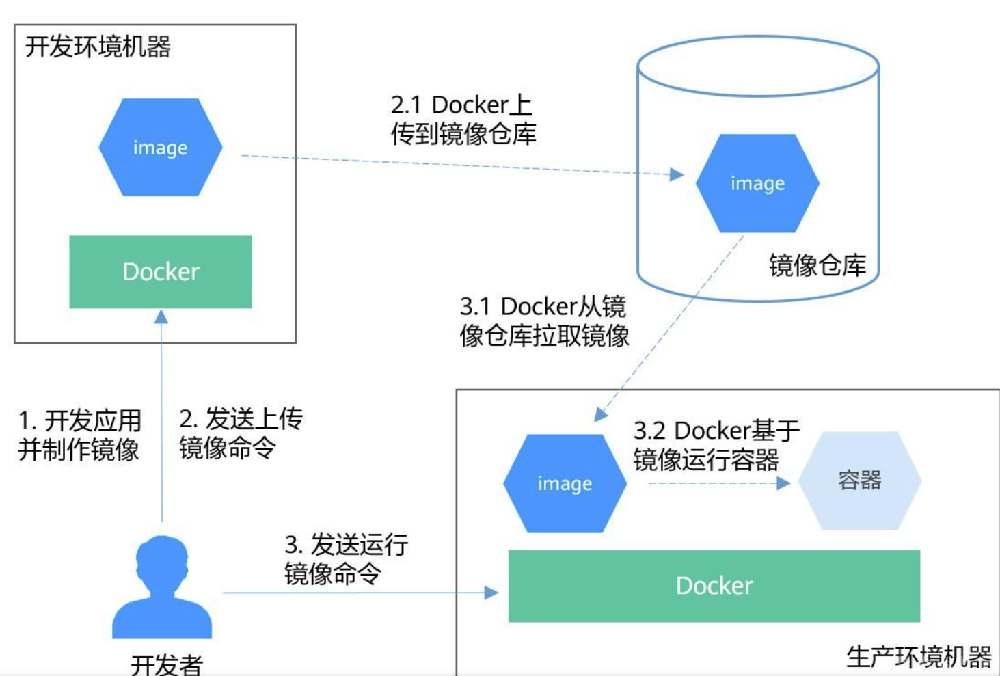
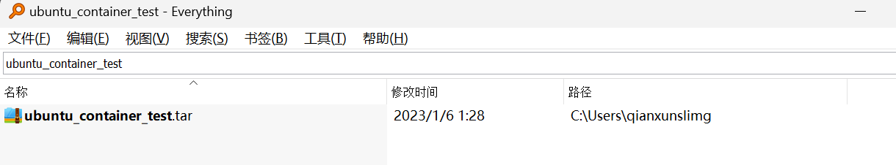
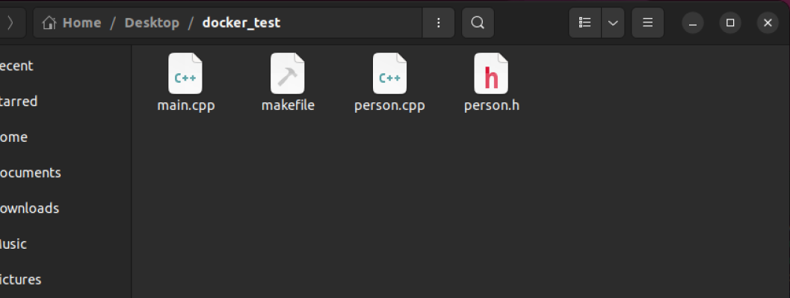
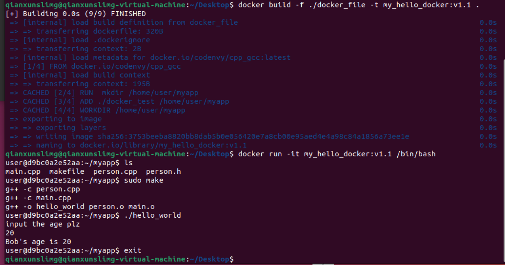

## 1. window安装问题

docker在windows下安装需要开启虚拟化服务，与vmware冲突，通常无法同时使用

1. 使用vmware

   ```sh
   bcdedit /set hypervisorlaunchtype off
   ```

2. 使用docker

   ```sh
   bcdedit /set hypervisorlaunchtype auto
   ```

3. 切换完需要重启

## 2. 镜像和容器关系

### windows中的vmware安装操作系统：

1. 创建虚拟机
2. 选择ios文件（操作系统镜像）
3. 配置虚拟机

### docker操作

1. pull镜像 （类似windows下的下载iso文件）
2. 运行容器 （从镜像新建容器， 相当于操作系统安装运行）



## 3. docker命令

### 拉取镜像：`docker pull ubuntu:18.04`

### 容器操作

#### 运行和终止容器（实则是从镜像创建容器并运行）：`docker run` 

 1. 输出一个 “Hello World”，之后终止容器

    ```sh
    C:\Users\qianxunslimg>docker run ubuntu:18.04 /bin/echo 'Hello world'
    'Hello world'
    ```

	2. 启动一个 bash 终端，允许用户进行交互

    ```sh
    C:\Users\qianxunslimg>docker run -t -i ubuntu:18.04 /bin/bash
    root@7563162c9979:/# ls
    bin  boot  dev  etc  home  lib  lib64  media  mnt  opt  proc  root  run  sbin  srv  sys  tmp  usr  var
    ```

    其中，`-t` 选项让Docker分配一个伪终端（pseudo-tty）并绑定到容器的标准输入上， `-i` 则让容器的标准输入保持打开。

3. 退出容器： 直接`exit`   或者 `Ctrl+d`  多个容器时使用`docker container stop`
4. 终止状态容器查看和启动： 
   1. `docker container ls -a` 终止状态容器查看
   2. 处于终止状态的容器，可以通过 `docker container start` 命令来重新启动

#### 进入容器

在使用 `-d` 参数时，容器启动后会进入后台。

无脑使用exec

1. attach 不好

   ```shell
   C:\Users\qianxunslimg>docker run -dit ubuntu
   adc05673f248b715ab90be0508fc45a86ce5ac44e1b7f492c0a5a70035761075
   
   # -d 或 --detach: 在后台运行容器，即以守护进程方式运行。
   # -i 或 --interactive: 保持标准输入 (stdin) 打开，允许用户与容器进行交互。
   # -t 或 --tty: 分配一个伪终端 (pseudo-TTY)，为容器提供一个终端界面。
   
   C:\Users\qianxunslimg>docker container ls
   CONTAINER ID   IMAGE     COMMAND   CREATED          STATUS          PORTS     NAMES
   adc05673f248   ubuntu    "bash"    12 seconds ago   Up 11 seconds             pedantic_hugle
   
   C:\Users\qianxunslimg>docker attach adc
   root@adc05673f248:/# ls
   bin  boot  dev  etc  home  lib  lib32  lib64  libx32  media  mnt  opt  proc  root  run  sbin  srv  sys  tmp  usr  var
   ```

2. exec 优先使用

   ```sh
   C:\Users\qianxunslimg>docker run -dit ubuntu
   d51137b164abacaa0ea8f151d6b5cad5a1c316b55869bb2ae27c81f50f2f3eac
   
   C:\Users\qianxunslimg>docker container ls
   CONTAINER ID   IMAGE     COMMAND   CREATED         STATUS         PORTS     NAMES
   d51137b164ab   ubuntu    "bash"    5 seconds ago   Up 4 seconds             crazy_mendeleev
   
   C:\Users\qianxunslimg>do       cker exec -i d51 bash  //-i没有命令提示符 难用
   ls
   bin
   boot
   dev
   ...
   
   C:\Users\qianxunslimg>docker exec -it d51 bash  //完整shell界面
   root@d51137b164ab:/# ls
   bin  boot  dev  etc  home  lib  lib32  lib64  libx32  media  mnt  opt  proc  root  run  sbin  srv  sys  tmp  usr  var
   ```

#### 导出和导入

1. 导出 docker export

   ```sh
   C:\Users\qianxunslimg>docker container ls -a
   CONTAINER ID   IMAGE     COMMAND   CREATED         STATUS         PORTS     NAMES
   61e0da2df721   ubuntu    "bash"    5 seconds ago   Up 4 seconds             pensive_fermat
   
   C:\Users\qianxunslimg>docker export 61e > ubuntu_container_test.tar
   ```

   

2. 导入容器快照 docker import

   ```sh
   C:\Users\qianxunslimg>docker import ubuntu_container_test.tar test:ubuntu_v1.0
   sha256:149d18447e370d3e6d15417450c7ad3189c3dfe32c79d16c5aea36927e5ed3ef
   
   C:\Users\qianxunslimg>docker image ls
   REPOSITORY               TAG           IMAGE ID       CREATED          SIZE
   test                     ubuntu_v1.0   149d18447e37   30 seconds ago   77.8MB
   ubuntu                   18.04         e28a50f651f9   2 days ago       63.1MB
   docker/getting-started   latest        3e4394f6b72f   13 days ago      47MB
   ubuntu                   latest        6b7dfa7e8fdb   3 weeks ago      77.8MB
   hello-world              latest        feb5d9fea6a5   15 months ago    13.3kB
   ```

   > 注：用户既可以使用 `docker load` 来导入镜像存储文件到本地镜像库，也可以使用`docker import` 来导入一个容器快照到本地镜像库。这两者的区别在于`容器快照文件将丢弃所有的历史记录和元数据信息`（即仅保存容器当时的快照状态），而`镜像存储文件将保存完整记录，体积也要大`。此外，从容器快照文件导入时可以重新指定标签等元数据信息。

#### 删除

1. 删除特定终止状态的容器 `docker container rm`
2. 删除所有终止容器  `docker container prune`


## 4. 打包程序

[【Docker】从零开始将自己的应用打包到docker镜像 - 腾讯云开发者社区-腾讯云 (tencent.com)](https://cloud.tencent.com/developer/article/1893294)

==（todo: 仿照这个操作步骤，打包一下tinywebserver, 在windows下的docker运行）==

### 小练习

简单c++



docker_file如下

```dockerfile
# 基础镜像
FROM codenvy/cpp_gcc 

# make file in the docker image
RUN  mkdir /home/user/myapp

# 将本地文件复制到容器中
ADD ./docker_test /home/user/myapp

# set workdir
WORKDIR /home/user/myapp

# 编译程序
RUN sudo make

# 运行程序
CMD ["./hello_world"]


###########################逐行解释#############################
# 基础镜像
FROM codenvy/cpp_gcc 
# 这一行表示从codenvy/cpp_gcc这个镜像开始构建，这个镜像是一个包含了C++和GCC的环境，用于编译和运行C++程序。

# make file in the docker image
RUN  mkdir /home/user/myapp
# 这一行表示在容器中运行一个命令，即创建一个/home/user/myapp的目录，用于存放项目文件。

# 将本地文件复制到容器中
ADD ./project /home/user/myapp
# 这一行表示将本地的./project目录下的所有文件和子目录复制到容器中的/home/user/myapp目录下，这样就可以在容器中访问项目文件了。

# set workdir
WORKDIR /home/user/myapp
# 这一行表示设置容器中的工作目录为/home/user/myapp，这样后面的命令都会在这个目录下执行。

# 编译程序
# RUN sudo make
# 这一行表示在容器中运行一个命令，即使用sudo权限执行make命令，用于编译项目中的程序。但是这一行是被注释掉的，所以不会执行。

# 运行程序
CMD ["./hello_world"]
# 这一行表示设置容器启动时要执行的命令，即运行./hello_world这个可执行文件，这是项目中编译出来的程序。
```

镜像运行为容器

```shell
docker build -f ./docker_file -t my_hello_docker:v1.0 .

docker image ls
docker run -it my_hello_docker:v1.0 //正常运行

docker container ls -a  //查看container
docker container export 632 > test.tar  //导出container
docker container prune  //删除所有容器
docker container ls -a
```

重新导入容器测试

```sh
docker image rm my_hello_docker:v1.0 
docker image ls
docker import test.tar my_hello_docker:v1.0

docker run -it my_hello_docker:v1.0 //为啥运行不起来了
docker: Error response from daemon: No command specified.
```

报错原因：

从dockerfile新建容器时是可以缺省参数直接运行程序的，

而导入的镜像 运行需要参数

```sh
docker run -it  my_hello_docker:v1.0 /bin/bash
cd /home/user/myapp
./hello_world   //正常运行
```

### 修改

dockerfile里边不执行make 直接打包  严谨一点




## 5. 挂载到虚拟环境

如果你本地没有安装ROS 2环境，但想运行本地的ROS 2代码，你可以考虑使用Docker容器来创建一个包含ROS 2环境的运行环境。以下是一般步骤：

1. 安装Docker：首先，在你的本地系统上安装Docker。你可以按照Docker官方文档的说明进行安装。

2. 获取ROS 2镜像：从Docker Hub上获取一个包含ROS 2环境的镜像。ROS官方提供了官方的ROS 2镜像，你可以选择适合你需要的版本和发行版。例如，你可以使用以下命令拉取ROS 2 Foxy版本的镜像：

   ```bash
   docker pull ros:foxy
   ```

3. 运行容器：使用`docker run`命令来创建并运行一个容器，并在容器内部执行你的ROS 2代码。以下是一个示例命令：

   ```bash
   docker run -it --rm -v /path/to/your/code:/ros_ws/src/ros_package_name -w /ros_ws ros:foxy bash
   ```

   解释一下上述命令中的参数：

   - `-it`：在交互模式下运行容器。
   - `--rm`：容器退出后自动删除。
   - `-v /path/to/your/code:/ros_ws/src/ros_package_name`：将你的本地ROS 2代码所在的路径挂载到容器内部的ROS工作空间路径。
   - `-w /ros_ws`：设置容器的工作目录为ROS工作空间。

4. 在容器中运行ROS 2代码：容器启动后，你可以在容器内部执行ROS 2相关的命令，例如构建、编译和运行你的ROS 2代码。

   ```bash
   colcon build
   source install/setup.bash
   ros2 run ros_package_name node_name
   ```

   这些命令将在容器内部进行ROS 2代码的构建和运行。

通过这种方式，你可以在没有本地ROS 2环境的情况下，使用Docker容器来运行你的ROS 2代码，并且可以将本地的ROS 2代码目录挂载到容器内部，以便在容器中进行开发和调试。


### 示例

#### 挂载

```bash
qianxunslimg@ubuntu:~/Desktop/suudy/ros_study/node_test$ docker run -it -v /home/qianxunslimg/Desktop/suudy/ros_study/node_test:/ros_ws/src/ros_package_name -w /ros_ws ros:foxy bash
```

这个Docker命令用于创建并运行一个基于`ros:foxy`镜像的Docker容器。让我们逐步解释每个参数的含义：

- `docker run`: 运行一个Docker容器。
- `-it`: 创建一个交互式终端，允许用户与容器进行交互。
- `-v /home/qianxunslimg/Desktop/suudy/ros_study/node_test:/ros_ws/src/ros_package_name`: 这是一个挂载命令，将本地的`/home/qianxunslimg/Desktop/suudy/ros_study/node_test`路径挂载到容器中的`/ros_ws/src/ros_package_name`路径。这样可以将本地的文件或目录与容器内的目录进行共享。
- `-w /ros_ws`: 设置容器的工作目录为`/ros_ws`，即容器启动后默认所在的路径。
- `ros:foxy`: 指定要使用的Docker镜像，这里使用的是名为`ros:foxy`的镜像。该镜像是基于ROS 2 Foxy Fitzroy版本构建的。
- `bash`: 在容器中启动一个bash终端。

通过以上命令，你将在一个交互式的终端中进入到一个基于`ros:foxy`镜像的Docker容器中。同时，将本地的`/home/qianxunslimg/Desktop/suudy/ros_study/node_test`路径挂载到容器内的`/ros_ws/src/ros_package_name`路径，以便在容器中访问和操作本地的文件。

你可以在容器内执行ROS 2相关的命令和操作，并可以通过共享的挂载路径访问和修改本地的文件。

#### 运行

运行是可能当前控制台会打印log 无法执行其他的指令

1. 如果外部由ros环境 可以直接在外部的控制台中 ros2 node list等
2. 如果外部没有 在外部新开控制台，`docker exec -it <container_name> bash`   本示例中就是`docker exec -it 174`


### ros2挂载通信示例

将sub节点挂在到虚拟环境

```bash
docker run -it --rm -v /home/qianxunslimg/Desktop/study/ros_study/ros2_sub:/ros_ws/src/sub_demo -w /ros_ws ros:foxy bash
```

因为默认是docker的网络是桥接模式 所以可以通信

同一局域网ip挂载

docker run -it --rm --net=mynetwork --ip=192.168.31.200 -v /home/qianxunslimg/Desktop/study/ros_study/ros2_sub:/ros_ws/src/sub_demo -w /ros_ws ros:foxy bash

### 挂载和启动图像界面

> 前提：xhost +local:docker
>
> ```bash
> docker run -it --rm \
> -e DISPLAY=$DISPLAY \
> -v /tmp/.X11-unix:/tmp/.X11-unix \
> -v $(pwd):/row_ws/src \
> --privileged \
> -w /row_ws \
> qianxunslimg/my_rolling:v1.1 \
> bash
> ```

但是若是想启动图像化的rqt和rviz2 还需要其他操作

例如对于这个项目：[qianxunslimg/ros2_kitti_publishers: Sample ROS2 publisher application that transforms and publishes the Kitti dataset into the ROS2 messages. (github.com)](https://github.com/qianxunslimg/ros2_kitti_publishers)

通过rviz2和rqt显示点云和相机数据，需要图像化界面的支持，此时需要如下的挂载命令

```bash
docker run -it --rm \
-e DISPLAY=$DISPLAY \
-v /tmp/.X11-unix:/tmp/.X11-unix \
-v $(pwd):/row_ws/src \
--privileged \
-w /row_ws \
osrf/ros:foxy-desktop \
bash
```

> 官方容器缺少环境 制作自己的镜像
>
> 1. 启动容器： docker run -it --rm osrf/ros:rolling-desktop bash
>
> 2. 安装所需的环境：
>
>    ```bash
>    sudo apt update
>    sudo apt install ros-rolling-hardware-interface ros-rolling-xacro ros-rolling-ros2-controllers-test-nodes ros-rolling-joint-state-broadcaster ros-rolling-diff-drive-controller ros-rolling-ros2controlcli ros-rolling-controller-manager ros-rolling-forward-command-controller ros-rolling-joint-trajectory-controller ros-rolling-transmission-interface
>    ```
>
> 3. 新终端`docker commit <container_id> <image_name>:<tag>`
>
>    ```bash
>    docker commit 15f my_rolling:v1.0
>    ```
>
> 4. 新镜像挂载
>
>    ```bash
>    docker run -it --rm \
>    -e DISPLAY=$DISPLAY \
>    -v /tmp/.X11-unix:/tmp/.X11-unix \
>    -v $(pwd):/row_ws/src \
>    --privileged \
>    -w /row_ws \
>    qianxunslimg/my_rolling:v1.0 \
>    bash
>    ```

当运行Docker容器时，我们需要设置一些参数和挂载一些目录，以便实现图形界面的显示和文件系统的共享。下面是每个参数的解释：

- `-it`：以交互模式运行容器，可以与容器进行交互。

- `--rm`：在容器退出后自动删除容器，避免容器占用过多的磁盘空间。

- `-e DISPLAY=$DISPLAY`：设置环境变量`DISPLAY`，指定容器中的应用程序将使用的X服务器。

- `-v /tmp/.X11-unix:/tmp/.X11-unix`：将主机的X服务器套接字目录`/tmp/.X11-unix` 挂载到容器的相同目录，以便容器可以访问X服务器。

  > X服务器是一个软件，也称为X11或X Window System，`用于提供图形用户界面 (GUI) 的基本框架`。它允许应用程序在计算机上绘制图形和显示图像。
  >
  > rqt和rviz2是ROS（机器人操作系统）中的两个常用工具，用于开发和调试ROS应用程序。它们都是基于Qt库构建的`图形界面`工具。
  >
  > 在使用rqt和rviz2时，它们需要与X服务器进行通信以显示图形界面。通过与X服务器交互，这些工具可以创建窗口、渲染图形元素和接收用户交互。
  >
  > 因此，为了在Docker容器中运行rqt和rviz2，并显示图形界面，需要将主机上的X服务器的套接字目录挂载到容器中，以便容器内的应用程序可以与主机的X服务器进行通信并显示图形界面。这样，rqt和rviz2就能够利用X服务器来创建窗口和显示图形界面。

- `-v $(pwd):/row_ws`：将当前工作目录（主机）挂载到容器中的`/row_ws` 目录，以便容器可以访问主机的文件系统。

  >挂载当前目录的写法 很不错 比写一大串的绝对路径强多了

- `-w /row_ws`：将容器的工作目录设置为`/row_ws`，这是挂载的主机目录在容器内的路径。

- `--privileged`：赋予容器特权，以便容器可以执行某些需要特权的操作，例如访问主机的硬件资源。

  >`--privileged`选项在Docker中赋予容器特权访问主机的设备和功能。它允许容器在主机级别执行一些操作，如加载内核模块、访问设备节点等。使用`--privileged`选项可以解决一些与权限相关的问题，例如访问硬件设备或执行某些特权操作。

最后一行是指定要运行的Docker镜像和命令。在这个例子中，我们使用了OSRF提供的ROS Foxy桌面镜像`osrf/ros:foxy-desktop`，并且我们指定容器的入口点命令为`bash`，这将在容器中启动一个交互式bash终端。

通过使用这些参数和挂载，我们能够在容器中运行图形界面应用程序，并且可以与主机文件系统进行交互。请注意，这种配置仅适用于在主机上运行X服务器的情况下。如果使用的是Windows操作系统，可能需要配置额外的X服务器软件，如Xming或VcXsrv，并相应地调整参数和挂载。

> ==就算外部环境没有rqt和rviz2 也能显示图形化界面==

## 6. docker-vscode

### 优势

vscode的docker插件很强大, 可以直接在vscode中修改文件 然后同步到容器

相当于图像化了

### 遇到的问题

1. colcon build生成不能覆盖，需要 rm -r build/ install/ log/
2. attach到vscode ros2未在环境变量 需要source /opt/ros/foxy/setup.sh  而一般情况下是不需要的 只需要build之后source

### 挂载

挂载没发现什么快捷的方式 看样子还是需要命令行挂载 但是挂载完之后就可以在vscode中修改了 不是只读的话 直接修改原磁盘文件就好
