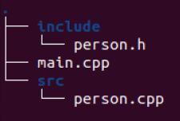

对如下简单代码进行测试

目录结构如下



main.cpp

```c++
#include <iostream>
#include "person.h"

int main(int argc, char **argv)
{
    Person person;
    int a = 10;  //编译选项开启Wall时 会有警告
    int age = 0;
    std::cout << "input the age plz" << std::endl;
    std::cin >> age;
    person.setAge(age);
    person.showInfo();
    return 0;
}
```

person.h

```c++
#pragma once

#include <iostream>
#include <string>

class Person {
public:
    Person();
    void showInfo();
    void setAge(int a);

private:
    int _age;
};
```

person.cpp

```c++
#include "person.h"

Person::Person(){
    _age = 18;
}

void Person::setAge(int a){
    _age = a;
}

void Person::showInfo(){
    std::cout << "Bob's age is "  << _age<< std::endl;
}
```

### make

#### makefile写法

```makefile
# 定义编译器和编译选项
CXX = g++
CXXFLAGS = -Wall -g -Iinclude

# 定义目标文件和依赖文件
TARGET = make.out
OBJS = main.o src/person.o
DEPS = include/person.h

# 定义生成目标文件的规则
$(TARGET): $(OBJS)
	$(CXX) $(CXXFLAGS) -o $@ $^

# 定义生成.o文件的规则
%.o: %.cpp $(DEPS)
	$(CXX) $(CXXFLAGS) -c -o $@ $<

# 定义清理文件的规则
.PHONY: clean
clean:
	rm -f $(TARGET) $(OBJS)
```

#### 逐行解释

1. `CXX = g++`：表示使用g++作为C++编译器，并把它赋值给一个变量CXX，方便后面使用
2. `CXXFLAGS = -Wall -g -Iinclude`：变量，用来指定C++编译器的编译选项。其中：
   - -Wall 表示开启所有的警告信息
   - -g 表示生成调试信息
   - -Iinclude 表示在预处理时添加include目录到搜索路径
   - 常用的还有 `-O2` 开启一些常用的优化，例如循环展开、常量传播、函数内联等，可以提高程序的运行速度，但也会增加编译时间和目标文件的大小。
3. `TARGET = make.out` ：表示定义一个变量TARGET，用来存储最终要生成的可执行文件的名字，这里是make.out
4. `OBJS = main.o src/person.o` ：表示定义一个变量OBJS，用来存储要生成的目标文件（.o文件）的名字，这里是main.o和src/person.o
5. `DEPS = include/person.h` ：表示定义一个变量DEPS，用来存储要生成目标文件所依赖的头文件的名字，这里是include/person.h
6. `$(TARGET): $(OBJS)` # 这一行表示要生成TARGET（即make.out）这个可执行文件，需要先生成OBJS（即main.o和src/person.o）这两个目标文件
   - `$(CXX) $(CXXFLAGS) -o $@ $^`  ： 这一行表示用CXX（即g++）这个编译器，用CXXFLAGS（即-Wall -g -Iinclude）这些编译选项，把`$^`（即所有的依赖文件，也就是main.o和src/person.o）链接起来，生成`$@`（即目标文件，也就是make.out）
7. `%.o: %.cpp $(DEPS)` ：表示要生成任意一个.o文件（如main.o或src/person.o），需要先有对应的.cpp文件（如main.cpp或src/person.cpp），以及DEPS（即include/person.h）这个头文件
   - `$(CXX) $(CXXFLAGS) -c -o $@ $<` ：表示用CXX（即g++）这个编译器，用CXXFLAGS（即-Wall -g -Iinclude）这些编译选项，对``$<`（即第一个依赖文件，也就是对应的.cpp文件）进行编译（-c选项），生成`$@`（即目标文件，也就是对应的.o文件）
8. `.PHONY: clean` :表示声明一个伪目标clean，也就是说clean不是一个真正的文件，而是一个命令
9. `clean:` ：表示定义clean这个伪目标的规则
   - `rm -f $(TARGET) $(OBJS)` ：表示执行rm -f命令，删除TARGET（即make.out）和OBJS（即main.o和src/person.o）这些文件

#### 执行

直接makefile目录下 执行命令`make`

### cmake

#### cmake写法

```cmake
cmake_minimum_required(VERSION 3.0)

project(HELLO)

set(CMAKE_CXX_FLAGS "${CMAKE_CXX_FLAGS} -g -O2 -Wall") #compile options couldnt break at bearkpoint if without -g

include_directories(include)

add_executable(cmake.out main.cpp src/person.cpp)

```

#### 逐行解释

1. `cmake_minimum_required(VERSION 3.0)` ：表示要求CMake的最低版本是3.0，如果当前的CMake版本低于这个要求，会报错

2. `project(HELLO)` ：表示定义一个工程的名字，这里是HELLO，这个名字会用在一些变量中，例如PROJECT_SOURCE_DIR表示工程的源码目录

3. `set(CMAKE_CXX_FLAGS "${CMAKE_CXX_FLAGS} -g -O2 -Wall")` ：表示设置一个变量CMAKE_CXX_FLAGS，用来存储C++编译器的编译选项，这里是在原有的选项基础上`添加`了-g -O2 -Wall，其中-g表示生成调试信息，-O2表示开启一般优化，-Wall表示开启所有警告

4. `include_directories(include)` ：表示添加一个目录到编译器的头文件搜索路径中，这里是include目录，这样在编译时就可以找到include目录下的头文件

5. `add_executable(cmake.out main.cpp src/person.cpp)` ：表示添加一个可执行文件的目标，需要指定可执行文件的名字和所依赖的源文件，这里是生成一个名为cmake.out的可执行文件，依赖于main.cpp和src/person.cpp两个源文件


#### 执行

cmake的本质是生成makefile 然后使用make命令编译，会产生较多的中间文件，因此 一般采用外部编译的方式 执行过程如下

```sh
mkdir build 
cd build
cmake ..  #当前目录的话是cmake .由于此时CMakeLists位于上层目录，因此..
make
```

### vscode_project

搭配cmake使用，主要是配置两个json文件

#### 写法与逐行解释

launch.json

```json
{
    "version": "0.2.0", // 文件的版本号，用来标识文件的格式
    "configurations": [ // 表示这个文件包含一个或多个调试配置，每个配置是一个对象，用花括号括起来
        {
            "name": "g++ make and debug", // 表示这个调试配置的名字，会在VS Code的调试菜单中显示，方便用户选择
            "preLaunchTask": "Build", // 表示在启动调试之前要执行的任务名，这个名字要跟tasks.json中的任务名字大小写一致
            "type": "cppdbg", // 表示这个调试配置的类型，用来指定使用哪种调试器，这里是cppdbg，表示使用C/C++扩展提供的调试器
            "request": "launch", // 表示这个调试配置的请求类型，有两种选择：launch和attach，launch表示启动一个新的程序进行调试，attach表示附加到一个已经运行的程序进行调试，这里是launch
            "program": "${workspaceFolder}/build/vscode_project.out", // 表示要调试的程序的路径，可以使用一些变量来代替绝对路径，这里是${workspaceFolder}/build/vscode_project.out，表示工作空间目录下的build子目录中的vscode_project.out文件
            "args": [], // 表示要传递给程序的参数列表，用数组形式表示，每个参数是一个字符串，这里是空数组，表示没有参数
            "stopAtEntry": false, // 表示是否在程序入口处停止调试器，如果为true，则会在main函数开始处暂停执行，如果为false，则会直接运行程序，这里是false
            "cwd": "${workspaceFolder}", // 表示程序运行时的当前工作目录，也可以使用变量来代替绝对路径，这里是${workspaceFolder}，表示工作空间目录
            "environment": [], // 表示程序运行时的环境变量列表，用数组形式表示，每个环境变量是一个对象，包含name和value两个属性，这里是空数组，表示没有额外的环境变量
            "externalConsole": false, // 表示是否使用外部控制台来显示程序的输入和输出，如果为true，则会打开一个新的控制台窗口来运行程序，如果为false，则会在VS Code内置的终端中运行程序
            "MIMode": "gdb", // 表示要使用哪种MI（机器接口）模式来与调试器通信，有三种选择：gdb、lldb和clrdbg
            "miDebuggerPath": "/usr/bin/gdb", // 表示MI调试器（如gdb）的路径，可以使用绝对路径或相对路径（相对于cwd）
            "setupCommands": [ // 表示要在启动调试器之后执行的命令列表，用数组形式表示，每个命令是一个对象
                {
                    "description": "Enable pretty-printing for gdb", // 表示命令的描述信息，用来帮助用户理解命令的作用
                    "text": "-enable-pretty-printing",//表示命令的文本内容，就是要发送给调试器的字符串
                    "ignoreFailures": true // 表示是否忽略命令执行失败的情况，如果为true，则即使命令执行失败，也不会影响调试器的启动，如果为false，则会报错并终止调试器的启动
                }
            ]
        }
    ]
}
```

tasks.json

```json
{
	"version": "2.0.0", // 表示这个文件的版本号，用来标识文件的格式
	"options": { // 表示这个文件中所有任务的默认选项，可以用一个对象来表示
		"cwd": "${workspaceFolder}/build" // 表示所有任务的默认工作目录，也就是执行命令时的当前目录，这里是工作空间目录下的build子目录
	},
	"tasks": [ // 表示这个文件包含一个或多个任务，每个任务是一个对象，用花括号括起来
		{
			"type": "shell", // 表示这个任务的类型，有两种选择：shell和process，shell表示在一个shell中执行命令，process表示直接执行一个可执行文件，这里是shell
			"label": "cmake", // 表示这个任务的标签，用来在VS Code中唯一标识这个任务，方便用户选择
			"command": "cmake", // 表示这个任务要执行的命令，可以是一个可执行文件的名字或路径，也可以是一个shell命令
			"args": [ // 表示要传递给命令的参数列表，用数组形式表示，每个参数是一个字符串
				".."
			]
		},
		{
			"label": "make",
			"group": { // 表示这个任务所属的组，用一个对象来表示
				"kind": "build", // 表示组的类型，有两种选择：build和test，build表示这个任务是用来构建项目的，test表示这个任务是用来测试项目的，这里是build
				"isDefault": true // 表示是否把这个任务设为默认任务，如果为true，则当用户执行Run Build Task命令时，会自动执行这个任务，如果为false，则会让用户选择要执行哪个任务，这里是true
			},
			"command": "make",
			"args": []
		},
		{
			"label": "Build",
			"dependsOrder": "sequence", // 表示当这个任务有依赖其他任务时，依赖任务的执行顺序，有两种选择：sequence和parallel，sequence表示按列出的顺序依次执行依赖任务，parallel表示同时执行所有依赖任务，这里是sequence
			"dependsOn": [ // 表示这个任务依赖于哪些其他任务，在执行这个任务之前要先执行它们，用数组形式表示，每个元素是一个依赖任务的标签名字
				"cmake",
				"make"
			]
		}
	]
}
```

#### 执行

直接vscode调试界面，选择要调试的配置 点击调试


#### 更简单的

安装cmake插件 直接使用cmake编译工程 比vscode的工程组织和编译方式好用多了


#### clang_format

virtual studio中有个很好用的clang_format插件

在vscode中也可以使用clang_format进行代码的格式化，默认的代码格式和google差异有点大

配置：增加一个.clang-format文件，简单的内容如下：

```cpp
---
Language:        Cpp
BasedOnStyle:  Google
...
```
