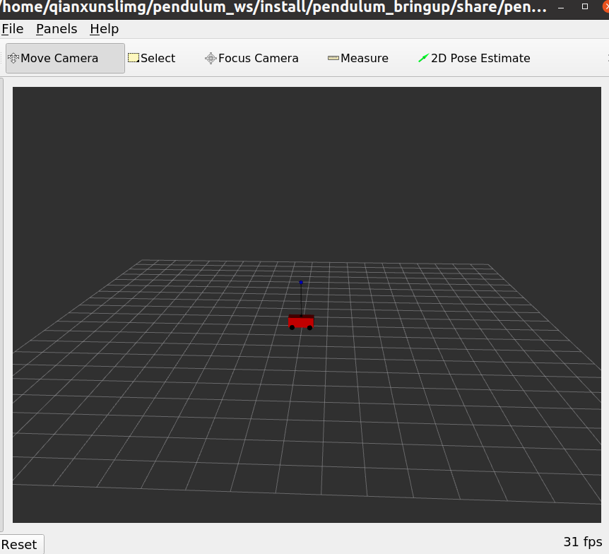
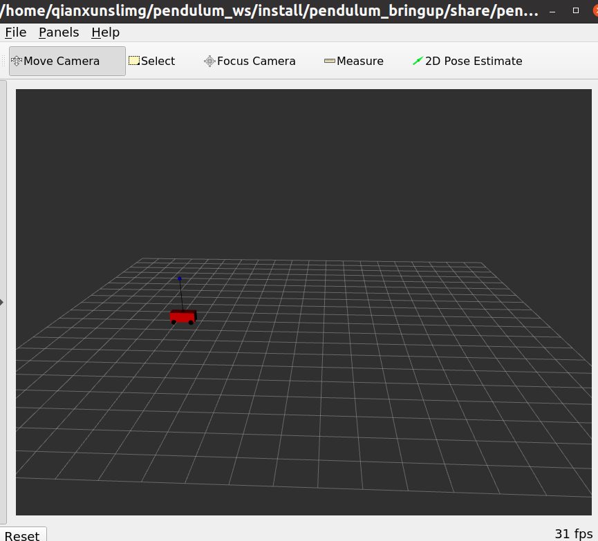

# pendulum

# 1. 项目配置及操作

## 项目地址

 [ros2-realtime-demo/pendulum at foxy (github.com)](https://github.com/ros2-realtime-demo/pendulum/tree/foxy)

## 项目install

[pendulum/installation.md at foxy · ros2-realtime-demo/pendulum · GitHub](https://github.com/ros2-realtime-demo/pendulum/blob/foxy/docs/installation.md)

```bash
cd adehome
ade --rc pendulum_ws/src/pendulum/ade/.aderc start --update --enter
ade$ source /opt/ros/foxy/setup.bash
ade$ cd pendulum_ws
ade$ colcon build
```

## 项目tutorial

 [pendulum/tutorial.md at foxy · ros2-realtime-demo/pendulum · GitHub](https://github.com/ros2-realtime-demo/pendulum/blob/foxy/docs/tutorial.md)

### Launch

The best way to run the pendulum demo is using ros2 launch. To check all the available launch options use the following command:

```bash
$ ros2 launch -s pendulum_bringup pendulum_bringup.launch.py 
Arguments (pass arguments as '<name>:=<value>'):

    'autostart':
        Automatically start lifecycle nodes
        (default: 'True')

    'priority':
        Set process priority
        (default: '0')

    'cpu-affinity':
        Set process CPU affinity
        (default: '0')

    'lock-memory':
        Lock the process memory
        (default: 'False')

    'lock-memory-size':
        Set lock memory size in MB
        (default: '0')

    'config-child-threads':
        Configure process child threads (typically DDS threads)
        (default: 'False')

    'rviz':
        Launch RVIZ2 in addition to other nodes
        (default: 'False')
```


Another way to run the demo is to use `ros2 run`. To see all the options use `-h`:

```bash
$ ros2 run pendulum_demo pendulum_demo -h
[INFO] [1600508474.177191293] [process_settings]: 	[--autostart auto start nodes]
	[--lock-memory lock memory]
	[--lock-memory-size lock a fixed memory size in MB]
	[--priority set process real-time priority]
	[--cpu-affinity set process cpu affinity]
	[--config-child-threads configure process settings in child threads]
	[-h]
```


The demo requires to pass the ros2 parameters. This can be done by using `--ros-args`:

```bash
$ ros2 run pendulum_demo pendulum_demo --autostart True --ros-args --params-file src/pendulum/pendulum_bringup/params/pendulum.param.yaml
```


Note, the demo doesn't not include for the moment any log message, see the following sections to check how to introspect the running demo.

### Modify the parameters

src/pendulum/pendulum_bringup/params/pendulum.param.yaml

```bash
pendulum_controller:
  ros__parameters:
    state_topic_name: "joint_states"
    command_topic_name: "joint_command"
    teleop_topic_name: "teleop"
    command_publish_period_us: 10000
    enable_topic_stats: False
    topic_stats_topic_name: "controller_stats"
    topic_stats_publish_period_ms: 1000
    deadline_duration_ms: 0
    controller:
      feedback_matrix: [-10.0000, -51.5393, 356.8637, 154.4146]

pendulum_driver:
  ros__parameters:
    state_topic_name: "joint_states"
    command_topic_name: "joint_command"
    disturbance_topic_name: "disturbance"
    cart_base_joint_name: "cart_base_joint"
    pole_joint_name: "pole_joint"
    state_publish_period_us: 10000
    enable_topic_stats: False
    topic_stats_topic_name: "driver_stats"
    topic_stats_publish_period_ms: 1000
    deadline_duration_ms: 0
    driver:
      pendulum_mass: 1.0
      cart_mass: 5.0
      pendulum_length: 2.0
      damping_coefficient: 20.0
      gravity: -9.8
      max_cart_force: 1000.0
      noise_level: 1.0
```

### Use ros2 command line interface tools (ros2cli)

The easiest way to instrospect the demo is by using the [ros2 command line interface tools](https://docs.ros.org/en/foxy/Concepts/About-Command-Line-Tools.html).

In terminal 1:

```bash
$ ros2 launch pendulum_bringup pendulum_bringup.launch.py
```

In terminal 2, check all the available topic:

```bash
$ ros2 topic list
/disturbance
/joint_command
/parameter_events
/pendulum_controller/transition_event
/pendulum_driver/transition_event
/pendulum_joint_states
/rosout
/teleop
```


In terminal 2, echo the pendulum joint states topic:

```bash
$ ros2 topic echo /pendulum_joint_states  
pole_angle: 3.136657553013568
pole_velocity: 0.0016956357748015758
cart_position: -0.10783921258312011
cart_velocity: -0.039079854353889186
cart_force: -1.6641213259403278
---
pole_angle: 3.1366850786187856
pole_velocity: 0.004907555002614707
cart_position: -0.10823849698219573
cart_velocity: -0.04076566297982292
cart_force: -1.593213131740399
---
pole_angle: 3.1367604642211493
pole_velocity: 0.008691379589434549
cart_position: -0.10866019061041654
cart_velocity: -0.04355419993947564
cart_force: -2.189881484363576
---
pole_angle: 3.1368436514592037
pole_velocity: 0.005850399768549463
cart_position: -0.10911670139934684
cart_velocity: -0.04772009714681185
cart_force: -2.948997808600583
...
```


The cart position should be close to 0.0 and the pole angle should be close to PI, that is, the pole up position.

### Visualize the pendulum in rviz

```bash
ros2 launch pendulum_bringup pendulum_bringup.launch.py rviz:=True
```



### Move the pendulum

The pendulum can be controller by using the topic `/teleop`.

```bash
# PendulumTeleop.msg
# This represents the desired state of the pendulum for teleoperation
float64 pole_angle
float64 pole_velocity
float64 cart_position
float64 cart_velocity
```


By sending a teleoperation message it is possible to control the cart position. For the moment only the cart commands are accepted. For example, using `ros2 pub` to move the cart to a position 5.0, we would send a command as follows:

```bash
ros2 topic pub -1 /teleop pendulum2_msgs/msg/PendulumTeleop "cart_position: 5.0"
```



### Display time series plots using PlotJuggler

Another way to instrospect the inverted pendulum status is using [PlotJuggler](https://github.com/facontidavide/PlotJuggler). This assumes that PlotJuggler is installed and the demo is already running.

### Use lifecycle node functionality

The controller and the drivers nodes are [managed lifecycle nodes](http://design.ros2.org/articles/node_lifecycle.html). That means that it is possible to control the state of the nodes by using the ros2 lifecycle functionalities. In the demo, the option `autostart` was added to simplify things and automatically transit the nodes to the active state if this option is enabled.

Let's see an example of how manually transitioning the nodes to the active state.

Check the node names:

```bash
$ ros2 node list
  /pendulum_controller
  /pendulum_driver
```


Use `ros2 lifecycle` to get and change the node states:

```bash
$ ros2 lifecycle get /pendulum_controller
unconfigured [1]
$ ros2 lifecycle set /pendulum_controller configure
Transitioning successful
$ ros2 lifecycle set /pendulum_driver configure
Transitioning successful
$ ros2 lifecycle set /pendulum_controller activate
Transitioning successful
$ ros2 lifecycle set /pendulum_driver configure
Transitioning successful
```

# 2. 新知识点

## ADE

ADE是一个工具，用来`创建和管理开发环境`，它`基于docker`，但是提供了一些额外的功能，比如：

- 允许你把一个基础镜像和一些附加的卷组合起来，比如IDE或者第三方库等。
- 自动把你的主机上的一个目录挂载到容器中的用户主目录，比如你的源码目录，这样你可以在容器中修改代码而不影响主机上的文件。
- 方便你切换不同版本的镜像和卷，比如不同的开发工具或者软件库的版本等。
- 提供了一些命令行接口和图形界面，让你可以方便地启动、停止、进入、退出容器等。

ADE可以用来开发任何类型的应用程序，`不仅仅是ROS`。它可以让你在一个隔离和一致的环境中开发和测试你的应用程序，而不需要在你的主机系统上安装或者配置各种依赖或者设置。ADE也可以让你在不同的平台上使用相同的开发环境，比如Windows、Linux或者MacOS等。ADE还可以让你和其他开发者共享相同的开发环境，方便协作和交流。

### 用到的ADE命令

```bash
ade --rc pendulum_ws/src/pendulum/ade/.aderc start --update --enter
```

- ade是一个工具，可用来创建和管理ROS2的开发环境，它可以让你在一个容器中运行ROS2，而不影响你的主机系统。
- –rc pendulum_ws/src/pendulum/ade/.aderc是一个选项，用来`指定一个配置文件`，里面包含了一些环境变量和设置，比如ROS2的版本、源码的位置、依赖的包等。
- start --update --enter是一个子命令，用来启动一个容器，更新容器的内容，然后进入容器的交互模式。
- 这个命令的目的是让你在一个预配置好的ROS2环境中运行pendulum这个项目，它是一个演示ROS2实时性能的项目。

### 我是不是可以这样理解，用docker中的`虚拟的镜像`来跑我`本地的ros程序`

差不多是这样的。你可以把你的ros程序放在你本地的一个目录中，比如~/ros_ws，然后用docker或者ade来创建一个容器，把这个目录挂载到容器中的一个位置，比如/home/user/ros_ws。这样你就可以`在容器中编译、运行、调试你的ros程序`，而不影响你本地的其他文件。你也可以在容器中安装或者使用其他的ros包或者工具，比如rviz或者rqt等。这样你就可以在一个隔离和一致的环境中开发和测试你的ros程序。

### ADE和docker的区别

ade和docker的区别是：

- ade是一个工具，用来创建和管理ROS2的开发环境，它基于docker，但是提供了一些额外的功能，比如：
  - 允许你把一个基础镜像和一些附加的卷组合起来，比如IDE或者第三方库等。
  - 自动把你的主机上的一个目录挂载到容器中的用户主目录，比如你的源码目录，这样你可以在容器中修改代码而不影响主机上的文件。
  - 方便你切换不同版本的镜像和卷，比如ROS2的发行版或者软件库的版本等。
- docker是一个平台，用来创建和运行容器，它可以让你把应用程序和它们所需的环境打包成一个镜像，然后在任何地方运行这个镜像，而不依赖于主机系统。
  - docker可以让你创建、启动、停止、删除容器，以及管理容器之间的网络和存储等。
  - docker可以让你从一个Dockerfile构建一个镜像，或者从一个仓库下载一个镜像，或者把一个镜像上传到一个仓库等。
  - docker可以让你在容器中运行任何类型的应用程序，不仅仅是ROS2。

总之，ade使用了docker作为底层技术，但是提供了一些更方便和灵活的功能。docker是一个通用的容器平台，它可以让你在隔离的环境中运行任何应用程序。如果你只想用docker来运行ROS2，你也可以这样做，但是你可能需要自己配置一些环境变量和设置等。如果你想用ade来运行ROS2，你可以享受一些预配置好的环境和选项等。

## ROS2

### source install/setup.sh 和source install/setup.bash分别是什么作用

1. source install/setup.sh和source install/setup.bash的作用是激活你的工作空间，让你的终端能够识别你的ROS2包和消息类型。
2. 它们的区别是，setup.sh是适用于任何shell的通用脚本，而setup.bash是专门针对bash shell的脚本。一般来说，如果你使用的是bash shell，你可以用source install/setup.bash来激活你的工作空间，如果你使用的是其他的shell，比如zsh或fish，你可以用source install/setup.sh来激活你的工作空间。你也可以根据你的shell类型选择对应的setup.*sh文件，比如source install/setup.zsh或source install/setup.fish。你可以用echo $SHELL命令来查看你当前使用的是哪种shell。你每次打开一个新的终端时，都需要执行一次source命令来激活你的工作空间，或者你可以把这个命令添加到你的shell启动脚本中，比如.bashrc或.zshrc等。

> 如果在控制台不激活的话, ros2 topic echo /pendulum_joint_states 会报错 找不到自定义的消息类型pendulum2_msgs

### lifecircle

[Managed nodes (ros2.org)](https://design.ros2.org/articles/node_lifecycle.html)

ros2 lifecycle是一种`让节点具有管理生命周期的机制`，它可以让节点在不同的状态之间进行切换，从而实现对ROS系统的更好控制。ros2 lifecycle有以下特点：

> - 节点有四种基本状态（Primary States）：Unconfigured，Inactive，Active和Finalized。每种状态代表了节点的不同功能和行为。
> - 节点有六种切换状态（Transition States）：Configuring，CleaningUp，ShuttingDown，Activating，Deactivating和ErrorProcessing。每种状态代表了节点从一个基本状态到另一个基本状态的过程。
> - 节点有七种可被外部监督进程触发的转换（Transitions）：create，configure，cleanup，activate，deactivate，shutdown和destroy。每种转换会导致节点进入相应的切换状态，并执行相应的逻辑。
> - 节点在Active状态下可以正常执行其功能，如读取和处理数据，响应服务请求等。在Inactive状态下，节点不会执行任何功能，但可以被重新配置。在Unconfigured状态下，节点没有任何存储的状态。在Finalized状态下，节点已经被销毁。
> - 节点在切换状态下会通过生命周期管理接口向生命周期管理软件通报其转换的成功或失败。如果转换成功，节点会进入目标基本状态。如果转换失败或发生错误，节点会进入ErrorProcessing状态，并尝试恢复到之前的基本状态。

- 基本状态（Primary States）：节点在这些状态下具有不同的功能和行为。
  - Unconfigured：节点在被实例化后或发生错误后恢复到的状态。在这个状态下，节点没有任何存储的状态。
  - Inactive：节点在这个状态下不执行任何功能，但可以被重新配置。在这个状态下，节点不会读取或处理任何数据，也不会响应任何服务请求。
  - Active：节点在这个状态下可以正常执行其功能，如读取和处理数据，响应服务请求等。在这个状态下，节点可能会触发错误，并进入ErrorProcessing状态。
  - Finalized：节点在被销毁后进入的状态。在这个状态下，节点已经释放了所有资源，并不能再进行任何转换。
- 切换状态（Transition States）：节点在从一个基本状态到另一个基本状态的过程中经过的中间状态。在这些状态下，节点会执行相应的逻辑，并向生命周期管理软件通报其转换的成功或失败。
  - Configuring：节点从Unconfigured状态转换到Inactive状态时经过的切换状态。在这个状态下，节点会进行初始化和配置的操作。
  - CleaningUp：节点从Active或Inactive状态转换到Unconfigured状态时经过的切换状态。在这个状态下，节点会进行清理和释放资源的操作。
  - ShuttingDown：节点从Active或Inactive或Unconfigured状态转换到Finalized状态时经过的切换状态。在这个状态下，节点会进行关闭和销毁的操作。
  - Activating：节点从Inactive状态转换到Active状态时经过的切换状态。在这个状态下，节点会进行激活和启动功能的操作。
  - Deactivating：节点从Active状态转换到Inactive状态时经过的切换状态。在这个状态下，节点会进行停止功能和休眠的操作。
  - ErrorProcessing：节点从Active或任何切换状态触发错误后进入的切换状态。在这个状态下，节点会进行错误处理和恢复的操作。


### 静态单线程执行器

```cpp
    // 创建一个静态单线程执行器对象
    rclcpp::executors::StaticSingleThreadedExecutor exec;
    // 调用add_node方法，将节点添加到执行器中
    exec.add_node(controller_node_ptr->get_node_base_interface());
    // 调用spin方法，让执行器开始运行节点
    exec.spin();
```

什么是静态单线程执行器对象  除了这个还有其他别的类型吗 如何理解

rclcpp::executors::StaticSingleThreadedExecutor是一个静态单线程执行器类，它继承自rclcpp::Executor类，是一种`ROS 2执行器的实现`。执行器是用于管理和运行节点的对象，它可以`添加、移除、激活、停止`节点，并根据节点的回调函数和事件来调度节点的执行。

- 静态单线程执行器对象是指使用rclcpp::executors::StaticSingleThreadedExecutor类创建的对象，它<u>在一个单独的线程中运行所有添加到它的节点</u>。它与rclcpp::Executor类的区别在于，它<u>在添加节点时就会分配好内存和资源，而不是在运行时动态分配。这样可以提高执行器的性能和实时性，但也限制了执行器的灵活性和可扩展性。</u>
- 除了静态单线程执行器对象，还有其他类型的执行器对象，如rclcpp::executors::SingleThreadedExecutor对象和rclcpp::executors::MultiThreadedExecutor对象。它们都继承自rclcpp::Executor类，但有不同的实现方式和特点。
  - `rclcpp::executors::SingleThreadedExecutor`对象是一种单线程执行器对象，它<u>在一个单独的线程中运行所有添加到它的节点</u>。它与静态单线程执行器对象的区别在于，它<u>在运行时动态分配内存和资源</u>，而不是在添加节点时就分配好。这样可以提高执行器的灵活性和可扩展性，但也降低了执行器的性能和实时性。
  - `rclcpp::executors::MultiThreadedExecutor`对象是一种多线程执行器对象，它<u>在多个线程中并行运行所有添加到它的节点</u>。它与单线程执行器对象的区别在于，它可以利用多核处理器的优势，提高执行器的并发性和吞吐量，但也增加了执行器的复杂性和同步开销。
- 要理解静态单线程执行器对象，可以参考以下几点：
  - 静态单线程执行器对象需要在添加节点之前调用`rclcpp::init`方法，初始化ROS客户端库。
  - 静态单线程执行器对象需要调用`add_node`方法，将节点添加到执行器中。这个方法会为每个节点分配内存和资源，并将节点注册到ROS系统中。
  - 静态单线程执行器对象需要调用`spin`方法，让执行器开始运行节点。这个方法会创建一个单独的线程，并在该线程中循环地检查节点的事件和回调函数，并按照一定的策略来调度节点的执行。
  - 静态单线程执行器对象可以调用`remove_node`方法，将节点从执行器中移除。这个方法会<u>释放节点占用的内存和资源，并将节点从ROS系统中注销</u>。
  - 静态单线程执行器对象可以调用其他方法，如spin_some, spin_all, spin_until_future_complete等，来控制执行器的运行方式和时间。

### apex_test_tools

[Welcome to the documentation for apex_test_tools — apex_test_tools 0.0.2 documentation (ros.org)](https://docs.ros.org/en/ros2_packages/humble/api/apex_test_tools/index.html#)

apex_test_tools是一个ROS 2的软件包，它包含了一些测试辅助工具，用于测试Apex.OS和Apex.Autonomy的功能和性能。Apex.OS是一个基于ROS 2的实时操作系统，用于开发自动驾驶和机器人应用。Apex.Autonomy是一个基于Apex.OS的自动驾驶软件框架，用于提供自动驾驶的核心功能和组件。

- 要使用apex_test_tools，你需要先安装ROS 2和Apex.OS，以及相关的依赖包。你可以参考[这里](https://docs.apex.ai/apex-os-user-guide/1.0.0/installation.html)的安装指南。
- 然后，你需要`克隆apex_test_tools的源码到你的工作空间中`，并使用colcon工具来编译它。你可以参考[这里](https://docs.ros.org/en/ros2_packages/humble/api/apex_test_tools/index.html)的文档。
- 接着，你可以<u>使用apex_test_tools提供的一些函数和变量来编写你的测试用例</u>。例如，你可以使用apex_test_tools::memory::get_rss_usage()函数来获取当前进程的内存占用情况，或者使用apex_test_tools::memory::get_rss_limit()函数来获取当前进程的内存限制情况。你可以参考[这里](https://docs.ros.org/en/ros2_packages/humble/api/apex_test_tools/files.html)的文件列表。
- 最后，你可以使用colcon工具或者其他测试工具来运行你的测试用例，并查看测试结果和代码覆盖率。你可以参考[这里](https://docs.ros.org/en/ros2_packages/humble/api/apex_test_tools/index.html)的示例代码。


## CMAKE


## LAUNCH

`pendulum_bringup.launch.py`

这个文件的作用是`创建和管理一个摆动机器人的启动过程`，包括设置一些启动选项，创建和运行一些ROS 2节点，以及提供一个启动描述对象，用于描述启动过程中的动作和条件。

ROS 2是通过ros2 launch命令来运行这个文件的，例如：

ros2 launch pendulum_bringup pendulum_bringup.launch.py

这个命令会调用pendulum_bringup包中的pendulum_bringup.launch.py文件，并执行其中的`generate_launch_description`函数，来`生成一个启动描述对象`。然后，ROS 2会<u>根据这个对象中的信息，来执行相应的动作，如创建和管理节点，设置参数，启动RVIZ2等。</u>

```python
# 导入os模块，用于操作系统相关的功能，如文件路径
import os

# 导入launch模块，用于创建和管理ROS 2启动过程
from launch import LaunchDescription
from launch.actions import DeclareLaunchArgument
from launch.conditions import IfCondition
import launch.substitutions
from launch.substitutions import LaunchConfiguration
# 导入launch_ros模块，用于创建和管理ROS 2节点
from launch_ros.actions import Node
from launch_ros.substitutions import FindPackageShare

# 定义一个函数，用于生成启动描述对象，该对象包含了启动过程中需要执行的动作和条件
def generate_launch_description():
    # 获取pendulum_bringup包的目录路径，该包包含了摆动机器人的启动文件和参数
    bringup_dir = FindPackageShare('pendulum_bringup').find('pendulum_bringup')

    # 设置机器人描述参数，从urdf文件中读取机器人的模型和关节信息，并存储在robot_desc变量中
    urdf_file = os.path.join(bringup_dir, 'urdf', 'pendulum.urdf')
    with open(urdf_file, 'r') as infp:
        robot_desc = infp.read()
    rsp_params = {'robot_description': robot_desc}

    # 设置参数文件的路径，从param_file_path变量中获取参数文件的绝对路径，并存储在param_file变量中
    param_file_path = os.path.join(bringup_dir, 'params', 'pendulum.param.yaml')
    param_file = launch.substitutions.LaunchConfiguration('params', default=[param_file_path])

    # 设置rviz配置文件的路径，从rviz_cfg_path变量中获取rviz配置文件的绝对路径
    rviz_cfg_path = os.path.join(bringup_dir, 'rviz/pendulum.rviz')


    # Create the launch configuration variables
    autostart_param = DeclareLaunchArgument(
        name='autostart',
        default_value='True',
        description='Automatically start lifecycle nodes')
    priority_param = DeclareLaunchArgument(
        name='priority',
        default_value='0',
        description='Set process priority')
    cpu_affinity_param = DeclareLaunchArgument(
        name='cpu-affinity',
        default_value='0',
        description='Set process CPU affinity')
    with_lock_memory_param = DeclareLaunchArgument(
        name='lock-memory',
        default_value='False',
        description='Lock the process memory')
    lock_memory_size_param = DeclareLaunchArgument(
        name='lock-memory-size',
        default_value='0',
        description='Set lock memory size in MB')
    config_child_threads_param = DeclareLaunchArgument(
        name='config-child-threads',
        default_value='False',
        description='Configure process child threads (typically DDS threads)')
    with_rviz_param = DeclareLaunchArgument(
        'rviz',
        default_value='False',
        description='Launch RVIZ2 in addition to other nodes'
    )

    # 创建一些启动配置变量，用于设置启动过程中的一些选项，如自动启动、优先级、CPU亲和性、内存锁定等
    # 创建一个名为autostart的启动配置变量，用于设置是否自动启动生命周期节点，其默认值为True，即自动启动
    autostart_param = DeclareLaunchArgument(
        name='autostart',
        default_value='True',
        description='Automatically start lifecycle nodes')
    # 创建一个名为priority的启动配置变量，用于设置进程的优先级，其默认值为0，即不设置优先级
    priority_param = DeclareLaunchArgument(
        name='priority',
        default_value='0',
        description='Set process priority')
    # 创建一个名为cpu-affinity的启动配置变量，用于设置进程的CPU亲和性，其默认值为0，即不设置CPU亲和性
    cpu_affinity_param = DeclareLaunchArgument(
        name='cpu-affinity',
        default_value='0',
        description='Set process CPU affinity')
    # 创建一个名为lock-memory的启动配置变量，用于设置是否锁定进程的内存，其默认值为False，即不锁定内存
    with_lock_memory_param = DeclareLaunchArgument(
        name='lock-memory',
        default_value='False',
        description='Lock the process memory')
    # 创建一个名为lock-memory-size的启动配置变量，用于设置锁定内存的大小，单位为MB，其默认值为0，即不设置锁定内存大小
    lock_memory_size_param = DeclareLaunchArgument(
        name='lock-memory-size',
        default_value='0',
        description='Set lock memory size in MB')
    # 创建一个名为config-child-threads的启动配置变量，用于设置是否配置进程的子线程（通常是DDS线程），其默认值为False，即不配置子线程
    config_child_threads_param = DeclareLaunchArgument(
        name='config-child-threads',
        default_value='False',
        description='Configure process child threads (typically DDS threads)')
    # 创建一个名为rviz的启动配置变量，用于设置是否在其他节点之外启动RVIZ2，其默认值为False，即不启动RVIZ2
    with_rviz_param = DeclareLaunchArgument(
        'rviz',
        default_value='False',
        description='Launch RVIZ2 in addition to other nodes'
    )

    # 创建一个启动描述对象，用于存储启动过程中需要执行的动作和条件
    ld = LaunchDescription()

    # 向启动描述对象中添加启动配置变量，这些变量可以在启动时通过命令行参数进行修改
    ld.add_action(autostart_param)
    ld.add_action(priority_param)
    ld.add_action(cpu_affinity_param)
    ld.add_action(with_lock_memory_param)
    ld.add_action(lock_memory_size_param)
    ld.add_action(config_child_threads_param)
    ld.add_action(with_rviz_param)
    # 向启动描述对象中添加节点运行器，这些运行器可以创建和管理ROS 2节点，如机器人状态发布器、摆动演示器、RVIZ2和摆动状态发布器
    ld.add_action(robot_state_publisher_runner)
    ld.add_action(pendulum_demo_runner)
    ld.add_action(rviz_runner)
    ld.add_action(pendulum_state_publisher_runner)

    # 返回启动描述对象，供其他模块使用
    return ld
```
