之前开发虽然使用了git但只是当作备份 和版本管理，很少进行多人多线开发，偶尔设计也只是手动进行合并，解决冲突，参考[git 使用 tortoisegit 解冲突 - J.晒太阳的猫 - 博客园 (cnblogs.com)](https://www.cnblogs.com/jasongrass/p/11199039.html)学习一下tortoisegit快速解决冲突和分支合并。

## `冲突示例1` 多人单分支提交

- 仓库初始状态

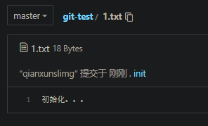

- 此时开发者1和开发者2在此基础上 对分支进行修改：

- 开发者1修改 并提交->push到远端

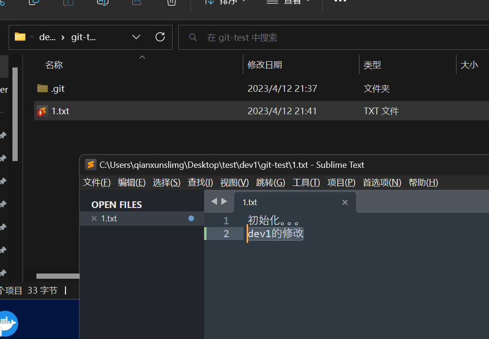

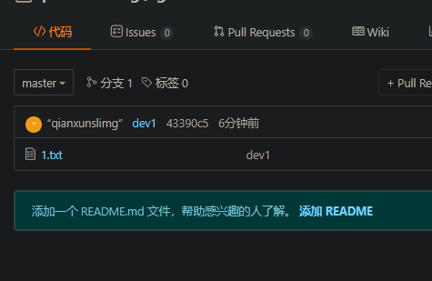

- 开发者2修改 并提交

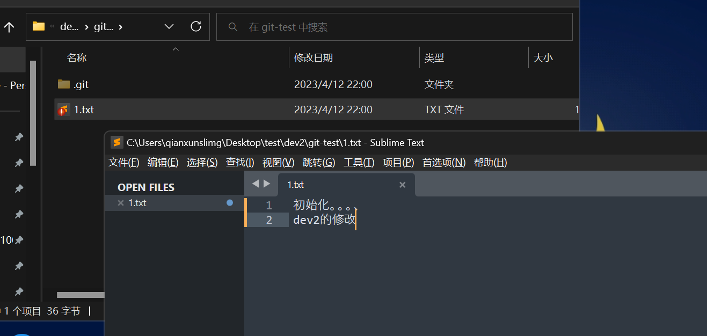

- push到远端时，会报错，

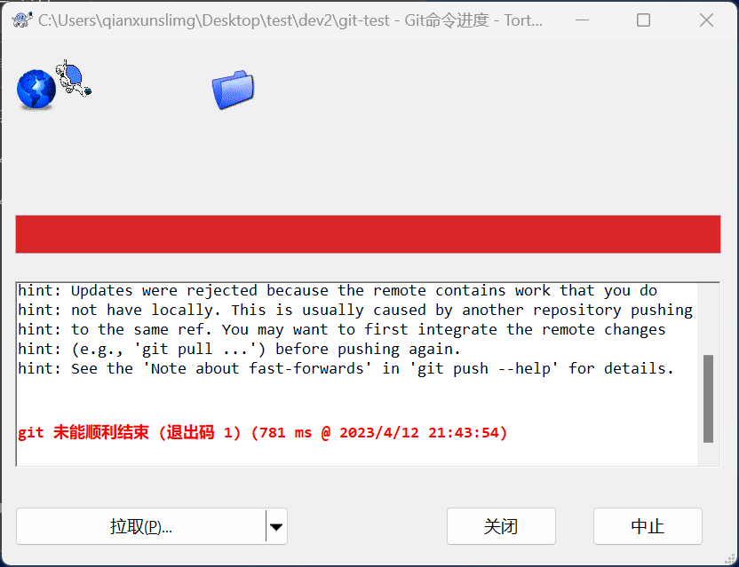

- 此时需要pull远端版本 并解决冲突。

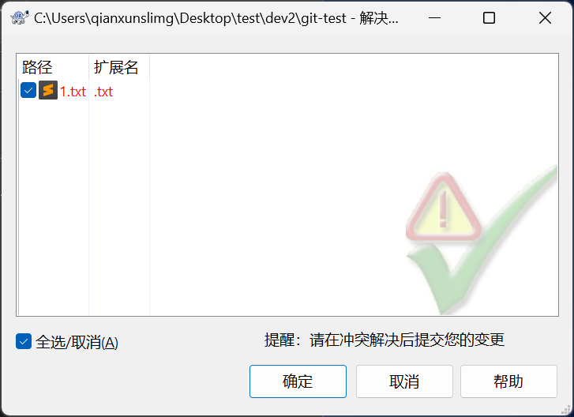

- 双击冲突文件(注意，不是点确定)

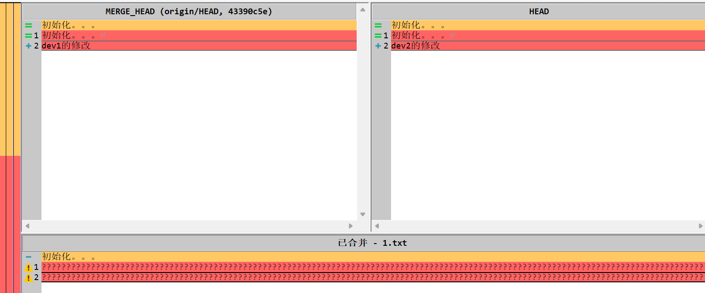

- 不知道为啥初始化的第一行 剪掉了 直接修改已合并的版本

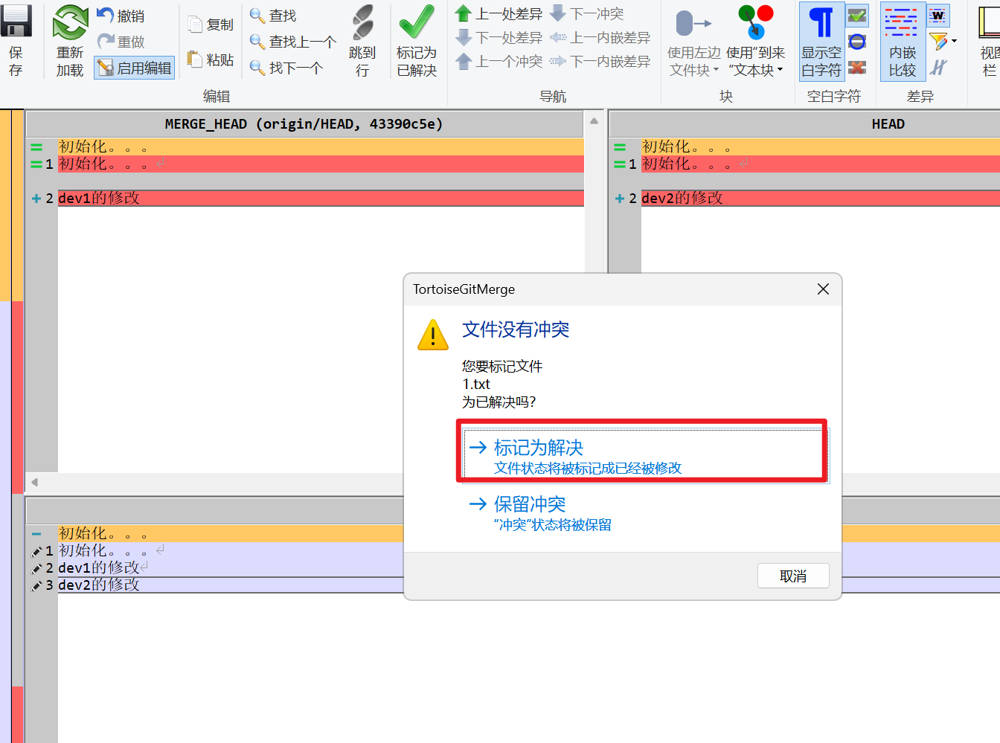

- 重新进行提交和push  合并成功

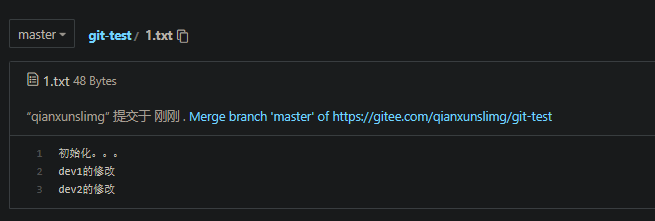

## `冲突示例2` 多人多分支合并

- 在gitee上新建仓库，从master分支拷贝一个分支，dev2 和 dev3分别对两个分支进行修改

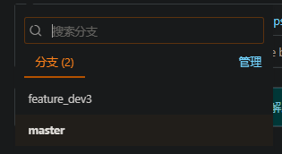

- dev2对master的修改

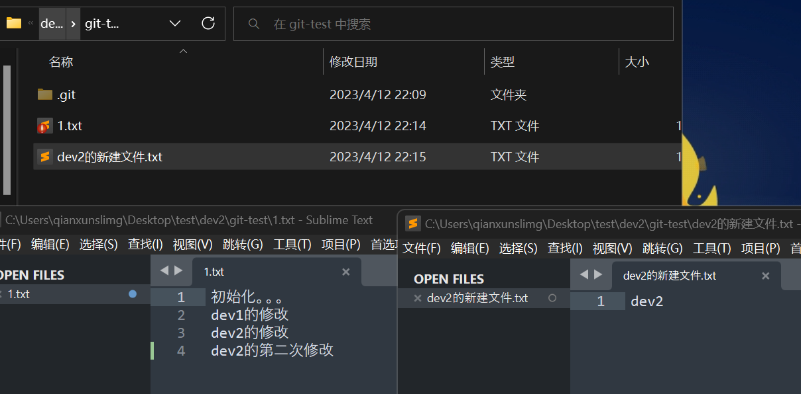

- dev3对feature_dev3的修改

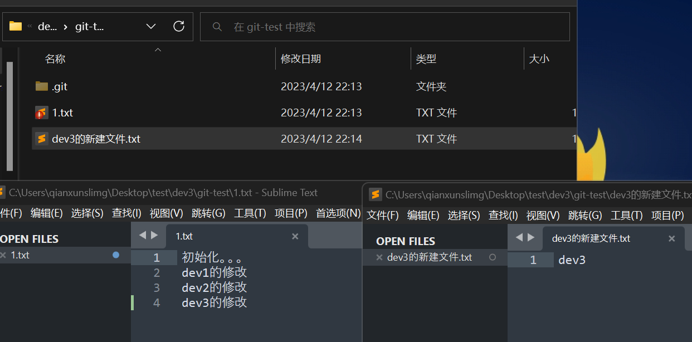

- dev2提交并push到master 代表其他开发人员的进度更新

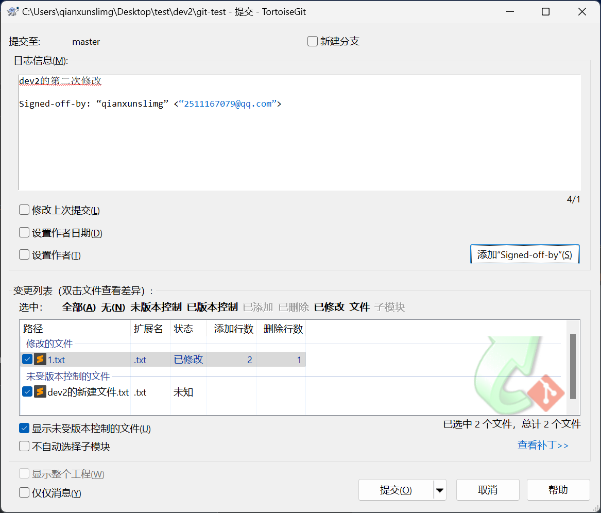

- dev3提交并push到feature_dev3 代表当前开发者的进度完成

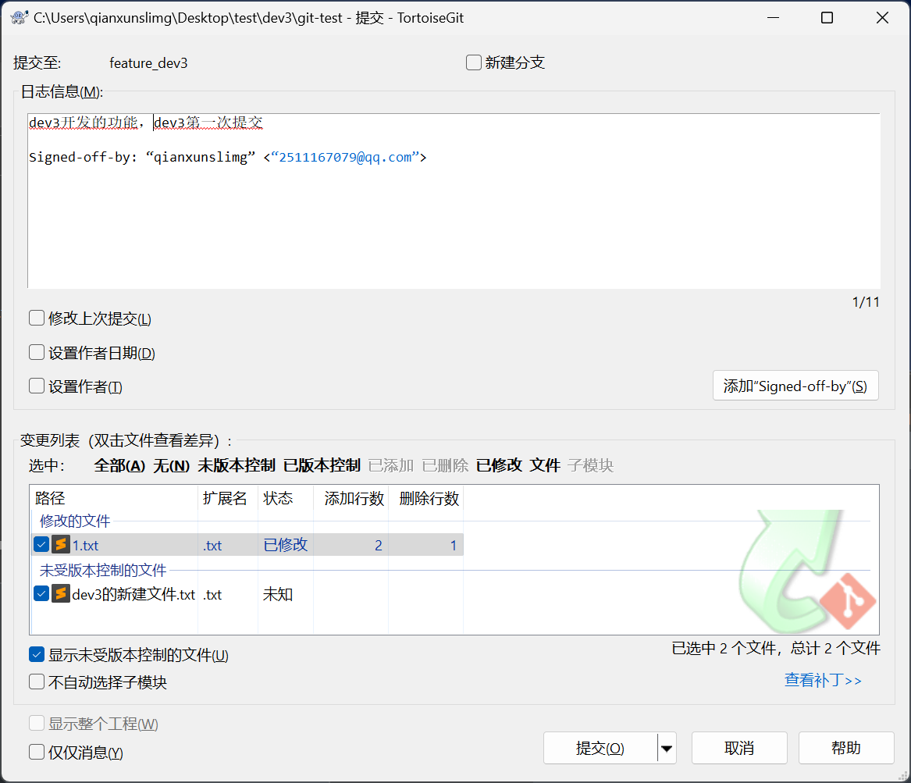

- 将dev3开发的功能合并到master分支

- 直接切换到目标分支master，同步进行pull，右键选择合并

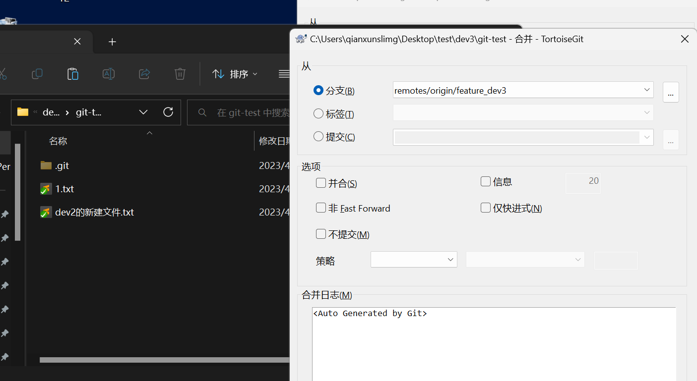

- 解决冲突

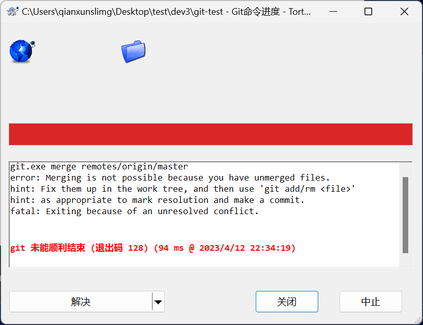

- 修改冲突文件

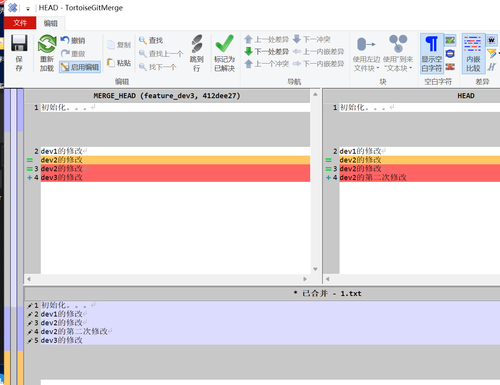

- 提交并push到远端

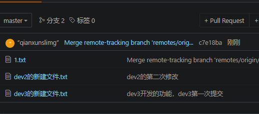
