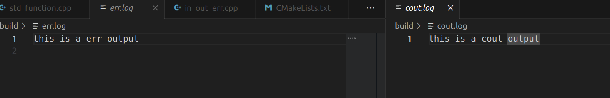

## 简单日志记录

可以使用进程的文件描述符简单的记录下输出和错误信息

有如下代码：

```cpp
#include <iostream>

int main() {
  std::cout << "this is a cout output";
  std::cerr << "this is a err output" << std::endl;
  return 0;
}

```

编译为可执行文件 hello.out

执行该文件：  ./hello.out >cout.log 2>err.log



## 自写log类

### 完整实现

见项目：[myserver/src at master · qianxunslimg/myserver (github.com)](https://github.com/qianxunslimg/myserver/tree/master/src)

log.h

```cpp
#ifndef LOG_H
#define LOG_H

#include "buffer.h"
#include <assert.h>
#include <condition_variable>
#include <mutex>
#include <queue>
#include <stdarg.h>
#include <stdlib.h>
#include <string.h>
#include <string>
#include <sys/stat.h>
#include <sys/time.h>
#include <thread>

using namespace std;

// 日志等级
enum LOG_LEVEL { V_INFO = 0, V_DEBUG, V_WARN, V_ERROR };

class Log {
public:
  // log初始化
  void init(const char *path = "./../log", const char *suffix = ".log");
  // 单例化模式
  static Log *Instance();
  // 单例模式异步写日志
  static void flushLogThreadRun();
  // 异步日志
  void asyncWriteLog();
  // 添加日志
  void logAdd(LOG_LEVEL level, const char *format, ...); //添加一条日志
  // 添加日志级别
  void AppendLogLevelTitle_(LOG_LEVEL level);
  // 是否打开
  bool IsOpen();

private:
  Log();
  virtual ~Log();

  int lineCnt_;
  bool isAsync_;
  bool isOpen_;

  Buffer buff_;
  int today_;

  FILE *fileptr_;
  mutex logmtx_;
  condition_variable que_not_empty;

  unique_ptr<thread> workThread_;
  queue<string> logQue_;

  const char *path_;
  const char *suffix_;

  static const int LOG_NAME_LEN = 100;
  static const int MAX_LINES = 5000;
};
#define LOG_BASE(level, format, ...)                                           \
  do {                                                                         \
    Log *log = Log::Instance();                                                \
    if (log->IsOpen()) {                                                       \
      log->logAdd(level, format, ##__VA_ARGS__);                               \
    }                                                                          \
  } while (0);

#define LOG_DEBUG(format, ...)                                                 \
  do {                                                                         \
    LOG_BASE(V_DEBUG, format, ##__VA_ARGS__)                                   \
  } while (0);
#define LOG_INFO(format, ...)                                                  \
  do {                                                                         \
    LOG_BASE(V_INFO, format, ##__VA_ARGS__)                                    \
  } while (0);
#define LOG_WARN(format, ...)                                                  \
  do {                                                                         \
    LOG_BASE(V_WARN, format, ##__VA_ARGS__)                                    \
  } while (0);
#define LOG_ERROR(format, ...)                                                 \
  do {                                                                         \
    LOG_BASE(V_ERROR, format, ##__VA_ARGS__)                                   \
  } while (0);

#endif
```

log.cpp

```cpp
#include "log.h"

Log::Log() {
  lineCnt_ = 0;
  isAsync_ = true;
  isOpen_ = false;
  today_ = 0;

  fileptr_ = nullptr;
  workThread_ = nullptr;
}

Log::~Log() {
  if (workThread_ && workThread_->joinable()) {
    while (!logQue_.empty()) {
      que_not_empty.notify_all();
    };
    workThread_->join();
  }
  if (fileptr_) {
    lock_guard<mutex> locker(logmtx_);
    fflush(fileptr_); //刷新输出缓冲区
    fclose(fileptr_);
  }
}

void Log::init(const char *path, const char *suffix) {
  path_ = path;
  suffix_ = suffix;
  isOpen_ = true;
  lineCnt_ = 0;
  // 新建日志线程
  if (workThread_ == nullptr) {
    unique_ptr<thread> newThread(new thread(flushLogThreadRun));
    workThread_ = move(newThread);
  }

  time_t timeNow = time(nullptr);
  struct tm *sysTime = localtime(&timeNow);
  today_ = sysTime->tm_mday;

  char fileName[LOG_NAME_LEN] = {0};
  // 初始化日志格式
  snprintf(fileName, LOG_NAME_LEN - 1, "%s/%04d_%02d_%02d%s", path_,
           sysTime->tm_year + 1900, sysTime->tm_mon + 1, sysTime->tm_mday,
           suffix_);

  lock_guard<mutex> locker(logmtx_);
  buff_.RecycleAll();
  // 新建日志文件
  if (fileptr_) {
    if (!logQue_.empty())
      que_not_empty.notify_all();
    fflush(fileptr_);
    fclose(fileptr_);
  }
  fileptr_ = fopen(fileName, "a");

  if (fileptr_ == nullptr) {
    mkdir(path_, 0777);
    fileptr_ = fopen(fileName, "a");
  }
  assert(fileptr_ != nullptr);
}

Log *Log::Instance() {
  // static实现简单的单例模式
  static Log logObject;
  return &logObject;
}

void Log::flushLogThreadRun() { Log::Instance()->asyncWriteLog(); }

void Log::asyncWriteLog() {
  while (true) {
    unique_lock<mutex> locker(logmtx_);
    if (logQue_.empty()) {
      que_not_empty.wait(locker);
    }

    fputs(logQue_.front().c_str(), fileptr_);
    fflush(fileptr_);
    logQue_.pop();
  }
}

bool Log::IsOpen() {
  lock_guard<mutex> locker(logmtx_);
  return isOpen_;
}

void Log::AppendLogLevelTitle_(LOG_LEVEL level) {
  switch (level) {
  case V_DEBUG:
    buff_.Append("[debug]: ", 9);
    break;
  case V_INFO:
    buff_.Append("[info] : ", 9);
    break;
  case V_WARN:
    buff_.Append("[warn] : ", 9);
    break;
  case V_ERROR:
    buff_.Append("[error]: ", 9);
    break;
  default:
    buff_.Append("[info] : ", 9);
    break;
  }
}

void Log::logAdd(LOG_LEVEL level, const char *format, ...) {
  struct timeval now = {0, 0};
  gettimeofday(&now, nullptr);
  time_t timer = time(nullptr);
  struct tm *sysTime = localtime(&timer);

  if (today_ != sysTime->tm_mday || (lineCnt_ && (lineCnt_ % MAX_LINES == 0))) {
    unique_lock<mutex> locker(logmtx_);
    locker.unlock();

    char newFile[LOG_NAME_LEN];
    char date[36] = {0};
    snprintf(date, 36, "%04d_%02d_%02d", sysTime->tm_yday + 1900,
             sysTime->tm_mon + 1, sysTime->tm_mday);

    if (today_ != sysTime->tm_mday) {
      snprintf(newFile, LOG_NAME_LEN - 72, "%s/%s%s", path_, date, suffix_);
      today_ = sysTime->tm_mday;
      lineCnt_ = 0;
    } else { // log文件超maxline行数  加 -num 后缀
      snprintf(newFile, LOG_NAME_LEN - 72, "%s/%s-%d%s", path_, date,
               (lineCnt_ / MAX_LINES), suffix_);
    }

    locker.lock();
    fflush(fileptr_);
    fclose(fileptr_);

    fileptr_ = fopen(newFile, "a");
    assert(fileptr_ != nullptr);
  }

  unique_lock<mutex> locker(logmtx_);
  lineCnt_++;
  int n =
      snprintf(buff_.BeginWrite(), 128, "%d-%02d-%02d %02d:%02d:%02d.%06ld ",
               sysTime->tm_year + 1900, sysTime->tm_mon + 1, sysTime->tm_mday,
               sysTime->tm_hour, sysTime->tm_min, sysTime->tm_sec, now.tv_usec);

  buff_.HasWritten(n);
  AppendLogLevelTitle_(level);

  va_list vaList;
  va_start(vaList, format);
  int m = vsnprintf(buff_.BeginWrite(), buff_.WritableBytes(), format, vaList);
  va_end(vaList);

  buff_.HasWritten(m);
  buff_.Append("\n\0", 2);

  if (isAsync_) {
    logQue_.push(buff_.RecycleAllReturnStr());
    que_not_empty.notify_one(); //唤醒一个线程
  } else
    fputs(buff_.Peek(), fileptr_);

  buff_.RecycleAll();
}
```


### 注意的点

1. 使用饿汉单例模式 局部静态首次调用时进行初始化

   ```c++
   Log *Log::Instance() {
     // static实现简单的单例模式
     static Log logObject;
     return &logObject;
   }
   ```

2. 异步写入日志

   1. 目的 : 避免写日志操作 阻塞原本线程

   2. 实现: 队列 互斥锁 条件变量 单一的工作线程

      1. queue< string>存储要写入的日志队列

      2. mutex logmtx_ 对写入日志文件这个临界区进行加锁

      3. 异步写入时 日志队列不为空则唤醒工作线程进行写入操作

         ```c++
         void Log::logAdd(LOG_LEVEL level, const char *format, ...) {
           ......
         	if (isAsync_) {
             logQue_.push(buff_.RecycleAllReturnStr());
             que_not_empty.notify_one(); //唤醒一个线程
           } else
             fputs(buff_.Peek(), fileptr_);
           buff_.RecycleAll();
         }
         
         void Log::asyncWriteLog() {
           while (true) {
             unique_lock<mutex> locker(logmtx_);
             if (logQue_.empty()) {
               que_not_empty.wait(locker);
             }
         
             fputs(logQue_.front().c_str(), fileptr_);
             fflush(fileptr_);
             logQue_.pop();
           }
         }
         ```

      4. 使用`va_list`来解决变参问题

      5. 日志文件太大怎么办: 判断日志行数 如果超过5000行 新建文件+后缀 -1 -2 -3...

## 自带log类

在ROS 2中，可以使用日志记录器（Logger）来将日志信息保存到文件中。日志记录器是ROS 2提供的一个功能强大的工具，用于记录节点的输出、调试信息和错误信息等。

要将ROS 2的日志信息保存到文件中，可以按照以下步骤进行操作：

1. 在你的ROS 2节点代码中，使用`rclcpp::init()`函数初始化ROS 2节点：

```cpp
#include "rclcpp/rclcpp.hpp"

int main(int argc, char** argv) {
  rclcpp::init(argc, argv);
  
  // 节点的其他代码逻辑
  
  rclcpp::shutdown();
  
  return 0;
}
```

1. 在初始化ROS 2节点后，创建一个`rclcpp::Node`对象，用于访问ROS 2节点的功能：

```cpp
auto node = std::make_shared<rclcpp::Node>("my_node");
```

1. 创建一个日志记录器，并配置它将日志信息输出到文件：

```cpp
auto logger = node->get_logger();
auto file_sink = std::make_shared<rcutils_logging::FileOutput>(logger->get_name(), "path/to/log/file.log");
logger->add_sink(file_sink);
```

在上述代码中，`"path/to/log/file.log"` 是指定要保存日志信息的文件路径。你可以根据需要更改为实际的文件路径。

1. 在节点运行期间，你可以使用不同的日志级别和日志宏（如`RCLCPP_INFO`、`RCLCPP_WARN`等）输出日志信息：

```cpp
RCLCPP_INFO(logger, "This is an info message");
RCLCPP_WARN(logger, "This is a warning message");
```

日志信息将被记录到文件中。

1. 在节点结束前，确保关闭日志记录器和ROS 2节点：

```cpp
logger->remove_all_sinks();
```

完整的示例代码如下所示：

```cpp
#include "rclcpp/rclcpp.hpp"

int main(int argc, char** argv) {
  rclcpp::init(argc, argv);
  
  auto node = std::make_shared<rclcpp::Node>("my_node");
  
  auto logger = node->get_logger();
  auto file_sink = std::make_shared<rcutils_logging::FileOutput>(logger->get_name(), "path/to/log/file.log");
  logger->add_sink(file_sink);
  
  RCLCPP_INFO(logger, "This is an info message");
  RCLCPP_WARN(logger, "This is a warning message");
  
  logger->remove_all_sinks();
  
  rclcpp::shutdown();
  
  return 0;
}
```

通过以上步骤，你可以将ROS 2节点的日志信息保存到指定的文件中。在运行节点时，输出的日志信息将被写入到文件中供后续查看和分析。记得将示例代码中的`"path/to/log/file.log"`替换为实际的文件路径。

## 日志查看与处理

### grep

```bash
# 使用 -a 选项来强制 grep 将输入文件视为文本文件，而不管其实际内容
grep -a debug 2022_07_29.log 
# 或者
cat 2022_07_29.log | grep -a debug
```
