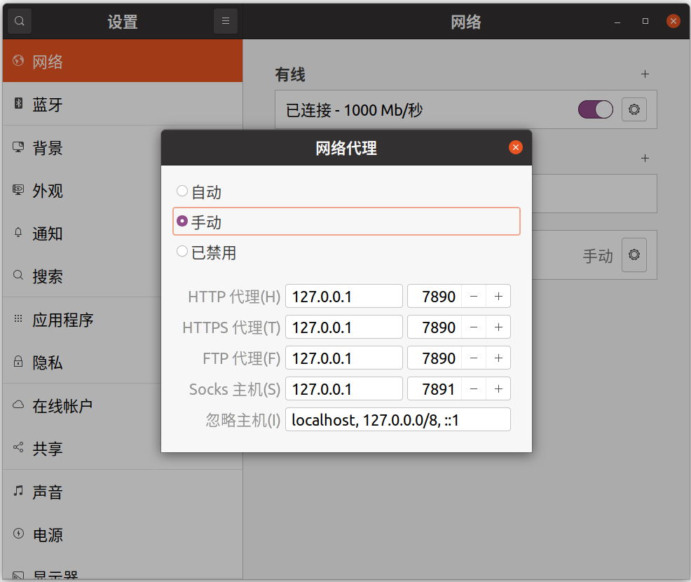

### 1. 代理配置



### 2. clash-linux

```bash
# 1. 直接执行 生成默认配置文件 然后c掉
./clash-linux-amd64
# 2. 更新配置到yaml
wget -O ~/.config/clash/config.yaml 订阅地址
# 3. 重新启动clash
./clash-linux-amd64
# 4. 网页配置规则
http://clash.razord.top/#/proxies
```
